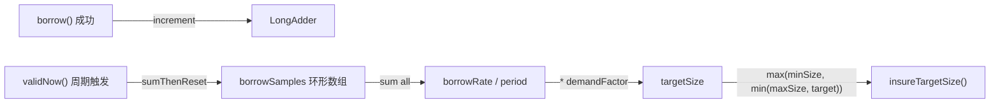

# ObjectPool 自适应补充（Adaptive Refill）

## 现状分析

当前 [ObjectPool.java](rxlib/src/main/java/org/rx/core/ObjectPool.java) 的补充逻辑非常简单：

```137:147:rxlib/src/main/java/org/rx/core/ObjectPool.java
    void insureMinSize() {
        while (size() < minSize) {
            IdentityWrapper<T> w = doCreate();
            if (w != null) {
                recycle(w);
            } else {
                break;
            }
        }
    }
```

`validNow()` 周期性调用 `insureMinSize()`，只保证池中对象数不低于 `minSize`。无法感知实际负载，导致：
- 高负载时：borrow 频繁触发 `doCreate()`（慢路径），增加延迟
- 低负载时：已经正确（维持 minSize 即可）

## 设计方案

### 核心思路：滑动窗口采样 + 动态目标水位



### 1. 新增字段（ObjectPool 类内）

| 字段 | 类型 | 说明 |
|---|---|---|

- `borrowAccumulator` (`LongAdder`) -- 热路径计数器，borrow 成功时 increment，零竞争
- `borrowSamples` (`long[]`, 大小 `SAMPLE_COUNT = 12`) -- 环形缓冲区，每次 `validNow()` 写入一个采样值
- `sampleIndex` (`int`) -- 当前写入位置
- `demandFactor` (`double`, 默认 `2.0`, getter/setter) -- 预热系数，表示预热多少个 validationPeriod 周期的需求量

常量 `SAMPLE_COUNT = 12`，默认 `validationPeriod = 5s`，窗口约覆盖 60 秒。

### 2. borrow() 热路径改动（最小化）

在 `borrow()` 方法成功返回前（第 294 行 `return wrapper.instance` 之前），增加一行：

```java
borrowAccumulator.increment();
return wrapper.instance;
```

`LongAdder.increment()` 在热路径上接近零开销（striped cells，无 CAS 竞争）。

### 3. validNow() 采样与动态目标

在 `validNow()` 末尾（当前第 178 行 `insureMinSize()` 处）替换为：

```java
// 采样：将本周期累积的 borrow 次数写入环形缓冲区
borrowSamples[sampleIndex] = borrowAccumulator.sumThenReset();
sampleIndex = (sampleIndex + 1) % SAMPLE_COUNT;

// 计算最近窗口内总 borrow 数
long totalBorrows = 0;
for (long s : borrowSamples) {
    totalBorrows += s;
}

// 动态目标 = max(minSize, min(maxSize, ceil(avgPerPeriod * demandFactor)))
double avgPerPeriod = (double) totalBorrows / SAMPLE_COUNT;
int targetSize = Math.max(minSize, Math.min(maxSize,
        (int) Math.ceil(avgPerPeriod * demandFactor)));

insureTargetSize(targetSize);
```

### 4. insureMinSize() 重构为 insureTargetSize(int target)

```java
void insureTargetSize(int target) {
    while (size() < target) {
        IdentityWrapper<T> w = doCreate();
        if (w != null) {
            recycle(w);
        } else {
            break;
        }
    }
}
```

保留 `insureMinSize()` 作为兼容方法，内部调用 `insureTargetSize(minSize)`。构造函数中的初始预热仍调用 `insureMinSize()`。

### 5. demandFactor 的 setter

```java
public void setDemandFactor(double demandFactor) {
    this.demandFactor = Math.max(0, demandFactor);
}
```

`demandFactor = 0` 时退化为纯 `minSize` 行为（关闭自适应）。

### 6. toString() 增加可观测性

在 `@ToString` 覆盖范围内，`borrowSamples` 和 `sampleIndex` 默认会被 Lombok 包含，`validNow()` 的注释掉的 log 行可以取消注释或在 debug 级别打印 `targetSize`。

## 行为示例

假设 `minSize=2, maxSize=20, validationPeriod=5s, demandFactor=2.0`：

- **低负载**：过去 1 分钟 borrow 12 次 -> avgPerPeriod = 1.0 -> target = ceil(1.0 * 2.0) = 2 -> 等于 minSize，无额外预热
- **中等负载**：过去 1 分钟 borrow 120 次 -> avgPerPeriod = 10.0 -> target = ceil(10.0 * 2.0) = 20 -> 达到 maxSize 上限
- **突发负载**：某 5s 内 borrow 50 次 -> 下一周期 avgPerPeriod 迅速上升 -> 自动预热更多对象
- **负载回落**：borrow 减少 -> 旧采样被覆盖 -> target 自然下降 -> 超出 target 的空闲对象由 `idleTimeout` 机制淘汰

## 不影响的部分

- `doCreate()`, `doRetire()`, `doPoll()`, `recycle()` 逻辑完全不变
- `idleTimeout` 淘汰机制继续生效（负载下降时自然回收多余对象）
- `leakDetectionThreshold` 不受影响
- 构造函数签名不变，新字段有合理默认值

## 测试计划

编写 `ObjectPoolAdaptiveRefillTest`：
1. **基线测试**：`demandFactor=0`，验证行为与原来一致（只保持 minSize）
2. **自适应预热测试**：短时间内高频 borrow/recycle，手动触发 `validNow()`，验证 `size()` 上升到合理值
3. **负载回落测试**：停止 borrow，多次触发 `validNow()`，验证 targetSize 回落到 minSize（超出部分由 idleTimeout 淘汰）
4. **边界测试**：验证 target 不超过 maxSize，不低于 minSize
