# ObjectPool / ThreadPool 性能优化计划

## 一、ObjectPool 性能问题

### P0: `borrow()` 中 `remainingTime` 初始值疑似 Bug

**问题**: [`ObjectPool.borrow()`](rxlib/src/main/java/org/rx/core/ObjectPool.java) 第 259 行 `remainingTime = 1`，而旧版 `ObjectPoolBak` 用的是 `borrowTimeout`。这导致第一轮循环中 `waitTime` 被压到约 1ms，在池中无可用对象时几乎立即超时，`borrow` 的实际等待时间远小于配置的 `borrowTimeout`。

```258:261:rxlib/src/main/java/org/rx/core/ObjectPool.java
        long beginNanos = System.nanoTime();
        long remainingTime = 1;
        IdentityWrapper<T> wrapper = null;
        while (remainingTime > 0) {
```

**修复**: 将初始值改为 `borrowTimeout`：

```java
long remainingTime = borrowTimeout;
```

---

### P1: `doRetire` 不从 stack 移除，导致 stale wrapper 累积

**问题**: `doRetire()` 仅从 `conf` 中移除条目，但**不从 `ConcurrentBlockingDeque` stack 中移除**对应的 `IdentityWrapper`。注释写 "O(1) ignore removal from stack, doPoll will skip retired"，依赖 `doPoll` 发现时跳过。

在高频创建/销毁场景下，stack 中可能积累大量 stale wrapper，`doPoll` 每次取到 stale 对象需要重新 poll，增加借出延迟。此外 stale wrapper 占用 `ConcurrentLinkedDeque` 节点内存和信号量计数。

**修复方案**（两选一）:
- 方案 A: `doRetire` 时调用 `stack.remove(wrapper)`，代价是 O(n) 遍历，适合池不大的场景
- 方案 B（推荐）: 在 `ObjectConf` 增加 `volatile boolean retired` 标志；`doPoll` 循环跳过 retired 的对象，避免 `conf.get()` 的 ConcurrentHashMap 查找开销：

```java
IdentityWrapper<T> doPoll(long timeout) throws InterruptedException {
    IdentityWrapper<T> wrapper;
    while ((wrapper = stack.pollLast(timeout, TimeUnit.MILLISECONDS)) != null) {
        ObjectConf<T> c = conf.get(wrapper);
        if (c == null || c.retired) continue; // 快速跳过
        synchronized (c) {
            if (c.isBorrowed() || c.retired) continue;
            // ... activate & return
        }
        timeout = 0; // 后续 poll 不再等待
    }
    return null;
}
```

---

### P2: `validNow()` 全量遍历 + 逐项加锁

**问题**: [`validNow()`](rxlib/src/main/java/org/rx/core/ObjectPool.java) 每个验证周期（默认 5s）遍历**整个 `conf` map**，对每个条目加 `synchronized(c)` 并调用 `validateHandler.test()`。如果 `validateHandler` 涉及 I/O（如检测数据库连接），会在定时线程上阻塞很长时间。

**优化建议**:
- 对 idle 对象做**批量采样验证**而非全量：例如每轮只验证 `min(size, 8)` 个对象
- 或将 idle timeout 检查与 validate 分离：idle timeout 仅看时间戳，无需调用 `validateHandler`

```java
void validNow() {
    int checked = 0, maxCheck = Math.min(size(), 8);
    for (Map.Entry<Object, ObjectConf<T>> p : conf.entrySet()) {
        if (checked >= maxCheck) break;
        // ...只检查 idle 的
        checked++;
    }
    insureMinSize();
}
```

---

### P3: `ConcurrentBlockingDeque` 容量设为 `Integer.MAX_VALUE` 使信号量退化

**问题**: `ObjectPool` 构造函数中 `stack = new ConcurrentBlockingDeque<>(Integer.MAX_VALUE)`，`spaces` 信号量的 `MAX_VALUE` 个 permit 实际上**永远不会阻塞入队**。每次 `offer/poll` 仍需 `spaces.tryAcquire()` / `spaces.release()` 的 CAS 操作，属于**无效开销**。

**优化建议**: 将容量设为 `maxSize`（实际不会超过 maxSize 个对象入池），或提供无界模式跳过 `spaces` 信号量操作。

---

## 二、ThreadPool 性能问题

### P0: `ThreadQueue.offer()` 中 `synchronized + wait(500)` 阻塞策略粗糙

**问题**: 当队列满时，[`ThreadQueue.offer()`](rxlib/src/main/java/org/rx/core/ThreadPool.java) 第 66-81 行使用 `synchronized(this) { wait(500) }` 轮询等待。问题：
- **500ms 固定等待粒度太粗**：即使队列立即有空位，生产者也可能白等最多 500ms
- **`synchronized(this)`**：所有等待的生产者线程争同一把锁，唤醒时是**惊群效应**（`notify` 只唤醒一个，但多线程竞争 `isFullLoad` 检查）
- **与 `doNotify` 的 `notify()` 配合不佳**：`doNotify` 只 `notify()` 一个线程，如果多个线程在 wait，其余线程仍需等满 500ms

```66:81:rxlib/src/main/java/org/rx/core/ThreadPool.java
            if (isFullLoad()) {
                boolean logged = false;
                while (isFullLoad()) {
                    if (!logged) {
                        log.warn("Block caller thread until queue[{}/{}] polled then offer {}", counter.get(), queueCapacity, r);
                        logged = true;
                    }
                    //避免生产者一直等待
                    synchronized (this) {
                        wait(500);
                    }
                }
```

**修复**: 改用 `Semaphore` 或 `Condition` 替代 `wait/notify`，消除固定 500ms 轮询：

```java
// 在 ThreadQueue 中加一个信号量
private final Semaphore availableSlots;

// 构造函数中初始化
availableSlots = new Semaphore(queueCapacity);

// offer 中
availableSlots.acquire(); // 精确阻塞到有空位
counter.incrementAndGet();
// ...

// doNotify 中
availableSlots.release(); // 精确唤醒一个等待者
```

---

### P1: `taskMap`（Caffeine weakKeys cache）在热路径上的开销

**问题**: [`taskMap`](rxlib/src/main/java/org/rx/core/ThreadPool.java) 第 471 行使用 `Caffeine.newBuilder().weakKeys().build()` 存储 `Runnable -> Task<?>` 映射。每次 `beforeExecute` 和 `afterExecute` 都要访问这个 cache。

Caffeine `weakKeys` 模式下：
- 使用 **identity hashCode/equals**（`==`），与普通 HashMap 行为不同
- **每次 put/get 触发 maintenance（清理过期 WeakReference）**，增加 GC 和 CPU 开销
- `weakKeys` 对 FutureTask 包装后的 key 可能导致过早回收（如果中间层没有强引用）

**优化建议**: 对于 `FutureTaskAdapter` 路径，`task` 字段已直接存储在 adapter 中，不需要 `taskMap`。只有 `CompletableFuture.AsynchronousCompletionTask` 路径需要 taskMap。考虑：
- 将 `taskMap` 改为普通 `ConcurrentHashMap`，在 `afterExecute` 中 `remove` 确保不泄漏（当前已在做）
- 或在 `setTask` 中优先走 `FutureTaskAdapter.task` / `Task.as(r)` 的快速路径，仅在 fallback 到 `AsynchronousCompletionTask` 时才用 map

```java
private Task<?> setTask(Runnable r) {
    if (r instanceof FutureTaskAdapter) {
        return ((FutureTaskAdapter<?>) r).task;
    }
    Task<?> task = Task.as(r);
    if (task != null) return task;
    // 仅 AsynchronousCompletionTask 才查/写 cache
    task = taskMap.getIfPresent(r);
    if (task == null && r instanceof CompletableFuture.AsynchronousCompletionTask) {
        task = Task.as(Reflects.readField(r, "fn"));
        if (task != null) taskMap.put(r, task);
    }
    return task;
}
```

---

### P2: `setTask` 中对 `CompletableFuture.AsynchronousCompletionTask` 的反射调用

**问题**: `Reflects.readField(r, "fn")` 每次需要通过缓存的 `Field` 对象做 `field.get(r)`。虽然字段查找被缓存了，但 `Field.get()` 本身在 JDK 8 上仍有 inflation 和 volatile 读开销。对于 `runAsync` 高频调用场景，这是热路径上的不必要开销。

**优化建议**: 使用 `MethodHandle` 或 `VarHandle` 替代 `Field.get()`，或者在 `Task.adapt` 阶段就把 Task 实例关联到某个可访问的位置，避免反向查找：

```java
// 方案：让 asyncExecutor 在 execute 时直接把 Task 绑定到 Runnable
final Executor asyncExecutor = r -> {
    // r 是 CompletableFuture 内部的 AsynchronousCompletionTask
    // 通过 weakKeys map 记录，但可以用 MethodHandle 加速
    super.execute(r);
};
```

---

### P3: `ThreadQueue.doNotify()` 中 counter 可能变为负数

**问题**: [`doNotify()`](rxlib/src/main/java/org/rx/core/ThreadPool.java) 第 141-151 行先 `counter.decrementAndGet()`，如果 `poll/take/remove` 被多次调用（如 `ThreadPoolExecutor` 内部机制调用 `poll` 后又调用 `remove`），counter 可能变负。虽然代码有修复逻辑（`counter.set(super.size())`），但：
- `super.size()` 是 `LinkedTransferQueue.size()` ，O(n) 遍历
- 两个线程同时发现负数，都调用 `super.size()` 后 `set`，存在覆盖竞态
- `saveMetric` 在修复路径上做日志，增加开销

**修复**: 使用 `AtomicInteger.updateAndGet` 确保不低于 0：

```java
private void doNotify() {
    int c = counter.updateAndGet(v -> Math.max(0, v - 1));
    synchronized (this) {
        notify();
    }
}
```

同时在 `offer` 中改用 `incrementAndGet` **后** 的值检查，保证一致性。

---

### P4: `runSerialAsync` 中 `taskSerialMap.compute()` 的锁粒度

**问题**: [`runSerialAsync()`](rxlib/src/main/java/org/rx/core/ThreadPool.java) 第 673 行使用 `taskSerialMap.compute(taskId, ...)` 在 lambda 中创建 `CompletableFuture` 并提交任务。`ConcurrentHashMap.compute()` 在计算期间**对该桶加锁**，而 lambda 中做了 `CompletableFuture.supplyAsync(t, asyncExecutor)` 这种可能涉及线程池提交的重操作，持锁时间偏长。

**优化建议**: 分两步：先 `get` 判断是否存在，不存在时用 `putIfAbsent` 竞争插入，减少 `compute` 锁内的工作量。

---

### P5: `Task` 构造函数中的采样开销

**问题**: [`Task` 构造函数](rxlib/src/main/java/org/rx/core/ThreadPool.java) 第 220-231 行，即使 `slowMethodSamplingPercent` 很低（默认 2%），每次创建 Task 都要：
- 检查 `CTX_STACK_TRACE.getIfExists()`
- 生成 `ThreadLocalRandom.current().nextInt(0, 100)`
- 采样命中时 `new Throwable().getStackTrace()` 非常昂贵（几十微秒级）

在高吞吐场景下，每秒创建数万 Task，2% 采样意味着每秒数百次 `getStackTrace()` 调用。

**优化建议**:
- 将采样率检查提前到 `slowMethodElapsedMicros > 0` 之外，减少无用计算
- 考虑用计数器取模替代随机数（`counter.incrementAndGet() % 50 == 0` 即 2%），避免 `ThreadLocalRandom` 开销

---

### P6: `taskLockMap` 内存泄漏风险

**问题**: `taskLockMap` 是 `static final ConcurrentHashMap`。`afterExecute` 中仅当 `ctx.decrementRefCnt() <= 0` 时才 `remove`。如果任务被取消或 `beforeExecute` 抛异常导致 `afterExecute` 不执行（虽然 TPE 保证会调用），或者 `SINGLE` tryLock 失败抛出 `RejectedExecutionException` 后 `afterExecute` 中 `ctx.ref.isHeldByCurrentThread()` 为 false 从而跳过清理，`RefCounter` 就会残留。

**优化建议**: 加定期清理，或改用 Caffeine `expireAfterAccess` 自动过期。

---

## 架构概览

```mermaid
graph TB
    subgraph threadPool [ThreadPool Hot Path]
        Submit[submit/execute] --> TaskAdapt["Task.adapt()"]
        TaskAdapt --> NewTaskFor["newTaskFor() -> FutureTaskAdapter"]
        NewTaskFor --> TPEExecute["TPE.execute()"]
        TPEExecute --> QueueOffer["ThreadQueue.offer()"]
        QueueOffer -->|full| WaitLoop["synchronized wait(500ms)"]
        QueueOffer -->|has slot| Enqueue["LTQ.offer/transfer"]
        Enqueue --> BeforeExec["beforeExecute()"]
        BeforeExec --> SetTask["setTask() -> taskMap lookup"]
        SetTask -->|"ACT"| Reflect["Reflects.readField (reflection)"]
        BeforeExec --> LockCheck["SINGLE/SYNC lock"]
        BeforeExec --> TraceStart["startTrace()"]
        BeforeExec --> TaskCall["task.call()"]
        TaskCall --> AfterExec["afterExecute()"]
        AfterExec --> TaskRemove["taskMap.remove()"]
        AfterExec --> LockRelease["unlock + refCnt--"]
    end

    subgraph objectPool [ObjectPool Hot Path]
        Borrow["borrow()"] --> PollFast["doPoll(0) fast path"]
        PollFast -->|miss| Create["doCreate() CAS"]
        PollFast -->|hit| ConfGet["conf.get() + synchronized(c)"]
        Create -->|maxSize| PollWait["doPoll(waitTime)"]
        ConfGet --> Validate["validateHandler.test()"]
        Validate --> ReturnObj["return instance"]
        Recycle["recycle()"] --> LookupTL["ThreadLocal lookup"]
        LookupTL --> ConfGet2["conf.get(lk)"]
        ConfGet2 --> StackOffer["stack.offer(wrapper)"]
    end
```



---

## 优化优先级总结

| 优先级 | 组件 | 问题 | 影响 | 改动量 |
|--------|------|------|------|--------|
| P0 | ObjectPool | `remainingTime=1` 疑似 Bug | borrow 几乎不等待 | 1 行 |
| P0 | ThreadPool | `wait(500)` 阻塞策略 | 生产者延迟高达 500ms | ~20 行 |
| P1 | ObjectPool | stack 中 stale wrapper 累积 | 借出延迟 + 内存浪费 | ~10 行 |
| P1 | ThreadPool | taskMap (Caffeine weakKeys) 热路径开销 | 每次任务额外 cache 开销 | ~15 行 |
| P2 | ObjectPool | `validNow()` 全量遍历 + 逐项加锁 | 验证周期 CPU 尖峰 | ~10 行 |
| P2 | ThreadPool | 反射读取 ACT 内部 fn 字段 | runAsync 热路径开销 | ~10 行 |
| P3 | ObjectPool | `ConcurrentBlockingDeque` 无效信号量 | 无用 CAS 开销 | ~5 行 |
| P3 | ThreadPool | `doNotify()` counter 可负 | 触发 O(n) size() 修复 | ~5 行 |
| P4 | ThreadPool | `runSerialAsync` compute 持锁 | 桶锁内提交任务 | ~15 行 |
| P5 | ThreadPool | Task 构造中 getStackTrace 采样 | 高吞吐下 CPU 开销 | ~5 行 |
| P6 | ThreadPool | `taskLockMap` 残留风险 | 长期运行内存泄漏 | ~10 行 |
