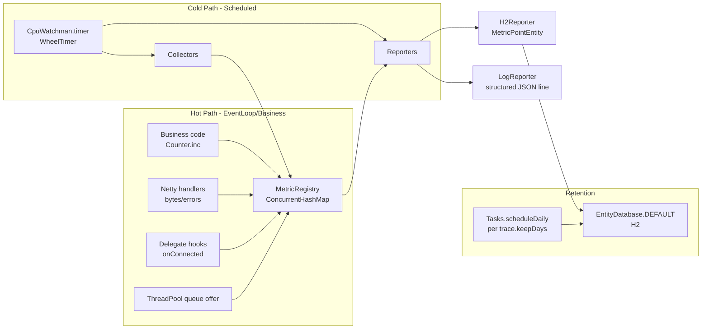

# rxlib 轻量级监控系统设计

模式：**高性能模式（Netty）**。Java 8，零第三方 metrics 依赖，热点路径零分配。

## 1. 设计目标与非目标

**目标**
- 热点路径零分配、无锁或低锁；I/O 线程只做 `LongAdder.increment()` / `AtomicLong.lazySet()`。
- 复用 rxlib 既有基础设施：`CpuWatchman.timer`、`Tasks.scheduleDaily`、`TraceHandler` + `EntityDatabase`（H2）、`Delegate`/`EventBus`、`Sys.mxInfo`、`RxConfig`/`ObjectChangeTracker`。
- 采集 **性能指标**（JVM/OS/Netty/线程池/网络）与 **业务指标**（SOCKS/RPC/DNS/HTTP，业务自定义）。
- 输出：周期性结构化日志（便于 ELK/Loki）+ H2 时间序列落库（便于本地 SQL 回溯）。**不开监听端口**。

**非目标**
- 不做分布式聚合、告警路由、Prometheus/Grafana 对接（当前选型范围外）。
- 不替换已有 `TraceHandler.saveMetric`；两者职责互补：`saveMetric` 为**低频事件计数**，新模块为**高频聚合指标**。

## 2. 现状扫描（简述）

- 性能采样：`CpuWatchman`（每 `trace.samplingCpuPeriod=30s` 全线程 dump；每 `threadPool.samplingPeriod=3s` 读 CPU + 线程池扩缩容）。
- 系统指标：`Sys.mxInfo()`（CPU 负载、物理内存、磁盘），`Sys.mxScheduleTask` 默认 60s 回调。
- 指标入口：[TraceHandler.saveMetric](rxlib/src/main/java/org/rx/exception/TraceHandler.java)（每次落 H2 + 采栈 + `Tasks.nextPool().runSerial`，不适合热路径）。
- 持久化：H2 via `EntityDatabase.DEFAULT`，配置 `disk.h2DbPath=./rx`；已有 `ExceptionEntity`/`MethodEntity`/`MetricsEntity`/`ThreadEntity`。
- 事件钩子：`TcpServer.onConnected/onReceive/onError`、`SocksProxyServer.onTcpRoute/onUdpRoute`、`BackpressureHandler.onEvent`、`GlobalChannelHandler` bind/connect/write future。
- 现有字节累计：[SocksUser.LoginInfo](rxlib/src/main/java/org/rx/net/socks/SocksUser.java) 的 `AtomicLong totalReadBytes/totalWriteBytes/totalActiveSeconds`；[ProxyManageHandler](rxlib/src/main/java/org/rx/net/socks/ProxyManageHandler.java) 继承 `ChannelTrafficShapingHandler`。

## 3. 整体架构



核心思想：**两段式**——热路径写原子变量，冷路径由 `WheelTimer` 周期快照后序列化为日志与 H2 记录。

## 4. 模块与文件

新增目录 `rxlib/src/main/java/org/rx/core/metric/`：

- `Metric.java` 抽象（name、tags、type 枚举 COUNTER/GAUGE/HISTOGRAM/TIMER）
- `Counter.java` 基于 `LongAdder`
- `Gauge.java` 双形态：`Supplier<Number>` 懒回调 / `AtomicLong` 直接写
- `Histogram.java` 固定分桶 `LongAdder[]` + 总和/最大/计数；默认桶采用指数 1,2,5,10,...（不用浮点）
- `Timer.java` Histogram 特化，单位纳秒
- `MetricRegistry.java` 单例 + `ConcurrentHashMap<String, Metric>`；key = `name|k=v|k=v` 串拼
- `MetricPointEntity.java` 带 `@DbColumn` 的 H2 实体（`name`、`tags`、`type`、`value/p50/p95/p99/max`、`ts`）

子包 `collector/`：
- `JvmCollector.java` — 堆/非堆/直接内存（`BufferPoolMXBean`）、GC（`GarbageCollectorMXBean`）、线程、类加载
- `NettyCollector.java` — `PooledByteBufAllocator.DEFAULT.metric()`（numHeapArenas/usedHeapMemory/usedDirectMemory/chunkSize/smallCacheSize 等）
- `RxSysCollector.java` — 读 `Sys.mxInfo()` → cpu_load/mem/disk
- `ThreadPoolCollector.java` — 遍历 `CpuWatchman.INSTANCE.holder` 的 `ThreadPoolExecutor`，导出 pool/active/queue；从 `ThreadPool` 的 `ThreadQueue.counter`（`AtomicInteger`）导出逻辑队列深度

子包 `reporter/`：
- `LogReporter.java` — 每 `monitor.logPeriod`（默认 60s）`log.info("METRICS {}", jsonLine)`
- `H2Reporter.java` — 每 `monitor.storePeriod`（默认 60s）批量 `db.save(MetricPointEntity, true)`；单事务

子包 `net/metric/`（非侵入绑定）：
- `NetMetricsBinder.java` — 调用方注册时 `combine` 进 `TcpServer.onConnected/onReceive/onError`、`SocksProxyServer.onTcpRoute/onUdpRoute`
- `MetricsPipelineHandler.java` — 可选 `ChannelDuplexHandler`：记 `bytes_in/bytes_out/msgs_in`；通过 `Sockets.addTcpServerHandler` 外部注入，不改核心类

## 5. 热路径关键代码（示意）

业务 / Handler 侧仅一次原子操作：

```java
private static final Counter BYTES_IN = MetricRegistry.DEFAULT.counter("net.bytes.in", "role", "server");

@Override
public void channelRead(ChannelHandlerContext ctx, Object msg) {
    if (msg instanceof ByteBuf) {
        BYTES_IN.add(((ByteBuf) msg).readableBytes());
    }
    ctx.fireChannelRead(msg);
}
```

Histogram 热点只做一次 `long` 比较 + `LongAdder.increment()`（桶索引用预计算的 `Long.numberOfLeadingZeros`，无对象分配）：

```java
public void observe(long nanos) {
    int idx = bucketIndexOf(nanos);
    buckets[idx].increment();
    sum.add(nanos);
    max.accumulate(nanos);
    count.increment();
}
```

## 6. 指标清单（最小可用集）

**JVM / OS**
- `jvm.mem.heap.used/max`、`jvm.mem.nonheap.used`、`jvm.mem.direct.used/capacity`（gauge）
- `jvm.gc.count{name}`、`jvm.gc.time_ms{name}`（counter）
- `jvm.threads.live/daemon/peak`（gauge）
- `os.cpu.load.sys/proc`（gauge，复用 `CpuWatchman.osMx`）
- `os.mem.used/free/total`（gauge）
- `os.disk.used{mount}`（gauge）

**rxlib 内部**
- `rx.threadpool.poolSize/active/queue{name}`（gauge）
- `rx.threadpool.rejected{name}`（counter，捕获 `RejectedExecutionException`）
- `rx.trace.queue.size`（gauge，`TraceHandler.queue.size()`）
- `rx.netty.buf.direct.used/numArenas`（gauge，`PooledByteBufAllocator.metric()`）
- `rx.wheeltimer.pending`（gauge）

**网络通用**
- `net.channel.active{role}`（gauge，`TcpServer.clients.size()`）
- `net.channel.connected/disconnected/errors{role}`（counter）
- `net.bytes.in/out{role}`（counter，pipeline 装饰）
- `net.backpressure.enter/exit`（counter）+ `net.backpressure.duration_ns`（histogram）

**SOCKS**
- `socks.route.tcp/udp{result}`（counter，挂在 `onTcpRoute`/`onUdpRoute`）
- `socks.user.bytes.in/out{user}`（counter，从 `SocksUser.LoginInfo` 周期聚合读取）
- `socks.upstream.warm{op=hit/miss/fallback/backoff/retire}`（counter，替代 `Socks5UpstreamPoolManager` 现有字符串 `saveMetric`）
- `socks.rrp.pending.bytes`（gauge，读 `RrpServer.RemoteRelayBuffer.pendingBytes`）

**DNS / RPC / HTTP**
- `dns.query.count{result}`（counter）+ `dns.query.latency_ns`（histogram，在 [DnsClient.query](rxlib/src/main/java/org/rx/net/dns/DnsClient.java) listener）
- `rpc.invoke.count{iface,method,status}`（counter）+ `rpc.invoke.latency_ns{iface,method}`（timer，在 `Remoting.createFacade`/`onReceive`）
- `http.server.request{path,status}`（counter）+ `http.server.latency_ns{path}`（timer，在 `HttpServer.invokeHandler` 前后）

**业务自定义**
- 直接 `MetricRegistry.DEFAULT.counter("biz.xxx", tags...)` / `.timer(...)`；要求标签低基数。

## 7. 配置（接入 RxConfig）

在 [RxConfig](rxlib/src/main/java/org/rx/core/RxConfig.java) 中新增 `MonitorConfig`（参考现有 `TraceConfig` 风格）：

```java
@Getter @Setter @ToString
public static class MonitorConfig {
    boolean enable;          // 默认 true
    long samplingPeriod;     // 默认 10_000ms（collectors 刷新频率）
    long storePeriod;        // 默认 60_000ms（H2 落库频率）
    long logPeriod;          // 默认 60_000ms；<=0 禁用日志输出
    int h2KeepDays;          // 默认复用 trace.keepDays
    String histogramBuckets; // 预设组名："latency"/"bytes"/"small"
}
```

`RxConfig.ConfigNames` 加 `MONITOR_ENABLE`/`MONITOR_SAMPLING_PERIOD`/`MONITOR_STORE_PERIOD`/`MONITOR_LOG_PERIOD`/`MONITOR_H2_KEEP_DAYS`，`refreshFromSystemProperty` 补充；`rx.yml` 默认值与 `TraceConfig` 同风格。

通过现有 `ObjectChangeTracker` 订阅热更：`@Subscribe(topicClass = RxConfig.class) void onMonitorChanged(...)` 重设周期/开关。

## 8. 与现有机制的对接点

- **启动入口**：沿用 `Sys` 静态初始化模式（`Sys` 已在 `static {}` 中 `ObjectChangeTracker.DEFAULT.watch(conf).register(Sys.class)`）。`MetricRegistry.DEFAULT` 首次被引用即初始化；周期任务挂到 `CpuWatchman.timer`（该定时器已由 `CpuWatchman.INSTANCE` 创建，最大优先级），不新建线程。
- **H2 表映射**：在 `TraceHandler` 构造里原本 `db.createMapping(ExceptionEntity.class, MethodEntity.class, MetricsEntity.class, ThreadEntity.class)`，改在 `MetricRegistry.init` 里追加 `db.createMapping(MetricPointEntity.class)`，避免改 `TraceHandler` 构造顺序。
- **保留天数清理**：复用 `TraceHandler.onChanged` 里 `Tasks.scheduleDaily(..., "3:00:00")` 的清理任务，增加一段对 `MetricPointEntity` 按 `monitor.h2KeepDays` 的删除逻辑。
- **`saveMetric` 迁移**：
  - [Constants.MetricName](rxlib/src/main/java/org/rx/core/Constants.java)（`THREAD_QUEUE_SIZE_ERROR`/`OBJECT_POOL_LEAK`/`DEAD_EVENT`/`OBJECT_TRACK_OVERFLOW`）保持不变，作为**事件型**指标。
  - [Socks5UpstreamPoolManager](rxlib/src/main/java/org/rx/net/socks/Socks5UpstreamPoolManager.java) 里的 `TCP_WARM_*`/`UDP_LEASE_*` 替换为 `MetricRegistry.counter("socks.upstream.warm", "op", "hit").increment()`（**另一 PR**，本 PR 不动业务）。
- **慢方法**：`TraceHandler.saveMethodTrace` 不改；`MetricRegistry` 可注册一个 counter `rx.method.slow.count` 由 `MethodEntity` 的写入钩子（或 `Sys.callLog` finally）自增，用于看板。

## 9. 热路径性能保证

- **API 层**：`Counter.add(long)` / `Histogram.observe(long)` 全部是 `final` + `static` 缓存引用，avoid map 查找。
- **查找**：`counter(name, tags...)` 首次走 `ConcurrentHashMap.computeIfAbsent`，业务侧持有 `static final` 引用复用。
- **标签**：约束**低基数**（文档明示），内部 `String[]` 合法化（固定顺序），避免运行时字符串拼接。
- **Histogram 桶定位**：预置桶边界 `long[]`，定位用 `Long.numberOfLeadingZeros` 或二分（桶数 ≤ 32）；**无对象分配**。
- **Gauge 只在 collectors 采样时读**，不在 EventLoop 内反复读 JMX。
- **reporter 线程**：始终在 `CpuWatchman.timer` 回调（worker 线程、非 EventLoop）；H2 写走 `Tasks.run`（已是异步池）。

## 10. 输出格式

- **LogReporter**（单行 JSON，utf-8）：
  ```
  METRICS {"ts":1704000000000,"app":"xxx","host":"h","metrics":[{"n":"net.bytes.in","t":"counter","tags":{"role":"server"},"v":1234567},{"n":"http.server.latency_ns","t":"histogram","tags":{"path":"/api"},"count":120,"sum":1234000,"p50":2000,"p95":9000,"p99":15000,"max":20000}]}
  ```
  使用 logback 滚动策略即可被 ELK/Loki 抓取。
- **H2Reporter** 写入 `MetricPointEntity`：
  - 主键：复合 `(name_hash, ts)` 或 `@DbColumn(primaryKey=true, autoIncrement=true)` 自增 id
  - 索引建议：按 `name` + `ts` 查询；参考现有 `ThreadEntity` 结构
  - 查询示例：`SELECT name, ts, value FROM metric_point WHERE name = 'net.bytes.in' AND ts >= ?`（需要查询时可临时连 `./rx.mv.db`，或在另一 PR 里给 `HandlerUtil` 加 `x=20` 分支）

## 11. 风险与取舍

- **H2 写入峰值**：每 60s 一批写 N 条，默认 N ≤ 200（指标数量限制）；低开销。
- **Histogram 精度**：固定桶不如 HDR/DDSketch；当前选择以**零分配**换**近似精度**，满足 SLI 四分位统计即可。
- **标签膨胀**：若业务滥用高基数标签会导致 `ConcurrentHashMap` 爆炸；在 `MetricRegistry.register` 中设 `maxMetrics`（默认 2000）并 `TraceHandler.saveMetric("MONITOR_CARDINALITY_OVERFLOW", ...)` 告警。
- **与 `TraceHandler.saveMetric` 并存**：两者职责分离，但要在文档中明确指导，避免重复埋点。

## 12. 测试与验收

- **单元测试**（`MonitorRegistryTest`）：`Counter/Gauge/Histogram` 并发正确性、桶定位边界、标签 key 稳定性、`maxMetrics` 上限。
- **基准**：JMH（已见 pom 无 JMH，可用简单 `nanoTime` 循环）—— `Counter.add` 在 8 线程下吞吐 ≥ 1 亿次/秒；`Histogram.observe` ≥ 5000 万/秒。
- **集成测试**（`MonitorIntegrationTest`）：启动 `LogReporter` + `H2Reporter`，验证一次周期后 `MetricPointEntity` 有记录且与内存读数一致；验证 `Tasks.scheduleDaily` 清理保留天数。
- **网络回归**：按 [AGENTS.md](AGENTS.md) 要求执行 `SocksProxyServerIntegrationTest`、`RemotingTest`、`DnsServerIntegrationTest` 确保非侵入绑定不影响现有行为。
- **内存/线程**：30 分钟稳定性跑（`SocksProxyServer` + `TcpClient` 压测），观察 `BufferPoolMXBean.direct.used` 无单调上涨。

## 13. 交付物清单

- 新增约 10–12 个 Java 文件（核心 ≤ 500 行，collectors/reporters/binder 另计约 300 行）。
- 修改 `RxConfig` + `rx.yml` + `TraceHandler.onChanged`（仅追加指标表清理分支）。
- 单元 + 集成测试。
- 文档：在 `AGENTS.md` 或新加 `docs/monitor.md` 说明 API 与标签约束。
