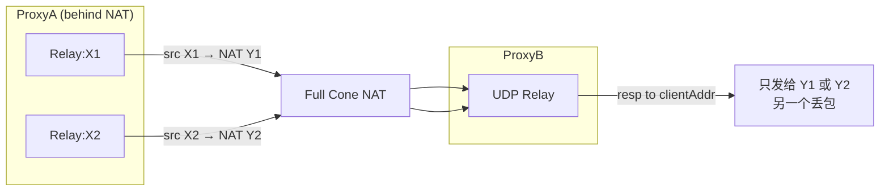
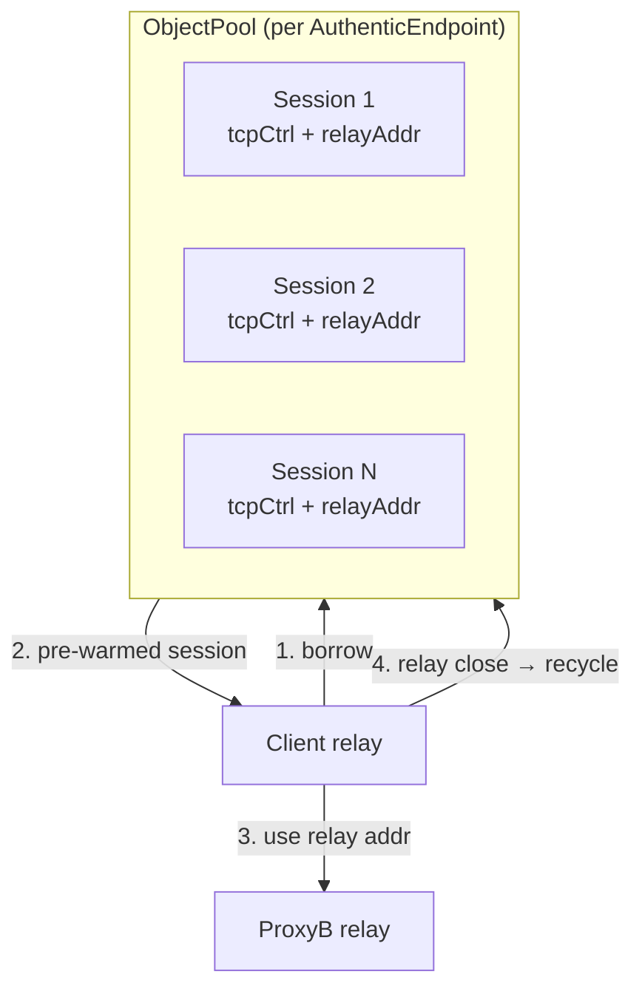

# Socks5 UDP Session 池化方案（v2 -- Full Cone NAT 修正）

## 分析：池化 Socks5Client 本身没有意义

`Socks5Client` 是**无状态**的配置持有者（仅 `proxyServer` + `config`），构造几乎零成本，`dispose()` 也不释放任何资源。池化它没有性能收益。

**真正昂贵的是 `Socks5UdpSession` 的建立过程**：每次 `udpAssociateAsync()` 都要执行 TCP connect + SOCKS5 握手（auth + UDP_ASSOCIATE command）= 3-4 RTT。

## 当前瓶颈

在 [SocksUdpUpstream.java](rxlib/src/main/java/org/rx/net/socks/upstream/SocksUdpUpstream.java) 的 `initChannel()` 中，每个客户端 relay channel 都会：
1. `new Socks5Client(svrEp, config)` -- 便宜
2. `client.udpAssociateAsync(channel).get(timeout)` -- **昂贵**（TCP连接 + SOCKS5握手）
3. 缓存在 channel 属性上 -- relay channel 关闭时 session 也关闭

按 socksServer.md 场景2/场景4，如果 ProxyA 有 100 个并发客户端都需要到 ProxyB 做 UDP relay，就产生 100 个独立的 TCP 控制连接 + SOCKS5 握手。

## Full Cone NAT 约束：共享 Session 不可行

之前方案B（共享 session，多个 relay channel 复用同一个上游 relay 地址）存在根本性问题：

**问题 1：ProxyB 的 `SocksUdpRelayHandler` 只跟踪单一 clientAddr**

```
164:189:rxlib/src/main/java/org/rx/net/socks/SocksUdpRelayHandler.java
```

`handleDestResponse()` 把所有响应发给 `relay.attr(ATTR_CLIENT_ADDR).get()` -- 只有一个地址。如果多个 ProxyA relay channel 共享同一个上游 session，只有最后一个设置的 clientAddr 能收到响应，其他客户端全部丢包。

**问题 2：NAT 映射使共享更加不可靠**



在 Full Cone NAT 下，ProxyA 的每个 relay channel 经过 NAT 后有不同的外部端口 (Y1, Y2)。ProxyB 的 relay handler 只记录一个 `clientAddr`，响应只能发给其中一个。即使不考虑 NAT，同一 LAN 内不同 relay 端口也有同样问题。

**问题 3：响应解复用无法可靠工作**

当两个客户端通过同一个 relay 向同一个目标（如 8.8.8.8:53）发送 UDP 时，ProxyB 的 relay 使用同一个出站端口。目标的响应回到 relay 后，ProxyB 无法区分该转发给哪个客户端。

**结论：必须使用独占模式 -- 每个客户端独占一个上游 session。**

## 推荐方案：ObjectPool 独占借还

使用现有 `ObjectPool<PooledSession>` 以 borrow/return 语义管理预建的上游 session，消除热路径上的握手延迟。



### 核心设计

**池化对象：`PooledSession`**（轻量包装）

```java
static class PooledSession implements Closeable {
    final Socks5Client client;
    final Channel tcpControl;
    final InetSocketAddress relayAddress;
    // 内部 UDP channel（仅用于 validate/keepalive，实际数据走 local relay channel）
}
```

**ObjectPool 配置**：

- `createHandler`: `new Socks5Client(ep, config).udpAssociateAsync().get()` -- 预建 TCP control + SOCKS5 握手
- `validateHandler`: `session.tcpControl.isActive()` -- TCP 控制通道存活检测
- `minSize`: 2-4（预热，避免冷启动）
- `maxSize`: 按并发客户端峰值配置
- `idleTimeout`: 300s（空闲回收，减少 ProxyB 资源占用）

**池管理器**：`ConcurrentHashMap<AuthenticEndpoint, ObjectPool<PooledSession>>`，按上游代理分组。

### 变更文件

- [Socks5Client.java](rxlib/src/main/java/org/rx/net/socks/Socks5Client.java)
  - 添加 `PooledSession` 内部类
  - 添加静态方法 `getOrCreatePool(AuthenticEndpoint, SocksConfig)` 返回/创建对应的 `ObjectPool<PooledSession>`
  - 添加静态方法 `closePool(AuthenticEndpoint)` 用于销毁

- [SocksUdpUpstream.java](rxlib/src/main/java/org/rx/net/socks/upstream/SocksUdpUpstream.java)
  - `initChannel()` 改为：
    ```java
    // Before (current) -- 每次握手 3-4 RTT
    Socks5Client client = new Socks5Client(svrEp, config);
    Socks5UdpSession session = client.udpAssociateAsync(channel).get(timeout);
    
    // After (pooled) -- borrow 接近 0ms
    ObjectPool<PooledSession> pool = Socks5Client.getOrCreatePool(svrEp, config);
    PooledSession ps = pool.borrow();
    InetSocketAddress relayAddr = ps.relayAddress;
    channel.closeFuture().addListener(f -> pool.recycle(ps));
    ```
  - 响应路由不变：ProxyB 的 `clientAddr` 在每次 borrow 后由第一个 UDP 包自动更新

### 性能收益

- **首包延迟**：从 3-4 RTT（TCP+握手）降至接近 0（预热 borrow）
- **并发效率**：预热的 minSize 个 session 可立即服务突发流量
- **资源管理**：idle session 自动回收，泄漏检测内置
- **故障恢复**：TCP 控制断开 → validate 失败 → retire + 自动创建新 session

### 注意事项

- borrow 的 session 与 local relay channel 是 1:1 独占关系，不存在响应路由歧义
- ProxyB 的 `ATTR_CLIENT_ADDR` 会在 borrow 后第一个 UDP 包到达时自动更新为新客户端地址
- `PooledSession.tcpControl` 必须保持存活（RFC 1928：TCP 关闭 = relay 终止）
- 回收时需确保 ProxyB 侧旧 ctxMap/routeMap 状态不影响下个借用者（ProxyB relay handler 的 ctxMap 用 Caffeine 有 maxSize 限制，自然淘汰）
