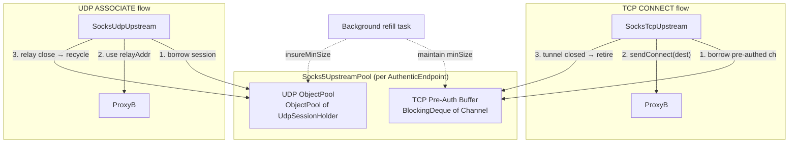

# Socks5 连接池方案（TCP + UDP）

## 背景与瓶颈

`Socks5Client` 是无状态配置对象，池化它本身没有意义。**真正昂贵的是每次 SOCKS5 握手**：TCP connect + 认证 + 命令（CONNECT/UDP_ASSOCIATE）= 3-4 RTT。

在 socksServer.md 的场景2/4中，ProxyA 到 ProxyB 的每个客户端都触发独立的握手，高并发时成为性能瓶颈。

## Full Cone NAT 约束

`SocksUdpRelayHandler.handleDestResponse()` 只跟踪单一 `clientAddr`，所有响应发给同一地址。多客户端共享同一 UDP session 时，只有最后一个 clientAddr 能收到响应。**因此 UDP 必须使用独占借还模式，不能共享 session。**

## 总体架构



---

## Part 1: TCP 预认证连接池

### 1.1 核心思路

SOCKS5 握手分两阶段：

| 阶段 | 内容 | RTT | 是否目标相关 |
|------|------|-----|-------------|
| **Auth** | TCP connect + init + password auth | 2-3 | 否（可预建） |
| **Command** | CONNECT dest_host:dest_port | 1 | 是（必须按需） |

**池化 Auth 阶段**：预建到 ProxyB 的 TCP 连接并完成 SOCKS5 认证，但暂不发送 CONNECT 命令。借用时再发 CONNECT，节省 2-3 RTT。

### 1.2 Socks5ClientHandler 改造

在 [Socks5ClientHandler.java](rxlib/src/main/java/org/rx/net/socks/Socks5ClientHandler.java) 中增加 `PRE_AUTH` 模式：

当前 `handleResponse()` 流程：`InitResponse → (PasswordAuthResponse →) sendCommand()`。

改造后：
- 新增字段 `private final boolean preAuthOnly;`
- Auth 完成后（即将调 `sendCommand` 的位置），若 `preAuthOnly = true`：
  - **不**调用 `sendCommand()`
  - 直接调用 `handshakeCallback.invoke()` 通知认证完成
  - 保留 pipeline 中的 encoder/decoder，**不** remove handler（等 CONNECT 后再 remove）
- 新增公开方法 `sendConnect(UnresolvedEndpoint destination)`：
  - 设置 `destinationAddress`（通过 Netty `ProxyHandler` 的内部机制）
  - 调用 `sendCommand(ctx)` 发送 CONNECT
  - CONNECT 响应后正常完成握手（`return true` → ProxyHandler 自动清理 pipeline）

```java
// 新增构造参数 preAuthOnly
public Socks5ClientHandler(SocketAddress proxyAddress, String username, String password,
                           Socks5CommandType commandType, boolean preAuthOnly) {
    ...
    this.preAuthOnly = preAuthOnly;
}

// Auth 完成时（原来调 sendCommand 的地方）
if (preAuthOnly) {
    if (handshakeCallback != null) handshakeCallback.invoke();
    return false; // 不结束握手，等待 sendConnect
}
sendCommand(ctx);

// 新增公开方法
public void sendConnect(@NonNull UnresolvedEndpoint dest) {
    // 在 channel 的 eventLoop 中执行
    channel.eventLoop().execute(() -> sendCommand(ctx, dest));
}
```

### 1.3 TCP Pool 设计

由于 TCP 隧道使用后即销毁（不可回收），用 `ConcurrentBlockingDeque<PreAuthedChannel>` + 后台补充任务，而非 `ObjectPool`：

```java
static class PreAuthedChannel {
    final Channel channel;
    final Socks5ClientHandler handler;
    final long createTime;
}
```

池行为：
- **补充**：后台定时任务保持 deque 中有 `minSize` 个预认证连接
- **借出**：`pollFirst()` 取一个，如果 `!channel.isActive()` 则丢弃再取
- **消费后**：不归还（隧道关闭 = channel 关闭），后台任务补充新的
- **超时淘汰**：创建超过 `maxIdleMs` 的预认证连接自动丢弃（避免 proxy 端超时断开）

### 1.4 SocksTcpUpstream + Socks5CommandRequestHandler 改造

[SocksTcpUpstream.java](rxlib/src/main/java/org/rx/net/socks/upstream/SocksTcpUpstream.java) 新增方法：

```java
// 尝试借用预认证连接；返回 null 则降级走原流程
public PreAuthedChannel borrowPreAuthed() {
    Socks5UpstreamPool pool = Socks5UpstreamPool.get(next.getEndpoint());
    return pool != null ? pool.borrowTcp() : null;
}
```

[Socks5CommandRequestHandler.java](rxlib/src/main/java/org/rx/net/socks/Socks5CommandRequestHandler.java) 的 `connect()` 方法改造：

```java
private void connect(Channel inbound, Socks5AddressType dstAddrType, SocksContext e, ...) {
    Upstream upstream = e.getUpstream();

    // 快速路径：尝试使用预认证通道
    if (upstream instanceof SocksTcpUpstream) {
        PreAuthedChannel preAuthed = ((SocksTcpUpstream) upstream).borrowPreAuthed();
        if (preAuthed != null && preAuthed.channel.isActive()) {
            Channel outbound = preAuthed.channel;
            // 添加 relay handler 等
            inbound.pipeline().addLast(SocksTcpFrontendRelayHandler.DEFAULT);
            BackpressureHandler.install(inbound, outbound);

            // 发送 CONNECT 命令（仅 1 RTT）
            preAuthed.handler.sendConnect(upstream.getDestination());
            preAuthed.handler.connectFuture().addListener(f -> {
                if (f.isSuccess()) {
                    relay(inbound, outbound, dstAddrType, e);
                } else {
                    // 降级重试原流程
                    connectFresh(inbound, dstAddrType, e, null);
                }
            });
            return;
        }
    }

    // 慢路径：原流程（新建连接 + 完整握手）
    connectFresh(inbound, dstAddrType, e, reconnectionAttempts);
}
```

### 1.5 性能收益

- **首连延迟**：从 3-4 RTT → 1 RTT（仅 CONNECT 命令）
- **降级安全**：池空或预认证通道失效时自动走原流程，零风险
- **资源可控**：`minSize` / `maxIdleMs` 可按 ProxyB 负载调优

---

## Part 2: UDP Session ObjectPool

### 2.1 核心思路

与 TCP 不同，UDP session 可被回收复用（TCP 控制通道保持存活即可），使用 `ObjectPool<UdpSessionHolder>` 实现独占借还。

### 2.2 Pool 设计

```java
static class UdpSessionHolder implements Closeable {
    final Socks5Client client;
    final Socks5UdpSession session;
    final InetSocketAddress relayAddress;

    boolean isValid() {
        return !session.isClosed() && session.tcpControl.isActive();
    }
}
```

`ObjectPool` 配置：
- `createHandler`：`new Socks5Client(ep, config).udpAssociateAsync().get(timeout)` → 完整握手
- `validateHandler`：`holder.isValid()`
- `minSize`：2-4（预热）
- `maxSize`：按并发峰值
- `idleTimeout`：300s
- `borrowTimeout`：同 `config.connectTimeoutMillis`

### 2.3 SocksUdpUpstream 改造

[SocksUdpUpstream.java](rxlib/src/main/java/org/rx/net/socks/upstream/SocksUdpUpstream.java) 的 `initChannel()` 改为：

```java
@Override
public void initChannel(Channel channel) {
    // 快速路径：复用已有 session
    SessionHolder holder = channel.attr(ATTR_UDP_SESSION).get();
    if (holder != null && !holder.session.isClosed()) {
        return;
    }

    // 从 pool 借出
    Socks5UpstreamPool pool = Socks5UpstreamPool.getOrCreate(next.getEndpoint(), config);
    UdpSessionHolder udpHolder = pool.borrowUdp();
    InetSocketAddress relayAddr = udpHolder.relayAddress;

    holder = new SessionHolder(udpHolder, relayAddr);
    channel.attr(ATTR_UDP_SESSION).set(holder);

    // relay 关闭时归还
    channel.closeFuture().addListener(f -> {
        pool.recycleUdp(udpHolder);
        channel.attr(ATTR_UDP_SESSION).set(null);
    });
}
```

### 2.4 回收安全

- borrow 后 ProxyB 的 `ATTR_CLIENT_ADDR` 由第一个 UDP 包自动更新为新客户端地址
- ProxyB 的 `ctxMap` / `routeMap` 使用 Caffeine（maxSize=256），旧条目自然淘汰
- 如果 TCP 控制通道在借用期间断开，`validateHandler` 在下次 `recycle` 时检测到并 retire

---

## Part 3: 统一池管理器

新建 [Socks5UpstreamPool.java](rxlib/src/main/java/org/rx/net/socks/Socks5UpstreamPool.java)：

```java
public class Socks5UpstreamPool implements Closeable {
    // 全局注册表
    static final ConcurrentHashMap<AuthenticEndpoint, Socks5UpstreamPool> POOLS = new ConcurrentHashMap<>();

    final AuthenticEndpoint endpoint;
    final SocksConfig config;
    final ConcurrentBlockingDeque<PreAuthedChannel> tcpBuffer;   // TCP 预认证缓冲
    final ObjectPool<UdpSessionHolder> udpPool;                   // UDP session 池
    final TimeoutFuture<?> tcpRefillTask;                         // TCP 后台补充

    public static Socks5UpstreamPool getOrCreate(AuthenticEndpoint ep, SocksConfig config) { ... }
    public static void close(AuthenticEndpoint ep) { ... }

    public PreAuthedChannel borrowTcp() { ... }
    public UdpSessionHolder borrowUdp() throws TimeoutException { ... }
    public void recycleUdp(UdpSessionHolder holder) { ... }
}
```

### 配置参数（可通过 SocksConfig 或独立配置）

- `tcpPoolMinSize`：TCP 预认证连接保持数（默认 2）
- `tcpPoolMaxIdleMs`：TCP 预认证连接最大闲置时间（默认 60s）
- `udpPoolMinSize`：UDP session 最小数（默认 2）
- `udpPoolMaxSize`：UDP session 最大数（默认 50）
- `udpPoolIdleTimeout`：UDP session 闲置超时（默认 300s）

---

## 变更文件汇总

| 文件 | 变更内容 |
|------|---------|
| `Socks5ClientHandler.java` | 增加 `preAuthOnly` 模式、`sendConnect()` 方法 |
| `Socks5UpstreamPool.java` (新) | 统一 TCP/UDP 池管理器 |
| `SocksTcpUpstream.java` | 新增 `borrowPreAuthed()` 方法 |
| `Socks5CommandRequestHandler.java` | `connect()` 增加预认证快速路径 |
| `SocksUdpUpstream.java` | `initChannel()` 改为 pool borrow/recycle |
| `SocksConfig.java` | 增加池化相关配置参数 |
