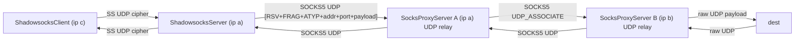

# 场景4 Review 报告（高性能模式）

## 1. 架构与数据流

### 1.1 链路总览

### 1.2 关键组件职责

- 入口 SS：[`ShadowsocksServer.java`](rxlib/src/main/java/org/rx/net/socks/ShadowsocksServer.java) 绑定 UDP 端口，pipeline `CipherCodec → SSProtocolCodec → SSUdpProxyHandler`。
- SS 解析：[`SSProtocolCodec.java`](rxlib/src/main/java/org/rx/net/socks/SSProtocolCodec.java) 解出 `DST.ADDR/PORT` 写入 `ShadowsocksConfig.REMOTE_DEST`。
- SS 路由/转发：[`SSUdpProxyHandler.java`](rxlib/src/main/java/org/rx/net/socks/SSUdpProxyHandler.java) 按 `(srcEp,dstEp)` 做路由缓存、异步 `initChannelAsync`、pending 队列、outbound 池 `OUTBOUND_POOL`、回包透传到 SS inbound。
- SOCKS5 UDP_ASSOCIATE：[`Socks5CommandRequestHandler.java`](rxlib/src/main/java/org/rx/net/socks/Socks5CommandRequestHandler.java) 为每个 TCP 控制新建 per-client UDP relay channel。
- SOCKS5 UDP 中继：[`SocksUdpRelayHandler.java`](rxlib/src/main/java/org/rx/net/socks/SocksUdpRelayHandler.java) 双向转发（client 包 → 下一跳；下一跳/dest 包 → client）。
- 上行 upstream：[`SocksUdpUpstream.java`](rxlib/src/main/java/org/rx/net/socks/upstream/SocksUdpUpstream.java) 建立/复用 SOCKS5 UDP 会话，支持 `Socks5UpstreamPoolManager` 租约池。
- 编码工具：[`UdpManager.java`](rxlib/src/main/java/org/rx/net/socks/UdpManager.java) 提供 SOCKS5 UDP header `HeaderTemplate` 缓存与 `socks5Encode/Decode`。
- UDP 优化：[`UdpRedundantEncoder/Decoder`](rxlib/src/main/java/org/rx/net/socks/UdpRedundantEncoder.java) 与 [`UdpCompressEncoder/Decoder`](rxlib/src/main/java/org/rx/net/socks/UdpCompressEncoder.java)，由 [`Sockets.addUdpOptimizationHandlers`](rxlib/src/main/java/org/rx/net/Sockets.java) 统一注入。
- 入口配置：[`Main.java`](rxlib/src/main/java/org/rx/Main.java) `launchClient` 组装 `ShadowsocksServer` + `SocksProxyServer`；`onUdpRoute` 使用 `SocksUdpUpstream(dstEp, toInConf, svrSupport)`。

### 1.3 ByteBuf 引用计数走查

- SS 入口：`SSUdpProxyHandler.channelRead0` 仅 `inBuf.retain()` 一次，传入 `writeRoutePacket/enqueuePendingPacket`。
- 下行编码：`UdpManager.HeaderTemplate.composite(..., retainPayload=false)` 直接把 `payload` ownership 转给 `CompositeByteBuf`。
- 异常清理：`composite` 内部 `try/catch` 调用 `Bytes.release(compositeBuf)`；`SSUdpProxyHandler.writePacketNow` 在 `buildOutboundPacket` 抛出时额外 `payload.release()`。
- 回包：`UdpBackendRelayHandler.channelRead0` 通过 `prependAddress(..., headerTemplate)` 走 `retainPayload=true` 分支，`SimpleChannelInboundHandler` 负责原始 `outBuf` 的 release。

## 2. 与用户硬约束的符合性

- Java 8：所有新文件仅使用 J8 API（`CompletableFuture`、`ConcurrentHashMap`、Netty 4.1），无 J9+ 特性。
- 零分配/低延迟：`UdpManager.HeaderTemplate` 缓存 ATYP+addr+port 字节，热路径复用；`CompositeByteBuf` 避免 payload 拷贝；`ATTR_LAST_ROUTE` 做 fast-path。
- 远程 DNS：`SocksUdpRelayHandler.handleClientPacket` 将 `dstEp` 原样作为 SOCKS5 UDP 头转发到下一跳，DNS 在 B 端（或 dest 侧）解析；仅 Direct Upstream 分支会调用 `upstream.getDestination().socketAddress()` 触发本地解析。
- UDP 无传输层背压：这里需要关注的不是 TCP 式端到端背压，而是本地写侧过载保护、丢包策略与指标。
- ByteBuf 引用计数：正常路径 OK；异常路径有一处 double-release 风险（见 3.1）。
- Full Clone NAT：`ctxMap` 按 `sender InetSocketAddress` 索引，endpoint-independent mapping 下回包稳定命中；异常 sender 会被 `rsv/frag` 校验拒绝。

## 3. 问题清单（按行动优先级）

### 3.1 必须修

1. `SSUdpProxyHandler.writePacketNow` 对 `buildOutboundPacket` 异常路径可能 double-release
   - 关键片段（[`SSUdpProxyHandler.java`](rxlib/src/main/java/org/rx/net/socks/SSUdpProxyHandler.java)）：
     - `buildOutboundPacket` → `UdpManager.socks5Encode(payload, tmpl)` → `composite(alloc, payload, false)`；
     - 若 `CompositeByteBuf.addComponents` 抛异常，Netty 内部已对 `payload` 做 ownership 转移/释放，外层 catch 又 `payload.release()`。
   - 建议：改为 `retainPayload=true` + 外层 try/finally 统一 release；或在 `buildOutboundPacket` 内部保证抛出前 payload 仍归调用方所有。

2. UDP 无传输层背压，但本地写侧过载保护不足
   - TCP 路径有 `BackpressureHandler`；UDP `relay.writeAndFlush(...)` 与 SS outbound 均无 `isWritable()` / drop metric / 本地发送压力指标。
   - 这里不是要求补 TCP 式“背压”，而是应用层写侧过载治理。
   - 建议：在 `SocksUdpRelayHandler.writeClientPacket` / `SSUdpProxyHandler.writeWhenReady` 前补 `channel.isWritable()` 守卫；不可写时按策略丢弃并通过 `DiagnosticMetrics` 计数。

3. Session 失效后路由表残留
   - `SocksUdpUpstream` session 断开时仅清 `channel.attr(ATTR_UDP_SESSION)`，不回调 `SocksUdpRelayHandler` 的 `ctxMap/routeMap`；依赖下一包 `isRouteReady=false` 进入 `beginRouteInit` 分支，靠 `routeMap.put` 覆盖自愈。
   - 风险：自愈期间 fast-path 不会命中，每包都走 `routeInitMap.computeIfAbsent`；旧 ctx 永不从 ctxMap 主动移除。
   - 建议：`SocksUdpUpstream.bindHolder` 的 `closeFuture` listener 触发 relay 侧清理（通过 `relay.eventLoop().execute` 提交）。

4. 可观测性不足，影响后续调优判断
   - `OUTBOUND_POOL` 无 size/miss/lifetime/evict 指标。
   - `SocksUdpRelayHandler.channelRead0` 中非 `ctxMap` sender 回包仅 `log.warn`，缺 `DiagnosticMetrics` 计数（用于发现 NAT 穿透异常）。
   - `MemoryCache` 的 `maximumSize`（routeMap=2048、ctxMap=256）硬编码，建议至少先补容量/命中率观测。

5. 测试覆盖还缺关键稳态与异常场景
   - 并发多 dst、session 自愈、异常注入、Netty leak detection、大包边界都值得补。
   - 这些测试既用于验证“必须修”项，也用于为第二组假设项提供数据。

### 3.2 需要压测/指标证明后再动

1. `SocksUdpRelayHandler.ctxMap` 的 “last-put-wins” 问题被放大了
   - 当前 `ctxMap` 更接近 known-upstream-sender gate，而不是 per-dst 回包分流表；现有 `handleDestResponse` 对 `SocksUdpUpstream` 只做 sender 识别和透传。
   - 现阶段直接改成嵌套 map，会增加热路径查找与对象成本，但没有明确场景4功能收益。
   - 建议：只有在需要做 per-dst 指标、归因、精细回包分流时，再评估是否重构。

2. `SSUdpProxyHandler.OUTBOUND_POOL` 先补指标，再决定是否加容量上限
   - 静态全局 `ConcurrentHashMap<OutboundPoolKey, ChannelFuture>` 的确值得观察，但当前已有 inbound close、outbound close、idle timeout 三层回收。
   - 直接加 hard cap / 主动驱逐，有误杀活跃会话的风险。
   - 建议：先补 `size/miss/lifetime/close-cause` 指标，再决定是否 cap。

3. `launchClient` 的 SS 入口 TCP idle timeout 属于 workload 调参项
   - [`Main.java`](rxlib/src/main/java/org/rx/Main.java) 确实把 `read/write timeout` 设成了 0。
   - 但是否应该收紧，要看是否存在大量 half-open/长空闲连接，以及是否允许长时间空闲隧道。
   - 建议：压测或线上指标证明后再改，不作为当前场景4的必修 bug。

4. `SSProtocolCodec` 的 `channel.attr(REMOTE_DEST)` handoff 不是明确 bug
   - 当前 `SSProtocolCodec` 写 attr 后，`SSUdpProxyHandler` 在同一条 UDP read 链里立即消费；在单 `DatagramChannel` 的 EventLoop 串行模型下，这不是清晰的正确性问题。
   - 若改成自定义消息封装 `(DatagramPacket, UnresolvedEndpoint)`，会在 SS UDP 热路径上引入每包额外对象分配。
   - 建议：只有在证明 attr handoff 出现正确性问题时，才考虑重构。

5. Direct Upstream 分支避免本地 DNS 解析
   - 这是合理方向，但不属于场景4主链路当前最紧迫问题；同时会牵涉语义边界（何时允许本地解析、何时强制远程解析）。
   - 建议：先确认是否真实进入 Direct 分支、命中频率和耗时，再决定是否改造。

6. `useDedicatedCryptoGroup=true` 与保留 UDP_ASSOCIATE TCP idle 都是调参项
   - `useDedicatedCryptoGroup` 需要和 EventLoop 线程亲和、上下文切换成本一起权衡。
   - UDP_ASSOCIATE 后是否保留 TCP control idle handler，也需要结合长连接模式和 NAT 行为来验证。
   - 建议：归入压测/指标驱动项，而不是默认修复项。

## 4. 测试覆盖评估

已覆盖（[`SocksProxyServerIntegrationTest.java`](rxlib/src/test/java/org/rx/net/socks/SocksProxyServerIntegrationTest.java) 与 [`ShadowsocksServerIntegrationTest.java`](rxlib/src/test/java/org/rx/net/socks/ShadowsocksServerIntegrationTest.java)）：

- 基础链路：`shadowsocksUdpRelay_e2e`、`shadowsocksUdpRelay_socks5_chained_e2e`。
- 冗余：`shadowsocksUdpRelay_socks5_chained_withUdpRedundantOnProxyA_e2e`。
- 冗余 + 压缩：`shadowsocksUdpRelay_socks5_chained_withUdpCompressAndRedundantOnProxyAB_e2e`。
- 租约池：`shadowsocksUdpRelay_socks5_chained_withLeasePool_e2e`。
- 多客户端端口：`shadowsocksUdpRelay_sameDestinationDifferentClientPorts_e2e`。
- LocalAddress：`shadowsocksUdpRelay_socks5_localChannel_preservesOrigin_e2e`。

建议补充：

- 同一 SS inbound 并发多 dst 验证 `OUTBOUND_POOL` 分区与 `ctxMap` 不串包。
- A→B session 失效后自愈（主动 `closeSession` 后继续发包，验证包到达 dest）。
- 带泄漏检测：`-Dio.netty.leakDetection.level=PARANOID` 执行全部 UDP 用例。
- `buildOutboundPacket` 异常注入，断言无 double-release。
- 大 UDP 包（接近 MTU）与 `MAX_PENDING_ROUTE_BYTES` 边界。

## 5. 结论

- 场景4 主路径设计合理：池化 outbound、header 模板缓存、异步初始化 + pending 队列、双向 decoder 注入、redundant peer 白名单控制编码范围。
- 无发现正常路径上的 Critical bug；当前应优先处理“必须修”组，第二组全部需要先拿压测或指标证明收益/风险，再决定是否进入实现。
- 其中“UDP 背压”表述已修正为“UDP 无传输层背压，但需要应用层写侧过载保护”。
- 不做代码改动（plan 模式），后续若需要逐项修复，可优先按“必须修”组拆独立 PR。

---

## 6. 必须修项 code review（commit 1294f787）

仅针对“必须修”5 项已落地代码做追加 review，不覆盖前文。结论：主体修复到位，但存在若干残留风险，建议后续迭代处理。

### 6.1 项①：`SSUdpProxyHandler.writePacketNow` 异常路径 release

- 已落地（[`SSUdpProxyHandler.java`](rxlib/src/main/java/org/rx/net/socks/SSUdpProxyHandler.java)）：
  - `payload.release()` 统一替换为 `Bytes.release(payload)`，并在释放前通过 `readableBytesOf(payload)` 先取字节数。
  - `Bytes.release` 对 `refCnt=0` 幂等，`buildOutboundPacket` 内 `CompositeByteBuf.addComponents` 即使转移 ownership 后抛错，外层二次释放也是 no-op。
- 残留提示：
  - `readableBytesOf` 在 `refCnt=0` 时返回 0，指标里会看到 `bytes=0` 的 drop 条目，可能掩盖真实包大小；建议在进入 try 块之前就捕获 `payload.readableBytes()`，异常分支也能上报真实字节数。

### 6.2 项②：UDP 写侧过载保护 `Sockets.writeUdp`

- 已落地（[`Sockets.java`](rxlib/src/main/java/org/rx/net/Sockets.java) + [`SSUdpProxyHandler.java`](rxlib/src/main/java/org/rx/net/socks/SSUdpProxyHandler.java) + [`SocksUdpRelayHandler.java`](rxlib/src/main/java/org/rx/net/socks/SocksUdpRelayHandler.java)）：
  - `UdpWriteResult` 枚举 + `writeUdp(channel, packet, metricPrefix, tags)`。
  - `pendingBytes`（`AtomicInteger`）对 `channel` 统计在飞字节；超 `udpWriteLimitBytes` 即 `PENDING_OVERLIMIT`，`!isWritable()` 即 `CHANNEL_UNWRITABLE`。
  - 写成功/失败 listener 中回退 pendingBytes；`writeAndFlush` 抛异常也回退并 release。
  - SS inbound/outbound、socks relay 三处写路径已切换到该函数。
- 潜在风险（追加）：
  - **[中]** SS inbound DatagramChannel 是**全局共享**（所有 SS 客户端一个 channel），`pendingBytes` 聚合所有客户端。大流量单一客户端会先耗尽 256KB 默认配额，引发其他客户端 drop（拥塞饥饿）。
    - 建议：对 SS inbound 这一 hotspot 额外引入 per-`srcEp`（或 per-recipient）的 soft limit（`ConcurrentMap<InetSocketAddress, AtomicInteger>`），避免单 source 拖垮整体；或至少把上限从 `writeBufferWaterMark.high()` 拉到更高的数量级（例如 MB 级），并给 SocksConfig 暴露配置。
  - **[中]** `udpWriteLimitBytes` 复用 `OptimalSettings.writeBufferWaterMark.high()`。Netty `WriteBufferWaterMark` 默认 32KB/64KB，对 UDP 常规 MTU 1500 场景只能容纳 ~40 个在飞包，短突发容易误伤。
    - 建议：`DEFAULT_UDP_WRITE_LIMIT_BYTES` 单独暴露到 `SocketConfig/SocksConfig`，并在生产默认值上调（如 1MB 起步）。
  - **[低]** `pending-overlimit` 分支 tag 里 `pendingBytes=queuedBytes` 含本次 bytes（尚未回退），语义上表示的是“超限前”的高水位；和 `not-writable` 分支一致。日志里看到 `pendingBytes=limit+bytes` 是预期行为，但文档/注释建议说明。
  - **[低]** `writeAndFlush` 成功 listener 回退 pendingBytes；若写 listener 因极端情况未被调用（例如 channel 被强制 `deregister` 且未触发 `operationComplete`），会造成 pendingBytes 永久增长。当前未观察到这种 Netty 行为，但建议加 channel inactive 时的强制 reset 兜底。

### 6.3 项③：Session 失效主动清理 ctxMap/routeMap

- 已落地（[`SocksUdpUpstream.java`](rxlib/src/main/java/org/rx/net/socks/upstream/SocksUdpUpstream.java) + [`SocksUdpRelayHandler.java`](rxlib/src/main/java/org/rx/net/socks/SocksUdpRelayHandler.java) + [`Socks5Client.java`](rxlib/src/main/java/org/rx/net/socks/Socks5Client.java)）：
  - `getUdpRelayAddress` 先校验 `holder.isValid()`，失效即触发 `invalidateHolder(channel, holder, false, "stale-session")`。
  - `bindHolder` 追加 `controlChannel.closeFuture()` listener 主动 invalidate；`channel.closeFuture()` 保留原 pooled lease 回收路径。
  - `invalidateHolder` 统一串行化到 `relay.eventLoop()`，并通过 `SocksUdpRelayHandler.onUpstreamSessionInvalidated` 调用 `cleanupInvalidatedRoute`。
  - `cleanupInvalidatedRoute` 先按 `relayAddress` 精确删除，再全表遍历清掉所有 `ctx.getUpstream() == upstream` 的 `ctxMap/routeMap/routeInitMap/ATTR_LAST_ROUTE`。
  - `Socks5UdpSession.tcpControl` 加 `@Getter`，`SessionHolder.controlChannel()` 统一暴露 TCP 控制通道。
  - 自愈链条完整：`ProxyB` UDP relay close → `Socks5CommandRequestHandler` 绑定的 `udpRelay.closeFuture → tcpControl.close` → `ProxyA` 侧 TCP RST → `Socks5Client` 绑的 `session.close()` + `SocksUdpUpstream` 绑的 `invalidateHolder(control-close)` → `cleanupInvalidatedRoute` → 下次包走 `beginRouteInit` 新建 session。
- 潜在风险（追加）：
  - **[中]** 每次 `bindHolder` 在 `controlChannel.closeFuture()` 上 `addListener`；若同一 relay channel 经历多次 init/invalidate（频繁失效自愈），旧 `controlChannel` 对象会持有匿名 listener 引用（含 `this` 和 `finalHolder`），直到旧 `controlChannel` 被 GC 才释放。短期无感，但建议开 `-Dio.netty.leakDetection.level=PARANOID` 验证，必要时改为一次性构造“弱绑定” listener。
  - **[低]** `cleanupInvalidatedRoute` 里先按 `relayAddress` 删再全表扫；由于同一 upstream 通常只对应一个 ctx/route 条目，第二遍 for-each 基本是兜底，属于冗余但可接受的设计。保留 for-each 的前提下，可考虑把 `ctxMap.entrySet()` 遍历加 early-break 条件或改为 `values().removeIf`。
  - **[低]** `getUdpRelayAddress` 会在调用线程（可能是 Socks relay 的 EventLoop 或 SSUdpProxyHandler 的 EventLoop）上触发 `invalidateHolder` 异步调度；排队到 eventLoop 前其他调用者可能继续拿到 stale `null`，自愈 N+1 次触发 `invalidateHolder` task（内部通过 `active != holder` 去重）。代价低，不影响正确性，但在指标里会看到多次 `session.invalidate.count`。
  - **[低]** `cleanupInvalidatedRoute` 与 `handleClientPacket` 都在 `relay.eventLoop()` 串行执行，没有并发问题；但 `ctxMap/routeMap/routeInitMap` 仍然是 `ConcurrentMap`，弱一致性迭代语义在单线程下等价于强一致，代码 OK。

### 6.4 项④：可观测性 DiagnosticMetrics

- 已落地 metric 清单（[`SSUdpProxyHandler.java`](rxlib/src/main/java/org/rx/net/socks/SSUdpProxyHandler.java) + [`SocksUdpRelayHandler.java`](rxlib/src/main/java/org/rx/net/socks/SocksUdpRelayHandler.java) + [`SocksProxyServer.java`](rxlib/src/main/java/org/rx/net/socks/SocksProxyServer.java) + [`SocksUdpUpstream.java`](rxlib/src/main/java/org/rx/net/socks/upstream/SocksUdpUpstream.java) + [`Sockets.java`](rxlib/src/main/java/org/rx/net/Sockets.java)）：
  - `ss.udp.outbound.pool.size` / `ss.udp.route.cache.size` / `ss.udp.outbound.route.cache.size` / `ss.udp.header.cache.size`
  - `ss.udp.drop.count` / `ss.udp.unexpected.sender.count` / `ss.udp.pending.write.bytes`
  - `socks.udp.ctx.cache.size` / `socks.udp.route.cache.size` / `socks.udp.drop.count`
  - `socks.udp.session.invalidate.count` / `socks.udp.session.cleanup.count`
  - `socks.udp.relay.active.count`
  - 自定义前缀 + tags 方式调用 `DiagnosticMetrics.record(...)`。
- 潜在风险（追加，重要）：
  - **[高]** **tags 高基数问题**。`recordUdpDrop` / `recordUdpMetric` / `udpMetricTags` 在 tags 里嵌入 `source=`, `sender=`, `destination=`, `recipient=`, `relay=`, `client=`, `bytes=`, `pendingBytes=`, `limitBytes=` 等高基数字段。每个包的 source/destination/bytes 都不同 → 每次 `DiagnosticMetrics.record` 创建新 series → 指标 storage/检索成本按 **O(包数)** 增长，生产环境几乎必爆。
    - 建议：只保留低基数维度（`reason`、`port`、`kind`、`action`、`pooled`、`limit-bucket`），具体 endpoint 信息改走结构化日志或事件流（如 `log.debug` + sampled structured log）。
  - **[中]** `recordRouteCacheSizes` 在每次 `onRouteInitSuccess` 和 session cleanup 时调用；high QPS 场景下 route 初始化频繁 → 指标写入频繁。建议按 EMA/采样频率（例如每 N 次或每 M 秒打一次 gauge）。
  - **[低]** `ss.udp.drop.count` / `socks.udp.drop.count` 直接用 `DiagnosticMetrics.record(name, 1D, tags)`；若 DiagnosticMetrics 底层是计数器，要确认它是按 tag 分组累加还是每次都新建。配合前述 tags 降基数一起治理。
  - **[低]** `SocksProxyServer.registerUdpRelay` 把 `port` 放到 tag（低基数，OK），但 `SocksUdpUpstream.invalidateHolder` 把 `relay=active.relayAddr` 放到 tag（高基数，会出现每个 pooled lease 一个 series）。同样建议替换。

### 6.5 项⑤：测试补充

- 已落地（[`SocketsTest.java`](rxlib/src/test/java/org/rx/net/SocketsTest.java) + [`ShadowsocksServerIntegrationTest.java`](rxlib/src/test/java/org/rx/net/socks/ShadowsocksServerIntegrationTest.java)）：
  - `testUdpWriteDropsWhenPendingBytesExceedLimit` 验证 PENDING_OVERLIMIT 释放。
  - `testUdpWriteAcceptedClearsPendingBytes` 验证成功路径 pending 归零。
  - `shadowsocksUdpRoute_rebuildsSocksSessionAfterUpstreamRelayClose` 验证 ProxyB 关闭 UDP relay 后链路自愈 + `udpRelayRegistry` 恢复。
- 潜在风险（追加）：
  - **[中]** 自愈用例用 8 次重试、1500ms SoTimeout、100ms 间隔，最坏 ~13s；在慢 CI 环境有 flaky 风险，`@Timeout(40)` 已给出兜底。建议：打开 DEBUG 日志后观察首次自愈耗时，把重试次数与超时调到 4 次 + 2s 内，加上对 `socks.udp.session.invalidate.count` 指标的断言。
  - **[低]** 此前缺少对 `Sockets.writeUdp` 的 `CHANNEL_UNWRITABLE` 与 `CHANNEL_INACTIVE` 分支单测；该缺口已在 commit `c9e78ca8` 补齐，当前剩余测试缺口转为 `WRITE_THROWN` 分支与低基数 metric 断言。
  - **[低]** 缺少 Netty leak detection 级别的验证；建议在 CI profile 里加一个 `-Dio.netty.leakDetection.level=PARANOID` 的单独 run，跑完整 UDP 场景4 链路集合。
  - **[低]** 缺 `ctxMap/routeMap` 多 dst 并发自愈用例：当 ProxyA 侧同时有 `dstA/dstB` 路由、ProxyB 侧 relay close 时，验证两个路由都能被清理并独立自愈。

### 6.6 新增待跟进项重分类

#### 6.6.1 必须修

- `metric-cardinality-reduction`（已完成）：把 Sockets.writeUdp / SSUdpProxyHandler / SocksUdpRelayHandler / SocksUdpUpstream 中新增 UDP 指标的高基数字段降为低基数维度，仅保留 `reason / path / direction / upstream / listenPort / limitBucket` 一类 tag，endpoint 信息回到日志。
- `writeudp-unwritable-test`（已完成）：为 `Sockets.writeUdp` 补充 `CHANNEL_UNWRITABLE` / `CHANNEL_INACTIVE` 单测，覆盖 writability 回退路径。

#### 6.6.2 待压测/指标证明后行动

- `ss-inbound-per-source-limit`：仅在 source-level drop 证明存在单源挤占时，再评估 SS inbound per-source/per-recipient soft limit 与配置化；目前不应提前把具体公平策略固化到热路径。
- `control-future-listener-cleanup`：仅在 leak detection / heap 证明 `controlChannel.closeFuture()` listener 带来短期内存压力时，再考虑“单次绑定 + 主动摘除”；当前更像理论风险。
- `route-cache-metrics-sampling`：仅在观察到 route churn 或 metrics store 压力时，再对 `recordRouteCacheSizes` / `recordCacheSizes` 做采样或节流；当前这些 gauge 不在每包热路径上。

---

## 7. 追加 review（commit c9e78ca8 `perf(socks): reduce UDP metric cardinality`）

仅针对 `metric-cardinality-reduction` 与 `writeudp-unwritable-test` 两项已完成修复做追加 review，不覆盖前文；待压测项维持搁置。

### 7.1 `metric-cardinality-reduction`：已落地，基数治理有效，有两处语义/维度建议

- 已落地变更（[`Sockets.java`](rxlib/src/main/java/org/rx/net/Sockets.java) + [`SSUdpProxyHandler.java`](rxlib/src/main/java/org/rx/net/socks/SSUdpProxyHandler.java) + [`SocksUdpRelayHandler.java`](rxlib/src/main/java/org/rx/net/socks/SocksUdpRelayHandler.java) + [`SocksUdpUpstream.java`](rxlib/src/main/java/org/rx/net/socks/upstream/SocksUdpUpstream.java)）：
  - `Sockets` 新增 `udpLimitBucket(int)`：`lte64k / lte256k / lte1m / gt1m`；`write-fail` 与 `releaseUdpPacket` 的 tag 由 `pendingBytes=<exact>,limitBytes=<exact>` 替换为 `limitBucket=<bucket>`。
  - `SSUdpProxyHandler.udpMetricTags(source, recipient, destination, localAddress)` 整签换为 `udpMetricTags(path, direction, upstream)`；`recordUdpDrop` 的 tags 由 `reason+source+destination+target+bytes` 收敛为 `reason,path=frontend`；backend handler 的 `drop.count` / `unexpected.sender.count` / `invalid-socks5-relay` 统一收敛到 `path=backend,upstream=socks` 等低基数。
  - `recordRouteCacheSizes` 以 `listenPort` 替代 `local=<InetSocketAddress>`，并加入 `scope=inbound|outbound` 区分。
  - `SocksUdpRelayHandler.udpMetricTags` 改为 `(config, direction, upstream)`，`recordDrop` 使用 `reason,path=client-ingress,port=<listenPort>`；`cleanupInvalidatedRoute` 的 metric 由 `relay=<InetSocketAddress>,ctxRemoved=...` 替换为 `action=session-cleanup,port=<listenPort>`。
  - `SocksUdpUpstream.invalidateHolder` 去掉 `relay=<InetSocketAddress>`，仅保留 `reason,pooled`。
- 效果：tag 维度从“每包 endpoint 细粒度”（典型上百万 series）降为“路径×方向×上游种类×端口×桶”（一般 10² 量级），基本解决指标爆炸。
- 追加发现：
  - **[中] `SSUdpProxyHandler` 的 `udpMetricTags` 派生指标仍缺 `listenPort` 维度**：当前 `recordRouteCacheSizes` 已经给 `ss.udp.*.cache.size` 系列带上 `listenPort`，但 `udpMetricTags(path, direction, upstream)` 这一路派生的 `ss.udp.*` 指标仍没有 SS 的 `listenPort`。由于 `SSUdpProxyHandler` 是 `@Sharable` 单例，多 `ShadowsocksServer` 实例共用同一 handler，同 JVM 内多个 SS 端口的这部分指标会混在一起，无法按端口排障。`SocksUdpRelayHandler.udpMetricTags` 已带 `listenPort`，建议 SS 侧对齐：
    - 把 `inbound` / `outbound` channel 或 SS `config.getServerEndpoint().getPort()` 透传到 `udpMetricTags`；或直接在 `writePacketNow` / `UdpBackendRelayHandler.channelRead0` 里用 `localPort(binding.inbound)` 补一个 `listenPort=<ssPort>` tag。
    - 这样也能让 `ss.udp.drop.count` / 其他 `udpMetricTags` 派生的 `ss.udp.*` 与 `socks.udp.*` 的端口维度更一致，便于 dashboard 关联。
  - **[低] `path` / `direction` 命名歧义**：当前约定是 `path`=数据来源侧（`frontend`=来自 SS client，`backend`=来自上游响应），`direction`=写入的 channel 方向（`outbound`=向上游，`inbound`=回客户端）。组合 `frontend+outbound` 表示“客户端数据写到上游”，`backend+inbound` 表示“上游响应写回客户端”，语义正确但极易被读成相反含义。建议任选其一做清理：
    - 在 `udpMetricTags` 方法上加 Javadoc 明确语义；或
    - 合并成单一 `flow` 维度，如 `flow=client-to-upstream` / `flow=upstream-to-client`，更直观且仍保持低基数（2 个值）。
  - **[低] backend handler 里的 metric 仍有裸 `DiagnosticMetrics.record` 调用**：`SSUdpProxyHandler.UdpBackendRelayHandler.channelRead0` 里 `missing-binding` / `unexpected.sender.count` / `invalid-socks5-relay` 三处直接 `DiagnosticMetrics.record(name, 1D, "...")`，tag 已低基数但与 `recordUdpDrop` / `recordUdpMetric` 路径是并行存在的。建议收敛到同一私有方法（例如 `recordUdpDrop(String reason, String path)`），方便未来统一加 `listenPort` 或做 sampling。
  - **[低] `ss.udp.drop.count` 当前只能按 `path=frontend` 粗分**：`recordUdpDrop` 在 frontend 侧的所有失败场景都贴 `path=frontend`，原因维度保留（`inactive` / `build-failed` / `init-failed` / `bind-failed` / `pending-route-overflow`）。维度够用，但 backend 侧的 `drop.count` 只有 `reason=missing-binding,path=backend` / `reason=invalid-socks5-relay,path=backend` 两条，排障时仍需配合日志；建议后续生产看板以 `reason` 为主，`path` 为辅。

### 7.2 `writeudp-unwritable-test` / `writeudp-write-thrown-test`：已落地，写侧回退分支已补齐

- 已落地（[`SocketsTest.java`](rxlib/src/test/java/org/rx/net/SocketsTest.java)）：
  - `testUdpWriteDropsWhenChannelUnwritable`：通过 `channel.unsafe().outboundBuffer().setUserDefinedWritability(1, false)` 强制 not writable，断言返回 `CHANNEL_UNWRITABLE`、`payload.refCnt()==0`、`udpPendingWriteBytes==0`、`readOutbound()==null`，最后恢复 writability 再 `finishAndReleaseAll`。
  - `testUdpWriteDropsWhenChannelInactive`：`EmbeddedChannel.close()` 后调用 `writeUdp`，断言返回 `CHANNEL_INACTIVE`、payload 释放、pending 归零。
- `testUdpWriteDropsWhenWriteThrowsAndRecordsLowCardinalityMetrics`：通过自定义 `EmbeddedChannel` 在 `writeAndFlush` 时同步抛异常，断言返回 `WRITE_THROWN`、payload 释放、pending 归零，并校验 `test.udp.drop.count` / `test.udp.pending.write.bytes` 落库的 tags 为低基数形态。
- 覆盖现状：`ACCEPTED` / `PENDING_OVERLIMIT` / `CHANNEL_UNWRITABLE` / `CHANNEL_INACTIVE` / `WRITE_THROWN` 五条返回路径已覆盖。
- 追加建议：
  - **[低] `unsafe().outboundBuffer().setUserDefinedWritability(...)` 是 Netty internal API**：Netty 主版本升级时可能变动。短期成本低，暂不动；如果未来升级 Netty 出现红灯，可替换为 pipeline 前置累积式 encoder（不断累积不 flush）触发真实 watermark 越界。

### 7.3 新增待跟进项重分类

#### 7.3.1 必须修

- `writeudp-write-thrown-test`（已完成）：已补 `Sockets.writeUdp` 的 `WRITE_THROWN` 分支单测以及低基数 metric 捕获断言，作为降基数回归护栏。

#### 7.3.2 待压测/指标证明后行动

- `ss-metric-listenport-tag`：评估是否为 `SSUdpProxyHandler.udpMetricTags` 派生的 `ss.udp.*` 指标补齐 `listenPort`（或等价维度）；当前 route/header cache 指标已带 `listenPort`，单 SS 场景也不紧迫。
- `udp-metric-flow-naming`：将 `path` / `direction` 组合维度合并为单一 `flow` 维度（`client-to-upstream` / `upstream-to-client`），或至少为现有命名补 Javadoc，避免后续读者歧义。
