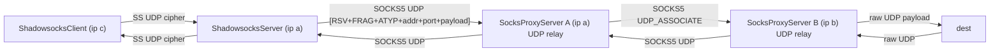

# 场景4 Review 报告（高性能模式）

## 1. 架构与数据流

### 1.1 链路总览

### 1.2 关键组件职责

- 入口 SS：[`ShadowsocksServer.java`](rxlib/src/main/java/org/rx/net/socks/ShadowsocksServer.java) 绑定 UDP 端口，pipeline `CipherCodec → SSProtocolCodec → SSUdpProxyHandler`。
- SS 解析：[`SSProtocolCodec.java`](rxlib/src/main/java/org/rx/net/socks/SSProtocolCodec.java) 解出 `DST.ADDR/PORT` 写入 `ShadowsocksConfig.REMOTE_DEST`。
- SS 路由/转发：[`SSUdpProxyHandler.java`](rxlib/src/main/java/org/rx/net/socks/SSUdpProxyHandler.java) 按 `(srcEp,dstEp)` 做路由缓存、异步 `initChannelAsync`、pending 队列、outbound 池 `OUTBOUND_POOL`、回包透传到 SS inbound。
- SOCKS5 UDP_ASSOCIATE：[`Socks5CommandRequestHandler.java`](rxlib/src/main/java/org/rx/net/socks/Socks5CommandRequestHandler.java) 为每个 TCP 控制新建 per-client UDP relay channel。
- SOCKS5 UDP 中继：[`SocksUdpRelayHandler.java`](rxlib/src/main/java/org/rx/net/socks/SocksUdpRelayHandler.java) 双向转发（client 包 → 下一跳；下一跳/dest 包 → client）。
- 上行 upstream：[`SocksUdpUpstream.java`](rxlib/src/main/java/org/rx/net/socks/upstream/SocksUdpUpstream.java) 建立/复用 SOCKS5 UDP 会话，支持 `Socks5UpstreamPoolManager` 租约池。
- 编码工具：[`UdpManager.java`](rxlib/src/main/java/org/rx/net/socks/UdpManager.java) 提供 SOCKS5 UDP header `HeaderTemplate` 缓存与 `socks5Encode/Decode`。
- UDP 优化：[`UdpRedundantEncoder/Decoder`](rxlib/src/main/java/org/rx/net/socks/UdpRedundantEncoder.java) 与 [`UdpCompressEncoder/Decoder`](rxlib/src/main/java/org/rx/net/socks/UdpCompressEncoder.java)，由 [`Sockets.addUdpOptimizationHandlers`](rxlib/src/main/java/org/rx/net/Sockets.java) 统一注入。
- 入口配置：[`Main.java`](rxlib/src/main/java/org/rx/Main.java) `launchClient` 组装 `ShadowsocksServer` + `SocksProxyServer`；`onUdpRoute` 使用 `SocksUdpUpstream(dstEp, toInConf, svrSupport)`。

### 1.3 ByteBuf 引用计数走查

- SS 入口：`SSUdpProxyHandler.channelRead0` 仅 `inBuf.retain()` 一次，传入 `writeRoutePacket/enqueuePendingPacket`。
- 下行编码：`UdpManager.HeaderTemplate.composite(..., retainPayload=false)` 直接把 `payload` ownership 转给 `CompositeByteBuf`。
- 异常清理：`composite` 内部 `try/catch` 调用 `Bytes.release(compositeBuf)`；`SSUdpProxyHandler.writePacketNow` 在 `buildOutboundPacket` 抛出时额外 `payload.release()`。
- 回包：`UdpBackendRelayHandler.channelRead0` 通过 `prependAddress(..., headerTemplate)` 走 `retainPayload=true` 分支，`SimpleChannelInboundHandler` 负责原始 `outBuf` 的 release。

## 2. 与用户硬约束的符合性

- Java 8：所有新文件仅使用 J8 API（`CompletableFuture`、`ConcurrentHashMap`、Netty 4.1），无 J9+ 特性。
- 零分配/低延迟：`UdpManager.HeaderTemplate` 缓存 ATYP+addr+port 字节，热路径复用；`CompositeByteBuf` 避免 payload 拷贝；`ATTR_LAST_ROUTE` 做 fast-path。
- 远程 DNS：`SocksUdpRelayHandler.handleClientPacket` 将 `dstEp` 原样作为 SOCKS5 UDP 头转发到下一跳，DNS 在 B 端（或 dest 侧）解析；仅 Direct Upstream 分支会调用 `upstream.getDestination().socketAddress()` 触发本地解析。
- ByteBuf 引用计数：正常路径 OK；异常路径有一处 double-release 风险（见 3.1）。
- Full Clone NAT：`ctxMap` 按 `sender InetSocketAddress` 索引，endpoint-independent mapping 下回包稳定命中；异常 sender 会被 `rsv/frag` 校验拒绝。

## 3. 问题清单（按严重度）

### 3.1 Medium 级

1. `SSUdpProxyHandler.writePacketNow` 对 `buildOutboundPacket` 异常路径可能 double-release
   - 关键片段（[`SSUdpProxyHandler.java`](rxlib/src/main/java/org/rx/net/socks/SSUdpProxyHandler.java)）：
     - `buildOutboundPacket` → `UdpManager.socks5Encode(payload, tmpl)` → `composite(alloc, payload, false)`；
     - 若 `CompositeByteBuf.addComponents` 抛异常，Netty 内部已对 `payload` 做 ownership 转移/释放，外层 catch 又 `payload.release()`。
   - 建议：改为 `retainPayload=true` + 外层 try/finally 统一 release；或在 `buildOutboundPacket` 内部保证抛出前 payload 仍归调用方所有。

2. `SocksUdpRelayHandler.ctxMap` 按 `upDstAddr`（下一跳 relay 地址）索引导致 last-put-wins
   - 同一 relay channel 下多 `dstEp` 共用一个下一跳 session 时，`ctxMap.put(upDstAddr, context)` 会被后来者覆盖；当前 `handleDestResponse` 对 `SocksUdpUpstream` 只做 `outBuf.retain()` 透传，不依赖 context 细节，因此功能不受影响。
   - 风险：未来若按 context 做 per-dst 指标/超时/流量归属会出错。
   - 建议：`ctxMap` 改为 `Map<InetSocketAddress, Map<UnresolvedEndpoint, SocksContext>>` 或只作为 "known upstream sender" 标志位。

3. UDP 链路背压缺失
   - TCP 路径有 `BackpressureHandler`；UDP `relay.writeAndFlush(...)` 与 SS outbound 均无 `isWritable()` 检查。
   - 建议：在 `SocksUdpRelayHandler.writeClientPacket` / `SSUdpProxyHandler.writeWhenReady` 前加 `channel.isWritable()` 守卫；不可写时按策略丢弃并 `DiagnosticMetrics` 累加。

4. Session 失效后路由表残留
   - `SocksUdpUpstream` session 断开时仅清 `channel.attr(ATTR_UDP_SESSION)`，不回调 `SocksUdpRelayHandler` 的 `ctxMap/routeMap`；依赖下一包 `isRouteReady=false` 进入 `beginRouteInit` 分支，靠 `routeMap.put` 覆盖自愈。
   - 风险：自愈期间 fast-path 不会命中，每包都走 `routeInitMap.computeIfAbsent`；旧 ctx 永不从 ctxMap 主动移除。
   - 建议：`SocksUdpUpstream.bindHolder` 的 `closeFuture` listener 触发 relay 侧清理（通过 `relay.eventLoop().execute` 提交）。

5. `SSUdpProxyHandler.OUTBOUND_POOL` 无上限
   - 静态全局 `ConcurrentHashMap<OutboundPoolKey, ChannelFuture>`，key 含 `inboundId × source × upstreamType × affinity`；多客户端 × 多 dest 场景下端口/FD 增长仅靠 outbound idle 回收。
   - 建议：加 `DiagnosticMetrics` 上报 size，并在达到配置阈值时主动驱逐最久未用 entry。

6. `launchClient` SS 入口 TCP 永不超时
   - [`Main.java`](rxlib/src/main/java/org/rx/Main.java)：`config.setReadTimeoutSeconds(0); config.setWriteTimeoutSeconds(0);`，`ShadowsocksServer` TCP channel 不装 `ProxyChannelIdleHandler`。
   - 建议：继承 `rssConf.tcpTimeoutSeconds`，避免 half-open 连接堆积。

### 3.2 Low 级

7. `SSProtocolCodec` 通过 `inbound.attr(REMOTE_DEST)` 在 codec 与 handler 之间传递地址，对 UDP 单 DatagramChannel 多客户端模型依赖 pipeline 串行；建议改为自定义消息封装 `(DatagramPacket, UnresolvedEndpoint)`。
8. `SSUdpProxyHandler.ensureRelayResponseDecoder` 与 `Sockets.addUdpOptimizationHandlers` 存在路径交叉；当前靠 `pipeline.get(UdpRedundantDecoder.class)` 去重，建议在 `openOutboundChannel` 中显式控制是否走 `addUdpOptimizationHandlers`。
9. Direct Upstream 分支 `upstream.getDestination().socketAddress()` 为本地 DNS 解析；对于 B → dest 这一跳若客户端传入 domain，会在 B 侧走系统 DNS，与 "尽量远程解析" 精神冲突；建议接 `DnsClient` 异步解析或明确限制客户端必须传 IP。
10. `launchClient` 未对 SS server 显式开启 `useDedicatedCryptoGroup=true`；大流量下 reactor 线程被 `CipherCodec` 阻塞风险。
11. `Socks5CommandRequestHandler` 在 UDP_ASSOCIATE 后从 TCP 移除 `ProxyChannelIdleHandler`；TCP 控制仅依赖对端断连检测，应保留较大的 idle（例如 `udpTimeoutSeconds`）作兜底。

### 3.3 可观测性

12. `OUTBOUND_POOL` 无 size/miss/evict 指标。
13. `SocksUdpRelayHandler.channelRead0` 中非 `ctxMap` sender 回包仅 `log.warn`，缺 `DiagnosticMetrics` 计数（用于发现 NAT 穿透异常）。
14. `MemoryCache` 的 `maximumSize`（routeMap=2048、ctxMap=256）硬编码，建议暴露到 `SocksConfig`。

## 4. 测试覆盖评估

已覆盖（[`SocksProxyServerIntegrationTest.java`](rxlib/src/test/java/org/rx/net/socks/SocksProxyServerIntegrationTest.java) 与 [`ShadowsocksServerIntegrationTest.java`](rxlib/src/test/java/org/rx/net/socks/ShadowsocksServerIntegrationTest.java)）：

- 基础链路：`shadowsocksUdpRelay_e2e`、`shadowsocksUdpRelay_socks5_chained_e2e`。
- 冗余：`shadowsocksUdpRelay_socks5_chained_withUdpRedundantOnProxyA_e2e`。
- 冗余 + 压缩：`shadowsocksUdpRelay_socks5_chained_withUdpCompressAndRedundantOnProxyAB_e2e`。
- 租约池：`shadowsocksUdpRelay_socks5_chained_withLeasePool_e2e`。
- 多客户端端口：`shadowsocksUdpRelay_sameDestinationDifferentClientPorts_e2e`。
- LocalAddress：`shadowsocksUdpRelay_socks5_localChannel_preservesOrigin_e2e`。

建议补充：

- 同一 SS inbound 并发多 dst 验证 `OUTBOUND_POOL` 分区与 `ctxMap` 不串包。
- A→B session 失效后自愈（主动 `closeSession` 后继续发包，验证包到达 dest）。
- 带泄漏检测：`-Dio.netty.leakDetection.level=PARANOID` 执行全部 UDP 用例。
- `buildOutboundPacket` 异常注入，断言无 double-release。
- 大 UDP 包（接近 MTU）与 `MAX_PENDING_ROUTE_BYTES` 边界。

## 5. 结论

- 场景4 主路径设计合理：池化 outbound、header 模板缓存、异步初始化 + pending 队列、双向 decoder 注入、redundant peer 白名单控制编码范围。
- 无发现正常路径上的 Critical bug；以上 6 条 Medium 项建议排期修复，Low/可观测性项可并入下一轮迭代。
- 不做代码改动（plan 模式），后续若需要逐项修复，可将本计划的每个风险项作为独立 PR 提交。
