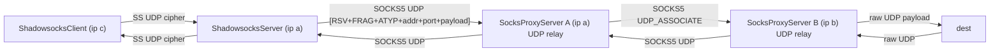

# 场景4 Review 报告（高性能模式）

## 1. 架构与数据流

### 1.1 链路总览

### 1.2 关键组件职责

- 入口 SS：[`ShadowsocksServer.java`](rxlib/src/main/java/org/rx/net/socks/ShadowsocksServer.java) 绑定 UDP 端口，pipeline `CipherCodec → SSProtocolCodec → SSUdpProxyHandler`。
- SS 解析：[`SSProtocolCodec.java`](rxlib/src/main/java/org/rx/net/socks/SSProtocolCodec.java) 解出 `DST.ADDR/PORT` 写入 `ShadowsocksConfig.REMOTE_DEST`。
- SS 路由/转发：[`SSUdpProxyHandler.java`](rxlib/src/main/java/org/rx/net/socks/SSUdpProxyHandler.java) 按 `(srcEp,dstEp)` 做路由缓存、异步 `initChannelAsync`、pending 队列、outbound 池 `OUTBOUND_POOL`、回包透传到 SS inbound。
- SOCKS5 UDP_ASSOCIATE：[`Socks5CommandRequestHandler.java`](rxlib/src/main/java/org/rx/net/socks/Socks5CommandRequestHandler.java) 为每个 TCP 控制新建 per-client UDP relay channel。
- SOCKS5 UDP 中继：[`SocksUdpRelayHandler.java`](rxlib/src/main/java/org/rx/net/socks/SocksUdpRelayHandler.java) 双向转发（client 包 → 下一跳；下一跳/dest 包 → client）。
- 上行 upstream：[`SocksUdpUpstream.java`](rxlib/src/main/java/org/rx/net/socks/upstream/SocksUdpUpstream.java) 建立/复用 SOCKS5 UDP 会话，支持 `Socks5UpstreamPoolManager` 租约池。
- 编码工具：[`UdpManager.java`](rxlib/src/main/java/org/rx/net/socks/UdpManager.java) 提供 SOCKS5 UDP header `HeaderTemplate` 缓存与 `socks5Encode/Decode`。
- UDP 优化：[`UdpRedundantEncoder/Decoder`](rxlib/src/main/java/org/rx/net/socks/UdpRedundantEncoder.java) 与 [`UdpCompressEncoder/Decoder`](rxlib/src/main/java/org/rx/net/socks/UdpCompressEncoder.java)，由 [`Sockets.addUdpOptimizationHandlers`](rxlib/src/main/java/org/rx/net/Sockets.java) 统一注入。
- 入口配置：[`Main.java`](rxlib/src/main/java/org/rx/Main.java) `launchClient` 组装 `ShadowsocksServer` + `SocksProxyServer`；`onUdpRoute` 使用 `SocksUdpUpstream(dstEp, toInConf, svrSupport)`。

### 1.3 ByteBuf 引用计数走查

- SS 入口：`SSUdpProxyHandler.channelRead0` 仅 `inBuf.retain()` 一次，传入 `writeRoutePacket/enqueuePendingPacket`。
- 下行编码：`UdpManager.HeaderTemplate.composite(..., retainPayload=false)` 直接把 `payload` ownership 转给 `CompositeByteBuf`。
- 异常清理：`composite` 内部 `try/catch` 调用 `Bytes.release(compositeBuf)`；`SSUdpProxyHandler.writePacketNow` 在 `buildOutboundPacket` 抛出时额外 `payload.release()`。
- 回包：`UdpBackendRelayHandler.channelRead0` 通过 `prependAddress(..., headerTemplate)` 走 `retainPayload=true` 分支，`SimpleChannelInboundHandler` 负责原始 `outBuf` 的 release。

## 2. 与用户硬约束的符合性

- Java 8：所有新文件仅使用 J8 API（`CompletableFuture`、`ConcurrentHashMap`、Netty 4.1），无 J9+ 特性。
- 零分配/低延迟：`UdpManager.HeaderTemplate` 缓存 ATYP+addr+port 字节，热路径复用；`CompositeByteBuf` 避免 payload 拷贝；`ATTR_LAST_ROUTE` 做 fast-path。
- 远程 DNS：`SocksUdpRelayHandler.handleClientPacket` 将 `dstEp` 原样作为 SOCKS5 UDP 头转发到下一跳，DNS 在 B 端（或 dest 侧）解析；仅 Direct Upstream 分支会调用 `upstream.getDestination().socketAddress()` 触发本地解析。
- UDP 无传输层背压：这里需要关注的不是 TCP 式端到端背压，而是本地写侧过载保护、丢包策略与指标。
- ByteBuf 引用计数：正常路径 OK；异常路径有一处 double-release 风险（见 3.1）。
- Full Clone NAT：`ctxMap` 按 `sender InetSocketAddress` 索引，endpoint-independent mapping 下回包稳定命中；异常 sender 会被 `rsv/frag` 校验拒绝。

## 3. 问题清单（按行动优先级）

### 3.1 必须修

1. `SSUdpProxyHandler.writePacketNow` 对 `buildOutboundPacket` 异常路径可能 double-release
   - 关键片段（[`SSUdpProxyHandler.java`](rxlib/src/main/java/org/rx/net/socks/SSUdpProxyHandler.java)）：
     - `buildOutboundPacket` → `UdpManager.socks5Encode(payload, tmpl)` → `composite(alloc, payload, false)`；
     - 若 `CompositeByteBuf.addComponents` 抛异常，Netty 内部已对 `payload` 做 ownership 转移/释放，外层 catch 又 `payload.release()`。
   - 建议：改为 `retainPayload=true` + 外层 try/finally 统一 release；或在 `buildOutboundPacket` 内部保证抛出前 payload 仍归调用方所有。

2. UDP 无传输层背压，但本地写侧过载保护不足
   - TCP 路径有 `BackpressureHandler`；UDP `relay.writeAndFlush(...)` 与 SS outbound 均无 `isWritable()` / drop metric / 本地发送压力指标。
   - 这里不是要求补 TCP 式“背压”，而是应用层写侧过载治理。
   - 建议：在 `SocksUdpRelayHandler.writeClientPacket` / `SSUdpProxyHandler.writeWhenReady` 前补 `channel.isWritable()` 守卫；不可写时按策略丢弃并通过 `DiagnosticMetrics` 计数。

3. Session 失效后路由表残留
   - `SocksUdpUpstream` session 断开时仅清 `channel.attr(ATTR_UDP_SESSION)`，不回调 `SocksUdpRelayHandler` 的 `ctxMap/routeMap`；依赖下一包 `isRouteReady=false` 进入 `beginRouteInit` 分支，靠 `routeMap.put` 覆盖自愈。
   - 风险：自愈期间 fast-path 不会命中，每包都走 `routeInitMap.computeIfAbsent`；旧 ctx 永不从 ctxMap 主动移除。
   - 建议：`SocksUdpUpstream.bindHolder` 的 `closeFuture` listener 触发 relay 侧清理（通过 `relay.eventLoop().execute` 提交）。

4. 可观测性不足，影响后续调优判断
   - `OUTBOUND_POOL` 无 size/miss/lifetime/evict 指标。
   - `SocksUdpRelayHandler.channelRead0` 中非 `ctxMap` sender 回包仅 `log.warn`，缺 `DiagnosticMetrics` 计数（用于发现 NAT 穿透异常）。
   - `MemoryCache` 的 `maximumSize`（routeMap=2048、ctxMap=256）硬编码，建议至少先补容量/命中率观测。

5. 测试覆盖还缺关键稳态与异常场景
   - 并发多 dst、session 自愈、异常注入、Netty leak detection、大包边界都值得补。
   - 这些测试既用于验证“必须修”项，也用于为第二组假设项提供数据。

### 3.2 需要压测/指标证明后再动

1. `SocksUdpRelayHandler.ctxMap` 的 “last-put-wins” 问题被放大了
   - 当前 `ctxMap` 更接近 known-upstream-sender gate，而不是 per-dst 回包分流表；现有 `handleDestResponse` 对 `SocksUdpUpstream` 只做 sender 识别和透传。
   - 现阶段直接改成嵌套 map，会增加热路径查找与对象成本，但没有明确场景4功能收益。
   - 建议：只有在需要做 per-dst 指标、归因、精细回包分流时，再评估是否重构。

2. `SSUdpProxyHandler.OUTBOUND_POOL` 先补指标，再决定是否加容量上限
   - 静态全局 `ConcurrentHashMap<OutboundPoolKey, ChannelFuture>` 的确值得观察，但当前已有 inbound close、outbound close、idle timeout 三层回收。
   - 直接加 hard cap / 主动驱逐，有误杀活跃会话的风险。
   - 建议：先补 `size/miss/lifetime/close-cause` 指标，再决定是否 cap。

3. `launchClient` 的 SS 入口 TCP idle timeout 属于 workload 调参项
   - [`Main.java`](rxlib/src/main/java/org/rx/Main.java) 确实把 `read/write timeout` 设成了 0。
   - 但是否应该收紧，要看是否存在大量 half-open/长空闲连接，以及是否允许长时间空闲隧道。
   - 建议：压测或线上指标证明后再改，不作为当前场景4的必修 bug。

4. `SSProtocolCodec` 的 `channel.attr(REMOTE_DEST)` handoff 不是明确 bug
   - 当前 `SSProtocolCodec` 写 attr 后，`SSUdpProxyHandler` 在同一条 UDP read 链里立即消费；在单 `DatagramChannel` 的 EventLoop 串行模型下，这不是清晰的正确性问题。
   - 若改成自定义消息封装 `(DatagramPacket, UnresolvedEndpoint)`，会在 SS UDP 热路径上引入每包额外对象分配。
   - 建议：只有在证明 attr handoff 出现正确性问题时，才考虑重构。

5. Direct Upstream 分支避免本地 DNS 解析
   - 这是合理方向，但不属于场景4主链路当前最紧迫问题；同时会牵涉语义边界（何时允许本地解析、何时强制远程解析）。
   - 建议：先确认是否真实进入 Direct 分支、命中频率和耗时，再决定是否改造。

6. `useDedicatedCryptoGroup=true` 与保留 UDP_ASSOCIATE TCP idle 都是调参项
   - `useDedicatedCryptoGroup` 需要和 EventLoop 线程亲和、上下文切换成本一起权衡。
   - UDP_ASSOCIATE 后是否保留 TCP control idle handler，也需要结合长连接模式和 NAT 行为来验证。
   - 建议：归入压测/指标驱动项，而不是默认修复项。

## 4. 测试覆盖评估

已覆盖（[`SocksProxyServerIntegrationTest.java`](rxlib/src/test/java/org/rx/net/socks/SocksProxyServerIntegrationTest.java) 与 [`ShadowsocksServerIntegrationTest.java`](rxlib/src/test/java/org/rx/net/socks/ShadowsocksServerIntegrationTest.java)）：

- 基础链路：`shadowsocksUdpRelay_e2e`、`shadowsocksUdpRelay_socks5_chained_e2e`。
- 冗余：`shadowsocksUdpRelay_socks5_chained_withUdpRedundantOnProxyA_e2e`。
- 冗余 + 压缩：`shadowsocksUdpRelay_socks5_chained_withUdpCompressAndRedundantOnProxyAB_e2e`。
- 租约池：`shadowsocksUdpRelay_socks5_chained_withLeasePool_e2e`。
- 多客户端端口：`shadowsocksUdpRelay_sameDestinationDifferentClientPorts_e2e`。
- LocalAddress：`shadowsocksUdpRelay_socks5_localChannel_preservesOrigin_e2e`。

建议补充：

- 同一 SS inbound 并发多 dst 验证 `OUTBOUND_POOL` 分区与 `ctxMap` 不串包。
- A→B session 失效后自愈（主动 `closeSession` 后继续发包，验证包到达 dest）。
- 带泄漏检测：`-Dio.netty.leakDetection.level=PARANOID` 执行全部 UDP 用例。
- `buildOutboundPacket` 异常注入，断言无 double-release。
- 大 UDP 包（接近 MTU）与 `MAX_PENDING_ROUTE_BYTES` 边界。

## 5. 结论

- 场景4 主路径设计合理：池化 outbound、header 模板缓存、异步初始化 + pending 队列、双向 decoder 注入、redundant peer 白名单控制编码范围。
- 无发现正常路径上的 Critical bug；当前应优先处理“必须修”组，第二组全部需要先拿压测或指标证明收益/风险，再决定是否进入实现。
- 其中“UDP 背压”表述已修正为“UDP 无传输层背压，但需要应用层写侧过载保护”。
- 不做代码改动（plan 模式），后续若需要逐项修复，可优先按“必须修”组拆独立 PR。
