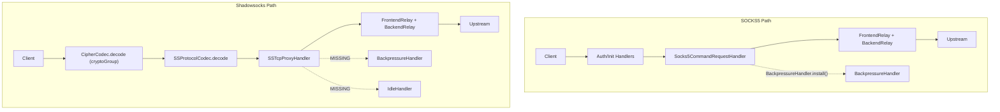

# SocksProxyServer / ShadowsocksServer 性能优化计划

## 审查总结

对两个文件及其完整数据路径（pipeline handler 链、加密实现、Bootstrap 配置、中继转发）进行了全面 review，以下按**严重程度排序**列出问题和优化方案。

---

## P0: Shadowsocks TCP 缺少 BackpressureHand

## ler（内存溢出风险）

**问题**: SOCKS5 路径中 `Socks5CommandRequestHandler` 在建连时调用了 `BackpressureHandler.install(inbound, outbound)`，当出站写满时会暂停入站读取。但 `SSTcpProxyHandler` 建连时**完全没有安装 BackpressureHandler**，高流量场景下如果出站写速度跟不上入站读速度，写队列会无限膨胀导致 OOM。

**修复**: 在 `[SSTcpProxyHandler.java](rxlib/src/main/java/org/rx/net/socks/SSTcpProxyHandler.java)` 的 `channelRead` 中，`bootstrap.connect()` 成功回调里加入 BackpressureHandler：

```java
// SSTcpProxyHandler.java channelRead() 的 connect listener 中
Channel outbound = f.channel();
BackpressureHandler.install(inbound, outbound); // <-- 新增
outbound.pipeline().addLast(SocksTcpBackendRelayHandler.DEFAULT);
```

---

## P1: UDP 解密路径每包分配临时 byte[] 数组

**问题**: `[AesGcmCrypto._udpDecrypt()](rxlib/src/main/java/org/rx/net/socks/encryption/impl/AesGcmCrypto.java)` 第 190 行每次调用都 `new byte[length]` 作为独立输入缓冲区。高 QPS UDP 场景下产生大量短命数组，增加 GC 压力。

```80:83:rxlib/src/main/java/org/rx/net/socks/encryption/impl/AesGcmCrypto.java
    protected void _udpDecrypt(ByteBuf in, ByteBuf out) {
        int length = in.readableBytes();
        byte[] encrypted = new byte[length];  // <-- 每包一次分配
        in.readBytes(encrypted, 0, length);
```

**修复**: 复用 `decBuffer()`（已有 `FastThreadLocal` 按线程缓存的 `~16KB` 缓冲区），将密文读入 `decBuffer` 的前半段，解密输出写到后半段，或用偏移避免重叠：

```java
protected void _udpDecrypt(ByteBuf in, ByteBuf out) {
    int length = in.readableBytes();
    byte[] decBuffer = decBuffer();
    // 将密文读入 decBuffer 尾部（PAYLOAD_SIZE_MASK + TAG_LENGTH 之后的区域），
    // 或直接分两段使用 decBuffer 做 in-place
    in.readBytes(decBuffer, 0, length);
    AEADCipher decCipher = getDecCipher();
    decCipher.init(false, getCipherParameters(false));
    int outLen = decCipher.processBytes(decBuffer, 0, length, decBuffer, 0);
    decCipher.doFinal(decBuffer, outLen);
    out.writeBytes(decBuffer, 0, length - TAG_LENGTH);
}
```

> 注意：需确认 BouncyCastle GCM 支持 in-place 解密（input/output 同数组），实测 GCMBlockCipher 允许 overlapping buffer。

---

## P2: encrypt/decrypt 每次分配未指定容量的 directBuffer

**问题**: `[CryptoAeadBase.encrypt()](rxlib/src/main/java/org/rx/net/socks/encryption/CryptoAeadBase.java)` 第 153 行和 `decrypt()` 第 180 行调用 `Bytes.directBuffer()` 不带初始容量参数，导致：

- 初始分配可能过小（Netty 默认 256 bytes），TCP 大数据包需要多次扩容拷贝
- 或者过大造成浪费

**修复**: 根据输入大小预估输出容量：

```java
// encrypt
int estimatedSize = forUdp
    ? getSaltLength() + in.readableBytes() + TAG_LENGTH
    : in.readableBytes() + ((in.readableBytes() / PAYLOAD_SIZE_MASK) + 1) * (2 + TAG_LENGTH * 2);
ByteBuf out = Bytes.directBuffer(estimatedSize);

// decrypt - 类似，根据输入大小减去 overhead 预估
```

---

## P3: Shadowsocks 缺少空闲连接检测

**问题**: `SocksProxyServer` 在 `acceptChannel()` 中安装了 `ProxyChannelIdleHandler` 做读/写超时检测，半死连接会被自动清理。但 `ShadowsocksServer` 的 pipeline 中**没有任何 idle 检测**，僵尸连接会一直占用资源。

**修复**: 在 `[ShadowsocksServer](rxlib/src/main/java/org/rx/net/socks/ShadowsocksServer.java)` 构造函数的 TCP pipeline 初始化中添加 idle handler：

```java
channel.pipeline()
    .addLast(new ProxyChannelIdleHandler(
        config.getReadTimeoutSeconds(),
        config.getWriteTimeoutSeconds()))  // <-- 新增
    .addLast(cryptoGroup, CipherCodec.DEFAULT, new SSProtocolCodec(), SSTcpProxyHandler.DEFAULT);
```

需要在 `ShadowsocksConfig` 中添加 `readTimeoutSeconds` / `writeTimeoutSeconds` 配置（或从父类 `SocketConfig` 继承默认值）。

---

## P4: cryptoGroup 线程切换开销可评估移除

**问题**: `ShadowsocksServer` 将 `CipherCodec` + `SSProtocolCodec` 放在独立的 `DefaultEventExecutorGroup(cryptoGroup)` 上执行。这意味着**每条消息都要从 IO EventLoop 切换到 cryptoGroup 线程，再切回**，增加了上下文切换和队列调度开销。

AES-GCM 在现代 CPU 上有 AES-NI 指令集加速，单次加解密通常在微秒级，线程切换的开销可能**反而大于**加解密本身。

**建议**: 

- 做基准测试：对比 `cryptoGroup` 独立线程 vs 直接在 IO EventLoop 上执行 AES-GCM 的吞吐和延迟
- 如果 AES-NI 可用（绝大多数 x86 服务器），考虑**移除 cryptoGroup**，让加解密直接在 IO EventLoop 上执行，消除线程切换
- 可以把这个作为一个**配置项**（`useDedicatedCryptoGroup`），默认关闭

```java
// 改为可配置
if (config.isUseDedicatedCryptoGroup()) {
    channel.pipeline().addLast(cryptoGroup, CipherCodec.DEFAULT, new SSProtocolCodec(), SSTcpProxyHandler.DEFAULT);
} else {
    channel.pipeline().addLast(CipherCodec.DEFAULT, new SSProtocolCodec(), SSTcpProxyHandler.DEFAULT);
}
```

---

## P5: UDP secureRandomBytes 每包生成盐值开销

**问题**: `CryptoAeadBase.encrypt()` 中 UDP 路径每个包都调用 `CodecUtil.secureRandomBytes(getSaltLength())`（底层为 `SecureRandom`），在高 QPS 下 `SecureRandom` 可能成为瓶颈（尤其是 Linux 上 `/dev/urandom` 在极端场景下的系统调用开销）。

**建议**: 考虑使用预生成的随机字节池或 `ThreadLocalRandom` + 定期 reseed 的方案（需评估安全性权衡）。或者使用 `SecureRandom` 批量生成随机字节缓存到 `FastThreadLocal` 中：

```java
// 例如每次生成 1024 个 salt，按需取用
private static final FastThreadLocal<ByteBuffer> SALT_POOL = new FastThreadLocal<>() {
    protected ByteBuffer initialValue() {
        byte[] bulk = CodecUtil.secureRandomBytes(1024);
        return ByteBuffer.wrap(bulk);
    }
};
```

---

## P6: SSProtocolCodec UDP encode 每包分配 directBuffer(64)

**问题**: `[SSProtocolCodec.encode()](rxlib/src/main/java/org/rx/net/socks/SSProtocolCodec.java)` 第 48 行每个 UDP 出站包都 `ctx.alloc().directBuffer(64)` 分配一个小 buffer 写地址头，再与 payload 做 `Unpooled.wrappedBuffer` 组合。小 direct buffer 频繁分配/回收有 overhead。

**建议**: 改为 heap buffer 或使用 `CompositeByteBuf` 避免额外拷贝：

```java
ByteBuf addrBuf = ctx.alloc().buffer(64); // heap buffer 更轻量
UdpManager.encode(addrBuf, addr);
buf = Unpooled.wrappedBuffer(addrBuf, buf.retain());
```

---

## 数据流概览（供参考）




---

## 优化优先级总结


| 优先级 | 问题                            | 影响          | 改动量        |
| --- | ----------------------------- | ----------- | ---------- |
| P0  | SS TCP 缺 BackpressureHandler  | OOM 风险      | 1 行        |
| P1  | UDP decrypt 每包 new byte[]     | GC 压力       | ~10 行      |
| P2  | encrypt/decrypt 未指定 buffer 容量 | 扩容拷贝开销      | ~5 行       |
| P3  | SS 缺 idle handler             | 僵尸连接泄漏      | ~5 行       |
| P4  | cryptoGroup 线程切换              | 延迟增加        | ~10 行 + 测试 |
| P5  | UDP 每包 SecureRandom           | CPU 开销      | ~20 行      |
| P6  | SSProtocolCodec 小 buffer 分配   | 轻微 overhead | ~2 行       |


