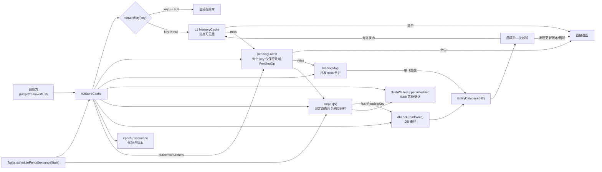
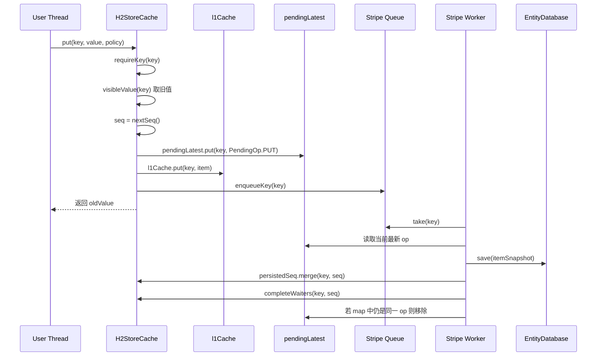
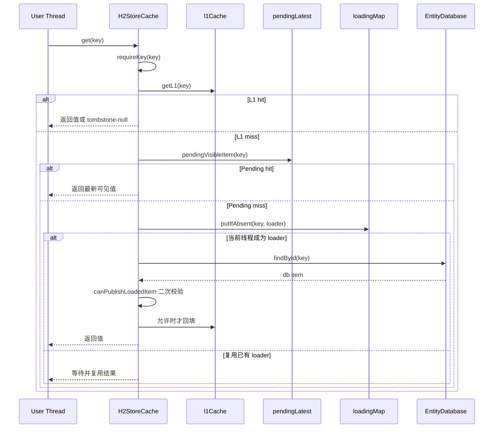

# 缓存、数据库与DNS演进

<details>
<summary><b>[2026-04-16] Cache and DB perf optimization</b></summary>

> **原始文件**: cache_and_db_perf_optimization_36ac4de7.plan.md
> **创建日期**: 2026-04-16

---
name: Cache and DB perf optimization
overview: "对 MemoryCache、H2StoreCache、EntityDatabaseImpl 进行性能优化。核心原则：不替换任何现有方法行为，所有性能改进通过\"新增 fast-path 方法\"或\"新增指标接口\"实现。Phase 1 直接推进零风险项；Phase 2 新增 fast-path + 内部改写；Phase 3 压测验证后决定。"
todos:
  - id: phase1-query-thread-safety
    content: "Phase 1: EntityDatabaseImpl.count()/exists() 不修改 query 状态，修复线程安全 bug"
    status: pending
  - id: phase1-setview-init
    content: "Phase 1: H2StoreCache.entrySet() setView 改为字段直接初始化"
    status: pending
  - id: phase1-singleton-params
    content: "Phase 1: EntityDatabaseImpl 单参数场景用 Collections.singletonList"
    status: pending
  - id: phase2-upsert-path
    content: "Phase 2: EntityDatabase 新增 upsert()，save() 完全不动；H2StoreCache 内部改用 upsert"
    status: pending
  - id: phase2-put-fast
    content: "Phase 2: H2StoreCache 新增 putFast()，put() 完全不动"
    status: pending
  - id: phase2-remove-fast
    content: "Phase 2: H2StoreCache 新增 removeFast()，remove() 完全不动"
    status: pending
  - id: phase2-sliding-throttle
    content: "Phase 2: H2StoreCache.get() 滑动续期 per-key 节流"
    status: pending
  - id: phase2-connpool-swap
    content: "Phase 2: EntityDatabaseImpl 连接池 volatile + swapPool() 统一协议"
    status: pending
  - id: phase2-policymap-reorder
    content: "Phase 2: MemoryCache computeNanos 反转查找顺序，policyMap 保留不删"
    status: pending
  - id: phase2-size-metric
    content: "Phase 2: H2StoreCache 新增 estimatedSize() 指标接口，size() 完全不动"
    status: pending
  - id: phase2-putfast-mc
    content: "Phase 2: MemoryCache 新增 putFast()，put() 完全不动"
    status: pending
  - id: phase3-stmt-cache
    content: "Phase 3: PreparedStatement 缓存，压测验证后决定"
    status: pending
  - id: regression-and-monitoring
    content: "贯穿: 每阶段完成后补回归测试 + 监控指标"
    status: pending
isProject: false
---

# 缓存与数据库层性能优化计划（v5 可执行版）

## 模式：高性能模式

## 核心原则

**不替换任何现有方法的行为。** 所有 `save()`、`put()`、`remove()`、`size()`、`put(key, value, policy)` 的签名、返回值、语义保持原样。性能改进一律通过以下两种方式实现：

1. **新增 fast-path 方法**：如 `upsert()`、`putFast()`、`removeFast()` — 内部调用方按需切换
2. **新增指标接口**：如 `estimatedSize()` — 监控消费者使用，`size()` 不变

---

## Phase 1 — 直接推进：零风险项

### 1.1 count() / exists() 不修改 query 状态

**问题**：直接修改传入 `query` 的 `orders`/`limit`/`offset` 再恢复，并发不安全。

**方案**：给 `EntityQueryLambda.resolve()` 新增 `resolveForCount(params)` 重载（或增加 `excludeOrders`/`excludeLimit` 标志位），在 SQL 拼接时跳过 ORDER BY 和 LIMIT。`count()` 和 `exists()` 改为调用新方法，不再操作 query 字段。

### 1.2 entrySet() setView 直接初始化

**方案**：`final EntrySetView setView = new EntrySetView()`，消除懒初始化竞态。

### 1.3 单参数 ArrayList 优化

**方案**：`deleteById`、`existsById`、`findById` 中 `new ArrayList<>(1) + add` 替换为 `Collections.singletonList(id)`。

### Phase 1 回归

- 多线程同一 query 并发调用 count() + findBy()，验证无 ConcurrentModificationException
- 现有 EntityDatabaseTest 全量通过

---

## Phase 2 — 新增 fast-path + 内部改写（不动任何现有方法）

### 2.1 EntityDatabase 新增 `upsert(T entity)`

**问题**：`save(T entity)` 在有主键时走 existsById(SELECT) + 事务 + 条件分支 = 3+ 次 DB。

**方案**：

- `EntityDatabase` 接口新增 `upsert(T entity)` 方法
- 实现：直接执行 `insertSql`（MERGE INTO），不做 existsById，不开事务，1 次 DB
- **`save()` 完全不动**，部分更新语义保留

```java
// EntityDatabaseImpl 新增
@Override
public <T> void upsert(T entity) {
    SqlMeta meta = getMeta(entity.getClass());
    List<Object> params = new ArrayList<>();
    for (Map.Entry<String, Tuple<Field, DbColumn>> col : meta.insertView) {
        params.add(col.getValue().left.get(entity));
    }
    executeUpdate(meta.insertSql, params);
}
```

- `H2StoreCache` 内部 3 处 `db.save(item)` 改为 `db.upsert(item)`（H2CacheItem 始终全字段，已审计确认安全）

### 2.2 H2StoreCache 新增 `putFast(TK key, TV value, CachePolicy policy)`

**问题**：`put()` 每次先 findById 取旧值（SELECT）再 save（existsById + INSERT/UPDATE）= 3+ 次 DB。

**方案**：

- **`put()` 完全不动**，保留 ConcurrentMap 返回旧值契约
- 新增 `putFast()`：不查旧值、不返回旧值，直接 upsert，1 次 DB

```java
public void putFast(TK key, TV value, CachePolicy policy) {
    if (policy == null) {
        policy = CachePolicy.absolute(defaultExpireSeconds);
    }
    H2CacheItem<TK, TV> newItem = new H2CacheItem<>(key, value, policy);
    newItem.setRegion(key.getClass().getSimpleName());
    l1Cache.put(key, newItem, newItem);
    db.upsert(newItem);
}
```

- `H2StoreCache.put()` 内部写路径从 `db.save(newItem)` 改为 `db.upsert(newItem)`（仅优化写入，旧值获取逻辑不变）：put 从 3 次 DB 降到 2 次
- 内部调用方如不需要旧值（如 `Cache.get(key, loadingFunc, policy)` 中的 miss 填充），可改调 `putFast()` 直接 1 次 DB

### 2.3 H2StoreCache 新增 `removeFast(Object key)`

**问题**：`remove()` 先 findById(SELECT) 再 deleteById(DELETE) = 2 次 DB。

**方案**：

- **`remove()` 完全不动**，保留 ConcurrentMap 返回旧值契约
- 新增 `removeFast()`：不查旧值、不返回旧值，直接 deleteById，1 次 DB

```java
public void removeFast(Object key) {
    l1Cache.remove(key);
    db.deleteById(H2CacheItem.class, CodecUtil.hash64(key));
}
```

- 内部调用方如不需要旧值（如 `expungeStale()` 已知要删的条目），可改调 `removeFast()`

### 2.4 滑动续期 per-key 节流

**问题**：每次 get 命中 sliding key 都异步 `db.save()`，无节流。

**方案**：`H2CacheItem` 增加 `transient volatile long lastDbRenewNanos`，get 路径中 per-key 节流：

```java
if (item.slidingRenew()) {
    long now = System.nanoTime();
    long elapsed = now - item.lastDbRenewNanos;
    if (elapsed > TimeUnit.MILLISECONDS.toNanos(item.getSlidingSpan() / 2)) {
        item.lastDbRenewNanos = now;
        final H2CacheItem<TK, TV> fItem = item;
        Tasks.run(() -> db.upsert(fItem));
    }
}
```

**保证**：内存态 expiration 每次 get 都更新；DB 侧在 slidingSpan/2 内至少写一次，expungeStale 不会误删。

### 2.5 连接池 volatile + swapPool 统一协议

**问题**：`getConnectionPool()` synchronized 导致串行竞争；时间滚动置空时未 dispose 旧池（资源泄漏）。

**方案**：

```java
volatile JdbcConnectionPool connPool;

JdbcConnectionPool getConnectionPool() {
    JdbcConnectionPool pool = connPool;
    if (pool != null) {
        return pool;
    }
    return initPool();
}

private synchronized JdbcConnectionPool initPool() {
    if (connPool == null) {
        // ... 创建并赋值 connPool ...
    }
    return connPool;
}

private synchronized void swapPool(JdbcConnectionPool newPool) {
    JdbcConnectionPool old = connPool;
    connPool = newPool;
    if (old != null) {
        old.dispose();
    }
}
```

全部 4 个写入点统一改为 swapPool：
- 时间滚动定时器：`swapPool(null)` — 修复资源泄漏
- preInvoke 错误恢复：`swapPool(null)` + `getConnectionPool()`
- dispose()：`swapPool(null)`

### 2.6 policyMap 查找顺序反转

**问题**：`computeNanos` 每次先查 `policyMap.get(key)`。

**约束**：`RandomList.next()`、`SocksTcpUpstream`、`DnsHandler` 等"普通值 + 外部 policy"场景必须依赖 policyMap。**不可删除 policyMap**。

**方案**：仅反转查找顺序——先 `as(value, CachePolicy.class)`，未命中再 `policyMap.get(key)`。

```java
long computeNanos(Object key, Object value, long currentDuration) {
    long ttlNanos;
    CachePolicy policy = as(value, CachePolicy.class);
    if (policy == null) {
        policy = policyMap.get(key);
    }
    // ... 后续不变
}
```

### 2.7 H2StoreCache 新增 `estimatedSize()` 指标接口

**问题**：`size()` 每次执行 COUNT SQL。

**方案**：

- **`size()` 完全不动**，保留精确 COUNT 语义
- 新增 `estimatedSize()`：维护 `AtomicLong` 近似计数，在 putFast/removeFast/expungeStale 时维护，expungeStale 周期中用 COUNT 校正
- 监控消费者使用 `estimatedSize()`，业务逻辑继续使用 `size()`

### 2.8 MemoryCache 新增 `putFast(TK key, TV value, CachePolicy policy)`

**问题**：`put()` 通过 `cache.asMap().put()` 返回旧值，比 `cache.put()` 多一次内部查找。

**方案**：

- **`put()` 完全不动**，保留 ConcurrentMap 返回旧值契约
- 新增 `putFast()`：使用 `cache.put(key, value)` 不返回旧值

```java
public void putFast(TK key, TV value, CachePolicy policy) {
    if (policy != null) {
        policyMap.put(key, policy);
    }
    cache.put(key, value);
}
```

- 内部调用方如不需要旧值（如 H2StoreCache 的 L1 缓存写入），可改调 `putFast()`

### Phase 2 回归

- **save() 稀疏更新不清空字段**：save 全字段 -> save(entity, false) 部分非 null -> 验证 DB 未赋值列保持原值
- **upsert() 全量覆写正确性**：upsert 后 findById 验证一致；upsert 已存在行验证覆盖
- **put() 返回旧值不变**：put 新 key 返回 null -> put 同 key 返回旧值 -> SetFromMap.add 行为验证
- **putFast() 不返回旧值**：putFast 后 get 验证值正确；putFast 同 key 覆盖验证
- **remove() 返回旧值不变**：remove 已有 key 返回旧值 -> remove 不存在 key 返回 null
- **removeFast() 无返回值**：removeFast 后 get 返回 null
- **热点 key 滑动续期不被误删**：put sliding key(2s) -> 多线程高频 get > 2s -> 手动 expungeStale -> key 仍存在
- **连接池 rollover 并发**：swapPool(null) 时有并发读写 -> 不抛 NPE、旧池 dispose、新池接管
- **连接池 closed-pool 恢复**：模拟 "Database is already closed" -> swapPool + 重建 -> 后续正常
- **普通值 + 外部 policy TTL 回归**：`put(key, "plain", CachePolicy.absolute(2))` -> 1s 后非 null -> 3s 后 null
- **size() 精确值不变**：put N 条 -> size() == N -> remove M 条 -> size() == N-M
- **estimatedSize() 近似值**：putFast/removeFast 后 estimatedSize 与 size 差值在可接受范围

---

## Phase 3 — 压测验证后决定

### 3.1 PreparedStatement 缓存

**问题**：每次查询都 `conn.prepareStatement(sql)` 创建新语句。

**方案**：先压测当前 H2 `QUERY_CACHE_SIZE` 配置下的 SQL 编译开销，确认是否为实际瓶颈。如果确认瓶颈：对高频固定 SQL（`existsByIdSql`、`findByIdSql`、`insertSql`、`deleteSql`）考虑连接级 PreparedStatement 缓存或调整 H2 参数。

---

## 四、监控指标（贯穿所有阶段）

- H2 连接池：活跃连接数 / 等待获取连接的线程数 / 连接获取耗时
- L1 缓存：命中率（hit/miss 比）、eviction 数
- DB QPS：按 SQL 类型统计（SELECT/MERGE/UPDATE/DELETE）
- 异步续期：当前排队任务数（Tasks executor queue size）
- 堆外内存占用（如涉及 Netty 调用链）

---

## 五、总览

- **Phase 1**（直接推进）— query 线程安全 + setView 初始化 + singletonList。3 项零风险改动。
- **Phase 2**（新增 fast-path + 内部改写）— upsert / putFast / removeFast / estimatedSize 全部是**新增方法**；policyMap 查找反转 / 滑动节流 / connpool swapPool 是**内部行为调整**。现有 save / put / remove / size / computeNanos **一行不改**。
- **Phase 3**（压测后定）— PreparedStatement 缓存，需先量化实际瓶颈。


</details>

<details>
<summary><b>[2026-06-14] DNS response cache 当前实现 review</b></summary>

> **原始文件**: dns_response_cache_current_review_20260614.md
> **创建日期**: 2026-06-14

# DNS response cache 当前实现 review

创建日期：2026-06-14

## Review 范围

本次 review 聚焦当前 `master` 上 DNS cache 相关实现，主要涉及：

- `rxlib/src/main/java/org/rx/net/dns/DnsServer.java`
- `rxlib/src/main/java/org/rx/net/dns/DnsClient.java`
- `rxlib/src/main/java/org/rx/net/dns/DnsResolveCore.java`
- `rxlib/src/main/java/org/rx/net/dns/DnsResolverSupport.java`
- `rxlib/src/main/java/org/rx/net/dns/DnsResponseCacheEntry.java`
- `rxlib/src/main/java/org/rx/core/RxConfig.java`
- `deploy/rss-svr/start.sh`

目标是确认 `prefetch` / `serve-expired` / response cache 是否已经真正生效，以及还有哪些实现风险需要继续修。

## 执行结果（2026-06-14）

本次已按 review 建议落地以下修复：

1. 新增 `app.net.dns.cacheEnabled`，库默认不启用普通 upstream response cache；`prefetch=true` 或 `serveExpired=true` 时仍会自动启用 response cache。
2. `deploy/rss-svr/start.sh` 显式加入 `DNS_CACHE_ENABLED=true`，保持 rss-svr 的生产推荐行为。
3. `DnsResponseCacheEntry` 不再缓存 TTL<=0 的 positive response，避免把上游明确的 0 TTL 改写为缓存 TTL。
4. negative response 优先按 SOA negative TTL 计算，无 SOA 时才使用 `negativeTtl` fallback。
5. `PERSISTENT` 模式下 `H2StoreCache` 的 L1 容量改为 `cacheMaximumSize`，不再固定为 `1`。
6. `DnsResolverSupport` 增加统一 `clearDnsCache()`；`DnsClient.clearCache()` 与 `DnsServer.clearCache()` 已对齐清理 response cache、refresh promise、interceptor cache 和 domain key cache。
7. 文档已明确：当前 `prefetch` / `serve-expired` 只覆盖 `DnsServer` upstream DNS query 路径，不覆盖 `DnsClient.resolve*` 的 address-level stale cache。
8. 已补 NXDOMAIN / NODATA negative cache 测试，覆盖 SOA TTL 与 SOA minimum 取小值、无 SOA fallback、SOA TTL/minimum=0 不缓存、SOA 解析失败不缓存。
9. `DnsResponseCacheEntry.tryCreate()` 已增加 debug skip reason，覆盖 truncated、unsupported rcode、non raw record、positive/negative TTL 非法、SOA 解析失败等原因。
10. 已明确 OPT/EDNS 策略：当前保守跳过含非 `DnsRawRecord` 的 response cache，不扩展 ECS/DNSSEC/DO/CD 等 cache key 维度。

未在本次实现的项：`DnsClient.resolve*` 的 address-level stale cache、metrics 细分命名、复杂 response cache key 维度扩展、positive response 丢弃 TTL<=0 authority/additional 后继续缓存。这些属于 P2，需单独评估 Netty resolve cache 双层 TTL 语义、指标兼容性与 EDNS 语义。

## 总体结论

当前实现已经比最初计划完整很多：

- `DnsServer` upstream query 路径已经有自己的 response cache。
- `prefetch` 已经有 fresh cache hit 后的后台刷新分支。
- `serve-expired` 已经有 upstream 失败或超时后返回 stale cache 的分支。
- `deploy/rss-svr/start.sh` 已经接入小内存运行参数。
- `DnsResponseCacheEntry` 已经避免直接长期缓存 Netty `DnsResponse` / `ByteBuf` 对象。

但仍有几个需要继续修的点：

1. `DnsClient.resolve*` 还没有覆盖 `prefetch` / `serve-expired`。
2. 默认行为已经改变：即使 `prefetch=false`、`serveExpired=false`，`DnsServer` 也会缓存 upstream response。
3. TTL=0 的 positive response 目前可能会被错误缓存。
4. `PERSISTENT` 模式容量参数看起来可能被限制成 1。
5. `clearCache()` 没有统一清理 `responseCache`。

## 已实现部分

### 1. DnsServer response cache 已接入

`DnsServer` 构造时已经初始化：

```java
responseCache = newResponseCache();
```

这说明普通 DNS server upstream 转发不再只依赖 Netty resolver cache，而是有 rxlib 自己的 response cache。

### 2. queryUpstream 已有 fresh / stale / prefetch 逻辑

当前 `DnsResolveCore.queryUpstream(...)` 已经包括：

```text
fresh cache hit
  -> 返回 cached response
  -> 若 shouldPrefetch，则后台 refresh

stale cache hit + serveExpired=true + clientTimeoutMillis=0
  -> 立即返回 stale
  -> 后台 refresh

stale cache hit + serveExpired=true + clientTimeoutMillis>0
  -> 先请求 upstream
  -> upstream 成功：返回 fresh 并更新 cache
  -> upstream 失败或超时：返回 stale

cache miss
  -> 请求 upstream
  -> 成功后写入 response cache
```

这已经覆盖了 Unbound-like `prefetch` 和 `serve-expired` 的核心语义，至少在 `DnsServer` upstream query 路径已经成立。

### 3. 后台刷新有并发去重

`refreshUpstream(...)` 使用：

```java
server.responseRefreshPromises.putIfAbsent(cacheKey, refreshPromise)
```

同一个 cache key 同一时间只有一个后台 refresh，避免热点域名在 TTL 后段触发刷新风暴。

### 4. ByteBuf / 引用计数处理方向正确

`DnsResponseCacheEntry` 入 cache 时把 `DnsRawRecord.content()` 拷贝成 `byte[]`：

```java
byte[] bytes = new byte[content.readableBytes()];
content.getBytes(content.readerIndex(), bytes);
```

出 cache 时重新构造：

```java
new DefaultDnsRawRecord(..., Unpooled.wrappedBuffer(record.content))
```

这避免了长期保存 ref-counted Netty 对象，是正确方向。

### 5. rss-svr 参数已接入

`deploy/rss-svr/start.sh` 已经加入：

```bash
DNS_CACHE_PREFETCH=${DNS_CACHE_PREFETCH:-false}
DNS_CACHE_SERVE_EXPIRED=${DNS_CACHE_SERVE_EXPIRED:-true}
DNS_CACHE_STORAGE=${DNS_CACHE_STORAGE:-MEMORY}
DNS_CACHE_MAXIMUM_SIZE=${DNS_CACHE_MAXIMUM_SIZE:-256}
DNS_CACHE_MAXIMUM_BYTES=${DNS_CACHE_MAXIMUM_BYTES:-65536}
DNS_CACHE_SERVE_EXPIRED_TTL_SECONDS=${DNS_CACHE_SERVE_EXPIRED_TTL_SECONDS:-3600}
DNS_CACHE_SERVE_EXPIRED_REPLY_TTL_SECONDS=${DNS_CACHE_SERVE_EXPIRED_REPLY_TTL_SECONDS:-15}
DNS_CACHE_SERVE_EXPIRED_CLIENT_TIMEOUT_MILLIS=${DNS_CACHE_SERVE_EXPIRED_CLIENT_TIMEOUT_MILLIS:-300}
DNS_CACHE_PREFETCH_THRESHOLD_PERCENT=${DNS_CACHE_PREFETCH_THRESHOLD_PERCENT:-10}
```

并通过 `DNS_CACHE_OPTIONS` 加入 `APP_OPTIONS`。

这组参数适合 2C / 1.5G RAM / 256m heap 的 rss-svr：

- 小内存只用 `MEMORY`。
- `maximumSize=256`。
- `maximumBytes=65536`。
- `prefetch=false`，降低额外请求。
- `serveExpired=true`，提升上游 DNS 抖动时的可用性。

## 需要修的问题

### 问题 1：DnsClient resolve* 还没有接入 prefetch / serve-expired

最初目标是 `DnsClient` 与 `DnsServer` 两个类共享公共能力。

当前实现中，`DnsServer` upstream query 路径已经接入 response cache，但 `DnsClient.resolveAsync(...)` / `resolveAllAsync(...)` 仍然是：

```text
resolveLocalAllAsync(...)
  -> 命中 local interceptor：返回 local result
  -> 未命中：nameResolver.resolve / nameResolver.resolveAll
```

也就是说：

- `DnsClient.resolve*` 仍主要依赖 Netty `DnsNameResolver` 自带 cache。
- `DnsClient.resolve*` 没有 stale fallback。
- `DnsClient.resolve*` 没有 prefetch。
- `DnsClient.query(DnsQuestion)` 自身也没有 cache；cache 是在 `DnsServer.queryUpstream(...)` 外层做的。

#### 建议

短期建议在文档中明确：

```text
当前 prefetch / serve-expired 只覆盖 DnsServer upstream DNS query 路径，不覆盖 DnsClient.resolve / resolveAll。
```

如果要补齐 `DnsClient`，建议单独实现 address-level cache，而不是强行复用 full DNS response cache。

候选方案：

```text
DnsClient.resolveAllAsync(host)
  -> rxlib address cache fresh hit
  -> stale hit + serveExpired
  -> miss -> nameResolver.resolveAll
```

注意要处理 Netty resolve cache 与 rxlib 外层 cache 的 TTL 语义，避免双层 cache 让过期行为难以理解。

### 问题 2：默认行为已经改变

当前 `DnsServer` 构造时无条件创建：

```java
responseCache = newResponseCache();
```

而 `queryUpstream(...)` 也无条件读写 response cache。

这意味着即使配置为：

```properties
app.net.dns.prefetch=false
app.net.dns.serveExpired=false
```

`DnsServer` 仍然会启用普通 upstream DNS response cache。

默认配置又是：

```java
storage = HYBRID
maximumSize = 4096
```

所以库默认行为已经从“纯转发”变成“带 response cache 的转发”。这不一定是 bug，但属于行为变更，需要明确确认。

#### 建议

如果目标是“配置了就生效，不配置不改变旧行为”，建议增加主开关：

```properties
app.net.dns.cacheEnabled=false
```

逻辑建议：

```java
boolean enabled = config.isCacheEnabled()
        || config.isPrefetch()
        || config.isServeExpired();
```

rss-svr 可以显式配置：

```bash
DNS_CACHE_ENABLED=${DNS_CACHE_ENABLED:-true}
-Dapp.net.dns.cacheEnabled=${DNS_CACHE_ENABLED}
```

库默认保持旧行为更稳。

如果确认希望默认开启普通 DNS response cache，也应该在文档中明确这是 intentional behavior。

### 问题 3：TTL=0 的 positive response 可能被错误缓存

当前 `DnsResponseCacheEntry.tryCreate(...)` 的逻辑是：

```java
int ttlSeconds = minPositiveTtl(answers, authorities, additionals);
if (ttlSeconds <= 0) {
    ttlSeconds = Math.max(1, fallbackTtlSeconds);
}
```

这会产生两个问题。

#### 3.1 Positive answer TTL=0 被 fallback 成 negativeTtl

如果 upstream 返回 `NOERROR` 且 answer TTL 全部为 0，当前逻辑会用 `fallbackTtlSeconds`，也就是通常的 `negativeTtl=5`。

这会把本来明确要求“不缓存”的 positive response 缓存几秒。

#### 3.2 混合 TTL 时，TTL=0 record 可能被输出成 TTL=1

出 cache 时：

```java
long remain = record.ttl - elapsedSeconds;
recordTtl = remain <= 0 ? 1 : ...;
```

如果某条 record 原始 TTL=0，但整个 response 因其他 record 有正 TTL 而被缓存，后续输出会把这条 TTL=0 record 改成 TTL=1。

#### 建议

对 positive answer 更严格：

```text
NOERROR 且 ANSWER 非空：
  - 如果任一 answer TTL <= 0：不缓存整个 response
  - 否则 freshTtlSeconds = answer/authority/additional 中正 TTL 的最小值，或至少 answers 的最小 TTL

NXDOMAIN / NODATA：
  - 可使用 SOA negative TTL
  - 无 SOA 时才 fallback 到 server.negativeTtl
```

最小修复：

```java
if (response.code() == DnsResponseCode.NOERROR && !answers.isEmpty()) {
    if (hasZeroOrNegativeTtl(answers)) {
        return null;
    }
}
```

### 问题 4：PERSISTENT 模式容量参数需要确认

当前 `newResponseCache()` 中：

```java
case PERSISTENT:
    return new H2StoreCache<String, DnsResponseCacheEntry>(
            EntityDatabase.DEFAULT, 1L, 1);
```

`newInterceptorCache()` 里也有类似写法。

如果 `H2StoreCache(EntityDatabase, long, int)` 第二个参数是容量或 maxSize，那么 `PERSISTENT` 模式可能只有 1 个条目，基本不可用。

#### 建议

确认 `H2StoreCache` 构造器语义。

如果第二个参数是容量，应改为：

```java
new H2StoreCache<>(EntityDatabase.DEFAULT, config.getMaximumSize(), 1)
```

如果第二个参数不是容量，也建议封装命名方法，避免维护者误解。

rss-svr 当前默认 `MEMORY`，所以线上暂时不受这个问题影响。

### 问题 5：clearCache 没有统一清 responseCache

当前 `DnsClient.clearCache()` 清理：

```java
nameResolver.resolveCache().clear();
interceptorCache.clear();
resolvingPromises.clear();
domainKeyCache.clear();
```

但现在公共基类里已经有：

- `interceptorCache`
- `responseCache`
- `resolvingPromises`
- `responseRefreshPromises`
- `domainKeyCache`

`DnsServer.dispose()` 只清了 `responseRefreshPromises`，没有清 `responseCache`。

#### 建议

在 `DnsResolverSupport` 增加统一方法：

```java
public void clearDnsCache() {
    if (interceptorCache != null) {
        interceptorCache.clear();
    }
    if (responseCache != null) {
        responseCache.clear();
    }
    resolvingPromises.clear();
    responseRefreshPromises.clear();
    domainKeyCache.clear();
}
```

`DnsClient.clearCache()` 调用该方法并额外清 Netty resolver cache：

```java
public void clearCache() {
    nameResolver.resolveCache().clear();
    clearDnsCache();
}
```

`DnsServer` 也可以暴露：

```java
public void clearCache() {
    clearDnsCache();
    upstreamClient.clearCache();
}
```

## 次要优化建议

### 1. 指标命名更精确

当前 `responseCacheMisses` 在 stale 可用但需要等待 upstream 时也会增加，统计语义有点混杂。

建议拆成：

```text
responseCacheMisses
responseCacheFreshHits
responseCacheStaleWaits
responseCacheStaleHits
responseCacheUpstreamFailServedExpired
```

### 2. prefetch 与 stale-refresh 指标拆开

当前 `responseCachePrefetchStarted` 既用于普通 prefetch，也用于 stale-refresh。

建议拆成：

```text
responseCachePrefetchStarted
responseCacheStaleRefreshStarted
responseCacheRefreshSuccess
responseCacheRefreshFailure
```

### 3. response cache key 后续可能要扩展

当前 key 维度是：

```text
type + dnsClass + normalized domain
```

对普通 A/AAAA/IN 场景足够。

如果后续支持以下能力，需要扩展 key：

- EDNS client subnet
- DNSSEC DO/CD bit
- different view / source IP policy
- per-upstream cache isolation
- ANY / CNAME / MX / TXT 等更复杂 response behavior

## 建议修复优先级

### P0

1. 修 TTL=0 positive response 不应缓存。
2. 明确默认是否启用 response cache；如不想改变旧行为，增加 `app.net.dns.cacheEnabled`。

### P1

3. 增加公共 `clearDnsCache()`，确保 `responseCache` 与 `responseRefreshPromises` 能被清理。
4. 文档明确当前能力只覆盖 `DnsServer` upstream query，不覆盖 `DnsClient.resolve*`。

### P2

5. 确认并修正 `PERSISTENT` 模式容量参数。
6. 拆分 metrics 计数器语义。
7. 评估是否给 `DnsClient.resolve*` 增加 address-level stale cache。

## 当前推荐状态

对 rss-svr 当前配置，建议继续保持：

```bash
DNS_CACHE_PREFETCH=false
DNS_CACHE_SERVE_EXPIRED=true
DNS_CACHE_STORAGE=MEMORY
DNS_CACHE_MAXIMUM_SIZE=256
DNS_CACHE_MAXIMUM_BYTES=65536
DNS_CACHE_SERVE_EXPIRED_TTL_SECONDS=3600
DNS_CACHE_SERVE_EXPIRED_REPLY_TTL_SECONDS=15
DNS_CACHE_SERVE_EXPIRED_CLIENT_TIMEOUT_MILLIS=300
DNS_CACHE_PREFETCH_THRESHOLD_PERCENT=10
```

这组配置适合小内存节点，也避免 prefetch 增加额外 DNS 请求。

但在继续扩大使用前，建议先修 TTL=0 positive response 缓存问题，并确认默认 response cache 行为是否符合库级兼容性预期。


</details>

<details>
<summary><b>[2026-06-14] rxlib DNS Cache 整体设计与运行建议 (2026-06)</b></summary>

> **原始文件**: rxlib_dns_cache_merged_20260614.md
> **创建日期**: 2026-06-14

# rxlib DNS Cache 整体设计与运行建议 (2026-06)

本文档由早期的 `prefetch/serve-expired` 设计方案与后期的运行参数建议合并整理而来，反映了当前 DNS Cache 机制的实现现状及生产环境（如 `rss-svr` 小内存节点）的推荐配置。

---

## 1. 背景与目标

rxlib 提供了 `DnsClient` 与 `DnsServer`：
- **`DnsClient`** 基于 Netty `DnsNameResolver`，负责基础解析逻辑。
- **`DnsServer`** 负责接收外部 DNS 请求，处理 hosts、拦截器(interceptor)以及通过 upstream 转发解析。

**核心增强目标**是在 `DnsServer` 转发路径上提供一套公共 DNS 缓存增强能力（参考 Unbound），但不引入复杂的递归解析验证逻辑：
- **Prefetch（预获取）**：热门域名在缓存即将过期时，后台自动触发上游刷新，减少客户端阻塞。
- **Serve-Expired（过期服务）**：当上游发生超时或暂时性故障时，继续下发已过期的缓存数据，以牺牲少部分准确性换取极大的高可用。
- **内存安全**：保证不长期持有 Netty 引用计数对象（`ByteBuf`），使用深拷贝和不可变缓存对象记录 DNS 结果。

---

## 2. 核心架构与实现现状

截至目前（2026-06-14），该能力的核心骨架均**已实现并接入** `DnsServer`。

### 2.1 已实现能力
1. **Upstream Response Cache**：
   - 拦截并缓存 `DnsResolveCore.queryUpstream`。
   - Key 按 `normalized domain + record type + record class` 生成。
   - 缓存时深拷贝 DNS 记录内容，出缓存时重新创建 `DnsResponse` 和 `DefaultDnsRawRecord`，彻底避免对象引用计数泄漏。
2. **Serve-Expired (过期失效回退)**：
   - 上游查询成功：更新缓存，正常返回。
   - 上游查询失败或发生超时：如果存在过期 (stale) 缓存且 `serveExpired=true`，则直接返回 stale 数据。
3. **Prefetch (预获取合并)**：
   - 当缓存命中，且剩余 TTL 进入配置的最后百分比阈值（如最后 10%）时，后台触发 `refresh`。
   - 已实现并发请求合并，确保同一个 Cache Key 在同一时刻仅产生一个后台上游查询，不会引发风暴。
4. **日志与埋点**：
   - 已加入对应分支事件日志（如 fresh hit, stale hit, prefetch, upstream fail served expired 等）。

### 2.2 Netty 缓存的边界区分
- **`DnsServer` 转发路径**：走的是完整的 rxlib DNS response cache，支持过期回退与预获取。
- **`DnsClient.resolve*`**：这部分代码调用的依然是 Netty 底层自带的 resolve cache。因此，Netty 的缓存机制与新增的 rxlib 增强机制**并不完全重叠**。未来若需要对 `resolve` 接口也应用 serve-expired，需在 Netty 外层独立加盖封装，目前 MVP 阶段暂且区分开。
- **OPT/EDNS**：当前只缓存可深拷贝的 `DnsRawRecord`；遇到 OPT/EDNS 等非 raw record 时保守跳过整个 response cache，避免在未扩展 ECS/DNSSEC/DO/CD 等 key 维度前产生错误复用。

---

## 3. 配置参考与字典

系统新增了一组 `DnsCacheConfig` 参数（前缀 `app.net.dns.`）：

| 属性名 | 默认值 | 描述 |
| --- | --- | --- |
| `cacheEnabled` | `false` | 普通 upstream response cache 主开关；`prefetch=true` 或 `serveExpired=true` 时会自动启用 response cache。 |
| `prefetch` | `false` | 主开关：是否允许热点命中时在 TTL 尾期后台刷新。 |
| `prefetchThresholdPercent` | `10` | TTL 剩余比例 <= 10% 时触发 prefetch。 |
| `serveExpired` | `false` | 主开关：上游不可用时是否回退给客户端过期缓存。 |
| `serveExpiredTtlSeconds` | `86400` (1天) | 记录过期后，在此宽限期内依然允许当做 stale 记录服务。 |
| `serveExpiredReplyTtlSeconds` | `30` | 响应 stale 记录时下发给客户端的临时 TTL（不宜过长）。 |
| `serveExpiredClientTimeoutMillis`| `1800` | 返回 stale 前等待上游的最大时间 (毫秒)，0 表示有 stale 立即返回并异步刷新。 |
| `cacheStorage` | `HYBRID` | `MEMORY` / `PERSISTENT` / `HYBRID`。 |
| `cacheMaximumSize` | `4096` | 缓存 Key 条数上限。 |
| `cacheMaximumBytes` | `0` | 内存预估容量上限字节数，`>0` 时启用基于权重的驱逐策略。 |

---

## 4. 推荐运行参数 (以 rss-svr 为例)

`rss-svr` 这类节点通常只有极小的堆内存配置（`-Xms256m -Xmx256m`），因此我们的缓存参数必须偏向于**极小内存占用、高稳定、不频繁刷新**的策略。

**强烈建议 `rss-svr` 的 `start.sh` 使用以下环境变量配置：**

```bash
DNS_CACHE_PREFETCH=false
DNS_CACHE_ENABLED=true
DNS_CACHE_SERVE_EXPIRED=true
DNS_CACHE_STORAGE=MEMORY
DNS_CACHE_MAXIMUM_SIZE=256
DNS_CACHE_MAXIMUM_BYTES=65536
DNS_CACHE_SERVE_EXPIRED_TTL_SECONDS=3600
DNS_CACHE_SERVE_EXPIRED_REPLY_TTL_SECONDS=15
DNS_CACHE_SERVE_EXPIRED_CLIENT_TIMEOUT_MILLIS=300
DNS_CACHE_PREFETCH_THRESHOLD_PERCENT=10
```

### 推荐参数核心解读：
1. **`DNS_CACHE_STORAGE=MEMORY`**
   - 不要使用默认的 `HYBRID`，会引入非必要的 H2Store 开销，小内存节点不需要持久化 DNS 记录。
2. **`DNS_CACHE_PREFETCH=false`**
   - 保持关闭。预加载会带来额外的上游连接数与机器负载开销（预估额外 +10% 流量），在小规格机器上没有明显的成本收益比。
3. **`DNS_CACHE_SERVE_EXPIRED=true`**
   - 强烈建议打开。这是兜底可用性的利器。配置 `CLIENT_TIMEOUT_MILLIS=300` 代表上游 300ms 没回来就立马塞回过期缓存；下发 TTL 设置为 `15` 秒让客户端尽快重新拿最新解析。
4. **`MAXIMUM_SIZE=256` & `MAXIMUM_BYTES=64KB`**
   - 极端压榨缓存所占用的 Heap 空间，如果线上 Heap 紧张甚至可以缩小到 128/32KB，这足以容纳核心白名单路由的少数域名缓存。

---

## 5. 未实现功能与非目标防范

在对标 Unbound 级别特性的设计中，经过评估，rxlib 在当前阶段**不会或暂缓**实现以下能力：

### 暂不建议实现：
1. **DNSSEC validation (DNSSEC 安全验证)**：引入验证链与锚点太重，当前 Netty resolver + forwarder 的定位不符。
2. **QNAME minimization (隐私最小化)**：该优化主要应用于向权威服务器递归过程，rxlib 默认只向上游公共 DNS 转发，实现意义有限。
3. **Prefetch-key**：绑定在 DNSSEC 上，无 DNSSEC 则没意义。

### 建议留待未来增强：
1. **`cache-min-ttl` / `cache-max-ttl` 的公共覆盖**：当前仍然强依赖于 Netty 初始化的硬编码（5 ~ 300 秒）。
2. **`rrset-roundrobin`**：A 记录的多 IP 自动轮转打散，防止客户端持续死咬单一故障 IP。
3. **Access Control (IP 访问控制) / RBAC View**：利用 DnsHandler 中的 srcIp 去实施请求阻断或返回差异化配置。
4. **DNS Rebinding 防护**：防止公共域名恶意将解析结果指向内部私有局域网网段。


</details>


<details>
<summary><b>[2026-05-04] DNS over HTTPS TCP 端口复用方案</b></summary>

> **原始文件**: doh-resolve-interceptor-plan.md (来自 docs/plan/archive)
> **创建日期**: 2026-05-04

# DNS over HTTPS TCP 端口复用方案

## 模式

本方案采用高性能模式（Netty 底层网络编程），Java 版本严格按 Java 8 设计。

## 目标

- `DnsServer` 不新增端口，复用现有 TCP DNS 端口承载 DoH。
- UDP DNS 端口保持现状，不参与 DoH。
- 新增 `DoHClient`，用于 `Sockets.injectNameService(...)` 直接连接远程 `DnsServer` 的同一个 TCP 端口。
- 远程 `DnsServer` TCP 端口同时支持：
  - DNS-over-TCP：原始 2 字节 length-prefix DNS 报文。
  - DoH：HTTPS `POST /dns-query`，body 为 DNS wire format。
- 保持 I/O 线程不阻塞，热点路径避免多余对象分配，`ByteBuf` 引用计数必须成对释放。

## 结论

技术上可以复用 `DnsServer` 自己的 TCP 端口，但不能直接把 HTTP handler 塞到当前 pipeline 后面。当前 TCP pipeline 是：

```text
TcpDnsQueryDecoder -> TcpDnsResponseEncoder -> DnsHandler
```

入口位于 `rxlib/src/main/java/org/rx/net/dns/DnsServer.java:106`。它只认识 DNS-over-TCP length-prefix 报文；DoH 的首包是 TLS ClientHello 或 HTTP 请求行，必须先做协议探测和 pipeline 分流。

`HttpServer.getDefault()` 可以作为 fallback 或测试入口，但不是本方案主路径。主路径是 `DnsServer` TCP 端口 mux。

## 总体架构

```text
JDK InetAddress
    -> Sockets nsProxy
    -> DoHClient (DnsResolveInterceptor)
    -> TLS/HTTP POST /dns-query
    -> remote DnsServer TCP port
    -> DnsTcpPortMuxHandler
    -> DoHServerHandler
    -> DnsResolveCore
    -> hosts / interceptors / upstream DNS

传统 DNS client
    -> remote DnsServer TCP port
    -> DnsTcpPortMuxHandler
    -> TcpDnsQueryDecoder
    -> DnsHandler

传统 UDP DNS client
    -> remote DnsServer UDP port
    -> DatagramDnsQueryDecoder
    -> DnsHandler
```

## 新增组件

### 1. DoHClient

建议类名：

- `org.rx.net.dns.DoHClient implements DnsResolveInterceptor, AutoCloseable`
- `org.rx.net.dns.DoHEndpoint`
- `org.rx.net.dns.DoHMessageCodec`

`DoHClient` 作用：

- 给 `Sockets.injectNameService(DoHClient)` 使用。
- 直接连接远程 `DnsServer` 的 TCP DNS 端口，不需要本地 DNS 端口。
- 实现 `DnsResolveInterceptor#resolveHost(InetAddress srcIp, String host)`。
- 内部发起 DoH 请求，返回 `List<InetAddress>`。

`DoHEndpoint` 字段建议：

- `InetSocketAddress address`：远程 `DnsServer` IP + DNS TCP 端口，必须是 IP literal 或已解析地址。
- `String tlsHost`：TLS SNI 和证书校验域名。
- `String path`：默认 `/dns-query`。
- `int weight`：多 endpoint 权重。
- `int timeoutMillis`：单请求超时。

关键约束：

- `DoHClient` 连接目标必须使用已解析 IP，不能用 `Sockets.parseEndpoint("host:port")` 触发系统 DNS。
- `Bootstrap` 建议使用 `NoopAddressResolverGroup.INSTANCE` 或已解析 `InetSocketAddress`，避免注入后递归解析 DoH 服务域名。
- TLS client 默认使用系统 trust；测试或内网自签证书用显式配置，不建议默认 trust-all。
- HTTP/1.1 keep-alive 即可，不要求 HTTP/2。
- 每条 HTTP/1.1 连接默认只允许一个 in-flight 请求，避免 pipeline 响应匹配复杂度。
- A 和 AAAA 建议并行查询并合并，`DnsHandler`/DoH server 响应时再按原 query type 过滤。

### 2. DnsTcpPortMuxHandler

建议类名：

- `org.rx.net.dns.DnsTcpPortMuxHandler extends ByteToMessageDecoder`

放在 `DnsServer` TCP pipeline 的第一个 handler。它只 peek 前几个字节，不消费业务数据，判定后移除自己并安装目标 pipeline。

判定规则：

- TLS DoH：`0x16 0x03 xx`，即 TLS ClientHello。
- 明文 HTTP DoH：`POST ` 或 `GET `，只建议测试或显式允许时开启。
- 其他：默认按 DNS-over-TCP 处理。

目标 pipeline：

```text
TLS DoH:
SslHandler -> HttpServerCodec -> HttpObjectAggregator(maxDnsMessageBytes) -> DoHServerHandler

Plain HTTP DoH:
HttpServerCodec -> HttpObjectAggregator(maxDnsMessageBytes) -> DoHServerHandler

DNS-over-TCP:
TcpDnsQueryDecoder -> TcpDnsResponseEncoder -> DnsHandler.DEFAULT
```

注意：

- mux 不能把 TLS 首包误投给 `TcpDnsQueryDecoder`。
- 判定后需要把已读缓冲重新 `fireChannelRead` 给新 pipeline，必须处理 `retain/release`。
- 普通 DNS-over-TCP 查询长度首字节通常为 `0x00`，但不能只靠这个判断；TLS/HTTP 命中优先，其余回落 DNS。
- 明文 HTTP DoH 默认关闭，避免在公网暴露未加密 DoH。

### 3. DoHServerHandler

建议类名：

- `org.rx.net.dns.DoHServerHandler extends SimpleChannelInboundHandler<FullHttpRequest>`

职责：

- 只接受 `POST /dns-query`。
- 校验 `Content-Type: application/dns-message`。
- body 上限建议 65535 字节，超过返回 `413 Payload Too Large`。
- 解析 DNS wire query，调用共享 DNS resolver core。
- 返回 `Content-Type: application/dns-message`。
- 禁用 HTTP 压缩，DoH 响应不需要 `HttpContentCompressor`。

HTTP 状态建议：

- 非 `/dns-query`：`404`。
- 非 POST：`405`。
- content-type 错误：`415`。
- DNS wire 格式错误：`400`。
- 解析链路异常：HTTP `200` + DNS `SERVFAIL`，符合 DoH 客户端预期。

### 4. DnsResolveCore

必须把 `DnsHandler` 里的解析分支抽成共享核心，避免 DoH server 和传统 DNS handler 复制逻辑。

建议类名：

- `org.rx.net.dns.DnsResolveCore`
- 或作为 `DnsServer` 内部方法：`resolveQuestion(...)`

输入：

- `DnsServer server`
- `InetAddress srcIp`
- `DefaultDnsQuestion question`
- `EventExecutor callbackExecutor`

输出建议：

- `Future<DefaultDnsResponse>` 或 `Promise<DefaultDnsResponse>`

核心顺序保持现有行为：

1. hosts 命中。
2. fake host 后缀。
3. `DnsResolveInterceptor`。
4. upstream DNS。

需要同步修正：

- `DnsResolveInterceptor` 返回 `null` 表示未处理或临时失败，不能缓存 NXDOMAIN。
- 空列表才表示明确 negative answer，并按 `negativeTtl` 缓存。
- A 查询只能写 A record，AAAA 查询只能写 AAAA record。
- `interceptorCache` key 增加命名空间和 qtype，例如 `"_dns:int:A:" + domain`。

## DnsServer 改造点

当前构造函数：

```java
serverBootstrap = Sockets.serverBootstrap(channel -> channel.pipeline()
        .addLast(new TcpDnsQueryDecoder(), new TcpDnsResponseEncoder(), DnsHandler.DEFAULT));
```

目标改造：

```java
serverBootstrap = Sockets.serverBootstrap(channel -> channel.pipeline()
        .addLast(new DnsTcpPortMuxHandler(dohConfig)));
```

`DnsTcpPortMuxHandler` 在判定为 DNS-over-TCP 后再安装：

```java
pipeline.addLast(new TcpDnsQueryDecoder(), new TcpDnsResponseEncoder(), DnsHandler.DEFAULT);
```

判定为 DoH 后安装：

```java
pipeline.addLast(sslHandlerIfTls);
pipeline.addLast(new HttpServerCodec());
pipeline.addLast(new HttpObjectAggregator(maxDnsMessageBytes));
pipeline.addLast(new DoHServerHandler());
```

`DnsServer` 需要新增 DoH 配置入口，建议不要污染现有构造函数太多：

```java
public DnsServer enableDoH(DnsDoHConfig config)
```

或新增配置类构造：

```java
public DnsServer(int port, Collection<InetSocketAddress> nameServerList, DnsServerConfig config)
```

其中 `DnsDoHConfig` 至少包含：

- `boolean enabled`
- `SslContext sslContext`
- `String path`
- `boolean allowPlainHttp`
- `int maxDnsMessageBytes`

## DoHClient 接入 Sockets.injectNameService

示例：

```java
DoHClient client = new DoHClient(Collections.singletonList(new DoHEndpoint(
        new InetSocketAddress(InetAddress.getByAddress(new byte[]{10, 0, 0, 8}), 53),
        "dns.example.com",
        "/dns-query")));

Sockets.injectNameService(client);
```

连接的是远程 `DnsServer` 的 TCP DNS 端口，例如 `10.0.0.8:53`。这个端口通过 mux 同时服务传统 DNS-over-TCP 和 DoH。

同时建议增强 `Sockets.injectNameService(...)`：

- 替换全局 interceptor 时，如果旧 interceptor 实现 `AutoCloseable` 且不是新对象，则关闭旧对象。
- 保留 `injectNameService(List<InetSocketAddress>)` 兼容旧 DNS-over-UDP/TCP 模式，但新增：

```java
public static void injectNameService(DoHClient client)
```

该重载本质仍调用 `injectNameService(DnsResolveInterceptor)`，主要提升可读性。

## DoH wire codec

`DoHMessageCodec` 负责 DNS wire format，不包含 TCP 2 字节 length prefix。

需要能力：

- encode query：DNS header + question。
- decode query：DoH server 端解析 request body。
- encode response：DoH server 端写 response body。
- decode response：DoHClient 解析 A/AAAA。
- 支持 name compression pointer。
- 校验 query id、rcode、qdcount。
- 跳过 CNAME/NS/OPT 等非 A/AAAA record，保留最小解析成本。

不要复用 `TcpDnsQueryDecoder` 解析 DoH body，因为 DoH body 没有 TCP DNS length prefix。

## 背压与生命周期

DoHClient：

- 每 endpoint 固定小连接池，默认 1 到 2 条连接。
- 每连接一个 in-flight 请求。
- 全局 `maxInFlight`，超过后返回 `null`，让 JDK name service fallback 原 resolver。
- 单 endpoint 连续失败进入短暂熔断。
- `close()` 关闭连接池、pending promise、EventLoop 附着资源。

DoHServerHandler：

- `HttpObjectAggregator` 上限 65535 字节。
- 超限立即拒绝，不进入 DNS resolver。
- 异步解析时关闭或暂停 auto-read，响应后恢复，避免同连接请求堆积。
- 不在 EventLoop 里执行阻塞 upstream 或 interceptor。

DnsTcpPortMuxHandler：

- 只做首包探测，不做阻塞操作。
- 判定完成后移除自身，避免后续请求多一次分支判断。

## 配置建议

`RxConfig.DnsConfig` 增加：

- `boolean dohEnabled`
- `String dohPath`
- `boolean dohAllowPlainHttp`
- `int dohMaxMessageBytes`
- `int dohTimeoutMillis`
- `int dohMaxInFlight`
- `List<String> dohEndpoints`

`dohEndpoints` 格式建议：

```text
10.0.0.8:53|dns.example.com|/dns-query|weight=100
```

第一段必须是 IP:port，第二段是 TLS host。

## 测试计划

单元测试：

- `DnsTcpPortMuxHandlerTest`
  - TLS ClientHello 首包进入 DoH pipeline。
  - `POST /dns-query` 明文测试首包进入 HTTP pipeline。
  - DNS-over-TCP length-prefix 首包进入原 DNS pipeline。
  - mux 判定后原始 ByteBuf 数据不丢失、不泄漏。
- `DoHMessageCodecTest`
  - A/AAAA query encode/decode。
  - A/AAAA response encode/decode。
  - name compression pointer。
  - NXDOMAIN/SERVFAIL。
- `DoHClientTest`
  - 使用 mock DoH server 返回固定 A/AAAA。
  - endpoint 使用 IP 地址时不触发系统 DNS。
  - 超时、熔断、maxInFlight。
- `DnsResolveCoreTest`
  - `null` interceptor fallback upstream。
  - 空列表返回 NXDOMAIN。
  - A/AAAA 响应过滤。

集成测试：

- `DnsServer` 同一 TCP 端口：
  - 传统 DNS-over-TCP 查询成功。
  - HTTPS DoH 查询成功。
  - UDP DNS 查询仍成功。
- `Sockets.injectNameService(new DoHClient(...))` 后，`InetAddress.getAllByName(...)` 通过远程 `DnsServer` TCP 端口解析。
- 并发同域名查询验证 single-flight 和 cache。

建议回归：

- `DnsServerIntegrationTest`
- `DnsOptimizationTest`
- `SocketsTest`
- `SocksProxyServerIntegrationTest`

## 监控指标

必须覆盖：

- DoH client 请求数、成功数、失败数、超时数。
- DoH server 请求数、HTTP 状态码、DNS rcode。
- mux 分流计数：dnsTcp、dohTls、dohPlain、malformed。
- DoH in-flight 数、拒绝数、熔断 endpoint 数。
- DNS cache hit/miss/negative-hit。
- upstream DNS 失败数和延迟。
- 当前 TCP/UDP channel 数、连接关闭原因。
- Netty 堆外内存：`PooledByteBufAllocator.DEFAULT.metric().usedDirectMemory()`。
- EventLoop pending tasks、HTTP/DoH 连接池 active/idle/pending acquire。

## 风险与处理

- TLS 和 DNS-over-TCP 共端口时，首包误判会导致协议失败。处理：TLS/HTTP 命中优先，其他全部回落 DNS；记录 malformed 指标。
- DoH 服务端需要证书。处理：生产使用正式证书或内网 CA；测试才允许自签和 trust-all。
- `DnsResolveInterceptor` 当前缺少 qtype。处理：`DoHClient` 先 A/AAAA 合并，服务端响应按原 query type 过滤；后续可扩展接口。
- `HttpObjectAggregator` 会聚合 body。处理：DoH DNS message 最大 65535，聚合上限固定，超过拒绝。
- 反复注入 `Sockets.injectNameService` 可能泄漏旧 client。处理：替换时关闭旧 `AutoCloseable` interceptor。

## 验收标准

- 不新增监听端口。
- 远程 `DnsServer` 同一个 TCP 端口同时支持 DNS-over-TCP 和 DoH。
- `DoHClient` 可用于 `Sockets.injectNameService`。
- DoH endpoint bootstrap 不触发系统 DNS。
- I/O 线程无阻塞调用。
- `ByteBuf` 引用计数无泄漏。
- DoH 故障不会被错误缓存为 NXDOMAIN。
- 单元测试和集成测试全部通过。

## 执行进度（2026-04-28）

状态：第一阶段已完成，可编译并通过针对性单元/集成测试。当前实现保持 Java 8 语法。

已完成：

- `DnsServer` TCP 入口已切换为 `DnsTcpPortMuxHandler`，UDP pipeline 保持原 `DatagramDnsQueryDecoder -> DatagramDnsResponseEncoder -> DnsHandler.DEFAULT`。
- 新增 `DnsDoHConfig`，支持 `enabled`、`sslContext`、`path`、`allowPlainHttp`、`maxDnsMessageBytes`。
- 新增 `DnsTcpPortMuxHandler`，按首包分流 TLS DoH、显式允许的明文 HTTP DoH、DNS-over-TCP；判定后移除自身，避免后续热点路径重复分支。
- 新增 `DoHServerHandler`，支持 `POST /dns-query`、`application/dns-message`、最大 body 限制、DoH wire 响应。
- 新增 `DoHMessageCodec`，支持 DNS wire query/response 编解码、A/AAAA 地址解析、name compression pointer、NXDOMAIN 空结果。
- 新增 `DnsResolveCore`，抽离 hosts、fake host、`DnsResolveInterceptor`、upstream DNS 的共享解析链路。
- 修正 `DnsResolveInterceptor` 语义：返回 `null` 不再缓存 NXDOMAIN，而是 fallback upstream；空列表才按 `negativeTtl` 缓存 negative answer。
- 修正 A/AAAA 响应过滤：A 查询只返回 A record，AAAA 查询只返回 AAAA record。
- `interceptorCache` 已增加 qtype 命名空间：`_dns:int:A:`、`_dns:int:AAAA:`；single-flight 仍按域名合并，避免 A/AAAA 双查询重复打到拦截器。
- 新增 `DoHEndpoint` 与 `DoHClient`，`DoHClient` 可作为 `DnsResolveInterceptor` 接入 `Sockets.injectNameService(DoHClient)`。
- `DoHClient` 使用已解析 `InetSocketAddress` 并配置 `NoopAddressResolverGroup.INSTANCE`，避免 DoH endpoint bootstrap 触发系统 DNS 或注入后递归解析。
- `Sockets.injectNameService(...)` 替换全局 interceptor 时会关闭旧的 `AutoCloseable` interceptor；旧 `List<InetSocketAddress>` 注入路径也改为可关闭包装器。
- `RxConfig.DnsConfig` 和 `rx.yml` 已新增 DoH 配置字段。

已补测试：

- `DoHMessageCodecTest`
  - A query encode/decode。
  - A/AAAA response encode/decode。
  - name compression pointer。
  - NXDOMAIN 空结果。
- `DnsTcpPortMuxHandlerTest`
  - DNS-over-TCP 首包进入 DNS pipeline。
  - `POST ` 明文首包在显式允许时进入 HTTP pipeline。
  - TLS ClientHello 首包进入 TLS/HTTP pipeline。
- `DoHClientIntegrationTest`
  - 同一 TCP 端口同时服务 DNS-over-TCP 与明文 DoH（仅测试开启明文）。
- 回归覆盖：
  - `DnsOptimizationTest`
  - `DnsServerIntegrationTest#udp_hostsRecord_returnsConfiguredAddress`
  - `DnsServerIntegrationTest#interceptor_secondQueryUsesCache_singleResolveHost`

验证命令：

```powershell
mvn -pl rxlib -DskipTests compile
mvn -pl rxlib "-Dtest=DoHMessageCodecTest,DnsTcpPortMuxHandlerTest,DoHClientIntegrationTest,DnsOptimizationTest,DnsServerIntegrationTest#udp_hostsRecord_returnsConfiguredAddress+interceptor_secondQueryUsesCache_singleResolveHost" test
```

验证结论：

- 编译通过。
- 上述 12 个针对性单元/集成测试全部通过。
- 曾尝试执行完整 `DnsServerIntegrationTest`，其中历史 `dns` 用例仍依赖外部 DNS/公网域名与本地缓存状态，失败点为 `x.cn` hosts 覆盖断言，不作为本次 DoH 变更的稳定验收依据。

未完成/后续阶段：

- `DoHClient` 当前是每请求短连接，尚未实现固定小连接池、HTTP/1.1 keep-alive 单连接单 in-flight、endpoint 熔断和权重调度。
- HTTPS DoH 真实证书链集成测试尚未补齐；当前 mux 单测覆盖 TLS pipeline 分流，集成测试使用显式开启的明文 DoH。
- DoH server/client 指标目前仅有 `DoHClient` 原子计数，尚未接入统一 `DiagnosticMetrics` 或导出 mux 分流计数、HTTP 状态码、DNS rcode、堆外内存等完整监控。
- `dohEndpoints` 配置解析尚未接到自动构建 `DoHClient` 的启动路径。
- 尚未执行 Socks/Remoting 全量网络回归。

当前风险评估：

- 内存泄漏：`DnsResolveCore` 对异步 upstream 和 single-flight 等待路径显式 `retain/release` query；DoH response encode 后释放 `DefaultDnsResponse`；新增测试覆盖 mux 原始数据不丢失的主要路径，但仍建议后续打开 Netty leak detector 做压力回归。
- 背压：DoH server 在异步解析期间暂停 `autoRead`，响应后恢复；DoH client 有 `maxInFlight` 拒绝保护。连接池化后的排队/拒绝指标需后续补齐。
- 连接生命周期：server 侧跟随 Netty channel 生命周期；client 当前短连接关闭明确。连接池阶段需补齐 active/idle/pending 管理。
- 线程模型：DNS 解析拦截仍通过 `Tasks.run` 脱离 I/O 线程；mux 和 codec 不做阻塞操作；DoHClient 作为 JDK name service interceptor 时会阻塞调用线程，但不阻塞 Netty I/O 线程。
- 协议兼容性：DNS-over-TCP、UDP DNS、明文 DoH 测试通过；HTTPS DoH 需补真实握手集成测试。
- 核心监控建议：后续接入 DoH 请求数/成功/失败/超时、HTTP 状态码、DNS rcode、mux 分流计数、in-flight/拒绝、cache hit/miss/negative-hit、upstream 失败和延迟、TCP/UDP channel 数、`PooledByteBufAllocator.DEFAULT.metric().usedDirectMemory()`、EventLoop pending tasks。


</details>

---

<details>
<summary><b>[2026-05-04] H2StoreCache L1 弱一致高吞吐改造计划</b></summary>

> **原始文件**: H2StoreCache-L1-WeakConsistency-plan.md (来自 docs/plan/archive)
> **创建日期**: 2026-05-04

# H2StoreCache L1 弱一致高吞吐改造计划

## 模式
- 高性能模式
- Java 8 约束
- 目标：`弱一致 + 高吞吐 + 同 key 保序 + 默认热路径不阻塞 H2`

## 进度同步（2026-04-16）

- `[已完成]` 未复用 Guava `Striped`
  - 原因：当前目标不是“条带锁复用”，而是“固定路由 + 单线程刷盘 + flush 等待”。
  - 结论：直接在 `H2StoreCache` 内实现最小 stripe worker，避免额外搬运 Guava 代码和依赖面。
- `[已完成]` `H2CacheItem` 增加 `version` / `tombstone` 元数据
- `[已完成]` `H2StoreCache` 新增 `pendingLatest`、全局 `seq`、`epoch`、stripe worker、`flush/flush(key)/syncPut/syncRemove/fastRemove/pendingWriteCount`
- `[已完成]` 写路径切为 `L1 + pendingLatest + 异步 H2`
- `[已完成]` 读路径切为 `L1 -> pendingLatest -> H2 -> 回填前二次校验`
- `[已完成]` `remove` 改为 tombstone 路径，避免旧值回填复活
- `[已完成]` `renewAsync` 改为 `RENEW` 入同 key 顺序通道
- `[已完成]` `expungeStale` 改为扫描后转删除 op 入队
- `[已完成]` `clear` 增加 `epoch + dbLock(write)` 栅栏，防止旧轮次刷盘/回填污染新状态
- `[已完成]` 单元测试已补并通过
  - 覆盖点：L1 可见性、flush 语义、并发 miss+put / miss+remove、防旧值回填、删除与保存失败重试、prefixed 视图、续期入队
- `[已完成]` `loadingMap` 并发 miss 合并
  - 同 key 多线程 `get()` 在 `L1/pendingLatest` miss 时会共享同一个加载 future，避免重复 `findById` 打 H2。
  - `clear()` 会同时清理旧 epoch 的 `loadingMap`，避免旧轮次加载结果污染新状态。
- `[已完成]` 基础监控/可观测接口已暴露
  - 已有：`pendingWriteCount()`、`stripeCount()`、`pendingQueueSize()`、`l1CacheMaxSize()`、`l1EstimatedSize()`
  - 说明：这一步只补了进程内观测接口，完整指标上报仍需结合现有监控体系落地。
- `[已完成]` 轻量级平衡默认值
  - `DEFAULT_STRIPE_COUNT = 2`
  - `DEFAULT_L1_CACHE_MAX_SIZE = 2048`
  - `DEFAULT_EXPUNGE_PERIOD_MILLIS = 3min`
- `[已完成]` 生命周期闭合
  - `H2StoreCache` 已支持 `close()`
  - 会取消 `expungeTask`、中断 stripe worker、清理 waiters / pending / L1
- `[已完成]` stripe queue 去重降内存
  - 同一个 key 同一时刻只保留一个排队节点
  - 热 key 高频覆盖写不再把 queue 长度线性堆高
- `[已完成]` sliding renew 去重窗口收紧
  - 已有未落库 `PUT/RENEW` 时，后续 `get()` 只续期同一份快照，不再反复创建新的 `RENEW`
  - 若 renew 正在 worker 中刷库，会在刷完后最多补刷一次，避免把最新过期时间丢到 DB 之外
- `[已完成]` `entrySet()/asSet()/iterator()` 改为 live view
  - 视图语义已经和 `get/containsKey` 对齐，包含尚未 flush 的 pending 可见状态
  - `contains/remove/clear` 不再混用 persisted view 与 live view
  - 枚举内部仍按 `id` 稳定排序，并通过分批 seek 扫描 persisted 数据后叠加 `pendingLatest`
- `[已完成]` `onExpired` 改为删除提交后触发
  - 过期路径会先把事件快照挂到 `REMOVE` op 上
  - 只有 stripe worker 成功完成删除提交后，才真正触发 `onExpired`
- `[已完成]` `expungeStale()` 改为 `expiration + id` seek 扫描
  - 单次清理窗口内不再反复扫描同一批尚未物理删除的过期行
  - 即使删除线程被慢盘或阻塞拖住，扫描线程也会按游标继续前进后自然结束
- `[已完成]` `containsValue()` 增加真实值校验
  - 先按 `valIdx` 缩小候选集合
  - 再比对真实 `value`，避免哈希碰撞导致假阳性
- `[已完成]` `DEFAULT` 默认实例改为 lazy start
  - 类加载阶段不再立即建表、起 stripe worker、挂 `expungeTask`
  - 只有第一次真正访问需要 H2/后台线程的 API 时，才启动底层资源
- `[已完成]` 顶层 `Map` API 已与 live view 对齐
  - `size()` 改为 live size
  - `containsValue()` 现在会同时考虑 pending-only 值和 pending remove 覆盖

## 1. 背景与现状

当前 `H2StoreCache` 仍是 `L1 + 同步 H2` 模型：

- `putPhysicalKey()` / `fastPutPhysicalKey()` 先写 `l1Cache`，随后同步 `db.save()`
- `removePhysicalKey()` 会同步 `db.deleteById()`
- `get()` / `containsPhysicalKey()` 在 L1 miss 后直接查 DB，并在命中后回填 L1
- `expungeStale()` 直接删库
- `clear()` 直接 `l1Cache.clear() + db.truncateMapping()`
- `renewAsync()` 会直接异步 `db.save(item)`，它不受同 key 写序约束

这套模型的问题是：

- 写路径会把 H2 延迟直接传播到业务线程
- 热 key 高频更新会产生重复刷盘，写放大明显
- `get miss -> DB load -> 回填 L1` 与并发 `put/remove` 存在旧值回填风险
- `expungeStale()` 与并发写删除之间缺少统一顺序模型
- `renewAsync()` 可能绕过未来的异步写队列，破坏同 key 顺序

## 2. 目标语义

本次改造建议明确以下语义边界：

- 同进程内，`put/remove/fastPut` 返回后，后续 `get/containsKey` 立即可见
- H2 允许短暂落后于 L1；进程异常退出时，未刷盘脏数据允许丢失
- 同一个 key 的落盘顺序必须保序
- 不同 key 之间允许并行刷盘
- 默认热路径不等待 H2；需要强一致持久化时，显式调用 `flush()` / `flush(key)` / `syncPut()`

需要额外澄清的非热点 API 语义：

- `entrySet()`、`asSet()`、`iterator()` 默认定义为“live view”
- 它们会合并 persisted 状态和 `pendingLatest`，反映当前进程内可见结果
- `size()`、`containsValue()` 仍然是持久层侧查询
- 如果调用点要求“只看已持久化状态”，先 `flush()` 再调用相关 API

这点必须写进接口注释或文档，否则业务方会默认它们仍是强一致读。

## 3. 总体设计

建议把 `H2StoreCache` 拆成三层状态：

- `l1Cache`
  - 继续承担热点读
  - 允许 eviction
  - 保存最新可见值，也保存短 TTL tombstone
- `pendingLatest`
  - `ConcurrentHashMap<Object, PendingOp>`
  - 保存“尚未刷到 H2 的该 key 最新操作”
  - 不受 L1 eviction 影响
  - 是同进程读一致性的兜底层
- `H2`
  - 最终持久层
  - 提供跨进程/重启后的恢复基础

整体原则：

- 读写以 L1 为先
- 脏写状态以 `pendingLatest` 为准
- H2 只负责最终追平，不再参与默认热路径同步写

## 3.1 当前实现结构图

下面这张图描述的是当前代码已经落地的主路径，而不是抽象概念图。



一句话概括：

- `L1` 负责“快”
- `pendingLatest` 负责“同进程最新真相”
- `stripe worker` 负责“异步刷库与同 key 保序”
- `dbLock + epoch` 负责“clear/刷盘/加载之间不串状态”

## 3.2 单 key 数据流

### put 路径



### get 路径



### remove 路径

- `remove/syncRemove/fastRemove` 不直接删 DB。
- 它们先构造 tombstone，写入 `pendingLatest + l1Cache`，随后异步由 worker 删除持久层。
- 这样做的根本目的，是阻止“DB 旧值在并发加载时又回填回 L1”。

## 3.3 为什么 queue 里只放 key，不放完整 op

这个点很关键，很多人第一次读会误判。

当前 stripe 队列只放 `physicalKey`，不是 `PendingOp`，原因是：

- 队列允许同一个 key 重复出现
- 真正刷哪一个版本，不由入队时决定，而由 worker 消费时读 `pendingLatest.get(key)` 决定
- 这样 `put(A1) -> put(A2) -> put(A3)` 即使队列里压了 3 次 `A`，worker 也只会看到最新 op

好处：

- 热 key 高频覆盖时天然合并
- 不需要在入队前做复杂去重
- 旧 op 不会因为排队太久而被错误持久化

代价：

- 队列里会有重复 key
- worker 每次取 key 都要重新读 `pendingLatest`

这个代价是值得的，因为它把复杂度从“队列去重”移到了“消费端只认最新版本”，更稳。

## 3.4 后台线程到底在做什么

当前实现里有两类后台线程。

### A. stripe worker

构造 `H2StoreCache` 时，会根据 CPU 数量创建固定个数的 `StripeState`：

- 每个 `StripeState` 内部持有一个 `LinkedBlockingQueue<Object>`
- 每个 `StripeState` 对应一个 daemon thread
- 线程名类似 `H2StoreCache-<cacheId>-stripe-<index>`

worker 主循环非常单纯：

```java
while (true) {
    flushPendingKey(queue.take());
}
```

也就是说：

- 队列空时线程阻塞等待
- 队列有 key 就顺序刷盘
- 同 stripe 内严格单线程串行

### B. 周期清理线程

构造时还会注册：

```java
Tasks.schedulePeriod(this::expungeStale, expungePeriod)
```

它不是直接删 DB，而是：

1. 周期扫描 DB 中已过期的行
2. 对每一行调用 `scheduleExpiredRemove`
3. 把删除转换成普通 `REMOVE` op 入相应 stripe

这样过期删除就被纳入了同一顺序模型，不会绕过写队列。

## 3.5 锁是怎么拆分的

这里不是传统的“一个大锁包住整个缓存”，而是把责任拆成几层。

### 第一层：无锁/低锁热点路径

这些结构是并发容器，热点路径主要靠它们：

- `l1Cache`
- `pendingLatest`
- `loadingMap`
- `persistedSeq`
- `flushWaiters`
- `renewingKeys`

特点：

- 读写线程直接并发访问
- 大多数 `put/get/remove` 不需要显式互斥锁
- 同 key 的语义更多依赖“最新值覆盖”和固定路由，而不是互斥锁

### 第二层：固定路由替代 per-key lock

当前没有为每个 key 单独加 `synchronized` 或 `ReentrantLock`。

同 key 保序依赖的是：

1. `stripeIndex(key)` 固定路由
2. 同一个 stripe 只有一个 worker 线程
3. worker 消费时只认 `pendingLatest` 里的最新 op

这本质上是“单 key 串行化执行”，但实现上不是显式 key 锁，而是“同 key 进入同一个单线程执行上下文”。

### 第三层：`dbLock`

`dbLock` 是 `ReentrantReadWriteLock`，这是当前实现里唯一显式的大锁，但它只保护 DB 交互和 `clear()` 栅栏，不保护所有内存状态。

#### `readLock` 保护什么

这些 DB 路径会进 `readLock`：

- `containsValue`
- `findPersistedItems`
- `countPersisted`
- `awaitLoad` 内部的 `findPersisted`
- `flushPendingKey` 内部真正的 `save/delete`

为什么 worker 刷盘也只拿 `readLock`：

- 因为这里允许多个普通 DB 读/写并发
- 但它们都必须与 `clear()` 的 `writeLock` 互斥

#### `writeLock` 保护什么

目前 `writeLock` 只在 `clear()` 使用。

`clear()` 会做这些事：

1. `epoch.incrementAndGet()`
2. `pendingLatest.clear()`
3. `loadingMap.clear()`
4. `persistedSeq.clear()`
5. `failAllWaiters(...)`
6. `renewingKeys.clear()`
7. `l1Cache.clear()`
8. `db.truncateMapping(...)`

你可以把它理解成：

- `readLock` 是“正常运行态的 DB 通行证”
- `writeLock` 是“管理操作 clear 的全停世界栅栏”

### 第四层：`epoch`

光有 `dbLock` 还不够，因为有些操作在你拿到 DB 结果时，内存世界可能已经换代了。

所以还需要 `epoch`：

- 每次 `clear()` 增加 `epoch`
- `PendingOp` 会记录创建时的 `epoch`
- `LoadResult` 也会记录读 DB 时的 `epoch`

后续所有关键路径都会核对：

- 当前 `op.epoch` 是否仍等于全局 `epoch`
- 当前 `readEpoch` 是否仍等于全局 `epoch`

一旦不相等，说明这是旧世界的结果，必须丢弃。

## 3.6 `flushPendingKey` 是整套实现的核心

如果你只读一个方法，建议重点读 `flushPendingKey`。

它做了 6 件关键事：

1. 从 `pendingLatest` 取当前 key 的 op
2. 校验这个 op 是否还是当前 `epoch`
3. 如果发现 map 中已是更高 `seq`，直接放弃当前刷盘
4. 如果 op 自己已经过期，把它转成删除路径
5. 在 `dbLock.readLock()` 内执行真正的 `save/delete`
6. 成功后更新 `persistedSeq`、唤醒 `flushWaiter`、尝试从 `pendingLatest` 移除自己

这里最容易学到的一点是：

- “刷盘成功”不等于“可以安全移除 pending”
- 只有当 `pendingLatest` 里还指向同一个 `seq` 时，才说明自己仍是最新 op
- 如果中途被更新版本覆盖，旧 op 虽然刷成功了，也不能误删新 op

## 3.7 `loadingMap` 怎么防止 DB 被打爆

`get()` 在 `L1` 和 `pendingLatest` 都 miss 后，才会走 DB。

如果没有 `loadingMap`，同一个冷 key 被 20 个线程同时访问时，会发生 20 次 `findById`。

当前实现的策略是：

- 第一个线程 `putIfAbsent(key, loader)` 成功，成为真正的 loader
- 其他线程拿到已有 `CompletableFuture`，直接等待它
- loader 完成后移除 `loadingMap` 项

这就是典型的 single-flight / request coalescing。

配合后面的 `canPublishLoadedItem`，它不仅减少 DB 压力，还避免 DB 旧值被多次回填。

## 3.8 `renewingKeys` 只是轻量去重，不是顺序保证

这个点也很容易误解。

`renewingKeys` 的作用只是：

- 当某个 sliding key 已经在做续期调度时，后续 `get()` 不重复生成大量 `RENEW` op

它不负责：

- 同 key 最终顺序
- 持久化互斥
- 跨线程严格排他

真正的顺序保证仍然来自：

- `PendingOp.seq`
- `pendingLatest` 最新覆盖
- stripe worker 固定路由串行消费

所以 `renewingKeys` 可以看成“续期风暴削峰器”，不要把它当成一致性主机制。

## 3.9 `flush` 为什么需要 `persistedSeq + flushWaiters`

`flush(key)` 的本质不是“强制立刻执行一次 save”，而是：

- 我要等到“当前这个 key 对应的最新 seq 已经真的刷到 DB”

为此当前实现拆成两层：

- `persistedSeq`
  - 记录每个 key 已确认落库的最大 seq
- `flushWaiters`
  - 记录正在等待某个目标 seq 的 future 队列

这样 worker 刷盘成功后，只要：

1. `persistedSeq.merge(key, op.seq, Math::max)`
2. `completeWaiters(key, op.seq)`

就能唤醒所有 `targetSeq <= op.seq` 的等待者。

这个设计比“每个 flush 都直接阻塞等某个线程对象”更松耦合，也更适合重复覆盖写。

## 3.10 当前一致性边界要怎么理解

当前实现里，有两类视图。

### 进程内最新可见视图

这类 API 优先看 `L1 + pendingLatest`：

- `get`
- `containsKey`
- `put/remove` 的返回旧值判断

它们追求的是“刚写完，自己立刻能读到”。

### live view

这类 API 合并当前进程内可见状态：

- `entrySet`
- `asSet`
- `iterator`

它们会把 persisted 数据和 `pendingLatest` 叠加起来，再按稳定顺序枚举。
因此尚未 flush 的 `put/remove` 也会体现在这些视图里。

### 持久层视图

这类 API 直接看 DB：

- `size`
- `containsValue`

这就是“弱一致”的真正落点。

## 3.11 `key != null` 为什么应该强限制

当前已经把所有外部 key 入口统一成 `requireKey(key)`。

原因不是代码洁癖，而是系统层面的简化：

- `physicalKey` 会参与 `hash64`
- 会进入 `pendingLatest`
- 会用于 stripe 路由
- 可能再被包成 `Tuple(keyPrefix, key)`

如果继续允许部分 API 对 `null key` 静默返回：

- 调用方会把“没写进去”和“写了个 null key”混为一谈
- 并发路径更难排障
- `entrySet/asSet/flush/remove/get` 语义会不一致

所以这里直接抛异常是更干净的契约。

## 3.12 `value == null` 为什么这次没有一起放开

这也是学习时要特别注意的一个工程现实。

从缓存抽象上看，`value == null` 未必不合理；但当前实现里 `H2CacheItem` 最终要进序列化链路，而现有 `JdkAndJsonSerializer` 对这里的 `null` 值并不兼容。

所以现在的真实情况是：

- `key == null`：明确禁止，直接抛异常
- `value == null`：不是 `H2StoreCache` 主动支持的语义，底层序列化链路当前也不支持

如果未来要支持 `null value`，比较稳的方式是：

- 在缓存层显式引入 `NULL_VALUE` 哨兵
- 落库时把它序列化为普通对象
- 读出时再还原成 `null`

不要直接把 `null` 裸值塞进当前持久化链路。

## 4. 核心数据结构

建议新增以下结构。

### 4.1 PendingOp

```java
final class PendingOp {
    final Object physicalKey;
    final long seq;
    final PendingOpType type;   // PUT / REMOVE / RENEW / CLEAR_BARRIER
    final H2CacheItem<Object, Object> itemSnapshot;
    final long epoch;
    final int retryCount;
    final long enqueueTime;
}
```

说明：

- `seq`：全局递增序号，使用 `AtomicLong`
- `type`：
  - `PUT`：普通写入
  - `REMOVE`：逻辑删除/tombstone
  - `RENEW`：滑动过期续期，必须进入同一顺序通道
  - `CLEAR_BARRIER`：`clear()` 管理栅栏，不走普通热路径
- `itemSnapshot`：
  - `PUT/RENEW` 保存完整快照
  - `REMOVE` 保存 tombstone 元数据或最小必要字段
- `epoch`：配合 `clear()` 做代际隔离

### 4.2 pendingLatest

```java
ConcurrentHashMap<Object, PendingOp> pendingLatest;
```

约束：

- 每个 key 只保留最新 op
- 旧 op 不在 map 中保留，靠 `seq` 判定是否已经过期
- 这是防止 L1 eviction 丢失 dirty 状态的关键结构

### 4.3 stripe 队列与 worker

```java
StripeState[] stripes;
```

每个 stripe 包含：

- 单线程 worker
- 一个 MPSC 队列，队列元素只放 `physicalKey`
- 队列允许重复 key

实现建议：

- 第一版不强绑某个队列库，优先“简单且可验证”
- 可选实现一：固定数量单线程 worker + `ConcurrentLinkedQueue<Object>`
- 可选实现二：若当前模块已有稳定单线程执行器抽象，则直接复用
- 核心不是队列库，而是“同 key 固定路由到同一 worker，并且 worker 单线程串行刷盘”

### 4.4 可选 loadingMap

```java
ConcurrentHashMap<Object, CompletableFuture<H2CacheItem<?, ?>>> loadingMap;
```

用途：

- 合并并发 miss
- 避免多个线程同时 `findPersisted(key)` 打爆 H2

这不是第一阶段必需项，但值得预留扩展点。

### 4.5 H2CacheItem 增强字段

建议为 `H2CacheItem` 增加一个持久化版本字段，例如：

```java
long version;
```

原因：

- `put(A1) -> put(A2)` 持久层主键相同，仅凭 key 无法区分新旧行
- `expungeStale()`、条件删除、flush 确认都需要版本信息
- `version = seq` 可以让“是否还是我看到的那一版”变成可校验条件

没有持久化版本，`expungeStale` 和 `clear` 周边竞态很难做干净。

## 5. 写路径计划

## 5.1 put / fastPut

建议调整为：

1. 生成全局递增 `seq`
2. 构造 `PendingOp(PUT)`
3. 先写 `pendingLatest`
4. 再写 `l1Cache`
5. 将 key 投递到所属 stripe 队列
6. 直接返回，不等待 DB

注意点：

- 同 key 最新值覆盖旧值，`pendingLatest` 天然做 key 级合并
- 队列允许 key 重复入队，consumer 刷盘时只看 `pendingLatest` 最新快照
- `put(A1) -> put(A2) -> put(A3)`，最终只需要持久化 `A3`

### put 返回旧值的处理

这里有一个兼容性取舍：

- `fastPut()` 保持纯热路径，不做 DB 旧值查询
- `put()` 如果必须保持“返回旧值”的现有语义，可以按以下顺序取旧值：
  - 先查 `l1Cache`
  - 再查 `pendingLatest`
  - 最后才查 DB

这样可以让高吞吐调用走 `fastPut()`，而需要旧值语义的调用接受冷路径 DB 读取成本。

## 5.2 remove

`remove()` 不应再是“删 L1 + 立即删 DB”，而应改成：

1. 生成 `seq`
2. 生成 `REMOVE` tombstone
3. 先写 `pendingLatest`
4. 再把 tombstone 写入 `l1Cache`
5. 入所属 stripe 队列
6. 直接返回

tombstone 规则：

- L1 tombstone 需要短 TTL，例如 5s ~ 30s，可配置
- tombstone 的作用不是长期存储，而是阻止 DB 旧值复活
- 即便 L1 tombstone 被淘汰，`pendingLatest` 仍然保底

### remove 返回旧值的处理

与 `put()` 一样建议区分：

- 默认 `remove()` 为兼容语义，可在 L1/pending/DB 三层读取旧值
- 增加 `fastRemove()` 或内部专用异步删除入口，避免热点删除强制查 DB

如果不拆分快慢路径，冷 key 删除依然可能把 DB 读压带回业务线程。

## 5.3 syncPut / syncRemove / flush

建议新增：

- `void flush()`
- `void flush(Object key)`
- `TV syncPut(TK key, TV value, CachePolicy policy)`
- `TV syncRemove(Object key)`
- `long pendingWriteCount()`

语义：

- `syncPut/syncRemove` 先走异步通道，再等待目标 `seq` 被持久化确认
- `flush(key)` 等待该 key 当前最新 `seq` 落盘
- `flush()` 等待所有 stripe 在某个屏障点之前的任务完成

这样把“强一致持久化”从默认热路径显式剥离出来。

## 6. 读路径计划

`get()` 与 `containsPhysicalKey()` 建议统一成：

1. 先查 `l1Cache`
2. 未命中则查 `pendingLatest`
3. 仍未命中才查 DB
4. DB 返回后，回填 L1 前做二次校验

### 6.1 L1 命中

- 普通值：直接返回
- tombstone：直接返回 null / false
- 已过期：
  - 不能再像现在这样直接删库
  - 应转成 `REMOVE` 或 `EXPIRE_REMOVE` 入同一刷盘通道

## 6.2 pendingLatest 命中

- `PUT`：直接返回快照值
- `REMOVE`：直接返回 null / false
- `RENEW`：返回快照值

这一步保证“同进程内写后立刻可见”，不依赖 L1 永不淘汰。

## 6.3 DB miss/load 回填

从 DB 读到值后，回填 L1 前必须做 double-check：

1. 再看一次 `pendingLatest`
2. 再看一次 `l1Cache`
3. 如果发现更高版本值或 tombstone，放弃这次回填

否则会出现：

- `get miss -> DB 读旧值`
- 同时另一个线程 `put/remove`
- DB 结果回来后把旧值回填到 L1，导致 stale read

### 建议校验条件

- 如果 `pendingLatest` 中存在该 key，直接放弃 DB 回填
- 如果 `l1Cache` 中已存在 tombstone 或更新版本，也放弃回填

第一版直接放弃即可，不需要复杂比较逻辑；后续如果想减少回填丢弃率，再引入更细版本判断。

## 7. 刷盘线程模型

核心目标是“同 key 保序，不同 key 并行”。

### 7.1 固定路由

```java
int stripe = spread(hash(physicalKey)) & (stripeCount - 1);
```

要求：

- stripe 数量固定，例如 4 或 8
- 同一个 key 永远路由到同一个 worker
- worker 单线程消费，不在 key 级再加锁

### 7.2 worker 刷盘逻辑

worker 从队列取到 key 后：

1. 读取 `pendingLatest.get(key)`
2. 如果不存在，跳过
3. 读取 op 当前快照
4. 按 `type` 刷 H2
5. 刷盘成功后，仅当 `pendingLatest` 里仍是同一个 `seq` 时才移除
6. 如果期间有新 op 覆盖，保留 map 中最新 op，等待后续重复入队再刷

这能保证：

- 热 key 多次写只落最后一版
- 旧 flush 完成不会误删新 op

### 7.3 H2 操作语义

- `PUT`：`db.save(itemSnapshot)`，并带上 `version = seq`
- `REMOVE`：按 key 删除，或按 `version <= seq` 的条件删除
- `RENEW`：本质上也是一次保存，必须携带最新过期时间与 `version`

如果底层 `EntityDatabase` 不支持条件删除，建议退化成：

- 先读当前 DB 行
- 仅在 `db.version <= removeSeq` 时执行删除

这条慢一些，但它只在 worker 线程执行，不影响默认热路径。

## 8. clear() 计划

`clear()` 不应走普通弱一致热路径，它是管理操作。

建议流程：

1. 进入全局 `clear epoch`
2. 暂停或栅栏化 stripe worker 接收旧 epoch 刷盘
3. `l1Cache.clear()`
4. `pendingLatest.clear()`
5. `db.truncateMapping(H2CacheItem.class)`
6. 发布新 epoch
7. 允许后续读写继续进入新 epoch

关键点：

- 所有 `get()` 的 DB 回填都要检查 epoch
- 如果读请求在旧 epoch 发起、在新 epoch 返回，必须放弃回填
- 否则 `clear()` 后旧值可能被 miss load 重新灌回 L1

`clear()` 本质是一次代际切换，不是普通的批量删除。

## 9. expungeStale() 计划

`expungeStale()` 不建议继续直接删库，应调整为“扫描 + 顺序删除”。

推荐做法：

1. 扫描 H2 中过期 key
2. 对每个 key 生成删除任务，进入所属 stripe
3. worker 再做最终条件删除

但这里有一个重要前提：

- 必须有 `H2CacheItem.version`
- 否则扫描到的“过期旧行”可能在你入队前已经被新值覆盖

因此建议：

- `expungeStale()` 扫描结果至少携带 `physicalKey + dbVersion + expiration`
- worker 删除前再次核对“DB 当前 version 是否仍是那版”
- 如果发现该 key 已有更高版本，直接跳过删除

否则会出现“过期扫描误删新值”的严重竞态。

## 10. sliding renew 计划

当前 `renewAsync()` 直接 `db.save(item)`，这条路径必须改。

原因：

- `get()` 触发续期时，如果同时有 `remove/put`
- 直接异步 `db.save()` 会绕过顺序通道
- 可能把已经删除的 key 又写回 DB

建议：

- `slidingRenew()` 只更新 L1 中的最新快照
- 按需生成 `RENEW` op 进入同 key stripe 队列
- `renewingKeys` 去重逻辑可以保留，但只用于“防止重复入队”，不再直接落 DB

## 11. API 一致性边界

改造后建议显式划分两类 API。

### 11.1 进程内立即可见 API

- `get`
- `containsKey`
- `put`
- `fastPut`
- `remove`
- `fastRemove`（建议新增）

### 11.2 live view API

- `entrySet`
- `asSet`
- `iterator`

这类 API 默认反映当前进程内 live 可见状态，而不是“仅 H2 已落盘状态”。

当前实现会先分批 seek 扫描 persisted 数据，再叠加 `pendingLatest` 生成 live snapshot。

### 11.3 持久层视图 API

- `size`
- `containsValue`

这类 API 仍然反映 H2 已落盘状态。

如果未来确实有“只看 persisted 枚举”的需求，建议另开一套显式接口，例如：

- `snapshotEntrySet()`
- `approximateSize()`

不要再把 `entrySet/asSet/iterator` 混回 persisted 语义。

## 12. 失败重试与背压

### 12.1 DB 失败处理

刷盘失败时：

- `pendingLatest` 不能移除
- 记录失败次数、最后异常、最后失败时间
- 由 worker 延迟重试
- 重试期间继续接受新写，新写可覆盖旧 op

这样即使：

- `put(A1)` 刷盘失败
- 紧接着 `put(A2)`

最终也只需要把 `A2` 刷成功即可。

### 12.2 队列积压与内存保护

风险点：

- DB 长时间变慢时，`pendingLatest` 和 stripe 队列会持续增长

建议：

- 暴露 `pendingLatest size`
- 暴露每个 stripe 队列长度
- 暴露 oldest pending age
- 达到阈值时打告警
- 不建议默认阻塞业务线程

如果后续确实需要降级策略，可考虑：

- 只对 `syncPut/syncRemove/flush` 做超时失败
- 默认 `fastPut/fastRemove` 继续接受，但持续上报告警

## 13. 实施步骤

建议分阶段落地，降低一次性改造风险。

### 阶段 1：最小可用骨架

- 为 `H2CacheItem` 增加 `version`
- 新增 `PendingOp`、`PendingOpType`
- 新增 `pendingLatest`
- 新增 stripe 队列与 worker
- 先把 `fastPut/remove` 改成异步追平

### 阶段 2：读路径修正

- `get/containsPhysicalKey` 改为 `L1 -> pending -> DB`
- 增加 DB load 前后二次校验
- 引入 tombstone

### 阶段 3：管理与过期语义

- `expungeStale()` 改成扫描后入队删除
- `renewAsync()` 改成 `RENEW` 入队
- `clear()` 加 epoch 栅栏

### 阶段 4：强制持久化能力

- 增加 `flush() / flush(key) / syncPut() / syncRemove()`
- 增加 pending backlog 监控

### 阶段 5：并发 miss 合并

- 增加 `loadingMap`
- 合并冷 key 并发 DB load

## 14. 测试计划

本次改造属于缓存一致性与并发模型变更，建议至少补充单元测试；如改动进入主分支，建议再补一轮集成测试。

### 14.1 单元测试

- `get miss + concurrent put`：不得旧值回填
- `get miss + concurrent remove`：不得幽灵复活
- `put/put` 同 key：最终只刷最新值
- `remove/put` 交叉：最终顺序正确
- `renew + remove`：续期不得把已删除 key 写回 DB
- `expunge + put`：不得误删新值
- `DB save/delete` 失败：`pendingLatest` 不丢，后续可重试
- `clear()` 后：旧 epoch 的 DB load 不得回填
- `flush(key)`：仅等待目标 key 当前 seq 成功落盘
- `size/entrySet`：在未 flush 前允许落后，flush 后与 DB 一致

### 14.2 集成测试

- 真实 H2 环境下热 key 高频覆盖写
- H2 注入慢盘/失败后 backlog 积压与恢复
- 进程内多线程并发 `get/put/remove/clear`
- 长时间运行后的 pending 队列回落情况

## 15. 监控建议

必须至少补这些指标：

- `pendingLatest.size`
- `pendingLatest.approxBytes`
- `stripe.queue.size`
- `stripe.flush.latency`
- `stripe.flush.fail.count`
- `stripe.flush.retry.count`
- `oldestPendingAge`
- `l1.hitRate`
- `l1.eviction.count`
- `tombstone.count`
- `flush.wait.latency`
- `jvm.heap.used`
- `jvm.heap.max`
- `netty.directMemory.used`（进程内若已启用 Netty 池化堆外内存，必须一起观测）

说明：

- 当前缓存本身主要吃堆内，但本仓是高性能网络项目，排障时必须同时看堆外内存
- 否则容易把“缓存积压”和“网络直接内存上涨”混在一起误判

## 16. 结论

基于当前 `H2StoreCache` 的代码结构，建议采用：

- `L1 先行可见`
- `pendingLatest 保底 dirty 状态`
- `H2 异步追平`
- `同 key stripe 单线程保序`
- `remove/expire 使用 tombstone 或条件删除防旧值复活`
- `clear/renew/expunge` 全部纳入统一顺序模型或代际栅栏

这是当前代码最容易演进、同时最符合“弱一致 + 高吞吐”目标的方案。

如果后续进入实现阶段，我建议先做“阶段 1 + 阶段 2”，先把默认热路径从同步 H2 中摘出来，再处理 `clear/expunge/renew` 这些边界操作。

## 17. 最新 Review 问题（2026-04-17）

下面这些问题是基于当前 [H2StoreCache.java](D:/projs_r/rxlib/rxlib/src/main/java/org/rx/core/cache/H2StoreCache.java) 已实现代码做的增量 review。  
它们不是“理论风险”，而是当前实现里仍然存在、后续值得继续收口的点。

### 17.1 生命周期未闭合：worker 线程与定时任务缺少显式释放

状态：`已处理`

现状：

- 每个 `H2StoreCache` 实例都会创建 `stripeCount` 条 daemon worker 线程
- 同时还会创建一个周期性的 `expungeTask`
- 当前类没有 `close()/dispose()`，也没有统一 shutdown 入口

对应代码点：

- `StripeState` 创建线程 [H2StoreCache.java](D:/projs_r/rxlib/rxlib/src/main/java/org/rx/core/cache/H2StoreCache.java:91)
- `scheduleExpungeTask()` 注册周期任务 [H2StoreCache.java](D:/projs_r/rxlib/rxlib/src/main/java/org/rx/core/cache/H2StoreCache.java:1079)

问题：

- 短生命周期实例会残留后台线程和定时任务
- 单元测试、大量临时 cache、热重建场景下会形成资源泄漏
- 这与“轻量级、低内存占用”的目标直接冲突

建议方案：

- 让 `H2StoreCache` 实现 `AutoCloseable` 或复用现有 `Disposable`
- `close()` 中至少做：
  - `expungeTask.cancel(false)`
  - 标记 worker 退出
  - `worker.interrupt()`
  - 可选：先 `flush()` 再退出
- `DEFAULT` 单例可以继续常驻，但显式 new 出来的实例必须可释放

### 17.2 queue 是无界的，而且同 key 会重复入队，慢盘时容易放大内存占用

状态：`已处理`

现状：

- stripe 内部使用 `LinkedBlockingQueue<Object>`
- 队列元素只放 `key`
- 设计上允许同一个 key 重复入队

对应代码点：

- 无界队列 [H2StoreCache.java](D:/projs_r/rxlib/rxlib/src/main/java/org/rx/core/cache/H2StoreCache.java:91)
- `enqueueKey()` 直接 `offer(key)` [H2StoreCache.java](D:/projs_r/rxlib/rxlib/src/main/java/org/rx/core/cache/H2StoreCache.java:726)

问题：

- `pendingLatest` 虽然只保留最新 op，但 queue 仍可能堆很多重复 key
- DB 变慢、失败重试、热点 key 高频覆盖写时，队列长度会持续增长
- 当前新增的 `pendingQueueSize()` 只能观测，不能阻止膨胀

建议方案：

- 每个 stripe 增加一个 `queuedKeys` 集合
- 只有 `queuedKeys.add(key)` 成功时才真正入队
- worker 在完成一次 `flushPendingKey(key)` 后再 `queuedKeys.remove(key)`
- 如果 worker 发现该 key 期间又有新 op，可在出队尾声再次补一次 `offer`

这样可以把“每个 key 同一时刻至多一个队列节点”作为硬约束，显著降低内存波动。

### 17.3 `renewingKeys` 只覆盖入队瞬间，热点 sliding key 仍可能产生续期写放大

状态：`已处理`

现状：

- `scheduleRenew()` 用 `renewingKeys.add(key)` 做瞬时去重
- 但在方法 `finally` 中会立即 `renewingKeys.remove(key)`
- 此时续期 op 可能还在 queue 里，甚至还没真正刷库

对应代码点：

- `scheduleRenew()` [H2StoreCache.java](D:/projs_r/rxlib/rxlib/src/main/java/org/rx/core/cache/H2StoreCache.java:693)
- `finally` 中立即移除 [H2StoreCache.java](D:/projs_r/rxlib/rxlib/src/main/java/org/rx/core/cache/H2StoreCache.java:715)

问题：

- 热点 sliding key 如果被连续 `get()`，在前一个 `RENEW` 还未落库时，仍可能再次生成新的 `RENEW`
- 语义上仍然正确，但会重新引入续期写放大

建议方案：

- 不要在 `scheduleRenew()` 返回时立刻移除 `renewingKeys`
- 改成在该 key 的 `RENEW` op 真正刷盘完成，或被更新的 `PUT/REMOVE` 覆盖时再释放
- 更进一步，可以直接把“是否已有未完成 renew”并入 `PendingOp` 状态判断，而不是靠独立 set

### 17.4 `entrySet()/iterator()` 的分页遍历缺少稳定排序，存在跳项/重复风险

状态：`已处理`

现状：

- `EntrySetView.itemIterator()` 用 `offset + limit` 分页读 DB
- `newQuery()` 只拼过滤条件，没有显式排序

对应代码点：

- `itemIterator()` [H2StoreCache.java](D:/projs_r/rxlib/rxlib/src/main/java/org/rx/core/cache/H2StoreCache.java:216)
- `newQuery()` [H2StoreCache.java](D:/projs_r/rxlib/rxlib/src/main/java/org/rx/core/cache/H2StoreCache.java:259)

问题：

- 没有 `order by` 时，分页结果顺序本身就不稳定
- 再叠加异步刷盘窗口，跨页遍历可能跳项或重复
- 这会让 `entrySet(prefix, offset, size)` 的结果比文档里的“弱一致”更难推断

建议方案：

- 至少加稳定排序，例如按 `id` 或 `version` 升序
- 如果后续要支持大规模稳定遍历，最好从 `offset + limit` 升级为“基于游标/上次 id”的 seek pagination

当前实现：

- `newQuery()` 已追加 `orderBy(H2CacheItem::getId)`
- `itemIterator()` 已从 `offset + limit` 分页切到“基于上次 `id`”的 seek pagination
- 对外 API 仍然维持 `entrySet(prefix, offset, size)`，但内部已不再依赖 H2 `OFFSET`
- 这样既保留了现有调用方契约，也把大 offset 的扫描成本收敛到了逐页 seek 前进

### 17.5 `onExpired` 事件触发早于持久层删除完成，监听方可能看到“事件先于事实”

状态：`已处理`

现状：

- `scheduleExpiredRemove()` 在安装 `REMOVE` op 成功后，会立即 `raiseEvent(onExpired, ...)`
- 但此时真正的 DB 删除还在后续 stripe worker 中

对应代码点：

- `scheduleExpiredRemove()` [H2StoreCache.java](D:/projs_r/rxlib/rxlib/src/main/java/org/rx/core/cache/H2StoreCache.java:678)

问题：

- 监听方如果把 `onExpired` 理解成“已经从持久层删除完成”，会产生语义误判
- 当前事件更接近“已判定过期并已入删除通道”，不是“删除已提交完成”

建议方案：

- 二选一：
  - 把事件语义明确改名/改文档，说明它只是“过期删除已调度”
  - 或增加一个真正的 `onExpiredCommitted`，由 worker 刷盘成功后触发

当前实现：

- 采用“保持原事件名，但把触发点后移”的方案
- `scheduleExpiredRemove()` 只负责把过期键转成 `REMOVE` op，并记录一份事件快照
- `flushPendingKey()` 在删除提交成功后才触发 `onExpired`
- 如果删除因为更高版本数据而被跳过，则不会误发过期事件

### 17.6 `expungeStale()` 在慢盘下会反复扫描同一批过期行

状态：`已处理`

现状：

- 旧实现是 `expiration <= now LIMIT prefetchCount`
- 真正删除发生在后面的 stripe worker 中
- 如果删除线程被慢盘、锁等待或故障重试拖住，下一轮循环会再次命中同一批过期行

问题：

- 单次 `expungeStale()` 调用可能在第一页热循环
- 这会把“异步删除”退化成“扫描线程空转”
- 表越大、磁盘越慢，这个问题越明显

当前实现：

- 扫描已改成按 `expiration ASC, id ASC` 的 seek pagination
- 每一页处理完都会记住最后一条的 `(expiration, id)` 作为游标
- 下一页只扫描严格大于该游标的记录，因此同一轮清理不会重复扫回第一页

效果：

- 即使过期行尚未物理删除，单轮扫描也只会经过一次
- 这样把风险收敛成“下一次周期任务可能再次看见同一行”，而不是“当前线程无限热循环”

### 17.7 `containsValue()` 仅按 `valIdx` 判断，存在哈希碰撞假阳性

状态：`已处理`

现状：

- 旧实现只做 `exists(valIdx = hash(value))`
- 只要两个不同值落到相同 `valIdx`，就会误报 `true`

问题：

- 这不满足标准 `Map.containsValue()` 的精确语义
- 也会让 `valIdx` 从“候选缩小”错误升级成“最终真值”

当前实现：

- 先按 `valIdx` 分页取候选，并按 `id` 稳定 seek 前进
- 再逐条反序列化并比较真实 `value`
- 命中候选后还会再看该 key 当前可见状态，避免把已被 pending 更新或删除的旧值误判为命中

## 18. 下一步建议顺序

本轮 review 列出的剩余问题已经全部收口，当前这套模型的状态可以归纳为：

1. 生命周期已闭合，临时实例可安全释放
2. queue 已去重，热点 key 不会再把待刷队列线性堆高
3. renew 写放大已压缩到“在途最多补刷一次”
4. `entrySet()/iterator()` 已具备稳定分页顺序
5. `onExpired` 已和删除提交点对齐

如果后续继续演进，我建议优先看这两个方向：

1. 为遍历接口补显式 cursor API，避免超大 offset 仍需要前置跳页
2. 把当前进程内观测接口接入正式监控，持续跟踪：
   - L1 命中率
   - `pendingWriteCount`
   - 每个 stripe 的 `pendingQueueSize`
   - H2 连接池等待时间
   - 堆外内存占用


</details>

---
