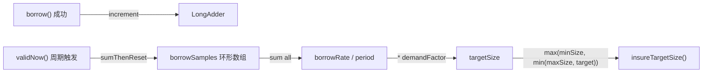

# 资源池与内存管理演进

<details>
<summary><b>[2026-04-13] ObjectPool adaptive refill</b></summary>

> **原始文件**: objectpool_adaptive_refill_71749666.plan.md
> **创建日期**: 2026-04-13

---
name: ObjectPool adaptive refill
overview: 为 ObjectPool 的 RefillTask（insureMinSize）增加基于最近 1 分钟 borrow 频率的自适应预热机制，使 pool 在高负载时主动补充更多空闲对象，低负载时回退到 minSize。
todos:
  - id: add-fields
    content: 新增 borrowAccumulator (LongAdder), borrowSamples (long[12]), sampleIndex, demandFactor 字段及 setter
    status: completed
  - id: borrow-increment
    content: 在 borrow() 成功路径增加 borrowAccumulator.increment()
    status: completed
  - id: refactor-insure
    content: 将 insureMinSize() 重构为 insureTargetSize(int target)，保留 insureMinSize() 兼容调用
    status: completed
  - id: validnow-sampling
    content: 在 validNow() 末尾增加滑动窗口采样逻辑，计算动态 targetSize 并调用 insureTargetSize()
    status: completed
  - id: unit-test
    content: 编写 ObjectPoolAdaptiveRefillTest 覆盖基线、自适应预热、负载回落、边界场景
    status: completed
isProject: false
---

# ObjectPool 自适应补充（Adaptive Refill）

## 现状分析

当前 [ObjectPool.java](rxlib/src/main/java/org/rx/core/ObjectPool.java) 的补充逻辑非常简单：

```137:147:rxlib/src/main/java/org/rx/core/ObjectPool.java
    void insureMinSize() {
        while (size() < minSize) {
            IdentityWrapper<T> w = doCreate();
            if (w != null) {
                recycle(w);
            } else {
                break;
            }
        }
    }
```

`validNow()` 周期性调用 `insureMinSize()`，只保证池中对象数不低于 `minSize`。无法感知实际负载，导致：
- 高负载时：borrow 频繁触发 `doCreate()`（慢路径），增加延迟
- 低负载时：已经正确（维持 minSize 即可）

## 设计方案

### 核心思路：滑动窗口采样 + 动态目标水位



### 1. 新增字段（ObjectPool 类内）

| 字段 | 类型 | 说明 |
|---|---|---|

- `borrowAccumulator` (`LongAdder`) -- 热路径计数器，borrow 成功时 increment，零竞争
- `borrowSamples` (`long[]`, 大小 `SAMPLE_COUNT = 12`) -- 环形缓冲区，每次 `validNow()` 写入一个采样值
- `sampleIndex` (`int`) -- 当前写入位置
- `demandFactor` (`double`, 默认 `2.0`, getter/setter) -- 预热系数，表示预热多少个 validationPeriod 周期的需求量

常量 `SAMPLE_COUNT = 12`，默认 `validationPeriod = 5s`，窗口约覆盖 60 秒。

### 2. borrow() 热路径改动（最小化）

在 `borrow()` 方法成功返回前（第 294 行 `return wrapper.instance` 之前），增加一行：

```java
borrowAccumulator.increment();
return wrapper.instance;
```

`LongAdder.increment()` 在热路径上接近零开销（striped cells，无 CAS 竞争）。

### 3. validNow() 采样与动态目标

在 `validNow()` 末尾（当前第 178 行 `insureMinSize()` 处）替换为：

```java
// 采样：将本周期累积的 borrow 次数写入环形缓冲区
borrowSamples[sampleIndex] = borrowAccumulator.sumThenReset();
sampleIndex = (sampleIndex + 1) % SAMPLE_COUNT;

// 计算最近窗口内总 borrow 数
long totalBorrows = 0;
for (long s : borrowSamples) {
    totalBorrows += s;
}

// 动态目标 = max(minSize, min(maxSize, ceil(avgPerPeriod * demandFactor)))
double avgPerPeriod = (double) totalBorrows / SAMPLE_COUNT;
int targetSize = Math.max(minSize, Math.min(maxSize,
        (int) Math.ceil(avgPerPeriod * demandFactor)));

insureTargetSize(targetSize);
```

### 4. insureMinSize() 重构为 insureTargetSize(int target)

```java
void insureTargetSize(int target) {
    while (size() < target) {
        IdentityWrapper<T> w = doCreate();
        if (w != null) {
            recycle(w);
        } else {
            break;
        }
    }
}
```

保留 `insureMinSize()` 作为兼容方法，内部调用 `insureTargetSize(minSize)`。构造函数中的初始预热仍调用 `insureMinSize()`。

### 5. demandFactor 的 setter

```java
public void setDemandFactor(double demandFactor) {
    this.demandFactor = Math.max(0, demandFactor);
}
```

`demandFactor = 0` 时退化为纯 `minSize` 行为（关闭自适应）。

### 6. toString() 增加可观测性

在 `@ToString` 覆盖范围内，`borrowSamples` 和 `sampleIndex` 默认会被 Lombok 包含，`validNow()` 的注释掉的 log 行可以取消注释或在 debug 级别打印 `targetSize`。

## 行为示例

假设 `minSize=2, maxSize=20, validationPeriod=5s, demandFactor=2.0`：

- **低负载**：过去 1 分钟 borrow 12 次 -> avgPerPeriod = 1.0 -> target = ceil(1.0 * 2.0) = 2 -> 等于 minSize，无额外预热
- **中等负载**：过去 1 分钟 borrow 120 次 -> avgPerPeriod = 10.0 -> target = ceil(10.0 * 2.0) = 20 -> 达到 maxSize 上限
- **突发负载**：某 5s 内 borrow 50 次 -> 下一周期 avgPerPeriod 迅速上升 -> 自动预热更多对象
- **负载回落**：borrow 减少 -> 旧采样被覆盖 -> target 自然下降 -> 超出 target 的空闲对象由 `idleTimeout` 机制淘汰

## 不影响的部分

- `doCreate()`, `doRetire()`, `doPoll()`, `recycle()` 逻辑完全不变
- `idleTimeout` 淘汰机制继续生效（负载下降时自然回收多余对象）
- `leakDetectionThreshold` 不受影响
- 构造函数签名不变，新字段有合理默认值

## 测试计划

编写 `ObjectPoolAdaptiveRefillTest`：
1. **基线测试**：`demandFactor=0`，验证行为与原来一致（只保持 minSize）
2. **自适应预热测试**：短时间内高频 borrow/recycle，手动触发 `validNow()`，验证 `size()` 上升到合理值
3. **负载回落测试**：停止 borrow，多次触发 `validNow()`，验证 targetSize 回落到 minSize（超出部分由 idleTimeout 淘汰）
4. **边界测试**：验证 target 不超过 maxSize，不低于 minSize


</details>


<details>
<summary><b>[2026-05-04] ObjectPool 修改验证与后续计划</b></summary>

> **原始文件**: ObjectPool-review-plan.md (来自 docs/plan)
> **创建日期**: 2026-05-04

# ObjectPool 修改验证与后续计划

## 背景

用户要求验证 `ObjectPool` 的修改，并更新本计划文档。

本次采用 **高性能模式（Netty 底层网络编程）**。当前项目强制基线仍为 Java 8，验证重点放在对象池状态机、并发归还、创建失败退避、资源释放、可观测性，以及对网络池化场景的影响。

## 当前结论

`rxlib/src/main/java/org/rx/core/ObjectPool.java` 当前实现已经覆盖上一轮 review 中的主要修复点：

- `ObjectConf` 状态机包含 `IDLE / BORROWED / RETIRED / VALIDATING`。
- `recycle()` 先通过 `BORROWED -> VALIDATING` CAS 获取归还所有权，只有 CAS 成功线程才执行 `validateHandler` 与 `passivateHandler`。
- `validNow()` 校验 idle 对象前先切到 `VALIDATING` 并从 shared idle 队列摘除，避免 borrow 与后台 validate 并发作用同一对象。
- `borrow()` 在 `createHandler` 持续失败或 duplicate 创建失败时调用 `backoffCreateFailure()`，避免 borrowTimeout 内 tight loop。
- `doCreate()` 与 `doCreateIdle()` 的 duplicate object 分支会释放预占 slot，并调用 `tryClose(wrapper)`。
- `demandFactor` 已是 `volatile double`，满足 setter 与后台 `validNow()` 并发可见性。
- `lookupKey FastThreadLocal` 在查找后通过 `finally` 清空，降低长生命周期线程强引用保留风险。
- `threadLocalCache` 只作为 L1 hint，归还对象仍进入 shared idle，borrow 命中 hint 后仍需 `IDLE -> BORROWED` CAS。
- `closeObjectOnLeak=false` 为默认值，泄漏检测默认只记录指标，不强制关闭 borrowed 对象。
- 诊断指标已包含 `active.count`、`target.total.count`，并保留兼容旧名 `target.count`。
- 支持 `setName(String)` 给对象池添加诊断 tag，便于多池实例区分。

本轮复核确认过一个 P1 问题：`doCreateIdle()` 遇到 duplicate object 时只回滚计数并返回 `null`，没有记录失败冷却状态。该问题会让 `validNow()`、`insureTargetSize()`、`insureMinIdle()` 与 `triggerMinIdleMaintain()` 后续再次触发 idle 创建，导致同一个错误 `createHandler` 在短时间内被多次调用。

当前已完成修复：idle 预热/维护创建路径新增 100ms 失败冷却。`doCreateIdle()` 的 duplicate、validate failed、异常路径会设置冷却；`insureMinIdle()`、`insureTargetSize()`、`triggerMinIdleMaintain()` 在冷却期内跳过补建；idle 创建成功后清除冷却。borrow 直接创建路径仍使用原有 `backoffCreateFailure()`，避免把借用热路径和后台 idle 维护冷却强耦合。

## 已核对文件

- `rxlib/src/main/java/org/rx/core/ObjectPool.java`
- `rxlib/src/test/java/org/rx/core/ObjectPoolTest.java`
- `rxlib/src/test/java/org/rx/net/socks/Socks5SessionPoolTest.java`
- `docs/reference/ObjectPool.md`

## 已验证命令

### ObjectPool 单元测试

```powershell
mvn -pl rxlib -Dtest=ObjectPoolTest test
```

结果：

- `Tests run: 34`
- `Failures: 0`
- `Errors: 0`
- `Skipped: 0`
- `BUILD SUCCESS`

说明：

- 测试日志中出现的 `Object has already in this pool` 与 `doCreate error` WARN 是用例主动覆盖 duplicate object 与 create failure 分支，属于预期日志。
- 修复后完整 `ObjectPoolTest` 已稳定通过本轮回归。

### duplicate idle 单用例复核

```powershell
mvn -pl rxlib -Dtest=ObjectPoolTest#testDuplicateIdleCreatedObjectIsClosedAndRetiredByValidation test
```

结果：

- `Tests run: 1`
- `Failures: 0`
- `Errors: 0`
- `Skipped: 0`
- `BUILD SUCCESS`

结论：

- P1 duplicate idle 维护路径反复补建问题已修复。
- 该用例修复前单独运行失败，修复后单独运行通过。

### Socks5 session pool 回归

```powershell
mvn -pl rxlib -Dtest=Socks5SessionPoolTest test
```

结果：

- `Tests run: 4`
- `Failures: 0`
- `Errors: 0`
- `Skipped: 0`
- `BUILD SUCCESS`

说明：

- 该用例覆盖网络侧 session pool 使用路径，可作为 ObjectPool 修改后对 SOCKS 池化场景的轻量回归。

## 当前测试覆盖

`ObjectPoolTest` 当前已覆盖：

- 基础 borrow / recycle / validate 生命周期。
- 创建失败后恢复。
- 创建持续失败退避：`testCreateHandlerContinuousFailureBackoff()`。
- duplicate borrowed 创建拒绝与关闭：`testDuplicateCreatedObjectIsClosedOrRejectedCleanly()`。
- duplicate idle 创建关闭并在 validate 后 retire：`testDuplicateIdleCreatedObjectIsClosedAndRetiredByValidation()`。
- shared idle 与 ThreadLocal hint 可见性。
- stale ThreadLocal cache 不借出 retired 对象。
- close / dispose 唤醒等待 borrower。
- leak detection 默认不关闭 borrowed 对象。
- borrow / recycle / validNow / close race 压力 smoke：`testStressBorrowRecycleValidateAndCloseRace()`。

## 风险评估

### 并发与状态机

当前 `recycle()` 的状态所有权已经收紧，重复 recycle 或并发 recycle 只有一个线程能进入 `VALIDATING` 并执行 handler。该修复降低了重复 passivate、重复释放 ByteBuf / Channel 关联资源、重复清理 UDP lease 的风险。

仍需继续关注：

- handler 内部不得阻塞 EventLoop。
- handler 内部不得执行不可重入的重复释放逻辑。
- 若池对象封装 Netty `ByteBuf`，必须由调用方保证引用计数成对释放。

### 创建失败退避

`backoffCreateFailure()` 当前使用 `LockSupport.parkNanos()` 做 1ms 到 100ms 的退避，并在检测到中断后抛出 `InterruptedException`。这能避免 `createHandler` 持续失败时 CPU tight loop。

仍需继续关注：

- 连续失败时 WARN 日志可能较多，生产环境应结合日志采样或指标告警。
- 如果 `createHandler` 失败原因来自远端不可达，应通过池外熔断或上游摘除处理，不能只依赖对象池退避。

### duplicate object 语义

当前 duplicate 分支会关闭 `createHandler` 返回的重复对象。这是对错误 `createHandler` 的防御，但如果 `createHandler` 违规返回仍被业务持有的池内对象，关闭动作可能影响正在使用的对象。

结论：

- 保持当前防御逻辑。
- 文档必须明确：`createHandler` 必须返回全新对象，不得返回已在池内或仍被业务持有的对象。

新增确认问题：

- 修复前：`doCreateIdle()` 的 duplicate 分支没有设置失败冷却。
- 修复前：`insureTargetSize()` 收到 `null` 会退出当前 while，但不会阻止后续 `validNow()` 或 `triggerMinIdleMaintain()` 再次进入。
- 修复前：`doRetire()` 在非 disposing 场景会触发 `triggerMinIdleMaintain()`，当 duplicate 分支关闭了已有 idle 对象后，validate retire 会进一步放大补建重试。
- 影响：不会直接借出重复对象，但会造成短时间重复创建、重复 WARN、额外 close 调用和 CPU/日志噪声。

已完成修复：

- 增加 `volatile long idleCreateBackoffUntilNanos`。
- 增加 `IDLE_CREATE_FAILURE_BACKOFF_NANOS = 100ms`。
- `doCreateIdle()` 发生 duplicate、异常或 validate failed 返回 `null` 前记录短暂冷却。
- `insureMinIdle()`、`insureTargetSize()`、`triggerMinIdleMaintain()` 在冷却期内直接跳过补建。
- idle 创建成功后清除冷却。
- `borrow()` 的直接创建路径继续使用现有 `backoffCreateFailure()`，不要把 borrow 热路径和后台 idle 维护冷却强耦合。

### ThreadLocal hint

当前 L1 ThreadLocal 只是 hint，不再隐藏 idle 对象，功能正确性已通过测试覆盖。

剩余风险：

- Netty EventLoop 等长生命周期线程可能短期保留 retired `ObjectConf` 引用，直到下一次 borrow 清理或线程结束。
- 当前测试已覆盖 stale hint 不会被借出，后续压测可继续观察内存保留。

### 泄漏检测

默认 `closeObjectOnLeak=false` 是更安全的方向，避免后台扫描关闭仍被业务持有的 borrowed 对象。

如果显式开启 `closeObjectOnLeak=true`：

- 这是破坏性强制回收。
- RPC / Socks / UDP 调用方必须能承受连接、session 或租约被后台关闭。

## 可观测性要求

生产或压测环境建议至少监控：

- 堆外内存占用，特别是 Netty direct memory。
- 池总数：`rx.object_pool.size.count`。
- 空闲数：`rx.object_pool.idle.count`。
- 活跃数估算：`rx.object_pool.active.count`。
- 等待借用线程数：`rx.object_pool.waiting.count`。
- borrow timeout 次数：`rx.object_pool.borrow.timeout.count`。
- 创建与销毁次数：`created.count`、`retired.count`。
- 动态目标总容量：`rx.object_pool.target.total.count`。
- 连接数、吞吐、平均延迟、P99 / P999 延迟。
- 泄漏告警与 close-on-leak 次数。

## 后续建议

1. 对 RPC pool、Socks session pool、UDP lease pool 分别做长时间压测，观察 direct memory、连接数、timeout、retired 与 P99 延迟。
2. 将 Remoting pool 模式纳入稳定 CI 回归；如仍有冷启动 1s 时序抖动，应增加预热或放宽测试超时。
3. 将 `doRetire(wrapper, action)` 的 magic int 替换为 Java 8 兼容的 `static final int` 常量，降低后续日志和指标误分类风险。
4. 如生产日志中 create failure WARN 过密，再增加日志采样或按池名聚合告警。

## 结论

本轮 P1 问题已修复：duplicate idle 创建失败现在会触发 idle 维护路径冷却，不再在短时间内被 `validNow()`、`insureMinIdle()` 或异步维护任务反复补建。

当前验证结论：`ObjectPoolTest` 与 `Socks5SessionPoolTest` 均通过。下一阶段可以进入 RPC / Socks / UDP 真实场景压测与 CI 稳定性回归。


</details>

---
