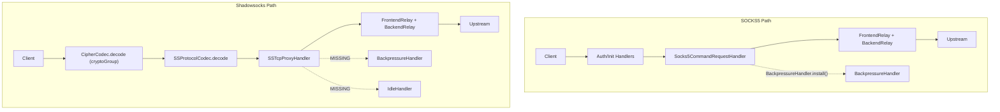

# 网络与代理层架构演进

<details>
<summary><b>[2026-04-04] SS Proxy Performance Optimization</b></summary>

> **原始文件**: ss_proxy_performance_optimization_d8dc3559.plan.md
> **创建日期**: 2026-04-04

---
name: SS Proxy Performance Optimization
overview: 对 SocksProxyServer 和 ShadowsocksServer 进行性能审查后，识别出 7 个关键优化点，涵盖背压控制、加密内存分配、线程切换开销、空闲连接管理等方面。
todos:
  - id: p0-backpressure
    content: SSTcpProxyHandler 添加 BackpressureHandler.install()
    status: completed
  - id: p1-udp-decrypt-alloc
    content: AesGcmCrypto._udpDecrypt 复用 decBuffer 替代 new byte[]
    status: completed
  - id: p2-buffer-capacity
    content: CryptoAeadBase encrypt/decrypt 预估 ByteBuf 初始容量
    status: completed
  - id: p3-idle-handler
    content: ShadowsocksServer TCP pipeline 添加 ProxyChannelIdleHandler
    status: completed
  - id: p4-crypto-group
    content: 评估移除 cryptoGroup，改为 IO EventLoop 直接执行加解密（可配置）
    status: completed
  - id: p5-salt-pool
    content: UDP 加密路径使用预生成盐值池减少 SecureRandom 调用
    status: cancelled
  - id: p6-addr-buffer
    content: SSProtocolCodec encode 改用 heap buffer 替代 directBuffer(64)
    status: completed
isProject: false
---

# SocksProxyServer / ShadowsocksServer 性能优化计划

## 审查总结

对两个文件及其完整数据路径（pipeline handler 链、加密实现、Bootstrap 配置、中继转发）进行了全面 review，以下按**严重程度排序**列出问题和优化方案。

---

## P0: Shadowsocks TCP 缺少 BackpressureHand

## ler（内存溢出风险）

**问题**: SOCKS5 路径中 `Socks5CommandRequestHandler` 在建连时调用了 `BackpressureHandler.install(inbound, outbound)`，当出站写满时会暂停入站读取。但 `SSTcpProxyHandler` 建连时**完全没有安装 BackpressureHandler**，高流量场景下如果出站写速度跟不上入站读速度，写队列会无限膨胀导致 OOM。

**修复**: 在 `[SSTcpProxyHandler.java](rxlib/src/main/java/org/rx/net/socks/SSTcpProxyHandler.java)` 的 `channelRead` 中，`bootstrap.connect()` 成功回调里加入 BackpressureHandler：

```java
// SSTcpProxyHandler.java channelRead() 的 connect listener 中
Channel outbound = f.channel();
BackpressureHandler.install(inbound, outbound); // <-- 新增
outbound.pipeline().addLast(SocksTcpBackendRelayHandler.DEFAULT);
```

---

## P1: UDP 解密路径每包分配临时 byte[] 数组

**问题**: `[AesGcmCrypto._udpDecrypt()](rxlib/src/main/java/org/rx/net/socks/encryption/impl/AesGcmCrypto.java)` 第 190 行每次调用都 `new byte[length]` 作为独立输入缓冲区。高 QPS UDP 场景下产生大量短命数组，增加 GC 压力。

```80:83:rxlib/src/main/java/org/rx/net/socks/encryption/impl/AesGcmCrypto.java
    protected void _udpDecrypt(ByteBuf in, ByteBuf out) {
        int length = in.readableBytes();
        byte[] encrypted = new byte[length];  // <-- 每包一次分配
        in.readBytes(encrypted, 0, length);
```

**修复**: 复用 `decBuffer()`（已有 `FastThreadLocal` 按线程缓存的 `~16KB` 缓冲区），将密文读入 `decBuffer` 的前半段，解密输出写到后半段，或用偏移避免重叠：

```java
protected void _udpDecrypt(ByteBuf in, ByteBuf out) {
    int length = in.readableBytes();
    byte[] decBuffer = decBuffer();
    // 将密文读入 decBuffer 尾部（PAYLOAD_SIZE_MASK + TAG_LENGTH 之后的区域），
    // 或直接分两段使用 decBuffer 做 in-place
    in.readBytes(decBuffer, 0, length);
    AEADCipher decCipher = getDecCipher();
    decCipher.init(false, getCipherParameters(false));
    int outLen = decCipher.processBytes(decBuffer, 0, length, decBuffer, 0);
    decCipher.doFinal(decBuffer, outLen);
    out.writeBytes(decBuffer, 0, length - TAG_LENGTH);
}
```

> 注意：需确认 BouncyCastle GCM 支持 in-place 解密（input/output 同数组），实测 GCMBlockCipher 允许 overlapping buffer。

---

## P2: encrypt/decrypt 每次分配未指定容量的 directBuffer

**问题**: `[CryptoAeadBase.encrypt()](rxlib/src/main/java/org/rx/net/socks/encryption/CryptoAeadBase.java)` 第 153 行和 `decrypt()` 第 180 行调用 `Bytes.directBuffer()` 不带初始容量参数，导致：

- 初始分配可能过小（Netty 默认 256 bytes），TCP 大数据包需要多次扩容拷贝
- 或者过大造成浪费

**修复**: 根据输入大小预估输出容量：

```java
// encrypt
int estimatedSize = forUdp
    ? getSaltLength() + in.readableBytes() + TAG_LENGTH
    : in.readableBytes() + ((in.readableBytes() / PAYLOAD_SIZE_MASK) + 1) * (2 + TAG_LENGTH * 2);
ByteBuf out = Bytes.directBuffer(estimatedSize);

// decrypt - 类似，根据输入大小减去 overhead 预估
```

---

## P3: Shadowsocks 缺少空闲连接检测

**问题**: `SocksProxyServer` 在 `acceptChannel()` 中安装了 `ProxyChannelIdleHandler` 做读/写超时检测，半死连接会被自动清理。但 `ShadowsocksServer` 的 pipeline 中**没有任何 idle 检测**，僵尸连接会一直占用资源。

**修复**: 在 `[ShadowsocksServer](rxlib/src/main/java/org/rx/net/socks/ShadowsocksServer.java)` 构造函数的 TCP pipeline 初始化中添加 idle handler：

```java
channel.pipeline()
    .addLast(new ProxyChannelIdleHandler(
        config.getReadTimeoutSeconds(),
        config.getWriteTimeoutSeconds()))  // <-- 新增
    .addLast(cryptoGroup, CipherCodec.DEFAULT, new SSProtocolCodec(), SSTcpProxyHandler.DEFAULT);
```

需要在 `ShadowsocksConfig` 中添加 `readTimeoutSeconds` / `writeTimeoutSeconds` 配置（或从父类 `SocketConfig` 继承默认值）。

---

## P4: cryptoGroup 线程切换开销可评估移除

**问题**: `ShadowsocksServer` 将 `CipherCodec` + `SSProtocolCodec` 放在独立的 `DefaultEventExecutorGroup(cryptoGroup)` 上执行。这意味着**每条消息都要从 IO EventLoop 切换到 cryptoGroup 线程，再切回**，增加了上下文切换和队列调度开销。

AES-GCM 在现代 CPU 上有 AES-NI 指令集加速，单次加解密通常在微秒级，线程切换的开销可能**反而大于**加解密本身。

**建议**: 

- 做基准测试：对比 `cryptoGroup` 独立线程 vs 直接在 IO EventLoop 上执行 AES-GCM 的吞吐和延迟
- 如果 AES-NI 可用（绝大多数 x86 服务器），考虑**移除 cryptoGroup**，让加解密直接在 IO EventLoop 上执行，消除线程切换
- 可以把这个作为一个**配置项**（`useDedicatedCryptoGroup`），默认关闭

```java
// 改为可配置
if (config.isUseDedicatedCryptoGroup()) {
    channel.pipeline().addLast(cryptoGroup, CipherCodec.DEFAULT, new SSProtocolCodec(), SSTcpProxyHandler.DEFAULT);
} else {
    channel.pipeline().addLast(CipherCodec.DEFAULT, new SSProtocolCodec(), SSTcpProxyHandler.DEFAULT);
}
```

---

## P5: UDP secureRandomBytes 每包生成盐值开销

**问题**: `CryptoAeadBase.encrypt()` 中 UDP 路径每个包都调用 `CodecUtil.secureRandomBytes(getSaltLength())`（底层为 `SecureRandom`），在高 QPS 下 `SecureRandom` 可能成为瓶颈（尤其是 Linux 上 `/dev/urandom` 在极端场景下的系统调用开销）。

**建议**: 考虑使用预生成的随机字节池或 `ThreadLocalRandom` + 定期 reseed 的方案（需评估安全性权衡）。或者使用 `SecureRandom` 批量生成随机字节缓存到 `FastThreadLocal` 中：

```java
// 例如每次生成 1024 个 salt，按需取用
private static final FastThreadLocal<ByteBuffer> SALT_POOL = new FastThreadLocal<>() {
    protected ByteBuffer initialValue() {
        byte[] bulk = CodecUtil.secureRandomBytes(1024);
        return ByteBuffer.wrap(bulk);
    }
};
```

---

## P6: SSProtocolCodec UDP encode 每包分配 directBuffer(64)

**问题**: `[SSProtocolCodec.encode()](rxlib/src/main/java/org/rx/net/socks/SSProtocolCodec.java)` 第 48 行每个 UDP 出站包都 `ctx.alloc().directBuffer(64)` 分配一个小 buffer 写地址头，再与 payload 做 `Unpooled.wrappedBuffer` 组合。小 direct buffer 频繁分配/回收有 overhead。

**建议**: 改为 heap buffer 或使用 `CompositeByteBuf` 避免额外拷贝：

```java
ByteBuf addrBuf = ctx.alloc().buffer(64); // heap buffer 更轻量
UdpManager.encode(addrBuf, addr);
buf = Unpooled.wrappedBuffer(addrBuf, buf.retain());
```

---

## 数据流概览（供参考）




---

## 优化优先级总结


| 优先级 | 问题                            | 影响          | 改动量        |
| --- | ----------------------------- | ----------- | ---------- |
| P0  | SS TCP 缺 BackpressureHandler  | OOM 风险      | 1 行        |
| P1  | UDP decrypt 每包 new byte[]     | GC 压力       | ~10 行      |
| P2  | encrypt/decrypt 未指定 buffer 容量 | 扩容拷贝开销      | ~5 行       |
| P3  | SS 缺 idle handler             | 僵尸连接泄漏      | ~5 行       |
| P4  | cryptoGroup 线程切换              | 延迟增加        | ~10 行 + 测试 |
| P5  | UDP 每包 SecureRandom           | CPU 开销      | ~20 行      |
| P6  | SSProtocolCodec 小 buffer 分配   | 轻微 overhead | ~2 行       |


</details>

<details>
<summary><b>[2026-04-16] Network Performance Optimization</b></summary>

> **原始文件**: network_performance_optimization_4e1223c1.plan.md
> **创建日期**: 2026-04-16

---
name: Network Performance Optimization
overview: 对 DnsServer、Remoting、ShadowsocksServer 三条核心数据路径进行系统性性能审计，按“低风险高收益优先、协议重设计后置”的原则给出分层优化方案：消除热点路径对象分配、降低锁竞争、改善编解码与日志开销、补全背压机制，并补齐测试与监控验收矩阵。
todos:
  - id: dns-string-alloc
    content: DnsHandler 域名规范化与 cache key 分配收敛（禁用 intern）
    status: pending
  - id: dns-log-downgrade
    content: DnsHandler 日志降级为 debug + 惰性求值
    status: pending
  - id: dns-hosts-copy
    content: DnsServer.getHosts() 避免每次 ArrayList 拷贝
    status: pending
  - id: dns-cache-memory
    content: interceptorCache 改用 MemoryCache 替代 H2StoreCache
    status: pending
  - id: dns-coalesce
    content: 雷鸣羊群并发请求合并（Promise 模式）
    status: pending
  - id: rpc-codec
    content: Remoting 传输 Codec 可插拔化，RPC 协议分层演进
    status: pending
  - id: rpc-object-pool
    content: RPC 请求对象生命周期梳理，谨慎评估池化边界
    status: pending
  - id: rpc-lazy-log
    content: Remoting 与 Sys.callLog 描述/参数快照改按策略延迟生成
    status: pending
  - id: rpc-event-lock
    content: EventBean synchronized+wait 改 Promise 异步模型
    status: pending
  - id: ss-backpressure
    content: SSTcpProxyHandler 恢复 BackpressureHandler 背压机制
    status: pending
  - id: ss-udp-alloc
    content: SSUdpProxyHandler 避免重复目标地址封装，但不按 channel 固定缓存
    status: pending
  - id: ss-udp-buf
    content: UdpBackendRelayHandler 使用安全的池化 CompositeByteBuf 组包
    status: pending
  - id: ss-crypto-factory
    content: 先基准化 ICrypto 构造成本，仅缓存无状态元数据
    status: pending
  - id: cross-attrkey
    content: AttributeKey.valueOf 改为 static final 常量
    status: pending
  - id: cross-log-hot
    content: 三模块数据路径日志统一降级
    status: pending
  - id: cross-validation
    content: 补充性能基准、回归测试与监控验收矩阵
    status: pending
isProject: false
---

# rxlib 网络层性能优化方案

**模式：高性能模式（Netty 底层网络编程）**

以下按 **影响面从大到小** 排列，每项标注影响级别（P0 最高）。

---

## 一、DnsServer / DnsHandler 优化

### 1.1 [P0] 热路径字符串分配消除

[DnsHandler.java](rxlib/src/main/java/org/rx/net/dns/DnsHandler.java) 第 46、63 行：

```java
String domain = question.name().substring(0, question.name().length() - 1); // 每查询 1 次 substring
String k = DOMAIN_PREFIX + domain; // 每查询 1 次 concat
```

**问题：** 每条 DNS 查询至少 2 次字符串分配，高 QPS（万级/秒）下造成 Young GC 压力。

**优化方案：**
- 将 `question.name()` 的标准化提取为独立 helper，避免重复 `name()/length()` 调用，并接受“若 cache API 仍要求 `String`，则保留一次受控字符串分配”的现实边界
- 若基准确认 `DOMAIN_PREFIX + domain` 有明显占比，可引入**有容量上限与 TTL 的 domain->cacheKey 本地缓存**，而不是每次重新拼接
- 明确禁止 `intern()`；DNS 域名来自外部输入，高基数场景会放大全局字符串池内存风险
- 不把 `FastThreadLocal<StringBuilder>` 作为主方案；最终 cache key 仍需落成 `String`，Builder 复用不能消除关键分配

### 1.2 [P0] DNS 查询日志降级

[DnsHandler.java](rxlib/src/main/java/org/rx/net/dns/DnsHandler.java) 第 51、131、150 行：

```java
log.info("dns query {}+{} -> {}[HOSTS]", srcIp, domain, ips.get(0).getHostAddress());
log.info("dns query {}+{} -> {}[ANSWER]", srcIp, domain, count);
log.info("dns query {}+{} -> {}[SHADOW]", srcIp, domain, ips.get(0).getHostAddress());
```

**问题：**
- 每条 DNS 查询触发 `log.info`，即使日志级别关闭，`getHostAddress()` 仍会被调用（先求值再传参）
- `getHostAddress()` 内部有字符串格式化与分配

**优化方案：**
- 全部降为 `log.debug`，或加 `if (log.isDebugEnabled())` 守卫
- `srcIp` 参数改为惰性求值（传 `InetAddress` 对象让 SLF4J 的 `toString()` 延迟调用）
- 去掉 `getHostAddress()` 显式调用，直接传 `InetAddress` 对象

### 1.3 [P1] getHosts() 每次查询返回新 ArrayList

[DnsServer.java](rxlib/src/main/java/org/rx/net/dns/DnsServer.java) 第 114 行：

```java
return enableHostsWeight ? Linq.from(ips.next(), ips.next()).distinct().toList() : new ArrayList<>(ips);
```

**问题：** 非加权模式下每次 DNS hosts 命中都 `new ArrayList<>(ips)` 拷贝整个列表。

**优化方案：**
- 在 `RandomList` 内部增加“内容变更即失效”的只读快照，`getHosts()` 直接返回该快照，避免每次重新拷贝
- 非加权模式优先返回快照，不直接暴露 `RandomList` 活视图；`Collections.unmodifiableList(ips)` 只能防写，不能解决底层集合仍在变化的问题
- 加权模式下 `Linq.from(...).distinct().toList()` 也有分配，可改为直接比较两个 `next()` 结果后返回单元素或双元素结果

### 1.4 [P1] interceptorCache 使用 H2StoreCache 过重

[DnsServer.java](rxlib/src/main/java/org/rx/net/dns/DnsServer.java) 第 78 行：

```java
interceptorCache = (Cache) cache;  // H2StoreCache.DEFAULT
```

**问题：** DNS 拦截器缓存使用磁盘型 H2 数据库，L1 内存层 maximumSize=2048，L2 涉及 `findById` / `save` 持久化操作。DNS 解析是高频低延迟场景，磁盘 I/O 与序列化开销不匹配。

**优化方案：**
- DNS 拦截器缓存改用纯 `MemoryCache`，配合 `CachePolicy.absolute(ttl)` 即可
- 若需持久化（重启恢复），可在后台异步写 H2，查询路径只走内存
- L1 容量从 2048 提升到至少 8192（DNS 域名集合通常较大）

### 1.5 [P2] 雷鸣羊群 fallback 放大上游负载

[DnsHandler.java](rxlib/src/main/java/org/rx/net/dns/DnsHandler.java) 第 71 行：

```java
if (server.resolvingKeys.add(k)) { ... } else { /* fall through to upstream */ }
```

**问题：** 并发请求同一域名时，首个线程走拦截器解析，其余直接 fallback 到上游 DNS，可能对上游造成放大效应。

**优化方案：**
- 优先使用 per-domain 的 Netty `Promise<List<InetAddress>>`；首个请求创建并解析，后续请求直接 `addListener` 复用结果
- Promise 完成后在各自请求对应的 `Channel.eventLoop()` 上回写响应，避免跨线程直接操作 `ChannelHandlerContext`
- 补充超时、异常完成与 map 清理逻辑，防止 promise 表在失败路径泄漏；若等待超时，再按策略决定回源上游或返回失败

---

## 二、Remoting 优化

### 2.1 [P0] 默认 Java 序列化需拆分为“传输层优化”和“RPC 协议重设计”

[TcpServer.java](rxlib/src/main/java/org/rx/net/transport/TcpServer.java) 与 [StatefulTcpClient.java](rxlib/src/main/java/org/rx/net/transport/StatefulTcpClient.java) pipeline 中默认使用 Java 原生序列化：

**问题：**
- Java 序列化本身在吞吐、分配和反序列化延迟上都偏重
- 但当前 Remoting 协议并非静态 Schema：`MethodMessage.parameters` 是 `Object[]`，`returnValue` 是 `Object`，事件链路还包含可变 `EventArgs`
- 因此“直接把 `ObjectDecoder/ObjectEncoder` 换成 Protobuf”不是短期优化，而是一次协议重设计

**优化方案（渐进式）：**
- **短期**：先把 Transport 层抽象为可插拔 Codec/Frame 策略，但默认保持现有协议与兼容行为不变；通过基准确认瓶颈是否真的落在 Java 序列化
- **中期**：在 RPC 层梳理热路径消息模型，先为高频 contract/事件建立**显式类型注册和版本协商**，解决 `Object[]/Object/EventArgs` 的兼容问题
- **长期**：在新旧协议可双栈运行、可灰度迁移后，再把热点 RPC 路径切到 `LengthFieldBasedFrameDecoder + 自定义二进制 Codec`；不要把“换 Protobuf”当作当前协议的直接替换

### 2.2 [P2] 每次 RPC 调用的对象分配

[Remoting.java](rxlib/src/main/java/org/rx/net/rpc/Remoting.java) 第 100、146 行：

```java
ClientBean clientBean = new ClientBean();  // 每次调用
pack = clientBean.pack = new MethodMessage(generator.increment(), m.getName(), args, ThreadPool.traceId());  // 每次调用
```

**问题：** 每次 RPC 方法调用至少分配 `ClientBean` + `MethodMessage` + `ResetEventWait`（内嵌于 `ClientBean`），但这些对象会跨异步等待、`clientBeans` 挂表以及重连重发路径存活，不是纯粹的线程内短命对象。

**优化方案：**
- 第一阶段**不直接引入 `ClientBean/MethodMessage` 对象池**；先补齐生命周期图，确认对象何时可安全释放、是否会被重连逻辑再次发送
- 优先采用低风险减分配手段：缩短等待对象生命周期、减少日志/trace 路径的额外对象创建、避免不必要的包装层
- 若基准证明请求对象分配确为主要瓶颈，只允许对**不跨异步边界、不进入 in-flight map、不参与重发**的临时对象做池化；请求包本身不得在边界不清晰前池化

### 2.3 [P1] String.format 日志与 callLog 开销

[Remoting.java](rxlib/src/main/java/org/rx/net/rpc/Remoting.java) 第 215-217、464-465 行：

```java
String.format("Client %s.%s [%s -> %s]", contract.getSimpleName(), methodMessage.methodName, ...)
String.format("Server %s.%s [%s -> %s]", contractInstance.getClass().getSimpleName(), pack.methodName, ...)
```

**问题：** 每次 RPC 调用无条件执行 `String.format` + `Sockets.toString()`，即使 callLog 内部不输出。

**优化方案：**
- `Remoting` 调用点的描述字符串改为惰性生成，避免每次无条件执行 `String.format` + `Sockets.toString()`
- `Sys.callLog` 入口进一步改造为“先判定 `LogStrategy` / matcher，再按需构造描述和参数快照”；仅改调用点还不够，因为当前 `callLog` 会提前生成 `paramSnapshot`
- 控制日志策略默认值，避免高频 RPC 路径在未输出日志时仍做对象转 JSON / 参数截断

### 2.4 [P1] synchronized(eventBean) 持锁等待

[Remoting.java](rxlib/src/main/java/org/rx/net/rpc/Remoting.java) 第 384-421 行：

```java
synchronized (eventBean) {
    // ... 
    eventBean.wait(s.getConfig().getConnectTimeoutMillis());  // 持锁阻塞等待
    broadcastTargets = collectBroadcastTargets(bean, eventBean, eCtx);
}
```

**问题：** COMPUTE_ARGS 场景中，在 `synchronized(eventBean)` 块内执行 `eventBean.wait()`，阻塞时间可达 `connectTimeoutMillis`（秒级）。期间所有同名事件的 SUBSCRIBE/PUBLISH/COMPUTE_ARGS 都被阻塞。

**优化方案：**
- 将 COMPUTE_ARGS 的等待模型改为 Netty `Promise`（必要时用 `CompletableFuture` 适配上层），避免在同步块内 wait
- `EventContext` 内嵌 `Promise<EventArgs>`，由 COMPUTE_ARGS 返回时 complete
- 广播目标收集移到 wait 完成后，缩短持锁范围

### 2.5 [P2] collectBroadcastTargets 每次 new ArrayList

[Remoting.java](rxlib/src/main/java/org/rx/net/rpc/Remoting.java) 第 490-506 行：

```java
List<TcpClient> targets = new ArrayList<>();
for (TcpClient client : eventBean.subscribe) { ... targets.add(client); }
```

**优化方案：**
- 首选 `new ArrayList<>(eventBean.subscribe.size())` 预分配容量，降低扩容次数
- 不将 `FastThreadLocal<ArrayList>` 作为默认方案；该列表会逃逸到锁外发送阶段，复用边界不如直接预分配清晰

### 2.6 [P2] ResetEventWait 虚假唤醒风险

[ResetEventWait.java](rxlib/src/main/java/org/rx/core/ResetEventWait.java) 的 `waitOne(timeoutMillis)` 超时分支：

**问题：** `wait()` 返回后若 `!open` 直接 `return false`，未区分虚假唤醒与真正超时，可能导致 RPC 调用提前超时返回。

**优化方案：**
- 超时 wait 分支改为 `while (!open && elapsed < timeout)` 循环，使用 `System.nanoTime()` 精确计算剩余等待时间

---

## 三、ShadowsocksServer 优化

### 3.1 [P0] 背压机制缺失

[SSTcpProxyHandler.java](rxlib/src/main/java/org/rx/net/socks/SSTcpProxyHandler.java) 中 `BackpressureHandler.install` 被注释：

**问题：** TCP 代理通道无背压控制，高流量时入站/出站缓冲区无限膨胀，可能导致 OOM 或 Direct Memory 耗尽。

**优化方案：**
- 恢复 `BackpressureHandler.install`，在 relay handler 安装到 inbound 和 outbound 两端
- 配合 `WriteBufferWaterMark` 设置合理水位（建议 32KB / 64KB）
- 确保 `ShadowsocksConfig` 的 `OptimalSettings` 已配置
- 为背压状态补充指标：不可写次数、暂停时长、恢复次数、堆外内存占用

### 3.2 [P1] SSUdpProxyHandler 每包对象分配

[SSUdpProxyHandler.java](rxlib/src/main/java/org/rx/net/socks/SSUdpProxyHandler.java) 第 98 行：

```java
UnresolvedEndpoint dstEp = new UnresolvedEndpoint(inbound.attr(ShadowsocksConfig.REMOTE_DEST).get());
```

**问题：** 每个 UDP 数据包都创建新的 `UnresolvedEndpoint` 对象，高 QPS UDP 场景下分配压力大。

**优化方案：**
- UDP 模式下**不能**把目标地址按 channel 生命周期固定缓存；`SSProtocolCodec` 会对每个数据包重新 decode 并更新 `REMOTE_DEST`
- 如需优化，改为 `SSProtocolCodec` 在每包 decode 后直接写入 `UnresolvedEndpoint`，后续 handler 读取同一对象，避免 `InetSocketAddress -> UnresolvedEndpoint` 的重复封装
- `routeMap` 仍按“每包最新目标地址”查找，确保同一 UDP association 发往多目标时不会串路由

### 3.3 [P1] UdpBackendRelayHandler 每包 buffer 分配

[SSUdpProxyHandler.java](rxlib/src/main/java/org/rx/net/socks/SSUdpProxyHandler.java) 第 71 行：

```java
ByteBuf addrBuf = ctx.alloc().buffer(64);
UdpManager.encode(addrBuf, realDstEp);
ByteBuf finalBuf = Unpooled.wrappedBuffer(addrBuf, outBuf.retain());
```

**问题：** 每个入站 UDP 响应包都分配 64 字节 `ByteBuf` 用于地址编码。

**优化方案：**
- 保留“每包一个小 header buffer”的安全边界，但统一使用池化 `CompositeByteBuf` 组包，减少包装对象与堆分配
- 将组包逻辑下沉为辅助方法，例如 `UdpManager` 提供基于 `ByteBufAllocator` 的地址头编码 + `CompositeByteBuf` 拼装
- 明确禁止 `FastThreadLocal<ByteBuf>` 复用该 header；它会跨异步 `writeAndFlush` 生命周期逃逸，存在数据覆盖与引用计数失配风险

### 3.4 [P2] 先基准化 ICrypto.get() 成本，避免缓存有状态实例

[ShadowsocksServer.java](rxlib/src/main/java/org/rx/net/socks/ShadowsocksServer.java) 第 43-44 行：

```java
ICrypto _crypto = ICrypto.get(config.getMethod(), config.getPassword());
```

**问题：**
- 每个新连接（TCP/UDP channel init）都会调用 `ICrypto.get()` 创建实例
- 但当前 `CipherKind.newInstance()` 实际主要是 `new AesGcmCrypto(...)`，不应在没有基准数据前假设它是主热点
- `AesGcmCrypto`/`CryptoAeadBase` 持有 nonce、subkey、分段解密状态和 UDP/TCP 模式状态，实例天然是有状态对象

**优化方案：**
- 先用 benchmark / profiler 确认 `ICrypto.get()`、`AesGcmCrypto` 构造、密钥派生在建连路径中的占比，再决定是否优化
- 不缓存 `ICrypto` 实例，不做模板 `clone()`，也不做共享 ThreadLocal crypto；这些方案很容易破坏 AEAD 会话状态正确性
- 若确实需要优化，只缓存**无状态元数据**，例如算法枚举解析结果、密码派生辅助数据；每个连接仍创建独立 `ICrypto` 实例

### 3.5 [P2] routeMap 惰性初始化可做分支收敛

[SSUdpProxyHandler.java](rxlib/src/main/java/org/rx/net/socks/SSUdpProxyHandler.java) 第 102-104 行：

```java
ConcurrentMap<...> routeMap = inbound.attr(ATTR_ROUTE_MAP).get();
if (routeMap == null) {
    inbound.attr(ATTR_ROUTE_MAP).set(routeMap = MemoryCache...build().asMap());
}
```

**问题：** 在 Netty 的“单 channel 绑定单 EventLoop”模型下，这里通常不是实质性的并发正确性 bug，但运行时判空 + 建表逻辑仍然重复，且同类写法在多个 UDP handler 中都存在。

**优化方案：**
- 若顺手清理该逻辑，可改用 `attr.setIfAbsent()` 或在 channel init 阶段预初始化 `ATTR_ROUTE_MAP`
- 将它视为“代码整洁性与分支收敛”优化，而不是高优先级并发缺陷

---

## 四、跨模块共性优化

### 4.1 [P1] AttributeKey.valueOf(name) 动态查找

[TcpClient.java](rxlib/src/main/java/org/rx/net/transport/TcpClient.java) 接口的 `attr()` 方法每次按名字查找 AttributeKey：

**优化方案：**
- 高频路径改为 `static final AttributeKey<T>` 常量声明，一次注册后直接引用
- `TcpClient.attr(String)` 仍可保留作通用扩展接口，但 Remoting / Socks / DNS 热点路径应直接使用 typed key

### 4.2 [P2] 全局日志热点

三个模块在热路径上均大量使用 `log.info`，建议统一：
- 数据路径（每包/每查询）：仅 `log.debug`，且必须加 `isDebugEnabled()` 守卫
- 控制路径（连接建立/关闭/错误）：保持 `log.info`
- 异常路径：`log.warn` / `log.error`
- `Sys.callLog` 视为独立热点，需和普通 SLF4J 日志一起纳入治理

---

## 五、实施顺序与验收

### 5.1 建议实施顺序

**第一阶段：低风险高收益**
- DNS 查询日志降级与惰性求值
- `Sys.callLog` 按策略延迟构造描述与参数快照
- `DnsServer.interceptorCache` 评估切换到内存缓存或双层缓存
- `collectBroadcastTargets` 预分配容量
- `AttributeKey` 热点常量化

**第二阶段：并发与背压治理**
- DNS 同域名请求合并（Promise）
- `EventBean` 的 `wait/notify` 改 Promise 模型
- `ResetEventWait` 超时循环修正
- `SSTcpProxyHandler` 恢复背压并校准写水位
- UDP routeMap 初始化改 `setIfAbsent()` 或在 channel init 阶段预建

**第三阶段：协议与结构性优化**
- UDP 目标地址按包透传，消除重复封装
- UDP 组包统一改为池化 `CompositeByteBuf`
- Remoting 的 Transport Codec 抽象
- RPC 协议版本化、类型注册和双栈兼容方案

### 5.2 必测项

**单元测试**
- `ResetEventWait`：虚假唤醒、精确超时、无限等待
- `DnsServer.getHosts()`：单值、多值、加权与非加权返回语义
- UDP 目标路由：同一 channel 连续发送不同目标地址时不串路由
- `BackpressureHandler`：高低水位切换、异常恢复、关闭清理

**集成测试**
- `SocksProxyServerIntegrationTest`
- `ShadowsocksServerIntegrationTest`
- `Socks5ClientIntegrationTest`
- `RrpIntegrationTest`
- `RemotingTest`
- `DnsServerIntegrationTest`

### 5.3 性能与监控验收指标

- DNS：QPS、平均延迟、P99、每请求分配字节数、缓存命中率
- Remoting：QPS、RTT、P99、等待中的 `clientBeans` 数量、重连重发成功率
- Shadowsocks TCP/UDP：吞吐、P99、背压触发次数、丢包/重试情况
- 连接生命周期：当前连接数、建连失败率、半关闭/异常断开数量
- 内存：堆使用量、Young GC 频率、**堆外内存占用**、DirectBuffer OOM 告警

### 5.4 验收原则

- 小改动至少具备对应单元测试与基准对比
- 涉及网络链路、线程模型、背压、协议兼容的改动，必须补充集成测试
- 所有“优化”结论以 benchmark / profiler / 指标对比为准，不接受仅凭代码直觉进行高风险重构


</details>


<details>
<summary><b>[2026-05-04] HttpClient Netty 改造计划</b></summary>

> **原始文件**: HttpClient-Netty-Migration-plan.md (来自 docs/plan/archive)
> **创建日期**: 2026-05-04

# HttpClient Netty 改造计划

## 模式

- 高性能模式
- Java 8 约束
- 目标：基于 Netty 重建 `HttpClient`，覆盖旧 `HttpClient` 主要能力，移除 `okhttp` 依赖，同时保持低延迟、低额外分配、可控的连接与内存生命周期。

## 进度同步（2026-04-21）

- `[已完成]` 现状盘点
  - 现有 [`HttpClient.java`](/D:/projs_r/rxlib/rxlib/src/main/java/org/rx/net/http/HttpClient.java) 完全基于 `okhttp`。
  - 当前已具备的能力：`GET/HEAD/POST/PUT/PATCH/DELETE`、`json body`、`application/x-www-form-urlencoded`、`multipart/form-data` 文件上传、请求头透传、超时、Cookie、代理、Servlet 转发、响应转字符串/文件/JSON/流。
  - 当前 `HttpClient` 语义是“单实例仅维护一个活动响应”，重复请求会关闭上一次 `ResponseContent`，且类本身标注了 `Not thread safe`。
- `[已完成]` 依赖边界确认
  - 仅新增 Netty 版本还不能马上删除 `okhttp` 依赖。
  - 除 `HttpClient` 外，当前还直接依赖 `okhttp` 的位置包括：
    - [`AuthenticProxy.java`](/D:/projs_r/rxlib/rxlib/src/main/java/org/rx/net/http/AuthenticProxy.java)
    - [`CookieContainer.java`](/D:/projs_r/rxlib/rxlib/src/main/java/org/rx/net/http/CookieContainer.java)
    - [`PersistentCookieStorage.java`](/D:/projs_r/rxlib/rxlib/src/main/java/org/rx/net/http/cookie/PersistentCookieStorage.java)
    - [`VolatileCookieStorage.java`](/D:/projs_r/rxlib/rxlib/src/main/java/org/rx/net/http/cookie/VolatileCookieStorage.java)
    - [`HttpTunnelClient.java`](/D:/projs_r/rxlib/rxlib/src/main/java/org/rx/net/socks/httptunnel/HttpTunnelClient.java)
- `[已完成]` `HttpClient` 核心代码实现
  - 新增 [`HttpClient.java`](/D:/projs_r/rxlib/rxlib/src/main/java/org/rx/net/http/HttpClient.java)。
  - 已实现：Netty `Bootstrap` 复用、`FixedChannelPool` 按目标端点建池、HTTP/HTTPS pipeline、GET/HEAD、JSON/form/multipart body、PUT/PATCH/DELETE body、基础 Cookie、响应 `toString()/toJson()/toFile()/toStream()`、Servlet `forward(...)` 流式转发、HTTP/SOCKS 代理配置。
  - 连接池已使用 `ChannelHealthChecker.ACTIVE`，并补齐 `maxConnectionsPerHost`、`maxPendingAcquires`、pending acquire timeout，避免无上限建连。
  - 响应未使用 `HttpObjectAggregator`，按 `HttpContent` 写入 `HybridStream`；大响应超过阈值后暂停 `autoRead`，把落盘写入切到业务线程，完成后再恢复读取。
  - multipart/stream 上传按写水位、累计字节数和 chunk 数批量 flush，文件读取放到 worker 线程，避免在 Netty I/O 线程执行阻塞文件读，且不再每个 8K chunk 阻塞等待。
  - 同步 API 已增加 EventLoop 线程运行时保护，禁止在共享 TCP Reactor 内阻塞等待响应。
  - Cookie 存储已拆分为内存存储与 H2 持久化存储；H2 版本基于 [`EntityDatabase.java`](/D:/projs_r/rxlib/rxlib/src/main/java/org/rx/io/EntityDatabase.java)，热请求匹配仍走内存快照，H2 只在加载/保存/删除时访问。
  - 已补充 [`HttpClientFeatureTest.java`](/D:/projs_r/rxlib/rxlib/src/test/java/org/rx/net/http/HttpClientFeatureTest.java) 覆盖 GET、JSON、form、multipart、内存 Cookie、H2 Cookie、forward、SOCKS 代理认证成功与失败。
  - 已补充 [`HttpClientIntegrationTest.java`](/D:/projs_r/rxlib/rxlib/src/test/java/org/rx/net/http/HttpClientIntegrationTest.java) 覆盖 GET/HEAD、JSON `POST/PUT/PATCH/DELETE`、form、multipart、Cookie、响应缓存、gzip 解压、keep-alive 复用、请求超时、FixedChannelPool acquire 限流、EventLoop 同步 API 保护。
- `[已完成]` 配置/测试兼容
  - `RxConfig` 当前已有 `net.http.*` 服务端配置结构。
  - `HttpClient` 已接入 Netty `HttpProxyHandler` / `Socks5ProxyHandler`，连接池 key 已按代理类型、地址、用户名隔离。
  - `AuthenticProxy` 已改为纯代理配置对象，旧 `okhttp3.Authenticator` 已清理。
  - 已执行：`mvn -pl rxlib "-Dtest=org.rx.net.http.HttpClientFeatureTest,org.rx.net.http.HttpClientIntegrationTest" test`，结果 20 个测试通过。
- `[已完成]` 旧 `HttpClient` / `HttpTunnelClient` / `CookieContainer` 的 `okhttp` 引用清理
  - [`HttpClient.java`](/D:/projs_r/rxlib/rxlib/src/main/java/org/rx/net/http/HttpClient.java) 已切为 Netty 原生实现，不再持有 `okhttp` 客户端。
  - [`CookieContainer.java`](/D:/projs_r/rxlib/rxlib/src/main/java/org/rx/net/http/CookieContainer.java)、[`PersistentCookieStorage.java`](/D:/projs_r/rxlib/rxlib/src/main/java/org/rx/net/http/cookie/PersistentCookieStorage.java)、[`VolatileCookieStorage.java`](/D:/projs_r/rxlib/rxlib/src/main/java/org/rx/net/http/cookie/VolatileCookieStorage.java) 已切到仓内 Cookie 模型。
  - [`HttpTunnelClient.java`](/D:/projs_r/rxlib/rxlib/src/main/java/org/rx/net/socks/httptunnel/HttpTunnelClient.java) 已切到 `HttpClient` 原始字节上传路径。
- `[已完成]` 调用方切换与 `okhttp` 彻底下线
  - [`RestClient.java`](/D:/projs_r/rxlib/rxlib/src/main/java/org/rx/net/http/RestClient.java)、[`HandlerUtil.java`](/D:/projs_r/rxlib/rxlib/src/main/java/org/springframework/service/HandlerUtil.java)、[`RWebConfig.java`](/D:/projs_r/rxlib/rxlib/src/main/java/org/springframework/service/RWebConfig.java)、[`GeoManager.java`](/D:/projs_r/rxlib/rxlib/src/main/java/org/rx/net/support/GeoManager.java)、[`GeoIPSearcher.java`](/D:/projs_r/rxlib/rxlib/src/main/java/org/rx/net/support/GeoIPSearcher.java)、[`NetEventWait.java`](/D:/projs_r/rxlib/rxlib/src/main/java/org/rx/net/NetEventWait.java)、[`Main.java`](/D:/projs_r/rxlib/rxlib/src/main/java/org/rx/Main.java) 已完成切换。
  - `rxlib/pom.xml` 已删除 `okhttp` 依赖；源码与测试源码已无 `okhttp3.*` / `okio.*` 直接引用。
  - 已追加验证：`mvn -pl rxlib "-Dtest=org.rx.diagnostic.DiagnosticHttpHandlerTest,org.rx.net.http.HttpClientTest,org.rx.net.http.HttpServerBlockingTest,org.rx.net.http.HttpClientFeatureTest,org.rx.net.http.HttpClientIntegrationTest,org.rx.net.support.GeoIPSearcherTest" test` 与 `mvn -pl rxlib "-Dtest=org.rx.net.socks.httptunnel.HttpTunnelTest" test`，结果均通过。

## 1. 背景与目标

当前 `org.rx.net.http.HttpClient` 是 `okhttp` 包装层，已经被以下场景依赖：

- `RestClient` 的 HTTP facade 调用
- `HandlerUtil` / `RWebConfig` 的 Servlet 转发
- SOCKS 相关测试中的表单和 JSON 回归
- 若干内部工具类的简单 GET 请求

本次改造目标不是机械复制旧实现，而是做一个面向 rxlib 的 Netty 原生 HTTP 客户端内核：

- 保留现有功能面，尤其是：
  - `json post`
  - `multi-part` 文件上传
  - 常规 `GET/POST/PUT/PATCH/DELETE`
  - 自定义 Header
  - Cookie
  - 代理
  - 超时
  - 响应转字符串/JSON/文件/流
  - `forward(HttpServletRequest, HttpServletResponse, ...)`
- 去掉关键链路对 `okhttp` 的绑定，后续支持彻底移除 Maven 依赖。
- 避免把阻塞式 DNS、全量响应聚合、临时大对象分配带入热点路径。

## 2. 现状兼容面清单

### 2.1 现有 `HttpClient` 功能面

必须覆盖的旧能力：

- 工具方法
  - `buildUrl`
  - `decodeQueryString`
  - `decodeHeader`
  - `encodeUrl`
  - `decodeUrl`
  - `saveRawCookie`
- 请求能力
  - `head`
  - `get`
  - `post/postJson`
  - `put/putJson`
  - `patch/patchJson`
  - `delete/deleteJson`
  - `multipart/form-data`
  - `application/x-www-form-urlencoded`
  - 请求 Header 注入
  - 超时设置
  - 代理设置
  - Cookie 开关
- 响应能力
  - `responseHeaders`
  - `responseStream`
  - `toString`
  - `toJson`
  - `toFile`
  - `toStream`
- 转发能力
  - Servlet 请求头、QueryString、Body 透传
  - 上游响应头/状态码/Body 回写

### 2.2 兼容策略

用户已经明确说明 Netty 版本与原 `HttpClient` 方法名可以不同，因此兼容分两层：

- 第一层：先把 Netty `HttpClient` 核心能力做完整，接口允许更现代化。
- 第二层：按需要补一个轻量兼容适配器，给 `RestClient`、`forward` 等现有调用点平滑切换。

建议不要继续复制旧类的“单实例仅保留一个活动响应”限制，Netty `HttpClient` 应设计为线程安全的请求执行器；如果需要兼容旧语义，再单独做 adapter。

## 3. `HttpClient` 目标设计

### 3.1 类分层

建议新增以下核心类型：

- `HttpClient`
  - 线程安全
  - 负责发起请求、维护共享连接池和公共配置
- `HttpClientRequest`
  - 方法、URL、Header、Body、超时、代理、Cookie 开关等
- `HttpClientBody`
  - `EmptyBody`
  - `JsonBody`
  - `FormBody`
  - `MultipartBody`
  - `BytesBody`
  - `StreamBody`
- `HttpClientResponseV2`
  - 状态码
  - Header
  - 流式读取
  - `toString()/toJson()/toFile()/toStream()`
- `HttpClientTransport`
  - Netty `Bootstrap`
  - 连接池
  - DNS 解析
  - TLS/代理建连
- `HttpClientCookieJar`
  - 替代 `okhttp3.CookieJar`
  - 保持现有会话 Cookie 和持久 Cookie 语义

### 3.2 Netty 传输模型

建议复用项目现有基础设施，而不是重新堆一套网络栈：

- `Bootstrap` 复用 [`Sockets.java`](/D:/projs_r/rxlib/rxlib/src/main/java/org/rx/net/Sockets.java) 的配置能力
- `EventLoopGroup` 使用共享 TCP Reactor，避免每个客户端自建线程池
- DNS 使用 `Sockets.tcpDnsAddressResolverGroup(...)` 或 [`DnsClient.java`](/D:/projs_r/rxlib/rxlib/src/main/java/org/rx/net/dns/DnsClient.java) 的 Netty DNS 能力，避免 `InetAddress.getByName()`
- `ByteBufAllocator` 使用 `PooledByteBufAllocator.DEFAULT`
- TLS 使用 Netty `SslContextBuilder.forClient()`

### 3.3 Pipeline 建议

基础 pipeline：

- `SslHandler`，仅 HTTPS 时启用
- `HttpClientCodec`
- `HttpContentDecompressor`
- 自定义 `HttpClientInboundHandler`

实现原则：

- 默认不要上 `HttpObjectAggregator`
  - 大响应直接流式处理，避免一次性聚合到内存
- 对小响应只在 `toString()/toJson()` 时懒缓存
- 对下载文件场景直接边读边写到 `HybridStream` 或文件，降低堆内复制

### 3.4 请求体策略

#### `json body`

- 使用 `fastjson2` 序列化为 UTF-8 字节
- 设置 `Content-Type: application/json; charset=UTF-8`
- 小 body 可直接一次写出

#### `form-urlencoded`

- 复用现有 `buildUrl`/URL 编码逻辑
- 直接写 `application/x-www-form-urlencoded`

#### `multipart/form-data`

必须支持：

- 文本字段
- 单文件/多文件
- 文件名与媒体类型
- `DuplexStream` 直接上传

建议分阶段实现：

- 第一阶段：自定义 multipart writer，按 part 逐段写出，避免将整个请求体拼成单个大数组
- 文件 part 优先走流式传输，不把文件完整读入内存
- 在非 TLS 下可评估 `FileRegion` 零拷贝；TLS 场景仍以 chunked stream 为主

## 4. 连接池与生命周期

### 4.1 连接池

`okhttp` 当前给了连接池复用能力，Netty 版本也必须补上，否则吞吐和延迟会明显退化。

建议按以下 key 做连接池：

- `scheme`
- `host`
- `port`
- 代理配置
- TLS 配置

实现状态：

- 已基于 Netty `FixedChannelPool`
- 已支持 keep-alive 复用
- 已支持最大并发建连数、等待队列上限、pending acquire 超时
- 已使用 `ChannelHealthChecker.ACTIVE` 做复用前活性校验
- 空闲连接淘汰当前依赖 Netty 池关闭和服务端 keep-alive 关闭；如后续压测发现长空闲连接堆积，再补主动 idle eviction

### 4.2 生命周期控制

必须明确处理：

- 请求超时
- 连接超时
- 响应读取超时
- 半关闭/远端提前断开
- 连接复用前状态校验
- client close 时池内连接关闭

## 5. 代理、Cookie 与转发

### 5.1 代理

现有 `AuthenticProxy` 依赖 `okhttp3.Authenticator`，这部分需要一起抽离。

建议改造方向：

- 把 `AuthenticProxy` 改为纯配置对象
  - `Proxy.Type`
  - `SocketAddress`
  - `username/password`
  - `directOnFail`
- HTTP/HTTPS 代理使用 Netty `ProxyHandler`
- HTTPS 需覆盖 `CONNECT` 建链与认证场景

### 5.2 Cookie

现有 Cookie 容器直接依赖 `okhttp3.Cookie` / `HttpUrl`，不能继续保留。

建议新增仓库内自有模型：

- `HttpClientCookie`
  - `name/value/domain/path/expiresAt/secure/httpOnly`
- `HttpClientCookieJar`
  - `loadForRequest`
  - `saveFromResponse`
  - `clearSession`
  - `clear`

迁移时保留：

- 过期淘汰
- 持久 Cookie 与会话 Cookie 区分
- 域名/path 匹配

### 5.3 `forward(...)`

`forward` 不能简单复制旧逻辑，需要避免两个问题：

- Servlet 线程把大请求体全部读入内存
- 响应转发时一次性聚合大文件

改造建议：

- 小 body 可沿用字节数组路径
- 大 body 优先使用流式桥接
- 对 multipart 转发直接按 `Part` 流式转上游
- 回写 Servlet 响应时按 chunk 透传，避免堆内聚合

## 6. 分阶段实施

### 阶段 1：能力盘点与接口定稿

交付物：

- `HttpClient` 对外 API 草案
- `HttpClientBody`/`HttpClientResponseV2` 类型设计
- 兼容清单和迁移顺序

验收标准：

- 明确哪些旧能力直接保留
- 明确哪些旧方法由 adapter 承接

### 阶段 2：Netty 传输内核

交付物：

- 共享 `Bootstrap`
- DNS/TLS/连接池
- `GET/HEAD`
- 基础响应读取

验收标准：

- 本地 `HttpServer` 回归通过
- keep-alive 复用生效
- 无 `ByteBuf` 泄漏

### 阶段 3：请求体能力

交付物：

- `postJson`
- `form-urlencoded`
- `PUT/PATCH/DELETE` body
- `multipart/form-data` 文件上传

验收标准：

- JSON 回包正确
- 文本表单与文件上传都能被服务端正确解析
- 大文件上传不出现整文件堆内缓存

### 阶段 4：高级能力

交付物：

- Cookie
- 代理
- `toFile()/toStream()/toJson()`
- `forward(...)`

验收标准：

- Cookie 往返正确
- 代理鉴权通过
- `forward` 可透传 query/header/body/status/header

### 阶段 5：调用方切换（已完成）

当前状态：主干调用方已切到 Netty `HttpClient`，旧 `HttpClient` 的 okhttp 实现已移除。

优先迁移：

- `RestClient`
- `HandlerUtil`
- `RWebConfig`
- 现有测试中直接依赖 `HttpClient` 的场景

验收标准：

- 主要调用方不再依赖 `okhttp` 类型
- 旧功能回归通过

### 阶段 6：彻底移除 `okhttp`（已完成）

当前状态：`okhttp` Maven 依赖与源码直接引用均已删除。

需要同时改造：

- `AuthenticProxy`
- `CookieContainer`
- `PersistentCookieStorage`
- `VolatileCookieStorage`
- `HttpTunnelClient`
- 测试中的 `okhttp` 直接 import

验收标准：

- `pom.xml` 删除 `okhttp` 依赖
- 全仓无 `okhttp3.*` / `okio.*` import

## 7. 风险点与最优处理

### 7.1 内存泄漏风险

重点风险：

- `HttpContent` / `ByteBuf` 未释放
- 上传文件流异常中断后未关闭
- 连接池中失效 Channel 未剔除

处理要求：

- 所有入站 `HttpContent` 在消费后立即释放
- `MultipartBody` 内部持有的 `DuplexStream` 必须成对关闭
- 单测与集成测试开启 Netty leak detection 做回归

### 7.2 背压风险

重点风险：

- 大文件上传时写队列堆积
- 大响应下载时消费方跟不上

处理要求：

- 监听 `Channel.isWritable()`
- 必要时按 chunk 写入并串行推进
- 下载到文件/流时采用边读边写，避免内存累计

### 7.3 连接生命周期风险

重点风险：

- keep-alive 复用到半关闭连接
- 服务端返回 `Connection: close` 但池未感知
- TLS/代理握手失败后 Channel 被错误复用

处理要求：

- 复用前校验 `channel.isActive()` 和 HTTP keep-alive 状态
- 异常连接直接从池移除
- 代理/TLS 握手失败链路必须独立关闭

### 7.4 协议兼容风险

重点风险：

- multipart boundary 拼装错误
- `Content-Length` / `Transfer-Encoding` 处理不一致
- gzip/deflate 自动解压行为与旧版不一致

处理要求：

- 先补集成测试再替换主实现
- 大 body 优先使用 chunked，避免错误预估 `Content-Length`

## 8. 测试与验证计划

本次属于大改动，必须执行“单元测试 + 集成测试”。

### 8.1 单元测试

已覆盖：

- `HttpClientFeatureTest`
  - GET、JSON、form、multipart
  - 内存 Cookie、H2 持久化 Cookie
  - Servlet forward
  - SOCKS 代理认证成功与失败

后续如继续细拆，可把当前覆盖拆成更小的 request builder、multipart、cookie jar、response cache 专项测试类。

### 8.2 集成测试

已覆盖：

- `HttpClientIntegrationTest`
  - GET、HEAD、metrics
  - JSON `POST/PUT/PATCH/DELETE`
  - form、multipart
  - Cookie 往返、响应缓存、`toStream()/responseStream()/toFile()`
  - gzip 响应解压
  - keep-alive 连接复用
  - 请求超时
  - FixedChannelPool 最大连接数与 pending acquire 超时
  - 同步 API 禁止在 EventLoop 调用

待补充：

- 真实 Servlet 容器级 forward 集成测试，当前只用 mock servlet 回归。
- HTTP 代理认证专项测试，当前已覆盖 Netty SOCKS5 代理认证成功与失败。

### 8.3 既有回归

优先回归：

- [`HttpClientTest.java`](/D:/projs_r/rxlib/rxlib/src/test/java/org/rx/net/http/HttpClientTest.java)
- [`HttpServerBlockingTest.java`](/D:/projs_r/rxlib/rxlib/src/test/java/org/rx/net/http/HttpServerBlockingTest.java)
- `TestSocks` 中使用 `HttpClient` 的表单与 JSON 用例
- `DiagnosticHttpHandlerTest`

## 9. 监控指标建议

必须补以下核心指标，至少先暴露进程内计数接口：

- 请求总数、成功数、失败数、超时数
- 按方法和目标主机维度的延迟统计：`p50/p95/p99/max`
- 连接池当前连接数、空闲连接数、等待获取连接数、建连失败数
- in-flight 请求数
- 上传字节数、下载字节数
- gzip 解压后字节数
- 代理握手失败数
- DNS 解析耗时与失败数
- 堆外内存占用
  - `PooledByteBufAllocator` direct arena 使用量
  - Netty direct memory 使用量

## 10. 最终验收标准

达到以下条件，才可以删除 `okhttp` 依赖：

- `HttpClient` 已覆盖当前主要调用场景
- `RestClient`、`forward(...)`、JSON POST、multipart 文件上传都完成切换
- 旧测试回归通过，新测试通过
- 全仓没有 `okhttp3.*` / `okio.*` 直接引用
- 压测下无明显 `ByteBuf` 泄漏、无异常连接堆积、无明显吞吐回退


</details>

---

<details>
<summary><b>[2026-05-04] TCP/UDP 混合传输计划</b></summary>

> **原始文件**: HybridTcpUdpTransport-plan.md (来自 docs/plan/archive)
> **创建日期**: 2026-05-04

# TCP/UDP 混合传输计划

## 本次模式

**高性能模式（Netty 底层网络编程）**

## 1. 背景与目标

当前仓库已经具备三块基础能力：

- [`TcpClient`](../../rxlib/src/main/java/org/rx/net/transport/TcpClient.java) / [`TcpServer`](../../rxlib/src/main/java/org/rx/net/transport/TcpServer.java)：稳定可靠的 TCP 对象包传输。
- [`UdpClient`](../../rxlib/src/main/java/org/rx/net/transport/UdpClient.java)：可靠 UDP 传输，已支持 ACK、重传、分片、重组、request/reply。
- [`UdpHolePunchClient`](../../rxlib/src/main/java/org/rx/net/punch/UdpHolePunchClient.java)：基于协调端的 UDP 打洞直连。

目标是在不破坏现有 TCP/UDP 基础类语义的前提下，新增一层混合传输能力：

1. 默认使用 TCP client -> TCP server 通信，保证可靠可达。
2. 如果 UDP client 到对端可互通，小数据包通过 UDP 分片发送，大数据包继续走 TCP。
3. 如果 UDP client 不能直连，尝试 UDP 打洞。
4. 打洞失败继续走 TCP，不影响业务通信。
5. 打洞成功后，小数据包走 UDP，大数据包走 TCP。
6. 整体保持 Java 8、Netty EventLoop 友好、低分配、低延迟和可观测。

## 2. 设计结论

建议新增混合传输层，不直接改动 `TcpClient`、`TcpServer`、`UdpClient` 的现有对外语义。

核心原则：

- TCP 永远作为控制通道和兜底数据通道。
- UDP 只作为可用时的小包快路径。
- UDP 直连探测优先于打洞，因为直连探测更轻。
- 打洞作为第二阶段候选路径，失败不影响 TCP。
- 发送路由由混合层统一决策，业务侧只感知一个 `HybridSession`。
- 接收侧统一做 session token 校验和 sequence 去重，避免 UDP/TCP 双通道补发导致重复投递。

推荐新增包：

```text
org.rx.net.transport.hybrid
```

推荐新增核心类：

- `HybridClient`
- `HybridServer`
- `HybridSession`
- `HybridConfig`
- `HybridRouteState`
- `HybridPacket`
- `HybridControlPacket`
- `HybridUdpProbe`
- `HybridUdpData`
- `HybridTcpData`

## 3. 非目标

本期不建议做以下事情：

- 不把 `TcpClient` 改造成同时管理 UDP 的重型对象，避免影响 RPC、Socks、Remoting 等现有调用方。
- 不改变 `UdpClient` 当前 wire header，继续复用其可靠 UDP、分片和 ACK 语义。
- 不在 I/O 线程里执行阻塞打洞等待。
- 不强制所有业务包都支持 UDP，默认按大小和状态路由。
- 不承诺 TCP/UDP 混发天然有序，严格顺序业务默认走 TCP 或显式开启重排。

## 4. 对外 API 草案

### 4.1 HybridConfig

```java
public final class HybridConfig implements Serializable {
    private TcpClientConfig tcpClientConfig;
    private TcpServerConfig tcpServerConfig;
    private UdpClientConfig udpClientConfig;

    private int udpBindPort;
    private int udpSmallPacketThresholdBytes = 8 * 1024;
    private int udpProbeTimeoutMillis = 1500;
    private int udpProbeIntervalMillis = 120;
    private int udpProbeCount = 6;
    private int udpAckTimeoutMillis = 1200;
    private int maxUdpFailuresBeforeFallback = 3;

    private boolean enableUdpDirect = true;
    private boolean enableUdpHolePunch = true;
    private InetSocketAddress rendezvousEndpoint;
}
```

说明：

- `udpSmallPacketThresholdBytes` 建议按编码后的 payload 长度判断，不按对象估算大小判断。
- 默认阈值建议从 `8KB` 开始，压测后再调到 `16KB` 或 `32KB`。
- `UdpClient.maxFragmentPayloadBytes` 建议继续默认 `1024`，避免接近 MTU 触发 IP 层分片。
- `rendezvousEndpoint` 为空时只做 UDP 直连探测，不做打洞。

### 4.2 HybridSession

```java
public interface HybridSession extends AutoCloseable {
    boolean isConnected();

    HybridRouteState routeState();

    InetSocketAddress tcpRemoteEndpoint();

    InetSocketAddress udpRemoteEndpoint();

    void send(Object packet);

    void send(Object packet, HybridSendOptions options);

    Delegate<HybridSession, NEventArgs<Object>> onReceive();
}
```

推荐发送语义：

- `send(packet)` 默认自动路由。
- 小包且 UDP 已就绪：走 UDP。
- 大包、UDP 未就绪、UDP 不可写、UDP ACK 超时：走 TCP。
- 业务明确要求可靠有序时，通过 `HybridSendOptions` 强制 TCP。

### 4.3 HybridClient / HybridServer

客户端：

```java
HybridClient client = new HybridClient(config);
client.connect(serverEndpoint);
client.send(packet);
```

服务端：

```java
HybridServer server = new HybridServer(config);
server.start();
server.onReceive().combine((s, e) -> {
    Object packet = e.getValue();
});
```

服务端接收 TCP client 后创建 `HybridSession`，后续 TCP 和 UDP 数据都投递到同一个 session。

## 5. 控制面协议

TCP 控制面负责建立混合会话，不走 UDP。建议新增控制包：

```text
HybridHello
  sessionId
  peerId
  udpLocalHost
  udpLocalPort
  udpToken
  udpSmallPacketThresholdBytes
  udpProbeTimeoutMillis
  udpFragmentPayloadBytes
  udpMaxFragmentCount
  enableUdpDirect
  enableUdpHolePunch

HybridHelloAck
  sessionId
  peerId
  udpObservedHost
  udpObservedPort
  udpToken
  acceptedUdpSmallPacketThresholdBytes
  enableUdpDirect
  enableUdpHolePunch

HybridRouteUpdate
  sessionId
  routeState
  udpRemoteHost
  udpRemotePort
  reason
```

设计要点：

- `sessionId` 使用 long 或 String 均可，热点路径建议 long。
- `udpToken` 必须参与 UDP probe 和 UDP data 校验，不能只信任远端地址。
- 服务端看到 TCP 建连后先创建 session，TCP 控制面交换完成前数据默认走 TCP。
- UDP 的真实可达地址以收到的 `DatagramPacket.sender()` 为准，不能盲信对端上报的本地地址。

## 6. 数据面协议

### 6.1 TCP 数据包

业务包通过 TCP 发送时，建议包装：

```text
HybridTcpData
  sessionId
  seq
  flags
  packet
```

TCP 通道本身可靠有序，但仍建议保留 `seq`：

- 用于统一接收去重。
- 用于 TCP 补发 UDP 超时包时避免重复投递。
- 用于监控 TCP/UDP 路由比例和延迟。

### 6.2 UDP 数据包

业务包通过 UDP 发送时，建议包装：

```text
HybridUdpData
  sessionId
  seq
  token
  flags
  packet
```

`UdpClient` 外层继续负责：

- 编码。
- 分片。
- 重组。
- ACK。
- 重传。

混合层负责：

- session 校验。
- token 校验。
- seq 去重。
- 失败降级。
- 路由监控。

### 6.3 UDP 探测包

```text
HybridUdpProbe
  sessionId
  token
  peerId
  probeId
  timestampNanos

HybridUdpProbeAck
  sessionId
  token
  peerId
  probeId
  timestampNanos
```

探测成功条件：

- 收到对端合法 token 的 probe 或 probe ack。
- sender 地址被记录为当前 session 的 UDP remote endpoint。
- 状态切换到 `UDP_READY`。

## 7. 状态机

推荐状态：

```text
TCP_ONLY
  -> UDP_PROBING
  -> UDP_READY

UDP_PROBING
  -> UDP_PUNCHING
  -> UDP_READY

UDP_PROBING / UDP_PUNCHING
  -> TCP_ONLY

UDP_READY
  -> TCP_ONLY
  -> UDP_PROBING
```

状态含义：

- `TCP_ONLY`：只走 TCP，UDP 不参与业务数据。
- `UDP_PROBING`：正在尝试直接 UDP 互通，小包仍走 TCP。
- `UDP_PUNCHING`：正在通过 `UdpHolePunchClient` 建立直连，小包仍走 TCP。
- `UDP_READY`：UDP 可用，小包走 UDP，大包走 TCP。
- `UDP_FAILED` 可作为内部瞬时状态，不建议长期暴露，最终应回到 `TCP_ONLY`。

运行期降级条件：

- UDP ACK 连续超时达到阈值。
- `Sockets.writeUdp(...)` 返回 `PENDING_OVERLIMIT` 或 `CHANNEL_UNWRITABLE` 达到阈值。
- 收到非法 token、非法 sessionId 或异常 sender。
- UDP channel inactive。
- 打洞 session closed。

降级后处理：

- 立即把业务发送切回 TCP。
- 低频后台重新进入 `UDP_PROBING`。
- 不阻塞业务线程，不阻塞 EventLoop。

## 8. 发送路由策略

推荐发送流程：

```text
业务 send(packet)
  -> 判断是否强制 TCP
  -> 编码或估算 UDP payload 大小
  -> state == UDP_READY 且 encodedBytes <= threshold
      -> UDP send
      -> ACK 成功：完成
      -> ACK 失败：记录失败，必要时 TCP 补发
  -> TCP send
```

关键点：

- 最优判断应基于 `UdpClientCodec.encode(...)` 后的 `ByteBuf.readableBytes()`。
- 为避免二次编码，建议给 `UdpClient` 增加“预编码 payload 发送”或“返回 encodedBytes 的发送上下文”能力。
- 如果短期不改 `UdpClient`，第一版可以先按业务包类型或估算大小路由，但准确性较差。
- UDP 发送失败后是否 TCP 补发应由 `HybridSendOptions` 控制，默认建议补发并依赖 seq 去重。
- 对严格低延迟但允许丢包的业务，可允许 `AckSync.NONE` 且不补发。

推荐默认：

- 控制包：TCP。
- 大包：TCP。
- 小包普通业务：UDP `SEMI ACK`。
- 小包且业务要求 handler 成功后才确认：UDP `FULL ACK`。
- 有序强依赖业务：TCP。

## 9. 接收投递策略

接收侧统一入口为 `HybridSession.onReceive()`。

TCP 收到 `HybridTcpData`：

1. 校验 `sessionId`。
2. 读取 `seq`。
3. 去重。
4. 投递业务对象。

UDP 收到 `HybridUdpData`：

1. 校验 `sessionId`。
2. 校验 `token`。
3. 校验 sender 是否等于当前 UDP remote endpoint，或是否处于 endpoint 更新窗口。
4. 读取 `seq`。
5. 去重。
6. 投递业务对象。

去重结构：

- 可用环形窗口保存最近 N 个 seq。
- 第一版可用 `LongHashSet` + TTL，后续热路径再替换为低分配 ring bitmap。
- TTL 建议与 UDP alive timeout 对齐。

## 10. UdpClient 改造建议

为了做到“按编码后大小路由且避免二次序列化”，建议对 [`UdpClient`](../../rxlib/src/main/java/org/rx/net/transport/UdpClient.java) 做小范围增强：

### 10.1 新增发送上下文结果

```java
public final class UdpSendResult {
    private final ChannelFuture writeFuture;
    private final CompletableFuture<Void> ackFuture;
    private final int encodedBytes;
    private final int fragmentCount;
}
```

用途：

- 混合层记录 UDP 成功率、延迟、fragment 数。
- ACK 失败时触发 TCP 补发。
- 路由层可根据 encoded size 做后续调整。

### 10.2 支持预编码发送

可选新增内部方法：

```java
SendContext beginSendEncoded(InetSocketAddress remoteAddress,
                             Object packet,
                             ByteBuf encodedPayload,
                             int waitAckTimeoutMillis,
                             boolean fullSync,
                             int messageId)
```

引用计数约定：

- 入参 `encodedPayload` 所有权转移给 `UdpClient`。
- `UdpClient` 成功、失败、超时、close 都必须释放。
- 调用方不得在转移后继续释放。

### 10.3 避免 EventLoop 阻塞

现有 `sendAsync(...)` 内部会等待 ACK：

```java
context.ackFuture.get(...)
```

混合层不要在 EventLoop 调用这种阻塞 API。应使用返回 `CompletableFuture` 的非阻塞路径。

## 11. UdpHolePunchClient 改造建议

[`UdpHolePunchClient`](../../rxlib/src/main/java/org/rx/net/punch/UdpHolePunchClient.java) 当前 `connect(...)` 是阻塞式流程，内部存在等待和短 sleep。混合层应新增异步入口：

```java
public CompletableFuture<UdpHolePunchSession> connectAsync(InetSocketAddress rendezvousEndpoint,
                                                           String roomId,
                                                           String peerId,
                                                           int waitPeerTimeoutMillis,
                                                           int directTimeoutMillis)
```

实现要求：

- 不在 Netty EventLoop 上阻塞等待。
- 可复用 `TcpServer.SCHEDULER` 或独立轻量调度器执行阻塞兼容逻辑。
- 后续再把 `awaitPeer` 和 `establishDirect` 完全事件化。
- 关闭 `UdpHolePunchClient` 时，需要完成所有 pending future，并返回 `ClientDisconnectedException`。

## 12. 生命周期

### 12.1 建连

1. TCP 建连成功。
2. 创建 `HybridSession`。
3. 通过 TCP 发送 `HybridHello`。
4. 收到 `HybridHelloAck` 后启动 UDP direct probe。
5. direct probe 成功则进入 `UDP_READY`。
6. direct probe 失败且启用打洞，则进入 `UDP_PUNCHING`。
7. 打洞成功进入 `UDP_READY`，失败回到 `TCP_ONLY`。

### 12.2 断链

TCP 断开：

- session 标记 disconnected。
- 停止 UDP 业务投递。
- 清理 pending ACK、pending probe、pending punch。
- 如果启用 TCP reconnect，重连后重新执行 hello 和 UDP 探测。

UDP 降级：

- 不关闭 TCP。
- 不关闭整个 `UdpClient`，只把当前 session 标记为 `TCP_ONLY`。
- 清理该 session 的 UDP endpoint 和失败计数。
- 后台按退避策略重新探测。

### 12.3 关闭

`HybridSession.close()`：

- 关闭 TCP client 或 server side client。
- 移除 UDP receive handler 中的 session 映射。
- 关闭或 detach `UdpHolePunchSession`。
- 清理去重窗口、pending send、pending probe。

`HybridServer.close()`：

- 关闭所有 session。
- 关闭 TCP server。
- 关闭服务端共享 `UdpClient`。

## 13. 线程模型

要求：

- TCP I/O 仍在 TCP reactor。
- UDP I/O 仍在 UDP reactor。
- 控制面状态切换使用轻量 CAS/volatile，不在 I/O 线程做阻塞锁等待。
- 打洞阻塞兼容逻辑必须放到非 EventLoop 调度器。
- 业务事件投递沿用现有 `raiseEventAsync` 模式，避免长业务逻辑阻塞 I/O 线程。

建议：

- `HybridSession` 内的状态字段使用 `volatile HybridRouteState state`。
- pending map 使用 `ConcurrentHashMap`。
- 热点计数使用 `LongAdder` 或 `AtomicInteger`。
- seq 生成使用 `AtomicLong`，避免锁。

## 14. 背压与限流

TCP：

- 继续依赖 Netty `WriteBufferWaterMark`。
- 如果 `channel.isWritable() == false`，自动走现有 TCP 背压策略。

UDP：

- 继续统一通过 `Sockets.writeUdp(...)`。
- 遇到 `PENDING_OVERLIMIT`、`CHANNEL_UNWRITABLE` 时，不继续堆积 UDP 包。
- 小包路由失败时降级 TCP 或直接失败，由发送选项决定。
- 对同一 session 增加 UDP inflight 上限，避免 ACK 慢时占满 pendingSends。

建议默认：

- `maxUdpInflightMessagesPerSession = 1024`
- `maxUdpFailuresBeforeFallback = 3`
- `udpRetryBackoffMillis = 1000`

## 15. 内存与 ByteBuf 风险

必须遵守：

- `ByteBuf` 所有权只在明确边界转移。
- UDP probe/data 包经 `UdpClient` 编码后由 `UdpClient` 负责释放。
- 如果混合层提前编码再交给 `UdpClient`，转移后混合层不得释放。
- TCP 和 UDP 补发同一业务对象时，不能复用已释放的 `ByteBuf`。
- 如果业务对象本身包含 `ByteBuf`，必须定义 retain/release 规则，默认不建议让 Hybrid 层直接接受裸 `ByteBuf` 业务对象。

第一版建议：

- Hybrid 层只处理普通对象包。
- `ByteBuf` 原始流式传输单独设计，不混入对象包路由。

## 16. 安全与协议校验

必须校验：

- `sessionId` 是否存在。
- `token` 是否匹配。
- UDP sender 是否符合当前 endpoint 或探测更新窗口。
- 控制包是否来自当前 TCP session。
- `seq` 是否重复。
- 包类型是否允许。

拒绝策略：

- 非法 UDP 包直接丢弃，不回复 ACK 以外的业务响应。
- 非法控制包关闭当前 TCP session 或触发错误事件。
- 连续非法包计数超过阈值后降级到 TCP_ONLY，并记录指标。

## 17. 协议兼容性

本期新增的是混合层包类型，不改现有 TCP/UDP 基础协议。

兼容建议：

- `HybridHello` 带 `version`。
- 不支持混合传输的旧节点只使用原 TCP client/server。
- 双端均使用 Hybrid 时才启用 UDP 探测。
- `UdpClient` 的 codec 两端必须一致，默认可沿用当前 `FuryUdpClientCodec`。

## 18. 实施拆分

### 阶段 1：文档与 API 骨架

- 新增本计划文档。
- 新增 `HybridConfig`。
- 新增 `HybridRouteState`。
- 新增混合控制包和数据包。
- 新增 `HybridSession` 接口。

### 阶段 2：TCP_ONLY 可用闭环

- `HybridClient` 内部持有 `DefaultTcpClient`。
- `HybridServer` 内部持有 `TcpServer`。
- TCP 建连后建立 `HybridSession`。
- 所有数据先走 TCP。
- 单元测试覆盖基础收发和断链。

### 阶段 3：UDP 直连探测

- `HybridSession` 复用或创建 `UdpClient`。
- TCP 控制面交换 UDP 信息和 token。
- 实现 `HybridUdpProbe` / `HybridUdpProbeAck`。
- 探测成功切换 `UDP_READY`。
- 小包走 UDP，大包走 TCP。

### 阶段 4：UDP 失败降级

- 统计 UDP ACK timeout、write reject、非法 sender。
- 达到阈值后回到 `TCP_ONLY`。
- UDP 失败包按配置 TCP 补发。
- 增加 seq 去重，避免重复投递。

### 阶段 5：UDP 打洞集成

- 给 `UdpHolePunchClient` 增加异步 `connectAsync(...)`。
- direct probe 失败后通过 TCP 协调 `roomId` 和 `peerId`。
- 打洞成功后绑定 `UdpHolePunchSession` 的 direct endpoint。
- 打洞失败保持 `TCP_ONLY`。

### 阶段 6：性能与监控

- 增加混合传输指标。
- 增加压测和泄漏测试。
- 根据 p95/p99、UDP drop、堆外内存调整默认阈值。

## 19. 测试计划

### 单元测试

- `HybridRoutePolicyTest`
  - `TCP_ONLY` 下所有包走 TCP。
  - `UDP_READY` 下小包走 UDP。
  - `UDP_READY` 下大包走 TCP。
  - 强制 TCP 选项生效。
  - UDP 失败后按配置 TCP 补发。

- `HybridSequenceWindowTest`
  - TCP/UDP 重复 seq 只投递一次。
  - 过期 seq 被清理。
  - 无序 UDP 包按配置投递或等待。

- `HybridControlPacketTest`
  - hello/ack 字段校验。
  - version 不兼容拒绝。
  - token 不匹配拒绝。

### 集成测试

- `HybridTransportTcpOnlyIntegrationTest`
  - 只启动 TCP，不启用 UDP，收发成功。

- `HybridTransportUdpDirectIntegrationTest`
  - localhost UDP 直连成功。
  - 小包走 UDP。
  - 大包走 TCP。

- `HybridTransportUdpFallbackIntegrationTest`
  - 模拟 UDP 不可达或写拒绝。
  - 小包自动走 TCP。
  - 业务不中断。

- `HybridTransportUdpPunchIntegrationTest`
  - direct probe 失败后启动打洞。
  - 打洞成功后小包走 UDP。
  - 复用现有 `UdpHolePunchIntegrationTest` 的基础能力。

- `HybridTransportUdpPunchFailIntegrationTest`
  - rendezvous 不可用或打洞超时。
  - 继续 TCP_ONLY。

### 建议回归测试

```bash
mvn -pl rxlib -DskipTests compile
mvn -pl rxlib -DskipTests test-compile
mvn -pl rxlib "-Dtest=UdpTransportTest,UdpHolePunchIntegrationTest" test
```

混合层实现后补充：

```bash
mvn -pl rxlib "-Dtest=Hybrid*Test" test
```

## 20. 验证结论模板

实现完成后每次提交应填写：

```text
编译：
- mvn -pl rxlib -DskipTests compile：通过/失败

单元测试：
- mvn -pl rxlib "-Dtest=Hybrid*Test" test：通过/失败

集成测试：
- UdpTransportTest：通过/失败
- UdpHolePunchIntegrationTest：通过/失败
- HybridTransportUdpDirectIntegrationTest：通过/失败
- HybridTransportUdpPunchIntegrationTest：通过/失败

风险复核：
- ByteBuf 泄漏：已验证/未验证
- UDP 背压：已验证/未验证
- TCP 断链重连：已验证/未验证
- 打洞失败降级：已验证/未验证
```

当前仅生成计划文档，未修改 Java 代码，未执行测试。

## 21. 核心监控指标建议

必须覆盖：

- 堆外内存占用：`PooledByteBufAllocator.DEFAULT.metric().usedDirectMemory()`
- TCP active channel 数。
- Hybrid session active 数。
- 当前路由状态分布：`TCP_ONLY`、`UDP_PROBING`、`UDP_PUNCHING`、`UDP_READY`。
- TCP/UDP 发送包数和字节数。
- TCP/UDP 接收包数和字节数。
- UDP probe 成功率和耗时。
- UDP 打洞成功率和耗时。
- UDP ACK timeout 次数。
- UDP resend 次数。
- UDP write drop 次数。
- UDP pending write bytes。
- UDP fallback to TCP 次数。
- TCP 补发成功次数。
- duplicate seq 丢弃次数。
- 非法 token/session 包丢弃次数。
- 端到端延迟 p50/p95/p99。

## 22. 风险评估与最优解

### 22.1 内存泄漏风险

风险：

- UDP 分片 `ByteBuf` retained 后异常分支未释放。
- UDP 失败后 TCP 补发时复用已释放对象。
- 打洞 session close 后 receive handler 未移除。

最优解：

- ByteBuf 所有权边界写入接口注释和测试。
- 所有 pending context 在 success、failure、timeout、close 分支释放。
- 开启 Netty leak detector 做专项测试。

### 22.2 背压风险

风险：

- UDP 无 TCP 传输层背压，瞬时小包可能冲高 pending write bytes。
- ACK 慢导致 pendingSends 堆积。

最优解：

- 继续使用 `Sockets.writeUdp(...)`。
- 每 session 增加 UDP inflight 上限。
- 过载立即降级 TCP 或失败，不在 UDP 侧排长队。

### 22.3 连接生命周期风险

风险：

- TCP reconnect 后 UDP endpoint/token 仍使用旧值。
- UDP endpoint 因 NAT 变化漂移。

最优解：

- 每次 TCP reconnect 都重新 hello 和 probe。
- UDP READY 运行期允许通过合法 probe ack 更新 endpoint。
- token 每次新 session 重新生成。

### 22.4 线程模型风险

风险：

- 打洞 `connect(...)` 阻塞 EventLoop。
- 业务事件过重拖慢 UDP/TCP I/O。

最优解：

- 打洞改异步，阻塞兼容逻辑放到非 EventLoop 调度器。
- I/O handler 只做校验、状态更新和投递，不做长计算。

### 22.5 协议顺序风险

风险：

- TCP/UDP 混发导致跨通道乱序。
- UDP 超时 TCP 补发后，原 UDP 又到达导致重复。

最优解：

- 默认只保证去重，不保证跨通道严格有序。
- 严格有序业务强制 TCP。
- 如后续需要有序 UDP，增加小窗口重排和超时释放。

### 22.6 安全风险

风险：

- 伪造 UDP 包猜测 sessionId。
- NAT 后多个 peer 地址复用导致串包。

最优解：

- UDP 包必须校验 token。
- sender endpoint 与 token 双校验。
- 非法包只记录计数，不进入业务事件。

## 23. 当前结论

最优实现路径是新增 `Hybrid` 混合传输层，把现有 TCP、UDP、UDP 打洞能力组合起来：

- TCP 负责可靠控制面和兜底数据面。
- UDP 负责小包低延迟快路径。
- UDP 打洞负责 direct probe 失败后的候选路径。
- 状态机负责无感切换和降级。
- seq/token/sessionId 负责去重和安全边界。

这样改动范围清晰，对现有 `TcpClient`、`UdpClient`、`UdpHolePunchClient` 的侵入最小，后续也可以逐步把 `UdpClient` 发送结果和 `UdpHolePunchClient` 异步化补齐到更优性能形态。

## 24. 本轮实现记录（2026-04-26）

本轮按“先优先扩展现有类能力，避免重复代码”的要求推进，实际完成阶段 1、阶段 2，并补齐阶段 3 的 localhost UDP direct 基础闭环。

### 24.1 已扩展现有类

- `UdpClient`
  - 新增 `UdpSendResult`，返回 `writeFuture`、`ackFuture`、`encodedBytes`、`fragmentCount`。
  - 新增 `sendWithResult(...)`，混合层可拿到 ACK future 与编码后大小，避免再新建一套 UDP 发送状态机。
  - 新增 `encodedSize(Object packet)`，混合路由按实际 codec 编码后的 payload 大小判断 TCP/UDP。
  - 对外暴露的 `localEndpoint` 遇到 any-local 地址时转换为 loopback 可连接地址，避免 Windows 下把 `/0:0:0:0:0:0:0:0:port` 当远端发送导致 `Cannot assign requested address`。

- `UdpHolePunchClient`
  - 新增 `connectAsync(...)`。
  - 现阶段异步入口复用已有同步 `connect(...)`，由 `Tasks.runAsync(...)` 放到非 EventLoop 线程执行，避免混合层在 I/O 线程阻塞。

### 24.2 新增混合传输层

新增包：`org.rx.net.transport.hybrid`

核心类：

- `HybridClient`
- `HybridServer`
- `HybridSession`
- `DefaultHybridSession`
- `HybridConfig`
- `HybridRouteState`
- `HybridRoutePolicy`
- `HybridSendOptions`
- `HybridMetrics`
- `HybridSequenceWindow`
- `HybridTcpChannelCodec`
- 控制包：`HybridHello`、`HybridHelloAck`、`HybridRouteUpdate`
- 数据包：`HybridTcpData`、`HybridUdpData`
- 探测包：`HybridUdpProbe`、`HybridUdpProbeAck`

当前能力：

- TCP 建连后通过 `HybridHello` / `HybridHelloAck` 建立混合 session。
- 默认 TCP_ONLY 可完整收发。
- localhost UDP direct probe 成功后进入 `UDP_READY`。
- 小包在 `UDP_READY` 下走 UDP，大包或强制 TCP 选项走 TCP。
- UDP 数据校验 `sessionId`、`token`、sender endpoint。
- TCP/UDP 双通道统一 `seq` 去重。
- UDP ACK 失败、写失败、inflight 超限时降级 TCP，并按选项进行 TCP 补发。
- TCP 断链时 detach session，清理去重窗口和事件订阅。

### 24.3 新增测试

- `HybridRoutePolicyTest`
  - TCP_ONLY 下走 TCP。
  - UDP_READY 小包走 UDP。
  - UDP_READY 大包走 TCP。
  - 强制 TCP 选项生效。

- `HybridSequenceWindowTest`
  - 重复 seq 只接受一次。

- `HybridTransportTcpOnlyIntegrationTest`
  - 禁用 UDP direct 时，TCP_ONLY 收发成功。

- `HybridTransportUdpDirectIntegrationTest`
  - localhost UDP direct probe 成功。
  - 小包经 UDP 投递。

### 24.4 验证结论

编译：

- `mvn -pl rxlib -DskipTests compile`：通过。

单元测试 / 集成测试：

- `mvn -pl rxlib "-Dtest=Hybrid*Test" test`：通过，实际匹配并执行 16 个测试，包含已有 `HybridStreamTest`。
- `mvn -pl rxlib "-Dtest=UdpHolePunchIntegrationTest" test`：通过。
- `mvn -pl rxlib "-Dtest=UdpTransportTest" test`：仍有 1 个既有用例失败，`customCodecCanBeConfigured` 使用只支持字符串的自定义 codec 跑 `request/reply`，但 `reply()` 会发送 `UdpRpcResponse`，该 codec 无法反序列化响应对象，最终超时；该问题与本轮混合传输改动无直接关系。

### 24.5 风险复核

- ByteBuf 泄漏：本轮未新建裸 `ByteBuf` 数据面协议，UDP payload 仍由 `UdpClient` 统一编码、分片、释放；新增 `encodedSize(...)` 在 finally 中释放编码 buffer。
- UDP 背压：混合层增加每 session `maxUdpInflightMessagesPerSession` 限制，超限立即降级 TCP，不在 UDP 侧排长队。
- 连接生命周期：TCP 断链 detach session，清理去重窗口和事件订阅；后续 TCP reconnect 仍需补充重新 hello/probe 的完整回归。
- 打洞失败降级：已提供 `UdpHolePunchClient.connectAsync(...)` 扩展点，本轮尚未把打洞状态机接入 `HybridSession`。
- 协议兼容性：未修改现有 TCP/UDP wire header；混合层控制包和数据包均为新增对象包。

### 24.6 下一步建议

- 接入 UDP 打洞：direct probe 失败后进入 `UDP_PUNCHING`，通过 `connectAsync(...)` 建立候选直连 endpoint。
- 补充 UDP fallback 集成测试：模拟 UDP write reject / ACK timeout，验证 TCP 补发与 seq 去重。
- 增加 reconnect 集成测试：TCP reconnect 后重新 hello、重新生成 token、重新 probe。
- 将 `HybridMetrics` 接入现有诊断指标，至少覆盖堆外内存、session 状态分布、UDP ACK timeout、write drop、fallback、duplicate drop、illegal packet drop。


</details>

---

<details>
<summary><b>[2026-05-04] Hybrid Client/Server 支撑 Remoting 的能力补齐计划</b></summary>

> **原始文件**: HybridTransportRemotingReadiness-plan.md (来自 docs/plan/archive)
> **创建日期**: 2026-05-04

# Hybrid Client/Server 支撑 Remoting 的能力补齐计划

## 本次模式

**高性能模式（Netty 底层网络编程）**

## 1. 目标

`HybridClient` / `HybridServer` 的长期目标是替代 `Remoting` 当前基于 `DefaultTcpClient` / `TcpServer` 的通信方式。本文只规划混合传输层自身需要补齐的能力，不处理 `Remoting` 对外接口兼容，也不保证旧 TCP 节点兼容。

目标结果：

- `HybridClient` 能作为 Remoting 客户端侧唯一连接对象。
- `HybridServer` 能作为 Remoting 服务端侧唯一监听对象。
- `HybridSession` 能承载 Remoting 的请求、响应、元数据、事件订阅和断链清理。
- UDP 只做小包快路径，TCP 仍是控制面、兜底数据面和严格有序选项。

## 2. 当前能力基线

已具备：

- `HybridClient.connect(...)` 基于 TCP 建连，并发送 `HybridHello`。
- `HybridServer` 基于 TCP 接收 `HybridHello` 后创建 `DefaultHybridSession`。
- `DefaultHybridSession.send(...)` 按编码后大小和路由状态选择 TCP/UDP。
- UDP 数据已有 `sessionId`、`token`、sender endpoint 校验。
- TCP/UDP 双通道统一使用 `seq` 去重。
- UDP ACK 失败、写失败、inflight 超限后可降级 TCP 并补发。
- `HybridMetrics` 已暴露堆外内存、收发包、ACK timeout、write drop、fallback、重复包和非法 UDP 包计数。

当前不足：

- `HybridServer.onReceive` 只抛出业务对象，丢失来源 `HybridSession`。
- `HybridClient` 缺少 `connectAsync`、重连完成后重新 hello/probe 的完整生命周期。
- `HybridSession` 缺少连接级属性存储，不能替代 Remoting 当前 `TcpClient.attr(...)` 存储握手元数据。
- `HybridSession` 缺少可取消的 `onSend` 钩子，Remoting 当前可通过 TCP send 事件观察或取消出站包。
- `HybridServer` 缺少按 session 查询、广播、关闭单 session 的稳定 API。
- `DefaultHybridSession.startDirectProbe(...)` 当前使用 sleep 循环，应改成调度式探测，避免占用通用异步线程。
- UDP 打洞只有扩展点，尚未接入 `UDP_PUNCHING` 状态机。
- 指标缺少 session 状态分布、发送字节数、端到端延迟和 route 切换次数。

## 3. HybridClient 扩展计划

### 3.1 生命周期

新增能力：

```java
public Future<Void> connectAsync(InetSocketAddress serverEndpoint);

public Delegate<HybridClient, EventArgs> onReconnected();

public Delegate<HybridClient, NEventArgs<InetSocketAddress>> onReconnecting();

public Delegate<HybridClient, NEventArgs<HybridSession>> onSessionReady();
```

设计要求：

- `connect(...)` 保持阻塞语义，但只等待 TCP 建连和 `HybridHello` 入队，不等待 UDP ready。
- `onSessionReady` 在本地 session 创建并完成 hello 入队后触发，Remoting 可立即发送元数据；TCP 顺序保证服务端先处理 hello。
- TCP reconnect 成功后必须新建或重置 session token，重新发送 `HybridHello`，重新 direct probe。
- UDP endpoint、route state、sequence window 必须在 reconnect 时清空，避免旧 NAT 映射串到新连接。

### 3.2 客户端池友好 API

新增能力：

```java
public HybridSession session();

public boolean isSessionReady();

public void resetHandlers();
```

用途：

- Remoting pool borrow 后绑定 onReceive/onDisconnected。
- Remoting pool recycle 前清理事件订阅，避免复用连接时 handler 泄漏。
- 非池化 stateful 客户端关闭 facade 时直接关闭 `HybridClient`。

### 3.3 发送观测

新增出站事件：

```java
public final Delegate<HybridClient, NEventArgs<Object>> onSend = Delegate.create();
```

规则：

- `HybridClient.send(...)` 进入 `HybridSession.send(...)` 前触发。
- 事件 cancel 后不进入传输层。
- 不在事件里做耗时逻辑；Remoting 只用于轻量追踪、限流或测试断言。

## 4. HybridServer 扩展计划

### 4.1 保留来源 session 的接收事件

新增事件参数：

```java
public final class HybridServerEventArgs<T> extends NEventArgs<T> {
    private final HybridSession session;
}
```

调整服务端事件：

```java
public final Delegate<HybridServer, HybridServerEventArgs<Object>> onReceive = Delegate.create();
public final Delegate<HybridServer, HybridServerEventArgs<Object>> onSend = Delegate.create();
```

设计要求：

- `HybridServer.handleHello(...)` 里绑定 `session.onReceive()` 时必须包装为 `HybridServerEventArgs`。
- Remoting 服务端通过 `e.getSession().send(pack)` 回包。
- 事件订阅集合以 `HybridSession` 为 key，不再以 `TcpClient` 为 key。

### 4.2 Session 管理 API

新增能力：

```java
public Map<Long, HybridSession> sessions();

public HybridSession getSession(long sessionId);

public boolean closeSession(long sessionId);
```

设计要求：

- 对外返回只读视图。
- `closeSession` 必须同时移除 `sessionsById`、`sessionsByTcp`，并 detach session。
- 服务端关闭时先 detach 所有 session，再关闭 TCP server 和 UDP client。

### 4.3 控制包处理

当前 `HybridRouteUpdate` 在客户端被忽略，服务端未主动发送。建议补齐：

- direct probe 成功或失败后发送 `HybridRouteUpdate`。
- UDP fallback 后发送 `HybridRouteUpdate`。
- Remoting 可订阅 route 变化用于诊断，但不能依赖 route 变化保证业务有序。

## 5. HybridSession 扩展计划

### 5.1 连接属性

新增轻量 attr 能力：

```java
<T> T attr(AttributeKey<T> key);

<T> void attr(AttributeKey<T> key, T value);

boolean hasAttr(AttributeKey<?> key);
```

要求：

- 属性存储放在 `DefaultHybridSession` 内部，不依赖 TCP channel。
- attr map 使用 `ConcurrentHashMap<AttributeKey<?>, Object>`。
- `detach/close` 时清空 attr，避免 Remoting metadata 泄漏。

### 5.2 发送结果与失败回调

新增非阻塞发送结果：

```java
public HybridSendResult sendWithResult(Object packet, HybridSendOptions options);
```

建议字段：

- selectedRoute
- actualRoute
- sequence
- encodedBytes
- udpFragmentCount
- `CompletableFuture<Void> writeFuture`
- `CompletableFuture<Void> ackFuture`

用途：

- Remoting 后续可统计方法调用的 route、重试、fallback。
- 测试可精确断言小包走 UDP、大包走 TCP。

### 5.3 探测调度

改造 `startDirectProbe(...)`：

- 用 `Tasks.setTimeout(...)` 或固定调度链发送 probe。
- 不使用 `Thread.sleep(...)`。
- 每次 probe 前检查 session 是否 closed、route 是否已 ready。
- timeout 后进入 `UDP_PUNCHING` 或 `TCP_ONLY`。

### 5.4 UDP 打洞状态机

接入 `UdpHolePunchClient.connectAsync(...)`：

```text
UDP_PROBING timeout
  -> enableUdpHolePunch && rendezvousEndpoint != null
  -> UDP_PUNCHING
  -> punch success: UDP_READY
  -> punch fail: TCP_ONLY
```

要求：

- 打洞流程不得运行在 Netty EventLoop。
- pending punch future 在 session close / TCP disconnect 时取消。
- 打洞成功后必须用合法 probe/probe ack 再确认 token 和 sender endpoint。

## 6. Codec 与 ByteBuf 约束

现有 `HybridTcpChannelCodec` 复用 `UdpClientCodec` 编解码 TCP payload。Remoting 接入时建议先统一使用 `FuryUdpClientCodec` 或新增 `RemotingHybridCodecFactory` 生成 `UdpClientCodec`。

约束：

- Java 8，不引入 Java 9+ API。
- `ByteBuf` 所有权继续由 codec / `UdpClient` 管理。
- `encodedSize(...)` 必须在 finally 中释放临时 buffer。
- TCP/UDP 补发同一业务对象时不得复用已释放 `ByteBuf`。
- 热点路径避免反射、正则和临时字符串；日志只保留 debug 或抽样指标。

## 7. 背压与降级

必须保留：

- UDP inflight per session 上限。
- `Sockets.writeUdp(...)` 写拒绝立即计数并降级。
- ACK timeout 达阈值后回到 `TCP_ONLY`。

新增建议：

- `maxPendingHybridSendsPerSession`
- `maxRouteSwitchesPerMinute`
- TCP channel `isWritable == false` 时记录指标，必要时对 Remoting 方法调用快速失败或排队。
- UDP fallback TCP 补发时继续使用原 seq，依赖去重窗口避免重复投递。

## 8. 实施步骤

### 阶段 1：服务端事件补齐

- 新增 `HybridServerEventArgs`。
- `HybridServer.onReceive/onSend` 改为携带 session。
- 增加 `sessions()`、`getSession(...)`、`closeSession(...)`。
- 补单元测试验证 server receive 能拿到来源 session 并回包。

### 阶段 2：客户端生命周期补齐

- 新增 `connectAsync`。
- 接入 `onReconnecting/onReconnected` 并在 reconnect 后重新 hello/probe。
- 增加 `resetHandlers()`，支撑池化复用。
- 补 reconnect 集成测试。

### 阶段 3：Session attr 与发送结果

- `HybridSession` 增加 attr API。
- 新增 `HybridSendResult`。
- `DefaultHybridSession.send(...)` 内部改成构造结果对象，保留原 `void send(...)` 兼容内部调用。
- 补 attr 清理、send result、UDP fallback 的单测。

### 阶段 4：探测与打洞

- direct probe 改为非阻塞调度。
- direct probe 超时后接入 `UDP_PUNCHING`。
- 打洞成功后通过 probe ack 确认 endpoint。
- 补 `HybridTransportUdpPunchIntegrationTest` 和失败降级测试。

### 阶段 5：指标增强

- 增加 bytes、route 状态分布、route switch、session active、UDP probe/punch 延迟。
- 接入现有 `DiagnosticMetrics` 或保留独立 `HybridMetrics` 导出。

## 9. 测试计划

单元测试：

- `HybridServerEventArgsTest`
- `HybridClientLifecycleTest`
- `HybridSessionAttrTest`
- `HybridSendResultTest`
- `HybridRouteUpdateTest`

集成测试：

- `HybridTransportTcpOnlyIntegrationTest`
- `HybridTransportUdpDirectIntegrationTest`
- `HybridTransportUdpFallbackIntegrationTest`
- `HybridTransportReconnectIntegrationTest`
- `HybridTransportUdpPunchIntegrationTest`

建议命令：

```bash
mvn -pl rxlib -DskipTests compile
mvn -pl rxlib "-Dtest=Hybrid*Test" test
```

## 10. 风险复核

- 内存泄漏：重点检查 UDP 分片 payload、send result future、session close 清理。
- 背压：重点验证 UDP inflight、TCP channel unwritable、池化客户端借还。
- 连接生命周期：重点验证 TCP reconnect 后旧 token/endpoint 不再可用。
- 线程模型：probe/punch 不得阻塞 EventLoop；Remoting 方法反射调用仍在原业务调度路径内处理。
- 协议兼容性：本计划明确不兼容旧 Remoting TCP 节点，双端必须同时使用 Hybrid。

## 11. 核心监控指标建议

- 堆外内存占用：`PooledByteBufAllocator.DEFAULT.metric().usedDirectMemory()`
- active hybrid session 数。
- route 状态分布：`TCP_ONLY`、`UDP_PROBING`、`UDP_PUNCHING`、`UDP_READY`。
- TCP/UDP messages/s、bytes/s。
- RPC 方法 p50/p95/p99 延迟与 route 分布。
- UDP probe 成功率、耗时。
- UDP 打洞成功率、耗时。
- UDP ACK timeout、write drop、fallback to TCP。
- duplicate seq drops。
- illegal session/token/sender drops。
- TCP reconnect 次数、重连耗时。

## 12. 当前结论

`HybridClient` / `HybridServer` 已补齐 Remoting 迁移前需要的关键传输层能力：服务端收发事件可携带 `HybridSession`，客户端具备 async connect、session ready、reconnect 后重新 hello/probe，session 已支持 attr、可取消 onSend、send result、非阻塞 direct probe、UDP punching 状态接入和基础指标增强。

Remoting 后续可优先改为只依赖 `HybridSession` 进行收发与连接元数据存取，再逐步替换旧 `DefaultTcpClient` / `TcpServer` 路径。

## 13. 执行结果（2026-04-26）

已完成：

- 阶段 1：新增 `HybridServerEventArgs`，`HybridServer.onReceive/onSend` 携带来源 `HybridSession`；新增 `sessions()`、`getSession(...)`、`closeSession(...)`。
- 阶段 1 追加修复：服务端 hello 建 session 前到达的 TCP data 会按 `TcpClient` 暂存，建 session 后 drain，避免 `connect()` 后立即 `send()` 时因异步事件重排丢首包；暂存队列上限 1024，超限计入 `tcpPendingDrops`。
- 阶段 2：新增 `HybridClient.connectAsync(...)`、`onReconnecting`、`onReconnected`、`onSessionReady`、`isSessionReady()`、`resetHandlers()`；TCP reconnect 后会重建 session token、重新发送 `HybridHello`，并重新启动 probe。
- 阶段 3：`HybridSession` 新增 attr API、可取消 `onSend`、`HybridSendResult sendWithResult(...)`；原 `send(...)` 保持兼容。
- 阶段 4：`DefaultHybridSession.startDirectProbe(...)` 已改为 `Tasks.setTimeout(...)` 调度链，不再 sleep 占用异步线程；direct probe timeout 后接入 `UDP_PUNCHING`，并在 punch 成功后重新通过 probe/probe ack 确认 endpoint。
- 阶段 5：`HybridMetrics` 新增 TCP/UDP 发送字节数、TCP hello 前待投递丢弃数、route switch、active session、route 状态分布指标；保留堆外内存、连接/收发/ACK timeout/fallback/非法包等既有指标。

新增/调整测试：

- `HybridServerEventArgsTest`
- `HybridClientLifecycleTest`
- `HybridSessionAttrTest`
- `HybridSendResultTest`
- 既有 `HybridTransportTcpOnlyIntegrationTest`、`HybridTransportUdpDirectIntegrationTest`、`HybridRoutePolicyTest`、`HybridSequenceWindowTest` 回归通过。

验证命令与结论：

```bash
mvn -pl rxlib "-Dtest=Hybrid*Test" test
```

结果：BUILD SUCCESS，20 个测试通过。

风险复核：

- 内存泄漏：`ByteBuf` 编解码所有权仍由 `UdpClient`/codec 管理；`encodedSize(...)` 继续在 finally 释放临时 buffer；session close/detach 会清理 attr、事件、probe timer、pending punch future。
- 背压：保留 UDP inflight 上限和写拒绝计数，UDP 失败继续按配置 fallback TCP；新增 send result 可供 Remoting 后续按 route/ack/fallback 做调用级统计。
- 连接生命周期：TCP disconnect 会 detach session；TCP reconnect 后新建 session/token，清空旧 endpoint、sequence window 和 attr，重新 hello/probe。
- 线程模型：direct probe 改为 timer 调度；UDP punching 使用现有 `UdpHolePunchClient.connectAsync(...)`，不在 Netty EventLoop 中阻塞；HybridSession receive 投递去掉多余二次异步，底层 TCP/UDP 事件已经先离开 EventLoop。
- 协议兼容性：仍不承诺兼容旧 Remoting TCP 节点，双端需要同时使用 Hybrid。
- 未完全覆盖项：本次未搭建 rendezvous 协调端执行 `HybridTransportUdpPunchIntegrationTest`；已完成状态机接入和编译/Hybrid 回归验证，后续可在具备协调端测试环境时补集成压测。


</details>

---

<details>
<summary><b>[2026-05-22] Remoting 统一升级与优化综合计划</b></summary>

> **原始文件**: remoting-consolidated-plan.md (来自 docs/plan/archive)
> **创建日期**: 2026-05-22

# Remoting 统一升级与优化综合计划

本文档整合了 `RemotingHybridMigration`、`RemotingDnsNameserverReviewFix` 以及 `RemotingDirectedClientEvent` 三个计划的背景、执行状态和后续设计，作为 Remoting 及底层网络基础设施演进的全局视角。

## 1. 整体背景与模式

- **项目定位**：高性能模式（Netty 底层网络编程）。
- **核心目标**：统一 RPC 传输层底座（Hybrid）、修复已知并发与性能隐患（DNS/Nameserver/Remoting）、以及扩展面向长连接的精细化定向通知能力。
- **总体进度**：Hybrid 迁移和基础修复已完成并落地，定向事件与可靠补推作为下一步重要功能扩展等待实施。

---

## 2. 第一部分：Remoting Hybrid 迁移（已完成）

### 2.1 目标与结论
将 Remoting 的通信底座从 `DefaultTcpClient` / `TcpServer` 平滑迁移到 `HybridClient` / `HybridServer`，统一 RPC 方法调用、事件订阅和事件广播在 `HybridSession` 上的承载。

### 2.2 落地现状
- `Remoting` 客户端/服务端已全面切换到 Hybrid 相关组件，并保留了原有的兼容访问方式。
- 新增 `RpcHybridClientPool` 等连接池化实现，重构了 `RemotingContext` 的上下文获取。
- 采用保守的发布策略：控制消息、方法调用、方法响应、事件广播默认全部走 `FORCE_TCP`。UDP 快路径作为储备功能在稳定基线之上逐步评估放开。

---

## 3. 第二部分：Remoting / DNS / Nameserver 修复与复查（已完成）

### 3.1 Remoting 修复
- **事件订阅去重**：解决了 `SUBSCRIBE` 重复 `attachEvent` 导致的潜在监听器泄漏。
- **线程模型**：增加了可选的业务线程池 offload 能力，避免服务端同步反射执行阻塞 I/O 线程。
- **连接池语义保护**：显式拒绝 `poolMode` 下的长连接事件订阅操作。

### 3.2 DNS / DoH 修复
- **缓存隔离**：A/AAAA 查询 coalescing key 和 interceptor cache 已按地址族严格隔离，避免 IPv4/IPv6 语义串扰。
- **低分配优化**：`normalizeDomain` 重构为 ASCII 扫描的保守低分配实现。
- **异常保护**：修复了 DoH response body 编码异常路径可能导致泄漏的问题。

### 3.3 Nameserver 修复
- **版本校验优化**：引入 `replicaVersion` 并按 source-aware 维护最后应用版本，避免旧包覆盖新包。
- **包结构调整**：引入 `ReplicaSnapshot` / `ReplicaFullSync` DTO，避免 UDP 同步发送 live concurrent map/set。
- **健康检查清理**：修复了 client `healthTask` 未正确取消的问题。

---

## 4. 第三部分：Remoting 定向事件扩展设计（待实施）

### 4.1 业务需求
当前 Remoting 事件为“订阅-广播”模型，需扩展支持服务端执行长任务后，将结果仅推送给当初发起 RPC 调用的特定 client，避免广播给所有订阅者。同时需考虑异常断连/服务端重启下的持久化补推可能。

### 4.2 核心设计方案
**阶段一：内存态定向通知**
- 引入轻量级句柄：捕获当前的 `server` 引用及 `sessionId`，并验证对端特征：
  ```java
  public final class RemotingClientHandle {
      private final transient HybridServer server;
      private final long sessionId;
      private final String peerId;
      private final InetSocketAddress tcpRemoteEndpoint;
  }
  ```
- 新增服务端定向推送 API，在原始会话仍存活时直接路由单播 `BROADCAST` 报文：
  ```java
  public static RemotingClientHandle currentClientHandle();
  public static <TEvent extends EventArgs> boolean publishEventToClient(RemotingClientHandle client, String eventName, TEvent eventArgs);
  ```

**阶段二：可选的持久化补推 (Outbox)**
- 方案：引入 `RemotingOutboxStore` 可插拔接口，隔离核心网络和本地 H2 依赖。
- 如果需要服务端重启后补推结果，可开启基于 outbox 的重试；这要求 `RpcClientConfig` 支持配置固定的 `clientId` 以用于断线重连后的身份识别。

---

## 5. 后续待办与未决事项汇总

1. **Remoting Hybrid UDP 放开**：
   - 评估并择机为较小的 `MethodMessage` 和 `EventMessage` 开启 UDP 路由与降级策略，同时需补充 “UDP ACK timeout 后补发且业务仅投递一次” 的专项测试。
2. **DNS 空地址族语义确认**：
   - 当前在拦截器空返回时采用了 NXDOMAIN。后续需确认在严格语义下，是否应该针对“域名存在但无对应记录（如 IPv4 only 查 AAAA）”返回 NOERROR / NODATA。
3. **Nameserver UDP 大包策略**：
   - 针对 `ReplicaFullSync` 大包问题，需增加编码字节数监控；若用于跨机房大规模注册，考虑将 full sync 演进为 RPC/TCP 拉取。
4. **DNS 缓存隔离演进**：
   - `DnsResolveCore` 中 interceptor 缓存尚未按 `srcIp` 隔离，该项可能影响分流结果，已明确作为后续独立需求计划（`DnsInterceptorSourceAwareCache-plan.md`）评估。


</details>

---

<details>
<summary><b>[2026-05-04] RpcTcp 通用传输层与 Remoting Codec 重构执行记录</b></summary>

> **原始文件**: RpcTcpTransportCodecRefactor-plan.md (来自 docs/plan/archive)
> **创建日期**: 2026-05-04

# RpcTcp 通用传输层与 Remoting Codec 重构执行记录

## 本次模式

**高性能模式（Netty 底层网络编程）**

## 需求变更确认

相较原计划，本次执行按以下约束落地：

- 不再使用 Kryo，`Remoting` 默认 codec 直接切换为 **Apache Fury**。
- 不再保留 `RpcTcpClient` / `DefaultRpcTcpClient` / `RpcTcpServer` 的 `@Deprecated` 兼容壳，直接切换到新命名。
- transport 层彻底移除默认 Java object codec 绑定，序列化职责下沉到 `RemotingCodecFactory`。

## 执行进度

- [x] 新增通用传输抽象：`TcpClient`、`DefaultTcpClient`、`TcpServer`
- [x] 新增 transport codec 装配接口：`TcpChannelCodec`
- [x] `TcpClientConfig` / `TcpServerConfig` 增加 `codec` 配置
- [x] 移除 transport 层默认 `ObjectEncoder` / `ObjectDecoder`
- [x] 新增 `RemotingCodecFactory`
- [x] 新增 `FuryRemotingCodecFactory`
- [x] `RpcClientConfig` / `RpcServerConfig` 默认 codecFactory 切换为 Fury
- [x] `Remoting`、连接池、上下文切换到 `TcpClient` / `TcpServer`
- [x] 测试代码迁移到新命名
- [x] 补充 Fury codec 单元测试
- [x] 完成核心单元测试与 RPC 集成测试验证
- [ ] 后续补 benchmark，对比 Fury 与旧 JDK object codec 的延迟/吞吐

## 已落地实现

### 1. 通用 TCP 传输层解耦

transport 层现在只负责：

- 建连、断连、重连、保活
- 背压、水位、连接生命周期事件
- 传输管线公共能力装配

transport 层不再负责：

- Java 对象序列化
- RPC 协议消息类型绑定
- JDK object codec 默认注入

对应调整：

- `RpcTcpClient` -> `TcpClient`
- `DefaultRpcTcpClient` -> `DefaultTcpClient`
- `RpcTcpServer` -> `TcpServer`
- `TcpServerEventArgs<T>` 的消息泛型已放宽，避免 transport 被 RPC `Serializable` 语义绑死

### 2. Codec 装配方式

新增接口：

```java
public interface TcpChannelCodec extends Serializable {
    void install(ChannelPipeline pipeline);
}
```

初始化顺序保持为：

1. transport 公共 handler
2. `config.getCodec().install(pipeline)`
3. `TcpServer` / `DefaultTcpClient` 终端 handler

这样可以保证：

- RPC、SOCKS、自定义协议可以各自装配 framing 和序列化
- 非 `@Sharable` codec handler 不会被错误复用
- transport 与协议编解码职责边界清晰

### 3. Remoting 默认 Apache Fury

新增：

- `org.rx.net.rpc.RemotingCodecFactory`
- `org.rx.net.rpc.FuryRemotingCodecFactory`

默认行为：

- `RpcClientConfig.codecFactory = FuryRemotingCodecFactory.createDefault()`
- `RpcServerConfig.codecFactory = FuryRemotingCodecFactory.createDefault()`
- `Remoting` 在创建 client/server 前强制写入对应 Fury codec，避免误跑成裸 TCP

### 4. Fury 帧格式与安全约束

当前 Fury pipeline：

```text
LengthFieldBasedFrameDecoder
FuryMessageDecoder
LengthFieldPrepender
FuryMessageEncoder
```

内层帧头：

- `magic`
- `version`
- `codecId`
- `payloadLength`

当前约束：

- `codecId = 1` 表示 Fury
- payload 上限受 `Constants.MAX_HEAP_BUF_SIZE` 约束
- 通过 `ClassChecker` 做类名前缀 allowlist，默认允许：
  - `java.`
  - `javax.`
  - `org.rx.`

已注册核心消息类型：

- `PingPacket`
- `ErrorPacket`
- `MetadataMessage`
- `MethodMessage`
- `EventMessage`
- `EventFlag`
- `EventArgs`
- `NEventArgs`
- `RemotingEventArgs`

### 5. Fury 线程模型与内存语义

- Fury 实例通过 `FastThreadLocal<Fury>` 绑定到 Netty 线程，避免跨线程共享
- 编码直接写入 Netty `ByteBufOutputStream`
- 解码优先走 `ByteBuf.nioBuffer()`，复合缓冲区再退化为 `byte[]`
- decoder 只消费当前 frame，避免 `ByteBuf` 生命周期泄漏

## 风险评估

### 已覆盖风险

- **内存泄漏**：新增 codec 单测在 `PARANOID` leak detector 下回归；`ByteBuf` 在编解码测试中已验证可正常释放
- **连接生命周期**：`RemotingTest` 已验证 stateful 模式重连、同端口重启、断链重发
- **线程模型**：Fury 实例线程本地化，未引入 I/O 线程阻塞逻辑
- **协议切换**：transport 与 RPC codec 已完成解耦，后续可扩展其他 codec，不需要再改 transport 主链路

### 当前剩余说明

- Fury 在 `build()` 阶段仍会打印一条“未强制 class registration”的初始化告警；功能不受影响，因为 `ClassChecker` 会在 build 后注入。
- `org.rx.bean.DateTime` 当前会触发 Fury 的 `ObjectStreamSerializer` 警告；如果该类型进入 RPC 热路径，建议补自定义 Fury serializer，避免退化到 JDK serialization。
- 如果后续需要更强反序列化安全边界，建议新增“显式注册业务参数类型”的扩展点，并切换到 `requireClassRegistration(true)`。

## 核心监控指标建议

本次改动后，建议至少补齐以下监控：

- 堆外内存占用：`PooledByteBufAllocator.DEFAULT.metric().usedDirectMemory()`
- active channel 数、建连成功数、断连数、重连数
- 入站/出站 bytes/s、messages/s
- RPC p50/p95/p99 延迟、超时数、重发数
- `Channel.isWritable() == false` 次数与持续时间
- Fury encode/decode 耗时、异常数、解码拒绝数

## 测试与验证

已执行：

```bash
mvn -pl rxlib -DskipTests compile
mvn -pl rxlib -DskipTests test-compile
mvn -pl rxlib "-Dtest=FuryRemotingCodecTest,TcpTransportTest,RemotingTest,RrpIntegrationTest" test
```

当前结论：

- `FuryRemotingCodecTest` 通过
- `TcpTransportTest` 通过
- `RemotingTest` 通过
- `RrpIntegrationTest` 通过

说明：

- 小改动单测已覆盖 Fury codec 往返与 `TcpClientConfig` 深拷贝场景
- 集成测试已覆盖 RPC 注册、调用、事件广播、连接池、断链恢复、双次重启恢复，以及 RRP 远程转发链路

## 结果结论

本次重构已经按“直接 Apache Fury、无 Deprecated 兼容层”的版本完成主链路落地。当前 `rxlib` 的 TCP transport 与 RPC codec 职责已经拆开，`Remoting` 默认通过 Apache Fury 进行编解码，且核心单元测试与 RPC 集成测试已验证通过。


</details>

---

<details>
<summary><b>[2026-05-22] Udp2raw 综合演进与重构计划</b></summary>

> **原始文件**: udp2raw-unified-plan.md (来自 docs/plan/archive)
> **创建日期**: 2026-05-22

# Udp2raw 综合演进与重构计划

本文档整合了 `Udp2rawAdaptiveMtu-plan.md` 与 `Udp2rawDedicatedEntryReusePort-plan.md` 两个规划文档，涵盖自适应 MTU 双向探测机制以及自定义隧道（Fixed Entry + NAT-A）的核心设计与落地总结，作为 udp2raw 传输层底座全面演进的统一记录。

---

## 1. 整体背景与目标

为解决复杂网络下 UDP 隧道面临的单端口限速、路径 MTU 黑洞以及安全性能等问题，`udp2raw` 在最新迭代中进行了两大核心重构：
1. **自定义隧道与固定入口**：完全摒弃基于 SOCKS5 `UDP_ASSOCIATE` 的历史负担，引入 `SO_REUSEPORT` 固化接收入口，并通过为每个 Client Source 创建独立 NAT Channel 来保证 NAT-A（完全圆锥型 NAT）特征。
2. **自适应 MTU 双向探测**：在物理路径上实施毫秒级、零阻塞的 MTU 动态伸缩与收敛，避免路径黑洞并提升传输效能。

本计划属于 **高性能模式（Netty 底层网络编程）** 范围，聚焦于零分配、低延迟、高吞吐以及高安全的协议层改造。

---

## 2. 架构演进一：自定义隧道与固定入口 (Dedicated Entry & NAT-A)

### 2.1 彻底剥离 SOCKS5 UDP 历史兼容
- 新增 `Udp2rawUpstream` 取代原有的 `SocksUdpUpstream`。
- 不再为 udp2raw 数据面创建标准 SOCKS5 `UDP_ASSOCIATE` 的 TCP 控制连接。
- 不再启用、不兼容 UDP port hopping，避免多端状态爆炸。

### 2.2 控制面与数据面解耦
- **控制面鉴权**：复用现有的 `SocksRpcContract` 控制流。A 侧通过 RPC 下发 `openUdp2rawTunnel` 请求（携带 client 标识、压缩/冗余配置、流量统计标记等），获取 `tunnelId` 和会话密钥。
- **数据面鉴权**：废弃随包携带用户名密码的笨重模式。数据包仅使用自定义轻量 Frame Header（携带 `tunnelId`, `connId`, `packetSeq`）以及可选的 `authTag` 进行 MAC 校验。推荐使用 `FIRST_PACKET_MAC` 模式在首包完成强校验。

### 2.3 Per-Client NAT Channel 与独立会话
- **服务端入口**：RSS Server 侧基于 `Udp2rawServerEntryManager` 启动固定的 UDP 收包入口，支持 Linux epoll `SO_REUSEPORT`。
- **NAT-A 保证**：针对每个逻辑连接 `(tunnelId, connId)` 创建独立的出站 `natChannel` 并 `bind(0)`。相同目标（dest）下不同客户端来源的包，经过 NAT 转换后在目标端表现为不同的源端口，彻底避免交叉污染。

### 2.4 内置压缩与多倍发包 (Redundant)
- 协议层直接内置传输级 LZ4 压缩与多倍发包控制。
- 去重策略：依据 `tunnelId + connId + packetSeq + direction` 在解压之前、写入目标通道之前进行严格去重。

---

## 3. 架构演进二：自适应 MTU 双向探测 (Adaptive MTU)

### 3.1 核心状态机与探测机制
- **`Udp2rawMtuState` 状态机**：管理每条隧道的物理传输单元上限，设定 `STEP_UP` (20字节) 与 `STEP_DOWN` (80字节) 进行安全上探与极速回退。
- **零分配公共组件**：通过 `Udp2rawMtuProbeSupport` 提供探测帧 (`MTU_PROBE`) 与确认帧 (`MTU_ACK`) 的零碎分配构造和签名加解密封装。
- **双向独立探测**：Request 和 Response 两个方向各自维护独立的探测计划，严格使用专用控制帧探测物理丢包瓶颈。

### 3.2 极速自愈与安全隔离
- **极速状态撤销 (cancelPendingProbe)**：在发包前的本地写预检 (Local write check) 中，若发生网卡缓存满或丢包，直接抛弃等待而立即触发取消机制，无需等待 2 秒的确认超时。
- **延迟/过期 ACK 隔离**：由于序列号的严格约束，因为重试或网络延迟到达的历史 ACK 将被彻底无视。
- **物理下限保护 (Floor)**：强制锁定一个物理探测包底线长度（约 50 字节）。即使用户错误地配置了超小 MTU（如 40），状态机也能安全卡位，保证控制帧不发生缓冲区溢出。

### 3.3 防止劫持与控制面熔断 (Security Fuse)
- **物理 Peer 绑定 (pendingMtuProbePeer)**：Response 探测时严格锁定期望回包的物理通道，来自非预定 Peer 的 `MTU_ACK` 将被抛弃，记为 `ack-peer-mismatch`。
- **DDOS 与坏签名熔断**：如果控制帧签名校验失败，该对端的失效计数器将累加，达到阈值后直接触发黑名单机制，短期内物理阻断其所有业务。

---

## 4. 实施与验证状态

本综合演进计划已全部落地可编译，各项功能与安全点通过严格验证。

### 4.1 核心成果
- 完全移除了 A->B 间的 SOCKS5 冗余绑定，Fixed Entry 搭配 `SO_REUSEPORT` 并行架构运行正常。
- 独立的 Per-client `natChannel` 完成了 NAT-A 映射隔离。
- 自适应冗余、请求/响应双向压缩与去重全流程闭环打通。
- 基于数字签名熔断、Peer Rate Limit、Session Idle 的安全体系均已就绪。
- Adaptive MTU 双向探测、防污染、极速撤销及极限配置下探全部跑通。

### 4.2 质量保障
整个 `udp2raw` 新内核已通过 139 项全链路单元测试及集成测试，覆盖了以下关键 E2E 场景：
- 固定入口压缩解压/冗余发送去重验证。
- 伪造控制帧隔离与 `MTU_ACK` 熔断拦截。
- Udp2raw 专属指标（`tunnel.active`, `redundant.multiplier`, `compress.count`, `redundant.delayed.drop` 等）埋点验证。

后续工作将进入压测与长周期灰度观察，重点监控真实公网环境下的丢包率估算、冗余反馈机制与堆外内存健康状态。


</details>

---

<details>
<summary><b>[2026-05-05] UdpClient Codec 重构计划</b></summary>

> **原始文件**: UdpClientCodecRefactor-plan.md (来自 docs/plan/archive)
> **创建日期**: 2026-05-05

# UdpClient Codec 重构计划

## 本次模式

**高性能模式（Netty 底层网络编程）**

## 1. 背景与目标

当前 [`UdpClient`](../../rxlib/src/main/java/org/rx/net/transport/UdpClient.java) 同时承担三类职责：

- UDP 可靠传输语义：`ACK`、`SEMI/FULL` 同步、超时、重发、请求响应。
- UDP 分片与重组：按 `maxFragmentPayloadBytes` 拆成多个 `DatagramPacket`，接收端按 `messageId + sender` 聚合。
- 对象序列化：发送侧固定使用 `Serializer.DEFAULT.serializeToBytes(...)`，接收侧固定使用 `Serializer.DEFAULT.deserializeFromBytes(...)`。

本次重构目标：

1. 将对象编解码能力从 `UdpClient` 中抽出，由使用方通过配置设置。
2. `UdpClient` 默认 codec 切换为 **Apache Fury**。
3. 保留 `UdpClient` 自身的可靠 UDP、ACK、重发、分片与重组职责。
4. 分片与重组改为围绕 codec 产出的二进制 payload 工作，避免 transport 层绑定 JDK serializer。
5. 控制热点路径分配与复制，重点审计 `ByteBuf` 引用计数、重发场景和组包释放。

## 2. 范围与非目标

### 本期范围

- 新增 UDP payload codec 抽象。
- 新增 `UdpClientConfig`，由使用方显式配置 codec。
- `UdpClient(int bindPort)` 保留，默认使用 Fury codec。
- 用 Fury 替换当前默认 `Serializer.DEFAULT`。
- 重构 `SendContext` / `ReceiveAssembly` 的 payload 管理，覆盖拆包、装包、重发和过期释放。
- 补充单元测试与 UDP 打洞集成回归。

### 本期不做

- 不引入 UDP 端到端 codec 协商。
- 不改变 `ACK` 包格式。
- 不把 `UdpClient` 接入 TCP 的 `LengthFieldBasedFrameDecoder` / `LengthFieldPrepender`，UDP 仍按数据报边界处理。
- 不把 SOCKS5 UDP relay 的 `UdpCompress` / `UdpRedundant` 逻辑合并进 `UdpClient`。
- 不在 I/O 线程执行阻塞逻辑或重型压缩。

## 3. 当前协议现状

`UdpClient` 当前 wire header：

```text
----------------------+----------------------+
| MAGIC (4B)          | TYPE (1B)            |
+----------------------+----------------------+

ACK:
+----------------------+----------------------+
| MESSAGE_ID (4B)     |
+----------------------+

DATA:
+----------------------+----------------------+
| MESSAGE_ID (4B)     | ACK_SYNC (1B)        |
+----------------------+----------------------+
| ALIVE_MS (4B)       | FRAGMENT_INDEX (2B)  |
+----------------------+----------------------+
| FRAGMENT_COUNT (2B) | fragment payload     |
+----------------------+----------------------+
```

现有发送链路：

```text
Object -> Serializer.DEFAULT -> byte[] -> split -> DATA datagram(s)
```

现有接收链路：

```text
DATA datagram(s) -> byte[][] -> merge byte[] -> Serializer.DEFAULT -> Object
```

主要问题：

- transport 层被 JDK serializer 语义绑定，调用方无法替换 codec。
- 发送侧 `byte[]` 再写入 `ByteBuf`，接收侧 `byte[][]` 再合并成 `byte[]`，大包跨分片时有额外复制。
- `ReceiveAssembly` 过期释放只处理数组引用，后续切换 direct buffer 时必须明确引用计数。
- 默认 JDK object codec 不适合作为高性能默认实现。

## 4. 对外 API 设计

### 4.1 新增配置对象

建议新增：

```java
package org.rx.net.transport;

public class UdpClientConfig implements Serializable {
    private UdpClientCodec codec = FuryUdpClientCodec.createDefault();
    private int waitAckTimeoutMillis = 15 * 1000;
    private boolean fullSync;
    private int maxResend = 2;
    private int maxFragmentPayloadBytes = 1024;
    private int maxFragmentCount = 128;
}
```

构造入口：

```java
public UdpClient(int bindPort)
public UdpClient(int bindPort, UdpClientConfig config)
public UdpClient(int bindPort, UdpClientCodec codec)
```

原则：

- `codec` 只建议在构造时设置，不建议运行期热切换，避免同一 `UdpClient` 的待重组消息跨 codec 解码。
- 保留现有 setter 兼容 `waitAckTimeoutMillis`、`fullSync`、`maxResend`、`maxFragmentPayloadBytes`、`maxFragmentCount`。
- 如需运行期切换 codec，必须先关闭旧实例并创建新实例。

### 4.2 新增 codec 抽象

建议接口：

```java
package org.rx.net.transport;

import io.netty.buffer.ByteBuf;
import io.netty.buffer.ByteBufAllocator;

public interface UdpClientCodec extends Serializable {
    ByteBuf encode(ByteBufAllocator allocator, Object packet) throws Exception;

    Object decode(ByteBuf payload) throws Exception;
}
```

引用计数约定：

- `encode(...)` 返回 `refCnt = 1` 的 `ByteBuf`，所有权交给 `UdpClient`。
- `decode(...)` 不释放入参 `payload`，由 `UdpClient` 在 decode 完成后统一释放。
- codec 内部如果 `retain()` 或创建中间 `ByteBuf`，必须在异常分支释放。
- codec 不负责 UDP 分片、不负责 ACK、不负责重发。

### 4.3 兼容 codec

建议保留一个显式兼容实现：

```java
JdkSerializerUdpClientCodec
```

用途：

- 滚动升级期间，旧节点和新节点可以临时都指定 JDK serializer codec。
- 历史二进制协议兼容测试可以继续覆盖。

默认行为仍为 Fury，不再默认走 `Serializer.DEFAULT`。

## 5. 默认 Fury Codec 设计

新增：

```text
rxlib/src/main/java/org/rx/net/transport/FuryUdpClientCodec.java
```

建议 Fury payload 内层帧：

```text
+----------------------+----------------------+
| FRAME_MAGIC (2B)     | VERSION (1B)         |
+----------------------+----------------------+
| CODEC_ID (1B)        | PAYLOAD_LENGTH (4B)  |
+----------------------+----------------------+
| Fury payload bytes                          |
+---------------------------------------------+
```

设计要点：

- `FRAME_MAGIC` 可复用 RPC Fury 风格，例如 `0x5258`。
- `VERSION = 1`。
- `CODEC_ID_FURY = 1`。
- `PAYLOAD_LENGTH` 用于重组后校验，防止错误 codec 或残缺 payload 被误反序列化。
- Fury 实例用 `FastThreadLocal<Fury>` 绑定 Netty EventLoop，避免跨线程共享。
- 编码直接写入 Netty `ByteBufOutputStream`。
- 解码优先 `ByteBuf.nioBuffer()`，复合缓冲区再退化为 `ByteBufUtil.getBytes(...)`。
- 默认 allowlist 建议保持：
  - `java.`
  - `javax.`
  - `org.rx.`
- 业务方发送自定义包类型时，通过 `allowPrefix(...)` 或 `allowClass(...)` 显式开放。
- 继续保留 `DateTime` 自定义 serializer，避免退化到 JDK serialization。

示例使用：

```java
UdpClientConfig config = new UdpClientConfig();
config.setCodec(FuryUdpClientCodec.createDefault()
        .allowPrefix("com.mycompany."));
UdpClient client = new UdpClient(0, config);
```

## 6. 拆包与装包方案

### 6.1 出站装包顺序

```text
Object
  -> UdpClientCodec.encode(...)
  -> encoded ByteBuf
  -> 按 maxFragmentPayloadBytes 切 retainedSlice
  -> DATA header + fragment slice
  -> DatagramPacket
  -> Sockets.writeUdp(...)
```

建议重构点：

- `SendContext.payload` 从 `byte[]` 改为 `ByteBuf`。
- `fragmentCount(int payloadLength)` 继续基于 encoded payload 的 readable bytes 计算。
- `encodeData(...)` 不再复制 payload 字节，改为：
  - 分配固定长度 DATA header `ByteBuf`。
  - 对 encoded payload 调 `retainedSlice(offset, length)`。
  - 用 `CompositeByteBuf` 拼接 `header + fragmentSlice`。
  - `DatagramPacket` 接管 composite。
- `payloadLength == 0` 时仍发送一个空 payload DATA 包，保持当前行为。

### 6.2 入站拆包与重组顺序

```text
DatagramPacket
  -> 校验 UDP transport header
  -> fragment payload readRetainedSlice(...)
  -> ReceiveAssembly.add(index, fragment)
  -> 完整后 CompositeByteBuf 按序 addComponents
  -> UdpClientCodec.decode(...)
  -> Object
  -> handleLogicalMessage(...)
```

建议重构点：

- `ReceiveAssembly.fragments` 从 `byte[][]` 改为 `ByteBuf[]`。
- `handlePacket(...)` 读取 DATA header 后，对剩余 payload 使用 `readRetainedSlice(...)`，避免 inbound `DatagramPacket` 自动释放后悬挂引用。
- `ReceiveAssembly` 维护 `totalBytes`，超过 `maxEncodedPayloadBytes = maxFragmentPayloadBytes * maxFragmentCount` 时立即丢弃并释放已收 fragments。
- 完整后用 `CompositeByteBuf` 组包，不再 `merge byte[]`。
- duplicate fragment 需要立刻释放新收到的 fragment。
- assembly 过期、格式不一致替换、client close 时必须释放所有已保存 fragments。

### 6.3 Header 兼容性

本期建议不改变 UDP transport header，原因：

- `ACK` / `DATA` 的可靠传输语义不依赖对象 codec。
- 分片字段已经足够描述 encoded payload 的拆包顺序。
- codec 版本与 payload 长度由 codec 内层帧负责。

兼容性影响：

- 默认 codec 从 JDK serializer 切到 Fury 后，新旧默认实例不再 wire-compatible。
- 滚动升级需要双端同时升级，或双方显式配置 `JdkSerializerUdpClientCodec`。
- 若两端配置不同 codec，Fury 内层 `FRAME_MAGIC / CODEC_ID / PAYLOAD_LENGTH` 会在 decode 阶段失败，并走 `onError`。

## 7. 内存与生命周期规则

### 7.1 发送侧

- `beginSend(...)` 中 codec encode 成功后才创建 `SendContext`。
- `SendContext` 持有 encoded payload 的一个基础引用。
- 每个 fragment 通过 `retainedSlice(...)` 获得独立引用，写出后由 Netty / `DatagramPacket` 生命周期释放。
- `ACK != NONE` 时，`SendContext` 保留 payload 直到：
  - 收到 ACK；
  - ACK timeout；
  - 发送失败；
  - `UdpClient.close()`。
- `ACK == NONE` 时，初次 `writeFragments(...)` 调用完成后即可释放 `SendContext` 持有的基础 payload 引用。
- `Sockets.writeUdp(...)` 返回非 `ACCEPTED` 时会释放传入 `DatagramPacket`，调用方不得二次释放该 packet。

### 7.2 接收侧

- `ReceiveAssembly` 对每个 fragment 持有一个 retained `ByteBuf`。
- 以下分支必须释放 assembly 内所有 fragment：
  - assembly 过期；
  - 同一 key 收到不兼容的 `fragmentCount` / `ack` 后替换旧 assembly；
  - decode 成功或失败；
  - `UdpClient.close()`。
- `CompositeByteBuf` 传入 codec 后由 `UdpClient` 在 finally 中释放，间接释放各 fragment。
- decode 失败不能发送 ACK，避免对端误认为业务已接收。

## 8. 可靠性与背压

需要保持现有策略：

- 写出仍统一通过 `Sockets.writeUdp(...)`，继续使用 UDP pending bytes 软上限。
- `maxFragmentCount` 作为单条逻辑消息的硬上限，codec 输出超过上限直接失败。
- `maxFragmentPayloadBytes` 建议继续默认 `1024`，避免靠近 MTU 引发 IP 层分片。
- `FULL ACK` 仍在业务 handler 成功后发送。
- `SEMI ACK` 仍在完成 codec decode 与逻辑消息入队前后按现有语义处理。

额外建议：

- 记录 `udp.codec.encode.error.count`、`udp.codec.decode.error.count`。
- decode 失败时携带 sender、messageId、fragmentCount、payloadBytes，但不要打印 payload 内容。

## 9. 实施拆分

### 阶段 1：配置与接口

- 新增 `UdpClientCodec`。
- 新增 `UdpClientConfig`。
- `UdpClient` 增加配置构造器。
- `UdpClient(int bindPort)` 默认构造 `UdpClientConfig`，默认 codec 为 Fury。

### 阶段 2：Fury 与兼容 codec

- 新增 `FuryUdpClientCodec`。
- 新增 `JdkSerializerUdpClientCodec`。
- Fury 支持 allowlist、`allowPrefix(...)`、`allowClass(...)`。
- 补 `DateTime` serializer。

### 阶段 3：发送侧 ByteBuf 化

- `SendContext.payload` 改为 `ByteBuf`。
- `writeFragments(...)` 基于 `retainedSlice(...)` 拆包。
- `encodeData(...)` 改为 header + composite 装包。
- 审计 ACK、重发、失败和 close 的 payload 释放。

### 阶段 4：接收侧 ByteBuf 化

- `ReceiveAssembly.fragments` 改为 `ByteBuf[]`。
- `handlePacket(...)` 对 fragment payload 使用 `readRetainedSlice(...)`。
- 完整后 `CompositeByteBuf` 组包并交给 codec decode。
- 补过期、替换、重复 fragment 和 decode 异常释放。

### 阶段 5：调用方与测试

- 现有调用方保持默认 Fury：
  - `NameserverImpl`
  - `UdpHolePunchClient`
  - `UdpHolePunchServer`
- 对需要业务自定义类型的调用方补 `allowPrefix(...)` 示例或配置入口。
- 更新 `UdpTransportTest`。
- 回归 `UdpHolePunchIntegrationTest`。

## 10. 测试与验证计划

### 单元测试

- `FuryUdpClientCodecTest`
  - 普通对象往返。
  - 大 payload 往返。
  - `DateTime` 往返。
  - 非 allowlist 类型 decode 拒绝。
  - 错误 magic / version / codecId / payloadLength 拒绝。
- `UdpTransportTest`
  - 默认 Fury codec 下 `FULL ACK` 首次失败后重发成功。
  - 默认 Fury codec 下跨多 fragment request / response 成功。
  - 自定义 codec 可被 `UdpClientConfig` 设置并完成收发。
  - `JdkSerializerUdpClientCodec` 兼容收发。
  - 超过 `maxFragmentCount` 失败并释放 payload。
  - duplicate fragment、assembly timeout、decode exception 不泄漏。

### 集成测试

- `UdpHolePunchIntegrationTest`：默认 Fury 下两端打洞流程正常。
- Nameserver 副本同步路径：如已有稳定测试，补充默认 Fury 回归；否则至少补一个轻量 replica sync 测试。

### 建议执行命令

```bash
mvn -pl rxlib -DskipTests compile
mvn -pl rxlib -DskipTests test-compile
mvn -pl rxlib "-Dtest=FuryUdpClientCodecTest,UdpTransportTest,UdpHolePunchIntegrationTest" test
```

如涉及 Nameserver 集成测试，再补充对应 `-Dtest=...`。

## 11. 风险评估

### 协议兼容风险

- 默认 codec 改为 Fury 后，与旧默认 JDK serializer 不兼容。
- 最优解：双端同时升级；滚动升级窗口内显式配置 `JdkSerializerUdpClientCodec`。

### 内存泄漏风险

- 风险集中在 retained fragment、composite buffer、ACK 重发 payload。
- 最优解：新增 release helper，并在 success / failure / timeout / close / duplicate / replace / expire 全分支覆盖单测。

### EventLoop 延迟风险

- Fury encode/decode 在 I/O 线程执行，大对象可能抬高 p99。
- 最优解：保留 `maxFragmentCount` 和 payload 上限，后续按指标决定是否对超大对象走业务线程池或禁止发送。

### 安全风险

- 反序列化必须限制 class allowlist。
- 最优解：默认只允许 `java.`、`javax.`、`org.rx.`，业务类型必须显式 `allowPrefix(...)`。

### 背压风险

- 大对象拆成多 fragment 后会瞬时写入多个 datagram。
- 最优解：继续走 `Sockets.writeUdp(...)` 的 pending bytes 软上限，写入被拒绝时立刻失败当前 `SendContext`。

## 12. 核心监控指标建议

至少补充：

- 堆外内存占用：`PooledByteBufAllocator.DEFAULT.metric().usedDirectMemory()`
- `udp.codec.encode.count`
- `udp.codec.encode.error.count`
- `udp.codec.decode.count`
- `udp.codec.decode.error.count`
- `udp.fragment.out.count`
- `udp.fragment.in.count`
- `udp.fragment.assembly.timeout.count`
- `udp.fragment.assembly.bytes`
- `udp.ack.timeout.count`
- `udp.resend.count`
- `udp.pending.write.bytes`
- `udp.write.drop.count`
- `udp.message.latency.p50/p95/p99`

## 13. 当前结论

本次重构建议将 `UdpClient` 的职责收敛为“可靠 UDP transport + 分片重组”，对象序列化完全交给 `UdpClientCodec`。默认 Fury 能与当前 RPC/TCP codec 方向保持一致，同时通过构造配置给使用方保留自定义 codec 能力。拆包和装包不应继续依赖 `byte[] merge/copy`，而应改为 `ByteBuf retainedSlice + CompositeByteBuf`，这样可以减少大 payload 跨分片时的复制，并把引用计数规则集中在 `SendContext` 与 `ReceiveAssembly` 两处审计。


</details>

---

<details>
<summary><b>[2026-05-04] UDP 压缩实施计划（配合多倍发包）</b></summary>

> **原始文件**: UdpCompress-plan.md (来自 docs/plan/archive)
> **创建日期**: 2026-05-04

# UDP 压缩实施计划（配合多倍发包）

## 模式

- 高性能模式
- Java 8 约束
- 目标：在现有 [UdpRedundantSend.md](./UdpRedundantSend.md) 的 UDP 多倍发包链路上增加低延迟、低额外分配、可旁路的单包压缩能力，用于回收冗余带宽开销，但不破坏“零组延迟、立即发送”的现有模型。

## 进度同步（2026-04-23）

> 约定：后续实现、联调、压测推进时，只更新本节日期与状态，不再拆新文档。

- `[已完成]` 需求确认
  - UDP 压缩的首要目标是与多倍发包联用，先支撑试用和灰度，不单独做大范围协议改造。
  - 初始要求是先产出计划文档，再推进代码实现；当前已按该顺序完成实现与定向回归。
- `[已完成]` 现状盘点
  - 已有 [`UdpRedundantEncoder`](../rxlib/src/main/java/org/rx/net/socks/UdpRedundantEncoder.java) / [`UdpRedundantDecoder`](../rxlib/src/main/java/org/rx/net/socks/UdpRedundantDecoder.java) / [`UdpRedundantStats`](../rxlib/src/main/java/org/rx/net/socks/UdpRedundantStats.java)。
  - [`TransportFlags`](../rxlib/src/main/java/org/rx/net/TransportFlags.java) 中已有 `COMPRESS_READ/WRITE`，但当前只用于 TCP stream pipeline 上的 `zlib`，不适合直接套用到 UDP 数据报。
  - 立项时仓库没有 `UdpCompress*` 组件、没有 UDP 压缩头，也没有针对 UDP 的压缩统计与旁路机制；当前这些基础设施已补齐。
- `[已完成]` 方案初稿
  - 采用“单包无状态压缩 + 可选静态字典 + 自适应旁路”。
  - 出站顺序固定为“先压缩，后多倍发送”；入站顺序固定为“先去重，后解压”。
  - 初版默认算法已落地为 `LZ4`，当前编码侧默认 `compressionLevel = 0` 即 `fast compressor`，`1..17` 可切到 `high compressor`。
- `[已完成]` 文档初稿
  - 已输出协议头、Pipeline 顺序、配置建议、实施拆分、测试与监控方案。
- `[已完成]` 代码实现
  - 已新增 `UdpCompressConfig`、`UdpCompressEncoder`、`UdpCompressDecoder`、`UdpCompressStats`。
  - 已在 `Sockets` 中统一接入 UDP 压缩与多倍发包，顺序为“入站先去重后解压，出站先压缩后多发”。
  - 已在 `SocksConfig` 与 `Main.applyUdpCompressionTrial(...)` 暴露试用参数，当前默认试用值为 `LZ4_FAST + compressionLevel=0 + minPayloadBytes=96 + minSavingsBytes=24 + minSavingsRatio=0.12 + adaptiveBypassWindow=30s`。
  - 当前实现阶段仅支持 `dictionaryId = 0`，静态字典仍留待下一阶段。
- `[已完成]` 自动化验证
  - 已补充 `UdpCompressTest` 单元测试，覆盖压缩头、透传、去重后解压、引用计数释放、非法字典包丢弃。
  - 已补充 `SocksProxyServerIntegrationTest#socks5UdpRelay_chained_withUdpCompressAndRedundant_e2e`。
  - 已执行 `ShadowsocksServerIntegrationTest#shadowsocksTcpConnect_e2e`、`ShadowsocksServerIntegrationTest#shadowsocksUdpRelay_e2e`、`SocksProxyServerIntegrationTest#socks5TcpConnect_withPasswordAuth_e2e`、`SocksProxyServerIntegrationTest#socks5UdpRelay_chained_withUdpCompressAndRedundant_e2e` 等定向回归。
- `[已完成]` 最新修复同步（2026-04-23 18:21:57 +08:00）
  - `master` 最新提交为 `1403bbd5ab568dd35c5cb6ef2de1d4315275e8f5`，提交说明为 `bug fix udp compress`。
  - 该提交修正了 [`SSUdpProxyHandler`](../rxlib/src/main/java/org/rx/net/socks/SSUdpProxyHandler.java) 的回程解码链：Shadowsocks -> Socks 链式场景下，本地回包路径现在会同时补 `UdpRedundantDecoder` 与 `UdpCompressDecoder`，确保 `RDNT / UCMP` 头能正确剥离，但仍不安装 encoder，避免把本地跳也放大。
  - 同时新增 [`SocksProxyServerIntegrationTest#shadowsocksUdpRelay_socks5_chained_withUdpCompressAndRedundantOnProxyAB_e2e`](../rxlib/src/test/java/org/rx/net/socks/SocksProxyServerIntegrationTest.java)，覆盖 “SS -> ProxyA -> ProxyB -> UDP Echo” 的压缩 + 多倍发包链路。

## 1. 背景与目标

当前 UDP 多倍发包已经可以用带宽换到达率，但副作用也很明确：

- `multiplier = N` 时，on-wire 带宽近似放大到 `N` 倍。
- 在小包、高频、弱丢包场景中，多倍发包能显著压低尾延迟，但链路成本上升明显。
- 若直接对所有 UDP 包做通用压缩，容易在不可压流量上白白消耗 CPU，反而抬高 p99 延迟。

因此本次 UDP 压缩的目标不是“让所有 UDP 都压缩”，而是：

1. 在 **多倍发包链路** 上尽量回收可压缩流量的带宽膨胀。
2. 保持 **一个数据报进、一个数据报出**，不引入分片重组、不引入凑包等待。
3. 对 **小包、已加密、高熵、低收益** 流量自动旁路，避免热点路径做无用功。
4. 保持 **双端显式兼容**，不破坏当前非压缩部署。

## 2. 范围与非目标

### 2.1 本期范围

- SOCKS5 UDP relay
- Udp2raw 路径
- 与 `UdpRedundant` 组合使用
- 配置、监控、灰度与回退能力

### 2.2 本期明确不做

- 跨包增量压缩
- 基于历史包的差分编码
- 压缩后再分片重组
- 全局自适应字典训练
- 与 FEC 三者同时联用的完整矩阵支持

## 3. 设计原则

### 3.1 单包无状态

每个 UDP 包必须独立可解码，不依赖前一个包是否到达，也不依赖乱序恢复。这是本方案的首要约束。

### 3.2 先压缩，后冗余

逻辑数据流固定如下：

```text
Outbound:
业务 payload -> UdpCompressEncoder -> UdpRedundantEncoder -> wire

Inbound:
wire -> UdpRedundantDecoder -> UdpCompressDecoder -> 业务 payload
```

这样做的原因：

- 压缩只做一次，再复制压缩结果 `N` 份，CPU 成本最低。
- 接收端先去重，再解压，避免同一逻辑包被重复解压 `N` 次。
- 不需要改变现有 `UdpRedundant` 的去重模型。

### 3.3 强旁路而不是强压缩

满足任一条件就直接透传：

- 包太小
- 试压后收益不达标
- 已知高熵或已加密流量
- 目标端未启用该能力
- 当前 channel 进入压缩冷却期

### 3.4 不阻塞 EventLoop

- 不允许在 I/O 线程执行阻塞 I/O。
- 压缩实现必须倾向纯内存、低分支、低分配。
- 如果后续算法实测 CPU 抖动过大，要优先降级为旁路，而不是把重型压缩塞进 EventLoop。

## 4. 协议头设计

### 4.1 基本策略

- **仅在压缩成功且收益达标时** 才附加压缩头。
- 未压缩的数据报继续原样透传，不增加头部。
- 压缩头独立于 `RDNT` 冗余头，避免修改现有已落地协议。

### 4.2 建议头格式

压缩包格式：

```text
+-------------------+-------------------+
| UCMP_MAGIC (4B)   | ORIG_LEN (2B)     |
+-------------------+-------------------+
| FLAGS (1B)        | DICT_ID (1B)      |
+-------------------+-------------------+
|         compressed payload            |
+---------------------------------------+
```

- `UCMP_MAGIC`：建议使用 ASCII `UCMP`
- `ORIG_LEN`：原始 payload 长度，便于解压后做长度校验
- `FLAGS`：预留位；初版只使用 `DICT_USED`
- `DICT_ID`：`0` 表示无字典，`>0` 表示使用预共享静态字典版本

### 4.3 与多倍发包叠加后的 on-wire 结构

```text
+-------------------+-------------------+-------------------------------+
| RDNT_MAGIC (4B)   | SEQ_ID (4B)       | UCMP Header + compressed body |
+-------------------+-------------------+-------------------------------+
```

说明：

- `RDNT` 仍然位于最外层，保证接收端先去重。
- 对于未压缩的包，不附加 `UCMP` 头，仍可直接走现有冗余协议。
- 对端若未部署 `UdpCompressDecoder`，则无法正确恢复压缩负载，因此 **压缩能力要求双端一致启用**。

## 5. 算法与判定策略

### 5.1 初版算法选择

首版建议默认选择 **LZ4 fast**，理由：

- 单包压缩和解压延迟低
- 适合小包和实时路径
- 更符合“低尾延迟优先”而非“极限压缩率优先”的目标
- 当前仓库已切换到 `at.yawk.lz4:lz4-java:1.11.0`，沿用 `net.jpountz.lz4` 包名，兼容 Java 8

当前实现细节：

- `UdpCompressCodec` 仍然收口为 `LZ4_FAST`
- `compressionLevel = 0` 时使用 `LZ4.fastCompressor()`
- `compressionLevel = 1..17` 时切到 `LZ4.highCompressor(level)`
- 解压统一使用 `LZ4.safeDecompressor()`

初版不建议默认使用 `zlib/gzip`：

- CPU 成本更高
- 对 EventLoop p99 更不友好
- 小包收益通常不稳定

### 5.2 静态字典策略

针对游戏/控制类小包，纯 LZ4 在几十到几百字节区间的收益可能不稳定，因此建议预留 **静态字典**：

- 字典通过离线采样训练并随版本发布
- 双端按 `dictId` 预置
- 解码时只依赖 `dictId`，不依赖上一个包
- 初版可先支持 `dictId = 0`，字典实现放在第二阶段落地

### 5.3 旁路阈值建议

建议默认阈值如下：

| 参数 | 默认值 | 说明 |
|------|--------|------|
| `minPayloadBytes` | 96 | 小于该长度直接跳过 |
| `minSavingsBytes` | 24 | 至少节省这么多字节才值得 |
| `minSavingsRatio` | 0.12 | 至少节省 12% 才真正启用压缩 |
| `adaptiveBypassWindow` | 30s | 连续低收益时临时旁路 |

压缩判定公式建议：

```text
use_compress =
    payloadLen >= minPayloadBytes
    && compressedLen + ucmpHeaderLen < payloadLen
    && (payloadLen - compressedLen - ucmpHeaderLen) >= minSavingsBytes
    && ((payloadLen - compressedLen - ucmpHeaderLen) / payloadLen) >= minSavingsRatio
```

### 5.4 不建议压缩的流量

- 已经是加密流量的 UDP 负载
- 已知高熵或随机噪声较高的流量
- 已经非常接近 MTU 上限且压缩收益不稳定的负载

## 6. Pipeline 与接入点设计

### 6.1 逻辑顺序

逻辑顺序固定为：

- 出站：`UdpCompressEncoder -> UdpRedundantEncoder`
- 入站：`UdpRedundantDecoder -> UdpCompressDecoder`

### 6.2 Netty 注册顺序约束

为了同时满足入站和出站顺序，后续实际注册顺序建议为：

```text
UdpRedundantDecoder
UdpCompressDecoder
UdpRedundantEncoder
UdpCompressEncoder
```

这样在 Netty 中：

- 入站先过 `UdpRedundantDecoder`，再过 `UdpCompressDecoder`
- 出站先过 `UdpCompressEncoder`，再过 `UdpRedundantEncoder`

### 6.3 计划接入点

优先考虑统一收口在 [`Sockets.java`](../rxlib/src/main/java/org/rx/net/Sockets.java)：

- 现有 `addRedundantHandlers(...)` 适合扩展为更通用的 UDP 优化挂载入口
- `udpBootstrap(...)` 已是 UDP pipeline 自动装配点
- `SocksProxyServer` / `SocksUdpRelayHandler` / `Udp2rawHandler` 当前都可沿用该入口接入

建议后续演进方向：

1. 保留现有 `addRedundantHandlers(...)` 兼容入口。
2. 新增 `addUdpOptimizationHandlers(...)`，内部按配置决定是否挂接压缩与冗余。
3. 逐步让现有调用方切到统一入口，减少不同路径手工拼 pipeline 的分叉。

### 6.4 已落地的链式回程补丁

最新 `1403bbd` 提交之后，除 SOCKS5 UDP relay / Udp2raw 公共入口外，还额外补齐了 Shadowsocks 链式场景的本地回程 decoder：

- `SSUdpProxyHandler` 在识别上游为 `SocksUdpUpstream` 时，会为本地回包路径补 `UdpRedundantDecoder`
- 同时补 `UdpCompressDecoder`，保证来自 ProxyA/ProxyB 的 `UCMP` 头能够被正确剥离
- 明确不安装对应 encoder，避免 Shadowsocks 本地跳被误做冗余放大或二次压缩

## 7. 配置设计建议

建议新增独立配置对象：`UdpCompressConfig`

| 参数 | 类型 | 默认值 | 说明 |
|------|------|--------|------|
| `enabled` | boolean | false | 是否启用 UDP 压缩 |
| `codec` | enum/string | `LZ4_FAST` | 初版默认算法 |
| `compressionLevel` | int | 0 | `0 = LZ4 fast`，`1..17 = high compressor(level)` |
| `minPayloadBytes` | int | 96 | 小包直接旁路 |
| `minSavingsBytes` | int | 24 | 压缩收益门槛 |
| `minSavingsRatio` | double | 0.12 | 压缩收益比例门槛 |
| `dictionaryId` | int | 0 | 0 表示无字典 |
| `adaptiveBypass` | boolean | true | 是否按收益做临时旁路 |
| `adaptiveBypassWindowSeconds` | int | 30 | 压缩冷却窗口 |
| `destinationRules` | List | 空 | 分目的地启用/禁用与覆盖参数 |

与 `UdpRedundantConfig` 的关系建议如下：

- 二者解耦，分别建模，避免把压缩和冗余耦合进一个超大配置类。
- 在 `SocksConfig` 上允许同时挂 `udpCompressConfig` 与 `udpRedundantConfig`。
- 当两者都启用时，统一由一个入口按固定顺序装配 pipeline。

### 7.1 当前试用配置（`Main.java`）

[`Main.applyUdpCompressionTrial(...)`](../rxlib/src/main/java/org/rx/Main.java) 当前统一下发的试用参数为：

- `udpCompressEnabled = true`
- `udpCompressCodec = LZ4_FAST`
- `udpCompressCompressionLevel = 0`
- `udpCompressMinPayloadBytes = 96`
- `udpCompressMinSavingsBytes = 24`
- `udpCompressMinSavingsRatio = 0.12`
- `udpCompressAdaptiveBypass = true`
- `udpCompressAdaptiveBypassWindowSeconds = 30`

当前这些试用参数已经挂到：

- `inConf`
- `inTunConf`
- `outConf`
- `outTunConf`

并与 `udpRedundantMultiplier = 2` 联用，形成当前默认试用链路。

## 8. 统计与自适应旁路

本方案建议引入轻量统计，但 **不做服务端全局聚合自适应**。

### 8.1 建议统计维度

- `attemptPackets`
- `appliedPackets`
- `bypassTinyPackets`
- `bypassIncompressiblePackets`
- `savedBytes`
- `expandBytes`
- `encodeMicros`
- `decodeMicros`
- `decodeErrorPackets`
- `dictMismatchPackets`

### 8.2 自适应策略

建议按 **channel 或目标端点** 维护滚动窗口：

- 连续低收益则旁路一段时间
- 旁路窗口结束后抽样恢复压缩
- 不按整个服务端主 UDP channel 统一做全局收益判断，避免不同客户端流量相互污染

## 9. 实施拆分

### 阶段 1：协议与配置骨架

- 新增 `UdpCompressConfig`
- 明确 `UCMP` 头格式和版本约束
- 明确与 `UdpRedundantConfig` 的挂载关系
- 明确压缩库依赖选型与引入方式

### 阶段 2：核心编解码

- 新增 `UdpCompressEncoder`
- 新增 `UdpCompressDecoder`
- 完成透传、压缩、解压、长度校验、字典占位支持
- 确保 `ByteBuf` 引用计数正确，无中间缓冲泄漏

### 阶段 3：Pipeline 接入

- 接入 `Sockets` UDP 自动装配路径
- 接入 SOCKS5 UDP relay
- 接入 Udp2raw
- 确保与 `UdpRedundant` 组合顺序正确

### 阶段 4：统计与灰度

- 接入 `UdpCompressStats`
- 接入目的地规则和收益旁路
- 增加必要诊断指标与日志

### 阶段 5：回归与压测

- 单元测试
- 集成测试
- `tc netem` 人工压测
- 带宽、p99、堆外内存回归确认

## 10. 测试与验收计划

### 10.1 单元测试

至少覆盖：

- 未命中压缩条件时原样透传
- 命中阈值时正确追加 `UCMP` 头并可解压回原文
- `dictId = 0` 与未来非零字典的兼容判断
- `ORIG_LEN` 不匹配时丢弃并计数
- 与 `UdpRedundant` 叠加时只解压一次
- 原始 `DatagramPacket` 和中间 `ByteBuf` 引用释放正确

### 10.2 集成测试

至少覆盖：

- SOCKS5 UDP associate：压缩 + 多倍发包联用
- Udp2raw：压缩 + 多倍发包联用
- Shadowsocks -> Socks 链式回程：压缩 + 多倍发包联用
- 双端都启用压缩时互通正常
- 一端启用一端未启用时，按预期视为不兼容部署，不允许误判为普通 UDP

### 10.3 手工压测

建议至少记录三组对比：

1. 无压缩、无冗余
2. 仅多倍发包
3. 多倍发包 + UDP 压缩

关注指标：

- 端到端平均时延与 p99
- 丢包率下的游戏/控制包到达率
- on-wire 带宽
- 堆外内存占用
- CPU 使用率

## 11. 风险清单

### 11.1 协议兼容风险

- 压缩不是透传增强，而是协议增强。
- 一端启用压缩、另一端未升级时，业务 payload 会被破坏。
- 因此必须做 **双端能力对齐** 和 **按目的地灰度启用**。

### 11.2 性能风险

- 对不可压流量强行压缩，会白白增加 CPU 与尾延迟。
- 若使用高压缩率算法，会侵占 EventLoop 预算。
- 若中间缓冲重复分配过多，可能导致 Direct Memory 抖动。

### 11.3 内存泄漏风险

- 压缩成功、压缩失败、旁路三条分支都要审计 `ByteBuf` 生命周期。
- 尤其要确认与 `UdpRedundantEncoder` 组合后，中间缓冲不会被多次释放或遗忘释放。

### 11.4 MTU 风险

- 压缩头本身有额外开销。
- 如果收益不足，反而可能让数据报更接近 MTU，增加 IP 分片概率。
- 因此必须把最终 on-wire 长度作为启用条件之一。

## 12. 监控指标建议

至少补充以下指标：

- `udp_compress_attempt_packets`
- `udp_compress_applied_packets`
- `udp_compress_bypass_tiny_packets`
- `udp_compress_bypass_incompressible_packets`
- `udp_compress_saved_bytes`
- `udp_compress_expand_bytes`
- `udp_compress_encode_micros_p50`
- `udp_compress_encode_micros_p99`
- `udp_compress_decode_micros_p50`
- `udp_compress_decode_micros_p99`
- `udp_compress_decode_error_packets`
- `udp_compress_dict_mismatch_packets`
- `udp_wire_bytes_before_redundant`
- `udp_wire_bytes_after_redundant`
- `netty_direct_memory_used_bytes`

## 13. 当前结论

当前已落地路线如下：

1. 已实现 **无字典 LZ4 + 强旁路**，其中 `compressionLevel=0` 走 fast，`1..17` 可切 high compressor。
2. 已覆盖 **SOCKS5 UDP relay**、**Udp2raw**，以及 **Shadowsocks -> Socks 链式回程 decoder 补齐**。
3. 已支持与 **UdpRedundant** 联用，`Main.java` 默认试用组合为“`udpRedundantMultiplier = 2` + `applyUdpCompressionTrial(...)`”。
4. `master` 最新 `1403bbd` 已修正 SS 链式回程缺少 `UCMP` 解码的问题，说明当前 UDP 压缩的重点风险不在基础编解码，而在不同代理路径的 decoder 补齐与顺序一致性。
5. 下一阶段重点转向 **静态字典**、更细粒度监控指标和 `tc netem` 压测数据沉淀。

该路线对当前仓库最稳妥，能最大化复用现有 `UdpRedundant` 架构，同时把协议、性能和内存风险控制在可回退范围内。


</details>

---

<details>
<summary><b>[2026-05-22] V2Ray Geodata (geoip/geosite) 高性能加载与匹配演进综合计划</b></summary>

> **原始文件**: v2ray-geodat-unified-plan.md (来自 docs/plan/archive)
> **创建日期**: 2026-05-22

# V2Ray Geodata (geoip/geosite) 高性能加载与匹配演进综合计划

本文档整合了 `v2ray-geodat` 相关的多轮设计及 Review 修复计划（包括 high-performance、hotpath-review、latest-update、post-update、close-crossload、schedule-future 计划），全面梳理了 V2Ray Geodata（geoip.dat/geosite.dat）在 `rxlib` 中的解析机制、热点匹配、生命周期安全与调度管理的演进路径。

---

## 1. 整体背景与目标

- **项目定位**：高性能模式（Netty 底层网络编程）。
- **核心诉求**：支持高性能读取 V2Ray 的 `geosite.dat` 和 `geoip.dat` 规则文件，用于代理路由和分流，确保在超大规模规则（十万级）下具备低延迟、低分配、无锁的查找体验。
- **演进策略**：经历了从“Protobuf 二进制极速解析”、“热点路径预编译与零分配”，再到“加载侧隔离、线程安全生命周期和可重排调度任务”的完整迭代闭环。

---

## 2. 第一部分：高吞吐解析与紧凑索引设计

为了将 dat 二进制格式高性能转换为内存匹配器，设计了以下底座逻辑：

### 2.1 轻量手写 Protobuf Reader
- 摒弃官方重型 `protobuf-java` 依赖，以降低依赖体积和运行时分配。
- 实现 `V2RayGeoDataReader` 覆盖 Varint、Length-delimited 等基本 Wire Type，支持未知字段的安全跳过。

### 2.2 GeoIP Compact Range 与二分查找
- **无符号 IP 段转换**：加载时将 CIDR 转换为起止 IP Range，对其合并排序。
- **零分配二分查找**：
  - IPv4：使用 unsigned int 二分查找区间，无 Map 寻址与装箱。
  - IPv6：使用两个 `long`（High/Low 64-bit）表达 128-bit 的起止段进行二分，避开 `BigInteger` 内存开销。

### 2.3 GeoSite Trie 树复用
- 将 `RootDomain` 规则编译为后缀匹配，传给已有低分配的 `UltraDomainTrieMatcher`。
- `Full`、`Plain`（Keyword）、`Regex` 规则分别映射为对应的精确匹配、关键词命中（Aho-Corasick）与正则匹配。

---

## 3. 第二部分：热点路径预编译优化 (Hotpath)

为了应对热点路径中超高频的 IP/域名匹配请求，必须消除运行时的解析和查找开销。

### 3.1 预编译与便捷 API 隔离
- **便捷 API（慢路径，不推荐热点调用）**：
  - `matchGeoIp(String code, String ip)` / `matchGeoSite(...)`。
  - 运行时涉及 IP 格式解析、字符串 Normalize、Attr 过滤器解析、以及 Map 查找。
- **预编译 API（推荐热点调用）**：
  - 配置加载期一次性调用 `compileGeoIpMatcher(code)` 生成 `CodeMatcher` 视图。
  - 配置加载期调用 `compileGeoSiteMatcher(code, attrFilter)` 生成 `GeoSiteMatcher`。
  - 匹配请求直接使用 `CodeMatcher.matches(byte[])` 和 `GeoSiteMatcher.matches(domain)`，实现请求期零字符串开销。

### 3.2 同 Code 规则合并与 Inverse 规则过滤
- 合并同 code 下多个 normal entry，减少线性遍历的退化风险。
- 在 `lookupCode(byte[])` 反向 IP 查找中，针对 normal 与 inverse entry（反向排除段）重叠的场景，通过定义优先级排序（TreeSet 按 orderId 选择首项）避免歧义。

---

## 4. 第三部分：加载隔离、生命周期与任务重排

### 4.1 细粒度 Scoped Load 隔离
- 隔离 IP 侧和 Site 侧加载：支持 `ensureIpLoaded()` 与 `ensureSiteLoaded()`。
- compile API 保证仅在 snapshot 缺失时等待自身侧相关的 load task，防止因为其中一侧（如 site.dat 损坏）异步加载失败误伤或阻塞另一侧已有的可用快照 compile。

### 4.2 线程安全关闭 (Close Lifecycle)
- 引入 `volatile boolean closed` 标记，将 `close()` 设计为终态，不可逆。
- `close()` 触发时除清理快照外，强行 cancel `dailyTasks` 以及正在进行的 `dTask`。
- `load` 核心逻辑中在 Snapshot 替换发布前二次校验 `closed` 状态，确保在 close 竞态下绝不重新发布或泄漏新快照。

### 4.3 动态调度更新 (Schedule Reschedule)
- 运行时支持调用 `setDailyDownloadTime(...)` 重置每日自动下载时钟。
- **防半更新设计**：先预校验时间格式是否符合 `Time.valueOf` 规范并尝试 schedule 新任务。当新 schedule 成功生成后，再 cancel 旧任务并更新字段。格式非法时抛出异常并完整保留旧状态。

---

## 5. 第四部分：属性过滤与边界保障

### 5.1 GeoSite 属性解析
- 支持 Domain 级属性（如 `geosite:google@ads`）过滤匹配。
- 严格解析 `bool_value`，若为 `false` 则忽略该属性 Key。
- 支持 `int_value` 存在性过滤，作为 key/bool 过滤语义的支撑。

### 5.2 边界测试覆盖要求
- **IP 边界**：覆盖 `0.0.0.0/0`、`255.255.255.255/32`、`::/0` 等极端 CIDR 边界。
- **加载异常**：验证无效 dat 格式或空文件下，`compile*` 同步抛出加载异常，而不静默返回 null。
- **并发竞争**：验证在加载中触发 `close()` 后的正确拦截行为。


</details>

---

<details>
<summary><b>[2026-05-12] 背景</b></summary>

> **原始文件**: 2026-05-11-aes256-gcm-nio-bytebuf.md (来自 docs/plan)
> **创建日期**: 2026-05-12

# 背景

用户希望优化 `rockylomo/rxlib` 中 `ShadowsocksServer` 的加解密路径：当前 Shadowsocks AEAD 加解密仍依赖 `bcprov-jdk18on`，并通过 `byte[]` 中间缓冲完成加解密。用户明确要求只实现 `aes-256-gcm`，并希望能够直接走 NIO 加解密，最好基于 Netty `ByteBuf`。

本次任务按“新需求类任务”处理：先完成仓库扫描、影响面分析和计划文档提交；在用户明确要求“按计划执行 / 开始修改代码 / 实现代码”之前，不修改业务代码。

# 任务类型判断

本次需求属于新需求 / 性能优化类任务，原因如下：

- 需要新增或替换 `aes-256-gcm` 的底层加解密实现。
- 当前实现已经有 `ICrypto` 的 `ByteBuf` 接口，但内部仍使用 Bouncy Castle `AEADCipher` 和 `byte[]` 缓冲。
- 用户要求将 `aes-256-gcm` 收敛到 NIO / Netty `ByteBuf` 路径，属于对现有加密模块的新实现方案。
- 该修改会影响 Shadowsocks TCP/UDP 加解密链路，需要补充测试并通过 JDK 8 CI 验证。

# 当前上下文

仓库默认分支为 `master`，当前计划分支为 `agent/aes256-gcm-nio-bytebuf`。

已 review 的关键文件：

- `AGENTS.md`
  - 项目要求严格 Java 8。
  - 网络路径优先原生 Netty 能力。
  - 性能敏感路径要求优先 Direct Buffer、零拷贝、低对象分配。
  - `ByteBuf` 必须遵守引用计数语义。
- `rxlib/src/main/java/org/rx/net/socks/encryption/ICrypto.java`
  - 对外接口已经是 `ByteBuf encrypt(ByteBuf in)` 和 `ByteBuf decrypt(ByteBuf in)`。
- `rxlib/src/main/java/org/rx/net/socks/encryption/CryptoAeadBase.java`
  - 当前 AEAD 公共逻辑依赖 Bouncy Castle `AEADCipher`、`HKDFBytesGenerator`、`SHA1Digest`、`AEADParameters` 等类型。
  - TCP/UDP 公共逻辑存在 `byte[] encBuffer`、`byte[] decBuffer` 与 UDP 线程本地 `byte[]` 缓冲。
  - 负责 salt、subkey、nonce、TCP 分块、UDP 包格式处理。
- `rxlib/src/main/java/org/rx/net/socks/encryption/impl/AesGcmCrypto.java`
  - 当前 AES-GCM 实现依赖 Bouncy Castle `AESEngine`、`GCMBlockCipher`、`AEADCipher`。
  - TCP 格式为 `[encrypted payload length][length tag][encrypted payload][payload tag]`。
  - UDP 格式为 `[salt][encrypted payload][tag]`。
  - 当前读写 payload 时会从 `ByteBuf` 拷贝到 `byte[]` 再调用 BC API。
- `rxlib/src/main/java/org/rx/net/socks/encryption/CipherKind.java`
  - 当前 `aes-128-gcm`、`aes-192-gcm`、`aes-256-gcm` 都映射到 `AesGcmCrypto`。
- `rxlib/src/main/java/org/rx/net/socks/CipherCodec.java`
  - Netty pipeline 中的加解密入口，从 `ShadowsocksConfig.CIPHER` 取 `ICrypto` 并调用 `encrypt/decrypt`。
- `rxlib/src/main/java/org/rx/net/socks/SSProtocolCodec.java`
  - 解密后解析 Shadowsocks 地址头，后续链路依赖解密结果仍为可读 `ByteBuf`。
- `rxlib/pom.xml`
  - 当前存在 `bcprov-jdk18on` 依赖。本任务优先让 `aes-256-gcm` 不再走 BC byte[] 加解密路径；是否移除 BC 依赖需在代码阶段进一步确认其它 cipher / HKDF 代码是否仍依赖 BC。
- `.github/workflows/jdk8-unit-tests.yml`
  - 支持 `workflow_dispatch`，并支持传入 `test_classes`。

可用相关测试：

- `rxlib/src/test/java/org/rx/net/socks/CipherCodecTest.java`
- `rxlib/src/test/java/org/rx/net/socks/SSProtocolCodecTest.java`
- `rxlib/src/test/java/org/rx/net/socks/ShadowsocksServerIntegrationTest.java`
- `rxlib/src/test/java/org/rx/net/socks/SSUdpProxyHandlerTest.java`

# 目标

1. 为 `aes-256-gcm` 新增基于 JDK 8 JCE NIO `ByteBuffer` API 的实现，避免在 payload 加解密热点路径中使用 Bouncy Castle `AEADCipher` 和大块 `byte[]` 中间缓冲。
2. 保持 `ICrypto` 对外接口不变，继续以 Netty `ByteBuf` 作为输入输出。
3. 加密输出优先使用 direct `ByteBuf`，并通过 `ByteBuf.nioBuffer(...)` / `ByteBuf.nioBuffers(...)` / 输出 `ByteBuffer` 写入能力对接 JCE `Cipher`。
4. 保持 Shadowsocks AEAD 协议兼容：TCP 首包 salt、TCP chunk length/tag、payload/tag、UDP salt + encrypted payload + tag。
5. 只切换 `aes-256-gcm` 路径；其它 cipher 不在本次需求范围内。
6. 补充 JDK 8 可运行测试，覆盖 TCP/UDP roundtrip、TCP 半包解密、direct `ByteBuf` 输入、认证失败等场景。
7. 代码提交后触发 `jdk8-unit-tests.yml` 并按 CI 结果继续修复，最终保持 CI 通过。

# 非目标

- 不实现 `aes-128-gcm`、`aes-192-gcm` 的 NIO 版本，除非为了兼容编译和最小改动必须调整映射。
- 不实现 `chacha20-ietf-poly1305`。
- 不重写 `SocksProxyServer`、`SSProtocolCodec`、UDP relay、RRP、udp2raw 等无关链路。
- 不引入新重型依赖。
- 不升级 Java 版本，不使用 JDK 9+ API。
- 不自动发布 release。
- 不修改 secrets、token、证书或私钥。
- 不在计划提交阶段修改业务代码。

# 设计方案

## 总体方案

新增一个只服务于 `aes-256-gcm` 的 JCE/NIO 实现，例如：

- `rxlib/src/main/java/org/rx/net/socks/encryption/impl/Aes256GcmByteBufCrypto.java`

该实现直接实现 `ICrypto`，或抽取一个 BC-free 的 JCE AEAD base。为了最小改动，优先选择新增独立实现，避免大范围改造现有 `CryptoAeadBase` 和 `AesGcmCrypto`。

`CipherKind.newInstance(...)` 中仅将 `aes-256-gcm` 映射到新的 NIO/ByteBuf 实现；`aes-128-gcm`、`aes-192-gcm` 暂时保留现有 `AesGcmCrypto`，从而降低兼容性风险。

## 加密算法

使用 Java 8 标准 JCE：

- `Cipher.getInstance("AES/GCM/NoPadding")`
- `SecretKeySpec(subkey, "AES")`
- `GCMParameterSpec(128, nonce)`

HKDF-SHA1 使用 Java 8 标准 `javax.crypto.Mac` 实现：

- Extract：`HmacSHA1(salt, masterKey)`
- Expand：info 为 `ss-subkey`
- 输出长度为 32 字节

这样 `aes-256-gcm` 新路径不依赖 Bouncy Castle HKDF 或 AEAD API。

## ByteBuf / NIO 数据流

输入：

- 对 `ByteBuf` 使用 `readerIndex()` 与 `readableBytes()` 获取可读区域。
- 如果 `nioBufferCount() == 1`，直接使用 `in.nioBuffer(readerIndex, len)` 作为 JCE 输入。
- 如果是 composite buffer，使用 `in.nioBuffers(readerIndex, len)` 分段调用 JCE `Cipher.update(ByteBuffer, ByteBuffer)`，最后 `doFinal(...)`。
- 输入消费成功后再推进 `readerIndex`，避免认证失败时破坏上游状态；如果现有调用语义要求边读边消费，则测试阶段确认并保持一致。

输出：

- 使用现有项目分配方式（例如 `Bytes.directBuffer(...)`）创建 direct `ByteBuf`。
- 通过输出 `ByteBuf` 的 NIO buffer 视图传入 `Cipher.update/doFinal`。
- 按 JCE 返回写入字节数精确推进 `writerIndex`。
- 失败时释放输出 `ByteBuf`，避免堆外内存泄漏。

## TCP 状态机

保持当前 AEAD TCP 语义：

1. 加密：首次加密生成 salt，并用 HKDF 生成 subkey；每个 chunk 最多 `0x3FFF` 字节；length 与 payload 分别加密并递增 nonce。
2. 解密：首次读取 salt 并生成 subkey；分阶段读取 encrypted length + tag 与 encrypted payload + tag；支持 TCP 半包；认证失败时抛出解码异常。

## UDP 处理

保持当前 AEAD UDP 语义：

- 每个 UDP 包独立生成 salt。
- nonce 使用 12 字节全零。
- 输出 `[salt][ciphertext][tag]`。
- 解密时从包头读取 salt，HKDF 得到 subkey，再解密剩余 payload + tag。

## 异常处理

JCE 认证失败通常表现为：

- `javax.crypto.AEADBadTagException`
- `javax.crypto.BadPaddingException`

需要在 `CipherCodec` 中把这些异常视为认证失败，行为与当前捕获 Bouncy Castle `InvalidCipherTextException` 一致：TCP 记录 warning 后关闭 inbound channel，UDP 记录 warning 并丢弃该包。

## 资源释放策略

- 新实现返回的 `ByteBuf` 所有权交给 pipeline 后续 handler。
- 如果加解密过程中出现异常，必须释放已分配的输出 `ByteBuf`。
- 不 retain 输入 `ByteBuf`，输入生命周期继续由 Netty codec 语义管理。
- 所有 direct buffer 写入必须正确维护 reader/writer index。
- 测试中增加直接 `release()`，避免内存泄漏。

# 修改文件列表

计划代码阶段预计新增或修改以下文件：

- 新增：`rxlib/src/main/java/org/rx/net/socks/encryption/impl/Aes256GcmByteBufCrypto.java`
- 修改：`rxlib/src/main/java/org/rx/net/socks/encryption/CipherKind.java`
- 可能修改：`rxlib/src/main/java/org/rx/net/socks/CipherCodec.java`
- 可能修改：`rxlib/pom.xml`
  - 只有在确认 BC 已不再被当前保留功能使用、且测试通过时才考虑移除 `bcprov-jdk18on`；本任务默认不强制移除依赖。
- 新增：`rxlib/src/test/java/org/rx/net/socks/encryption/Aes256GcmByteBufCryptoTest.java`
- 可能修改：`rxlib/src/test/java/org/rx/net/socks/CipherCodecTest.java`

# 风险点

1. **JDK 8 Provider 差异**：`AES/GCM/NoPadding` 在常见 JDK 8 provider 中可用，但不同发行版的 NIO `ByteBuffer` 行为和异常类型可能存在差异。
2. **Composite ByteBuf**：`ByteBuf.nioBuffer(...)` 对 composite buffer 可能产生合并视图或异常，需要处理 `nioBufferCount() > 1` 的场景。
3. **writerIndex 维护**：JCE NIO API 写入输出 `ByteBuffer` 后，必须按实际写入字节数推进 `ByteBuf.writerIndex`。
4. **TCP 半包状态**：新实现必须严格保持当前 length phase / payload phase 半包解密行为。
5. **认证失败行为变化**：BC 的 `InvalidCipherTextException` 与 JCE 的 `AEADBadTagException` 类型不同，需要保持 `CipherCodec` 的日志与关闭策略一致。
6. **内存泄漏**：direct `ByteBuf` 分配后如异常路径未释放，会引入堆外内存泄漏。
7. **性能回退**：应优先使用分段 NIO `ByteBuffer`，只在不可避免的小元数据场景使用小型 `byte[]`。
8. **依赖移除风险**：即使 `aes-256-gcm` 不再依赖 BC，AES-128/192 或其它保留代码可能仍引用 BC。是否移除 `bcprov-jdk18on` 需要单独以编译结果为准。

# 验证方案

代码实现阶段完成后，执行以下验证：

1. 单元测试：
   - `Aes256GcmByteBufCryptoTest`
   - `CipherCodecTest`
   - `SSProtocolCodecTest`
2. 集成回归：
   - `ShadowsocksServerIntegrationTest`
   - 必要时补充 `SSUdpProxyHandlerTest`
3. Maven 命令建议：

```bash
mvn -B -U -Dgpg.skip=true -Dmaven.test.skip=false -DskipTests=false -Dtest=Aes256GcmByteBufCryptoTest,CipherCodecTest,SSProtocolCodecTest,ShadowsocksServerIntegrationTest clean test
```

4. GitHub Actions：

代码 commit 后触发 `.github/workflows/jdk8-unit-tests.yml`，传入：

```text
test_classes=Aes256GcmByteBufCryptoTest,CipherCodecTest,SSProtocolCodecTest,ShadowsocksServerIntegrationTest
```

5. CI 判定：

- 仅当 workflow run 的 `conclusion=success` 时认为通过。
- 如果 CI 失败，先读取失败日志并分类，再只修改与失败直接相关的代码，修复后再次 commit 并重新触发 CI。


</details>

---
