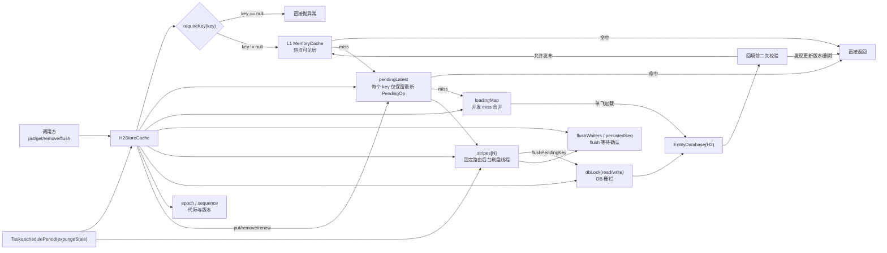
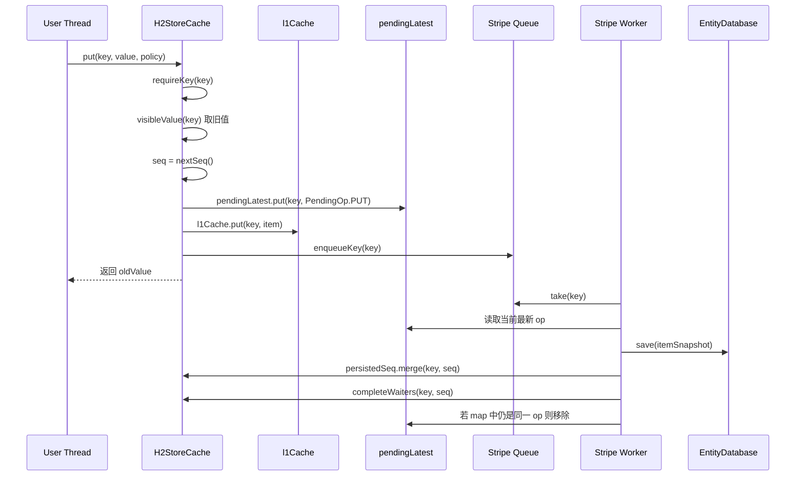
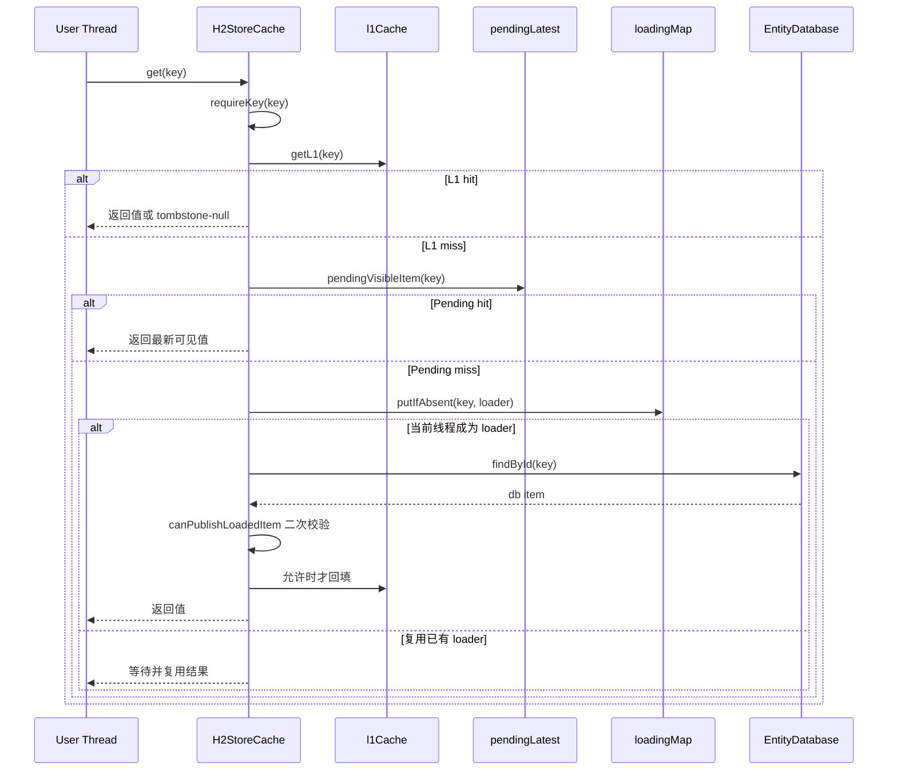

# H2StoreCache L1 弱一致高吞吐改造计划

## 模式
- 高性能模式
- Java 8 约束
- 目标：`弱一致 + 高吞吐 + 同 key 保序 + 默认热路径不阻塞 H2`

## 进度同步（2026-04-16）

- `[已完成]` 未复用 Guava `Striped`
  - 原因：当前目标不是“条带锁复用”，而是“固定路由 + 单线程刷盘 + flush 等待”。
  - 结论：直接在 `H2StoreCache` 内实现最小 stripe worker，避免额外搬运 Guava 代码和依赖面。
- `[已完成]` `H2CacheItem` 增加 `version` / `tombstone` 元数据
- `[已完成]` `H2StoreCache` 新增 `pendingLatest`、全局 `seq`、`epoch`、stripe worker、`flush/flush(key)/syncPut/syncRemove/fastRemove/pendingWriteCount`
- `[已完成]` 写路径切为 `L1 + pendingLatest + 异步 H2`
- `[已完成]` 读路径切为 `L1 -> pendingLatest -> H2 -> 回填前二次校验`
- `[已完成]` `remove` 改为 tombstone 路径，避免旧值回填复活
- `[已完成]` `renewAsync` 改为 `RENEW` 入同 key 顺序通道
- `[已完成]` `expungeStale` 改为扫描后转删除 op 入队
- `[已完成]` `clear` 增加 `epoch + dbLock(write)` 栅栏，防止旧轮次刷盘/回填污染新状态
- `[已完成]` 单元测试已补并通过
  - 覆盖点：L1 可见性、flush 语义、并发 miss+put / miss+remove、防旧值回填、删除与保存失败重试、prefixed 视图、续期入队
- `[已完成]` `loadingMap` 并发 miss 合并
  - 同 key 多线程 `get()` 在 `L1/pendingLatest` miss 时会共享同一个加载 future，避免重复 `findById` 打 H2。
  - `clear()` 会同时清理旧 epoch 的 `loadingMap`，避免旧轮次加载结果污染新状态。
- `[已完成]` 基础监控/可观测接口已暴露
  - 已有：`pendingWriteCount()`、`stripeCount()`、`pendingQueueSize()`、`l1CacheMaxSize()`、`l1EstimatedSize()`
  - 说明：这一步只补了进程内观测接口，完整指标上报仍需结合现有监控体系落地。
- `[已完成]` 轻量级平衡默认值
  - `DEFAULT_STRIPE_COUNT = 2`
  - `DEFAULT_L1_CACHE_MAX_SIZE = 2048`
  - `DEFAULT_EXPUNGE_PERIOD_MILLIS = 3min`
- `[已完成]` 生命周期闭合
  - `H2StoreCache` 已支持 `close()`
  - 会取消 `expungeTask`、中断 stripe worker、清理 waiters / pending / L1
- `[已完成]` stripe queue 去重降内存
  - 同一个 key 同一时刻只保留一个排队节点
  - 热 key 高频覆盖写不再把 queue 长度线性堆高
- `[已完成]` sliding renew 去重窗口收紧
  - 已有未落库 `PUT/RENEW` 时，后续 `get()` 只续期同一份快照，不再反复创建新的 `RENEW`
  - 若 renew 正在 worker 中刷库，会在刷完后最多补刷一次，避免把最新过期时间丢到 DB 之外
- `[已完成]` `entrySet()/iterator()` 改为稳定 `id` 排序分页
  - 当前分页查询已显式 `order by id asc`
  - `offset + limit` 至少建立在稳定顺序之上，跨页不再受 H2 默认返回顺序影响
- `[已完成]` `onExpired` 改为删除提交后触发
  - 过期路径会先把事件快照挂到 `REMOVE` op 上
  - 只有 stripe worker 成功完成删除提交后，才真正触发 `onExpired`

## 1. 背景与现状

当前 `H2StoreCache` 仍是 `L1 + 同步 H2` 模型：

- `putPhysicalKey()` / `fastPutPhysicalKey()` 先写 `l1Cache`，随后同步 `db.save()`
- `removePhysicalKey()` 会同步 `db.deleteById()`
- `get()` / `containsPhysicalKey()` 在 L1 miss 后直接查 DB，并在命中后回填 L1
- `expungeStale()` 直接删库
- `clear()` 直接 `l1Cache.clear() + db.truncateMapping()`
- `renewAsync()` 会直接异步 `db.save(item)`，它不受同 key 写序约束

这套模型的问题是：

- 写路径会把 H2 延迟直接传播到业务线程
- 热 key 高频更新会产生重复刷盘，写放大明显
- `get miss -> DB load -> 回填 L1` 与并发 `put/remove` 存在旧值回填风险
- `expungeStale()` 与并发写删除之间缺少统一顺序模型
- `renewAsync()` 可能绕过未来的异步写队列，破坏同 key 顺序

## 2. 目标语义

本次改造建议明确以下语义边界：

- 同进程内，`put/remove/fastPut` 返回后，后续 `get/containsKey` 立即可见
- H2 允许短暂落后于 L1；进程异常退出时，未刷盘脏数据允许丢失
- 同一个 key 的落盘顺序必须保序
- 不同 key 之间允许并行刷盘
- 默认热路径不等待 H2；需要强一致持久化时，显式调用 `flush()` / `flush(key)` / `syncPut()`

需要额外澄清的非热点 API 语义：

- `size()`、`entrySet()`、`asSet()`、`iterator()`、`containsValue()` 默认定义为“持久层视图”
- 这些 API 在异步刷盘窗口内允许落后于 L1
- 如果调用点要求“读到最新持久化状态”，先 `flush()` 再调用

这点必须写进接口注释或文档，否则业务方会默认它们仍是强一致读。

## 3. 总体设计

建议把 `H2StoreCache` 拆成三层状态：

- `l1Cache`
  - 继续承担热点读
  - 允许 eviction
  - 保存最新可见值，也保存短 TTL tombstone
- `pendingLatest`
  - `ConcurrentHashMap<Object, PendingOp>`
  - 保存“尚未刷到 H2 的该 key 最新操作”
  - 不受 L1 eviction 影响
  - 是同进程读一致性的兜底层
- `H2`
  - 最终持久层
  - 提供跨进程/重启后的恢复基础

整体原则：

- 读写以 L1 为先
- 脏写状态以 `pendingLatest` 为准
- H2 只负责最终追平，不再参与默认热路径同步写

## 3.1 当前实现结构图

下面这张图描述的是当前代码已经落地的主路径，而不是抽象概念图。



一句话概括：

- `L1` 负责“快”
- `pendingLatest` 负责“同进程最新真相”
- `stripe worker` 负责“异步刷库与同 key 保序”
- `dbLock + epoch` 负责“clear/刷盘/加载之间不串状态”

## 3.2 单 key 数据流

### put 路径



### get 路径



### remove 路径

- `remove/syncRemove/fastRemove` 不直接删 DB。
- 它们先构造 tombstone，写入 `pendingLatest + l1Cache`，随后异步由 worker 删除持久层。
- 这样做的根本目的，是阻止“DB 旧值在并发加载时又回填回 L1”。

## 3.3 为什么 queue 里只放 key，不放完整 op

这个点很关键，很多人第一次读会误判。

当前 stripe 队列只放 `physicalKey`，不是 `PendingOp`，原因是：

- 队列允许同一个 key 重复出现
- 真正刷哪一个版本，不由入队时决定，而由 worker 消费时读 `pendingLatest.get(key)` 决定
- 这样 `put(A1) -> put(A2) -> put(A3)` 即使队列里压了 3 次 `A`，worker 也只会看到最新 op

好处：

- 热 key 高频覆盖时天然合并
- 不需要在入队前做复杂去重
- 旧 op 不会因为排队太久而被错误持久化

代价：

- 队列里会有重复 key
- worker 每次取 key 都要重新读 `pendingLatest`

这个代价是值得的，因为它把复杂度从“队列去重”移到了“消费端只认最新版本”，更稳。

## 3.4 后台线程到底在做什么

当前实现里有两类后台线程。

### A. stripe worker

构造 `H2StoreCache` 时，会根据 CPU 数量创建固定个数的 `StripeState`：

- 每个 `StripeState` 内部持有一个 `LinkedBlockingQueue<Object>`
- 每个 `StripeState` 对应一个 daemon thread
- 线程名类似 `H2StoreCache-<cacheId>-stripe-<index>`

worker 主循环非常单纯：

```java
while (true) {
    flushPendingKey(queue.take());
}
```

也就是说：

- 队列空时线程阻塞等待
- 队列有 key 就顺序刷盘
- 同 stripe 内严格单线程串行

### B. 周期清理线程

构造时还会注册：

```java
Tasks.schedulePeriod(this::expungeStale, expungePeriod)
```

它不是直接删 DB，而是：

1. 周期扫描 DB 中已过期的行
2. 对每一行调用 `scheduleExpiredRemove`
3. 把删除转换成普通 `REMOVE` op 入相应 stripe

这样过期删除就被纳入了同一顺序模型，不会绕过写队列。

## 3.5 锁是怎么拆分的

这里不是传统的“一个大锁包住整个缓存”，而是把责任拆成几层。

### 第一层：无锁/低锁热点路径

这些结构是并发容器，热点路径主要靠它们：

- `l1Cache`
- `pendingLatest`
- `loadingMap`
- `persistedSeq`
- `flushWaiters`
- `renewingKeys`

特点：

- 读写线程直接并发访问
- 大多数 `put/get/remove` 不需要显式互斥锁
- 同 key 的语义更多依赖“最新值覆盖”和固定路由，而不是互斥锁

### 第二层：固定路由替代 per-key lock

当前没有为每个 key 单独加 `synchronized` 或 `ReentrantLock`。

同 key 保序依赖的是：

1. `stripeIndex(key)` 固定路由
2. 同一个 stripe 只有一个 worker 线程
3. worker 消费时只认 `pendingLatest` 里的最新 op

这本质上是“单 key 串行化执行”，但实现上不是显式 key 锁，而是“同 key 进入同一个单线程执行上下文”。

### 第三层：`dbLock`

`dbLock` 是 `ReentrantReadWriteLock`，这是当前实现里唯一显式的大锁，但它只保护 DB 交互和 `clear()` 栅栏，不保护所有内存状态。

#### `readLock` 保护什么

这些 DB 路径会进 `readLock`：

- `containsValue`
- `findPersistedItems`
- `countPersisted`
- `awaitLoad` 内部的 `findPersisted`
- `flushPendingKey` 内部真正的 `save/delete`

为什么 worker 刷盘也只拿 `readLock`：

- 因为这里允许多个普通 DB 读/写并发
- 但它们都必须与 `clear()` 的 `writeLock` 互斥

#### `writeLock` 保护什么

目前 `writeLock` 只在 `clear()` 使用。

`clear()` 会做这些事：

1. `epoch.incrementAndGet()`
2. `pendingLatest.clear()`
3. `loadingMap.clear()`
4. `persistedSeq.clear()`
5. `failAllWaiters(...)`
6. `renewingKeys.clear()`
7. `l1Cache.clear()`
8. `db.truncateMapping(...)`

你可以把它理解成：

- `readLock` 是“正常运行态的 DB 通行证”
- `writeLock` 是“管理操作 clear 的全停世界栅栏”

### 第四层：`epoch`

光有 `dbLock` 还不够，因为有些操作在你拿到 DB 结果时，内存世界可能已经换代了。

所以还需要 `epoch`：

- 每次 `clear()` 增加 `epoch`
- `PendingOp` 会记录创建时的 `epoch`
- `LoadResult` 也会记录读 DB 时的 `epoch`

后续所有关键路径都会核对：

- 当前 `op.epoch` 是否仍等于全局 `epoch`
- 当前 `readEpoch` 是否仍等于全局 `epoch`

一旦不相等，说明这是旧世界的结果，必须丢弃。

## 3.6 `flushPendingKey` 是整套实现的核心

如果你只读一个方法，建议重点读 `flushPendingKey`。

它做了 6 件关键事：

1. 从 `pendingLatest` 取当前 key 的 op
2. 校验这个 op 是否还是当前 `epoch`
3. 如果发现 map 中已是更高 `seq`，直接放弃当前刷盘
4. 如果 op 自己已经过期，把它转成删除路径
5. 在 `dbLock.readLock()` 内执行真正的 `save/delete`
6. 成功后更新 `persistedSeq`、唤醒 `flushWaiter`、尝试从 `pendingLatest` 移除自己

这里最容易学到的一点是：

- “刷盘成功”不等于“可以安全移除 pending”
- 只有当 `pendingLatest` 里还指向同一个 `seq` 时，才说明自己仍是最新 op
- 如果中途被更新版本覆盖，旧 op 虽然刷成功了，也不能误删新 op

## 3.7 `loadingMap` 怎么防止 DB 被打爆

`get()` 在 `L1` 和 `pendingLatest` 都 miss 后，才会走 DB。

如果没有 `loadingMap`，同一个冷 key 被 20 个线程同时访问时，会发生 20 次 `findById`。

当前实现的策略是：

- 第一个线程 `putIfAbsent(key, loader)` 成功，成为真正的 loader
- 其他线程拿到已有 `CompletableFuture`，直接等待它
- loader 完成后移除 `loadingMap` 项

这就是典型的 single-flight / request coalescing。

配合后面的 `canPublishLoadedItem`，它不仅减少 DB 压力，还避免 DB 旧值被多次回填。

## 3.8 `renewingKeys` 只是轻量去重，不是顺序保证

这个点也很容易误解。

`renewingKeys` 的作用只是：

- 当某个 sliding key 已经在做续期调度时，后续 `get()` 不重复生成大量 `RENEW` op

它不负责：

- 同 key 最终顺序
- 持久化互斥
- 跨线程严格排他

真正的顺序保证仍然来自：

- `PendingOp.seq`
- `pendingLatest` 最新覆盖
- stripe worker 固定路由串行消费

所以 `renewingKeys` 可以看成“续期风暴削峰器”，不要把它当成一致性主机制。

## 3.9 `flush` 为什么需要 `persistedSeq + flushWaiters`

`flush(key)` 的本质不是“强制立刻执行一次 save”，而是：

- 我要等到“当前这个 key 对应的最新 seq 已经真的刷到 DB”

为此当前实现拆成两层：

- `persistedSeq`
  - 记录每个 key 已确认落库的最大 seq
- `flushWaiters`
  - 记录正在等待某个目标 seq 的 future 队列

这样 worker 刷盘成功后，只要：

1. `persistedSeq.merge(key, op.seq, Math::max)`
2. `completeWaiters(key, op.seq)`

就能唤醒所有 `targetSeq <= op.seq` 的等待者。

这个设计比“每个 flush 都直接阻塞等某个线程对象”更松耦合，也更适合重复覆盖写。

## 3.10 当前一致性边界要怎么理解

当前实现里，有两类视图。

### 进程内最新可见视图

这类 API 优先看 `L1 + pendingLatest`：

- `get`
- `containsKey`
- `put/remove` 的返回旧值判断

它们追求的是“刚写完，自己立刻能读到”。

### 持久层视图

这类 API 直接看 DB：

- `size`
- `entrySet`
- `asSet`
- `iterator`
- `containsValue`

它们反映的是“已经落盘”的状态，不保证包含还在 `pendingLatest` 里的脏写。

这就是“弱一致”的真正落点。

## 3.11 `key != null` 为什么应该强限制

当前已经把所有外部 key 入口统一成 `requireKey(key)`。

原因不是代码洁癖，而是系统层面的简化：

- `physicalKey` 会参与 `hash64`
- 会进入 `pendingLatest`
- 会用于 stripe 路由
- 可能再被包成 `Tuple(keyPrefix, key)`

如果继续允许部分 API 对 `null key` 静默返回：

- 调用方会把“没写进去”和“写了个 null key”混为一谈
- 并发路径更难排障
- `entrySet/asSet/flush/remove/get` 语义会不一致

所以这里直接抛异常是更干净的契约。

## 3.12 `value == null` 为什么这次没有一起放开

这也是学习时要特别注意的一个工程现实。

从缓存抽象上看，`value == null` 未必不合理；但当前实现里 `H2CacheItem` 最终要进序列化链路，而现有 `JdkAndJsonSerializer` 对这里的 `null` 值并不兼容。

所以现在的真实情况是：

- `key == null`：明确禁止，直接抛异常
- `value == null`：不是 `H2StoreCache` 主动支持的语义，底层序列化链路当前也不支持

如果未来要支持 `null value`，比较稳的方式是：

- 在缓存层显式引入 `NULL_VALUE` 哨兵
- 落库时把它序列化为普通对象
- 读出时再还原成 `null`

不要直接把 `null` 裸值塞进当前持久化链路。

## 4. 核心数据结构

建议新增以下结构。

### 4.1 PendingOp

```java
final class PendingOp {
    final Object physicalKey;
    final long seq;
    final PendingOpType type;   // PUT / REMOVE / RENEW / CLEAR_BARRIER
    final H2CacheItem<Object, Object> itemSnapshot;
    final long epoch;
    final int retryCount;
    final long enqueueTime;
}
```

说明：

- `seq`：全局递增序号，使用 `AtomicLong`
- `type`：
  - `PUT`：普通写入
  - `REMOVE`：逻辑删除/tombstone
  - `RENEW`：滑动过期续期，必须进入同一顺序通道
  - `CLEAR_BARRIER`：`clear()` 管理栅栏，不走普通热路径
- `itemSnapshot`：
  - `PUT/RENEW` 保存完整快照
  - `REMOVE` 保存 tombstone 元数据或最小必要字段
- `epoch`：配合 `clear()` 做代际隔离

### 4.2 pendingLatest

```java
ConcurrentHashMap<Object, PendingOp> pendingLatest;
```

约束：

- 每个 key 只保留最新 op
- 旧 op 不在 map 中保留，靠 `seq` 判定是否已经过期
- 这是防止 L1 eviction 丢失 dirty 状态的关键结构

### 4.3 stripe 队列与 worker

```java
StripeState[] stripes;
```

每个 stripe 包含：

- 单线程 worker
- 一个 MPSC 队列，队列元素只放 `physicalKey`
- 队列允许重复 key

实现建议：

- 第一版不强绑某个队列库，优先“简单且可验证”
- 可选实现一：固定数量单线程 worker + `ConcurrentLinkedQueue<Object>`
- 可选实现二：若当前模块已有稳定单线程执行器抽象，则直接复用
- 核心不是队列库，而是“同 key 固定路由到同一 worker，并且 worker 单线程串行刷盘”

### 4.4 可选 loadingMap

```java
ConcurrentHashMap<Object, CompletableFuture<H2CacheItem<?, ?>>> loadingMap;
```

用途：

- 合并并发 miss
- 避免多个线程同时 `findPersisted(key)` 打爆 H2

这不是第一阶段必需项，但值得预留扩展点。

### 4.5 H2CacheItem 增强字段

建议为 `H2CacheItem` 增加一个持久化版本字段，例如：

```java
long version;
```

原因：

- `put(A1) -> put(A2)` 持久层主键相同，仅凭 key 无法区分新旧行
- `expungeStale()`、条件删除、flush 确认都需要版本信息
- `version = seq` 可以让“是否还是我看到的那一版”变成可校验条件

没有持久化版本，`expungeStale` 和 `clear` 周边竞态很难做干净。

## 5. 写路径计划

## 5.1 put / fastPut

建议调整为：

1. 生成全局递增 `seq`
2. 构造 `PendingOp(PUT)`
3. 先写 `pendingLatest`
4. 再写 `l1Cache`
5. 将 key 投递到所属 stripe 队列
6. 直接返回，不等待 DB

注意点：

- 同 key 最新值覆盖旧值，`pendingLatest` 天然做 key 级合并
- 队列允许 key 重复入队，consumer 刷盘时只看 `pendingLatest` 最新快照
- `put(A1) -> put(A2) -> put(A3)`，最终只需要持久化 `A3`

### put 返回旧值的处理

这里有一个兼容性取舍：

- `fastPut()` 保持纯热路径，不做 DB 旧值查询
- `put()` 如果必须保持“返回旧值”的现有语义，可以按以下顺序取旧值：
  - 先查 `l1Cache`
  - 再查 `pendingLatest`
  - 最后才查 DB

这样可以让高吞吐调用走 `fastPut()`，而需要旧值语义的调用接受冷路径 DB 读取成本。

## 5.2 remove

`remove()` 不应再是“删 L1 + 立即删 DB”，而应改成：

1. 生成 `seq`
2. 生成 `REMOVE` tombstone
3. 先写 `pendingLatest`
4. 再把 tombstone 写入 `l1Cache`
5. 入所属 stripe 队列
6. 直接返回

tombstone 规则：

- L1 tombstone 需要短 TTL，例如 5s ~ 30s，可配置
- tombstone 的作用不是长期存储，而是阻止 DB 旧值复活
- 即便 L1 tombstone 被淘汰，`pendingLatest` 仍然保底

### remove 返回旧值的处理

与 `put()` 一样建议区分：

- 默认 `remove()` 为兼容语义，可在 L1/pending/DB 三层读取旧值
- 增加 `fastRemove()` 或内部专用异步删除入口，避免热点删除强制查 DB

如果不拆分快慢路径，冷 key 删除依然可能把 DB 读压带回业务线程。

## 5.3 syncPut / syncRemove / flush

建议新增：

- `void flush()`
- `void flush(Object key)`
- `TV syncPut(TK key, TV value, CachePolicy policy)`
- `TV syncRemove(Object key)`
- `long pendingWriteCount()`

语义：

- `syncPut/syncRemove` 先走异步通道，再等待目标 `seq` 被持久化确认
- `flush(key)` 等待该 key 当前最新 `seq` 落盘
- `flush()` 等待所有 stripe 在某个屏障点之前的任务完成

这样把“强一致持久化”从默认热路径显式剥离出来。

## 6. 读路径计划

`get()` 与 `containsPhysicalKey()` 建议统一成：

1. 先查 `l1Cache`
2. 未命中则查 `pendingLatest`
3. 仍未命中才查 DB
4. DB 返回后，回填 L1 前做二次校验

### 6.1 L1 命中

- 普通值：直接返回
- tombstone：直接返回 null / false
- 已过期：
  - 不能再像现在这样直接删库
  - 应转成 `REMOVE` 或 `EXPIRE_REMOVE` 入同一刷盘通道

## 6.2 pendingLatest 命中

- `PUT`：直接返回快照值
- `REMOVE`：直接返回 null / false
- `RENEW`：返回快照值

这一步保证“同进程内写后立刻可见”，不依赖 L1 永不淘汰。

## 6.3 DB miss/load 回填

从 DB 读到值后，回填 L1 前必须做 double-check：

1. 再看一次 `pendingLatest`
2. 再看一次 `l1Cache`
3. 如果发现更高版本值或 tombstone，放弃这次回填

否则会出现：

- `get miss -> DB 读旧值`
- 同时另一个线程 `put/remove`
- DB 结果回来后把旧值回填到 L1，导致 stale read

### 建议校验条件

- 如果 `pendingLatest` 中存在该 key，直接放弃 DB 回填
- 如果 `l1Cache` 中已存在 tombstone 或更新版本，也放弃回填

第一版直接放弃即可，不需要复杂比较逻辑；后续如果想减少回填丢弃率，再引入更细版本判断。

## 7. 刷盘线程模型

核心目标是“同 key 保序，不同 key 并行”。

### 7.1 固定路由

```java
int stripe = spread(hash(physicalKey)) & (stripeCount - 1);
```

要求：

- stripe 数量固定，例如 4 或 8
- 同一个 key 永远路由到同一个 worker
- worker 单线程消费，不在 key 级再加锁

### 7.2 worker 刷盘逻辑

worker 从队列取到 key 后：

1. 读取 `pendingLatest.get(key)`
2. 如果不存在，跳过
3. 读取 op 当前快照
4. 按 `type` 刷 H2
5. 刷盘成功后，仅当 `pendingLatest` 里仍是同一个 `seq` 时才移除
6. 如果期间有新 op 覆盖，保留 map 中最新 op，等待后续重复入队再刷

这能保证：

- 热 key 多次写只落最后一版
- 旧 flush 完成不会误删新 op

### 7.3 H2 操作语义

- `PUT`：`db.save(itemSnapshot)`，并带上 `version = seq`
- `REMOVE`：按 key 删除，或按 `version <= seq` 的条件删除
- `RENEW`：本质上也是一次保存，必须携带最新过期时间与 `version`

如果底层 `EntityDatabase` 不支持条件删除，建议退化成：

- 先读当前 DB 行
- 仅在 `db.version <= removeSeq` 时执行删除

这条慢一些，但它只在 worker 线程执行，不影响默认热路径。

## 8. clear() 计划

`clear()` 不应走普通弱一致热路径，它是管理操作。

建议流程：

1. 进入全局 `clear epoch`
2. 暂停或栅栏化 stripe worker 接收旧 epoch 刷盘
3. `l1Cache.clear()`
4. `pendingLatest.clear()`
5. `db.truncateMapping(H2CacheItem.class)`
6. 发布新 epoch
7. 允许后续读写继续进入新 epoch

关键点：

- 所有 `get()` 的 DB 回填都要检查 epoch
- 如果读请求在旧 epoch 发起、在新 epoch 返回，必须放弃回填
- 否则 `clear()` 后旧值可能被 miss load 重新灌回 L1

`clear()` 本质是一次代际切换，不是普通的批量删除。

## 9. expungeStale() 计划

`expungeStale()` 不建议继续直接删库，应调整为“扫描 + 顺序删除”。

推荐做法：

1. 扫描 H2 中过期 key
2. 对每个 key 生成删除任务，进入所属 stripe
3. worker 再做最终条件删除

但这里有一个重要前提：

- 必须有 `H2CacheItem.version`
- 否则扫描到的“过期旧行”可能在你入队前已经被新值覆盖

因此建议：

- `expungeStale()` 扫描结果至少携带 `physicalKey + dbVersion + expiration`
- worker 删除前再次核对“DB 当前 version 是否仍是那版”
- 如果发现该 key 已有更高版本，直接跳过删除

否则会出现“过期扫描误删新值”的严重竞态。

## 10. sliding renew 计划

当前 `renewAsync()` 直接 `db.save(item)`，这条路径必须改。

原因：

- `get()` 触发续期时，如果同时有 `remove/put`
- 直接异步 `db.save()` 会绕过顺序通道
- 可能把已经删除的 key 又写回 DB

建议：

- `slidingRenew()` 只更新 L1 中的最新快照
- 按需生成 `RENEW` op 进入同 key stripe 队列
- `renewingKeys` 去重逻辑可以保留，但只用于“防止重复入队”，不再直接落 DB

## 11. API 一致性边界

改造后建议显式划分两类 API。

### 11.1 进程内立即可见 API

- `get`
- `containsKey`
- `put`
- `fastPut`
- `remove`
- `fastRemove`（建议新增）

### 11.2 持久层视图 API

- `size`
- `entrySet`
- `asSet`
- `iterator`
- `containsValue`

这类 API 默认反映 H2 已落盘状态，而不是“L1 最新状态”。

如果未来确实有“枚举也要包含 pendingLatest”的需求，建议另开一套显式接口，例如：

- `snapshotEntrySet()`
- `approximateSize()`

不要在现有 API 上偷偷改变语义。

## 12. 失败重试与背压

### 12.1 DB 失败处理

刷盘失败时：

- `pendingLatest` 不能移除
- 记录失败次数、最后异常、最后失败时间
- 由 worker 延迟重试
- 重试期间继续接受新写，新写可覆盖旧 op

这样即使：

- `put(A1)` 刷盘失败
- 紧接着 `put(A2)`

最终也只需要把 `A2` 刷成功即可。

### 12.2 队列积压与内存保护

风险点：

- DB 长时间变慢时，`pendingLatest` 和 stripe 队列会持续增长

建议：

- 暴露 `pendingLatest size`
- 暴露每个 stripe 队列长度
- 暴露 oldest pending age
- 达到阈值时打告警
- 不建议默认阻塞业务线程

如果后续确实需要降级策略，可考虑：

- 只对 `syncPut/syncRemove/flush` 做超时失败
- 默认 `fastPut/fastRemove` 继续接受，但持续上报告警

## 13. 实施步骤

建议分阶段落地，降低一次性改造风险。

### 阶段 1：最小可用骨架

- 为 `H2CacheItem` 增加 `version`
- 新增 `PendingOp`、`PendingOpType`
- 新增 `pendingLatest`
- 新增 stripe 队列与 worker
- 先把 `fastPut/remove` 改成异步追平

### 阶段 2：读路径修正

- `get/containsPhysicalKey` 改为 `L1 -> pending -> DB`
- 增加 DB load 前后二次校验
- 引入 tombstone

### 阶段 3：管理与过期语义

- `expungeStale()` 改成扫描后入队删除
- `renewAsync()` 改成 `RENEW` 入队
- `clear()` 加 epoch 栅栏

### 阶段 4：强制持久化能力

- 增加 `flush() / flush(key) / syncPut() / syncRemove()`
- 增加 pending backlog 监控

### 阶段 5：并发 miss 合并

- 增加 `loadingMap`
- 合并冷 key 并发 DB load

## 14. 测试计划

本次改造属于缓存一致性与并发模型变更，建议至少补充单元测试；如改动进入主分支，建议再补一轮集成测试。

### 14.1 单元测试

- `get miss + concurrent put`：不得旧值回填
- `get miss + concurrent remove`：不得幽灵复活
- `put/put` 同 key：最终只刷最新值
- `remove/put` 交叉：最终顺序正确
- `renew + remove`：续期不得把已删除 key 写回 DB
- `expunge + put`：不得误删新值
- `DB save/delete` 失败：`pendingLatest` 不丢，后续可重试
- `clear()` 后：旧 epoch 的 DB load 不得回填
- `flush(key)`：仅等待目标 key 当前 seq 成功落盘
- `size/entrySet`：在未 flush 前允许落后，flush 后与 DB 一致

### 14.2 集成测试

- 真实 H2 环境下热 key 高频覆盖写
- H2 注入慢盘/失败后 backlog 积压与恢复
- 进程内多线程并发 `get/put/remove/clear`
- 长时间运行后的 pending 队列回落情况

## 15. 监控建议

必须至少补这些指标：

- `pendingLatest.size`
- `pendingLatest.approxBytes`
- `stripe.queue.size`
- `stripe.flush.latency`
- `stripe.flush.fail.count`
- `stripe.flush.retry.count`
- `oldestPendingAge`
- `l1.hitRate`
- `l1.eviction.count`
- `tombstone.count`
- `flush.wait.latency`
- `jvm.heap.used`
- `jvm.heap.max`
- `netty.directMemory.used`（进程内若已启用 Netty 池化堆外内存，必须一起观测）

说明：

- 当前缓存本身主要吃堆内，但本仓是高性能网络项目，排障时必须同时看堆外内存
- 否则容易把“缓存积压”和“网络直接内存上涨”混在一起误判

## 16. 结论

基于当前 `H2StoreCache` 的代码结构，建议采用：

- `L1 先行可见`
- `pendingLatest 保底 dirty 状态`
- `H2 异步追平`
- `同 key stripe 单线程保序`
- `remove/expire 使用 tombstone 或条件删除防旧值复活`
- `clear/renew/expunge` 全部纳入统一顺序模型或代际栅栏

这是当前代码最容易演进、同时最符合“弱一致 + 高吞吐”目标的方案。

如果后续进入实现阶段，我建议先做“阶段 1 + 阶段 2”，先把默认热路径从同步 H2 中摘出来，再处理 `clear/expunge/renew` 这些边界操作。

## 17. 最新 Review 问题（2026-04-17）

下面这些问题是基于当前 [H2StoreCache.java](D:/projs_r/rxlib/rxlib/src/main/java/org/rx/core/cache/H2StoreCache.java) 已实现代码做的增量 review。  
它们不是“理论风险”，而是当前实现里仍然存在、后续值得继续收口的点。

### 17.1 生命周期未闭合：worker 线程与定时任务缺少显式释放

状态：`已处理`

现状：

- 每个 `H2StoreCache` 实例都会创建 `stripeCount` 条 daemon worker 线程
- 同时还会创建一个周期性的 `expungeTask`
- 当前类没有 `close()/dispose()`，也没有统一 shutdown 入口

对应代码点：

- `StripeState` 创建线程 [H2StoreCache.java](D:/projs_r/rxlib/rxlib/src/main/java/org/rx/core/cache/H2StoreCache.java:91)
- `scheduleExpungeTask()` 注册周期任务 [H2StoreCache.java](D:/projs_r/rxlib/rxlib/src/main/java/org/rx/core/cache/H2StoreCache.java:1079)

问题：

- 短生命周期实例会残留后台线程和定时任务
- 单元测试、大量临时 cache、热重建场景下会形成资源泄漏
- 这与“轻量级、低内存占用”的目标直接冲突

建议方案：

- 让 `H2StoreCache` 实现 `AutoCloseable` 或复用现有 `Disposable`
- `close()` 中至少做：
  - `expungeTask.cancel(false)`
  - 标记 worker 退出
  - `worker.interrupt()`
  - 可选：先 `flush()` 再退出
- `DEFAULT` 单例可以继续常驻，但显式 new 出来的实例必须可释放

### 17.2 queue 是无界的，而且同 key 会重复入队，慢盘时容易放大内存占用

状态：`已处理`

现状：

- stripe 内部使用 `LinkedBlockingQueue<Object>`
- 队列元素只放 `key`
- 设计上允许同一个 key 重复入队

对应代码点：

- 无界队列 [H2StoreCache.java](D:/projs_r/rxlib/rxlib/src/main/java/org/rx/core/cache/H2StoreCache.java:91)
- `enqueueKey()` 直接 `offer(key)` [H2StoreCache.java](D:/projs_r/rxlib/rxlib/src/main/java/org/rx/core/cache/H2StoreCache.java:726)

问题：

- `pendingLatest` 虽然只保留最新 op，但 queue 仍可能堆很多重复 key
- DB 变慢、失败重试、热点 key 高频覆盖写时，队列长度会持续增长
- 当前新增的 `pendingQueueSize()` 只能观测，不能阻止膨胀

建议方案：

- 每个 stripe 增加一个 `queuedKeys` 集合
- 只有 `queuedKeys.add(key)` 成功时才真正入队
- worker 在完成一次 `flushPendingKey(key)` 后再 `queuedKeys.remove(key)`
- 如果 worker 发现该 key 期间又有新 op，可在出队尾声再次补一次 `offer`

这样可以把“每个 key 同一时刻至多一个队列节点”作为硬约束，显著降低内存波动。

### 17.3 `renewingKeys` 只覆盖入队瞬间，热点 sliding key 仍可能产生续期写放大

状态：`已处理`

现状：

- `scheduleRenew()` 用 `renewingKeys.add(key)` 做瞬时去重
- 但在方法 `finally` 中会立即 `renewingKeys.remove(key)`
- 此时续期 op 可能还在 queue 里，甚至还没真正刷库

对应代码点：

- `scheduleRenew()` [H2StoreCache.java](D:/projs_r/rxlib/rxlib/src/main/java/org/rx/core/cache/H2StoreCache.java:693)
- `finally` 中立即移除 [H2StoreCache.java](D:/projs_r/rxlib/rxlib/src/main/java/org/rx/core/cache/H2StoreCache.java:715)

问题：

- 热点 sliding key 如果被连续 `get()`，在前一个 `RENEW` 还未落库时，仍可能再次生成新的 `RENEW`
- 语义上仍然正确，但会重新引入续期写放大

建议方案：

- 不要在 `scheduleRenew()` 返回时立刻移除 `renewingKeys`
- 改成在该 key 的 `RENEW` op 真正刷盘完成，或被更新的 `PUT/REMOVE` 覆盖时再释放
- 更进一步，可以直接把“是否已有未完成 renew”并入 `PendingOp` 状态判断，而不是靠独立 set

### 17.4 `entrySet()/iterator()` 的分页遍历缺少稳定排序，存在跳项/重复风险

状态：`已处理`

现状：

- `EntrySetView.itemIterator()` 用 `offset + limit` 分页读 DB
- `newQuery()` 只拼过滤条件，没有显式排序

对应代码点：

- `itemIterator()` [H2StoreCache.java](D:/projs_r/rxlib/rxlib/src/main/java/org/rx/core/cache/H2StoreCache.java:216)
- `newQuery()` [H2StoreCache.java](D:/projs_r/rxlib/rxlib/src/main/java/org/rx/core/cache/H2StoreCache.java:259)

问题：

- 没有 `order by` 时，分页结果顺序本身就不稳定
- 再叠加异步刷盘窗口，跨页遍历可能跳项或重复
- 这会让 `entrySet(prefix, offset, size)` 的结果比文档里的“弱一致”更难推断

建议方案：

- 至少加稳定排序，例如按 `id` 或 `version` 升序
- 如果后续要支持大规模稳定遍历，最好从 `offset + limit` 升级为“基于游标/上次 id”的 seek pagination

当前实现：

- `newQuery()` 已追加 `orderBy(H2CacheItem::getId)`
- 这一步先保证“同一批数据分页顺序稳定可推断”
- 后续如果数据量再上去，仍建议升级成 seek pagination，避免大 offset 扫描成本

### 17.5 `onExpired` 事件触发早于持久层删除完成，监听方可能看到“事件先于事实”

状态：`已处理`

现状：

- `scheduleExpiredRemove()` 在安装 `REMOVE` op 成功后，会立即 `raiseEvent(onExpired, ...)`
- 但此时真正的 DB 删除还在后续 stripe worker 中

对应代码点：

- `scheduleExpiredRemove()` [H2StoreCache.java](D:/projs_r/rxlib/rxlib/src/main/java/org/rx/core/cache/H2StoreCache.java:678)

问题：

- 监听方如果把 `onExpired` 理解成“已经从持久层删除完成”，会产生语义误判
- 当前事件更接近“已判定过期并已入删除通道”，不是“删除已提交完成”

建议方案：

- 二选一：
  - 把事件语义明确改名/改文档，说明它只是“过期删除已调度”
  - 或增加一个真正的 `onExpiredCommitted`，由 worker 刷盘成功后触发

当前实现：

- 采用“保持原事件名，但把触发点后移”的方案
- `scheduleExpiredRemove()` 只负责把过期键转成 `REMOVE` op，并记录一份事件快照
- `flushPendingKey()` 在删除提交成功后才触发 `onExpired`
- 如果删除因为更高版本数据而被跳过，则不会误发过期事件

## 18. 下一步建议顺序

本轮 review 列出的剩余问题已经全部收口，当前这套模型的状态可以归纳为：

1. 生命周期已闭合，临时实例可安全释放
2. queue 已去重，热点 key 不会再把待刷队列线性堆高
3. renew 写放大已压缩到“在途最多补刷一次”
4. `entrySet()/iterator()` 已具备稳定分页顺序
5. `onExpired` 已和删除提交点对齐

如果后续继续演进，我建议优先看这两个方向：

1. 把 `offset + limit` 升级成 seek pagination，进一步降低大页遍历成本
2. 把当前进程内观测接口接入正式监控，持续跟踪：
   - L1 命中率
   - `pendingWriteCount`
   - 每个 stripe 的 `pendingQueueSize`
   - H2 连接池等待时间
   - 堆外内存占用
