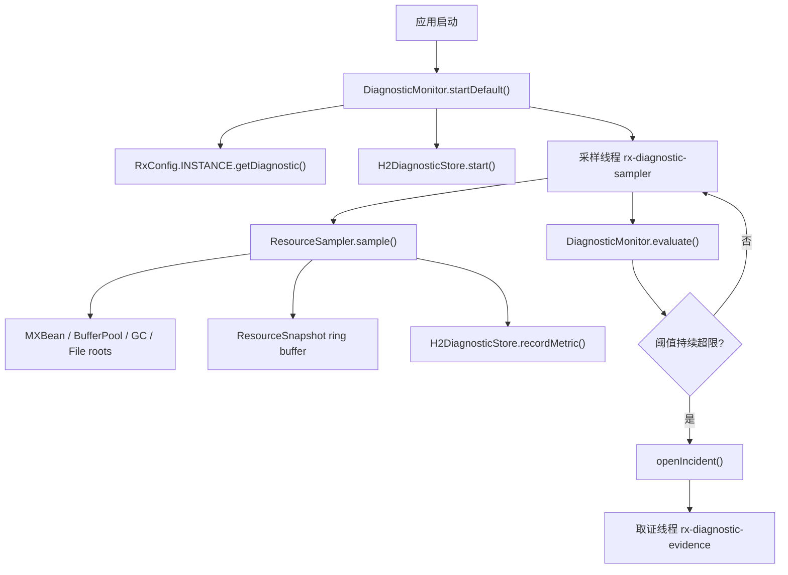
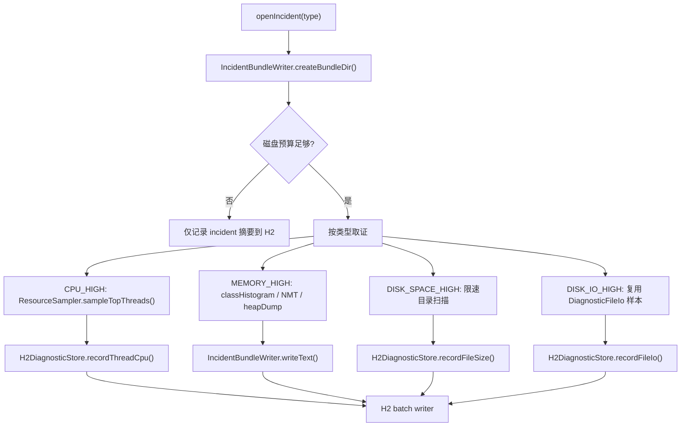
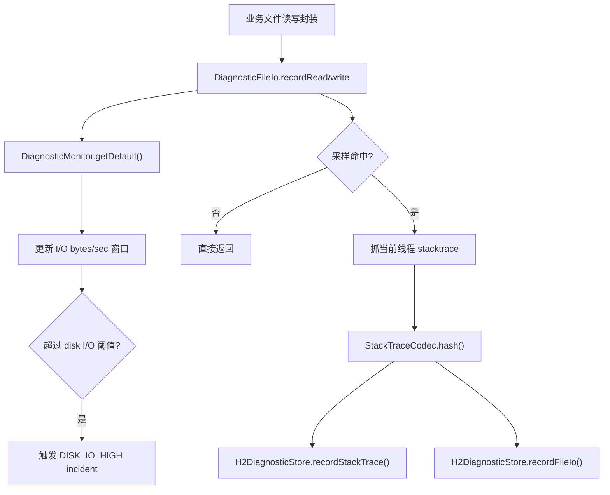
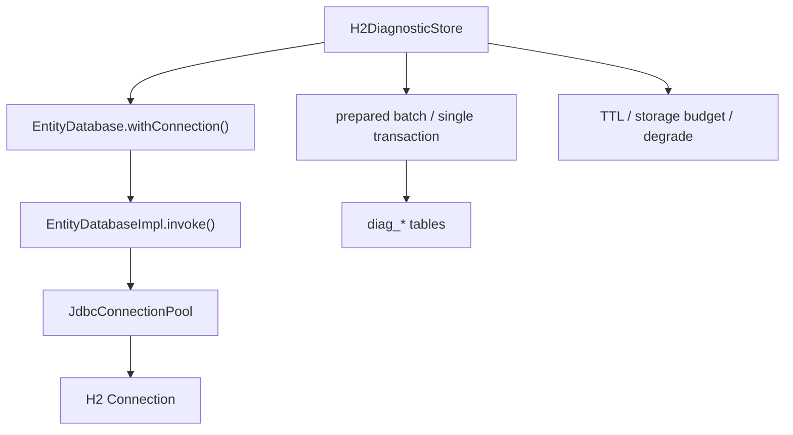

# 生产问题 StackTrace 监控模块计划

## 模式

- 高性能模式
- Java 8 约束
- 目标：在尽可能低的常态开销下，尽可能快速定位生产环境 CPU、内存、磁盘容量、磁盘读写异常对应的问题代码路径。
- 核心策略：常态低频采样 + 内存环形缓冲 + 异常触发升档取证 + H2 轻量索引化存储。

## 进度同步（2026-04-19）

- `[已完成]` 新增独立诊断包 `org.rx.diagnostic`
  - 当前实现不依赖 Spring，不改动旧 `CpuWatchman` / `Sys.Info` / `H2StoreCache` 等既有逻辑，便于后续逐步替换旧监控相关代码。
  - 主要类：`DiagnosticMonitor`、`RxConfig.DiagnosticConfig`、`ResourceSampler`、`H2DiagnosticStore`、`DiagnosticFileIo`、`JvmDiagnosticSupport`。
- `[已完成]` 配置整合进 `RxConfig`
  - 原独立 `DiagnosticConfig` 已整合为 `RxConfig.DiagnosticConfig`。
  - 诊断模块统一通过 `RxConfig.INSTANCE.getDiagnostic()` 获取默认配置。
  - `app.diagnostic.*` 系统属性仍保持不变，支持现有配置键继续生效。
  - 诊断 H2 文件与 incident 证据目录默认放在当前工作目录 `./`，避免默认写入系统临时目录导致生产排查路径不明确。
- `[已完成]` 使用 Lombok 精简诊断类
  - `DiagnosticMetric`、`ThreadCpuSample`、`ResourceSnapshot` 等数据类已用 Lombok 生成 getter / 构造器。
  - `DiagnosticMonitor`、`H2DiagnosticStore` 已改用 Lombok 日志注解，减少模板代码。
- `[已完成]` 常态轻量采样 MVP
  - 已覆盖进程 CPU、系统 CPU、线程数、Heap、Non-Heap、MemoryPool、Metaspace、Direct Buffer、Mapped Buffer、GC、物理内存、文件描述符、磁盘分区空间。
  - 采样线程独立运行，不进入 Netty EventLoop。
- `[已完成]` 异常触发与升档取证 MVP
  - CPU 高：通过 `ThreadMXBean#getThreadCpuTime()` 做 TopN 线程 CPU delta 采样，并抓取热点线程 stacktrace。
  - 内存高：已具备 Heap、Direct Buffer、Metaspace 阈值触发，异常时可尝试 class histogram、NMT summary、heap dump。
  - 磁盘容量高：已通过分区剩余空间触发，并支持限深、限数量、限时目录扫描，记录文件大小 TopN。
  - 磁盘读写高：已通过应用层 `DiagnosticFileIo` 入口按 bytes/sec 触发，并记录读写路径、字节数、耗时、stack hash。
- `[已完成]` H2 异步索引化存储 MVP
  - 已实现有界队列、单写线程、批量写入、flush 屏障、基础 TTL 清理、丢弃计数。
  - H2 只保存指标、事件、stacktrace、incident 和证据路径索引，不保存 heap dump / JFR 等大文件。
  - `H2DiagnosticStore` 已复用 `EntityDatabase` 底层连接池、连接生命周期和慢 SQL 日志能力，不再直接使用 `DriverManager` 创建连接。
  - `H2DiagnosticStore` 已移除重复的 `Class.forName("org.h2.Driver")`，H2 driver 由 `EntityDatabaseImpl` 统一加载。
- `[已完成]` 内置只读诊断页面 MVP
  - `HttpServer.requestDiagnostic()` 默认注册 `/rx-diagnostic`，也支持指定路径。
  - `RxConfig` 增加 `app.net.httpServerPort` / `app.net.httpServerTls`，配置端口后会初始化并复用全局默认 `HttpServer` 实例，避免多个模块各自占用端口。
  - 页面通过 Basic Auth 保护，用户名固定 `rxlib`，密码使用 `RxConfig.rtoken`。
  - 页面查询 H2 的 incident、metric、thread CPU、file I/O、file size、stacktrace，兼容移动端布局。
  - 页面壳已迁移到 `src/main/resources/rx-diagnostic.html`，由 `HttpServer.renderHtmlTemplate(...)` 基于 `${name}` 变量做简易模板渲染。
  - H2 查询通过 `requestAsync` 下放后台线程，避免阻塞 Netty EventLoop。
- `[已完成]` JDK 8 / JDK 17 兼容方向
  - 代码语法保持 Java 8。
  - JFR、class histogram、NMT、thread dump 通过 `com.sun.management:type=DiagnosticCommand` MBean 运行时探测，不直接依赖 JDK 17 的 `jdk.jfr` API。
  - CPU/内存指标优先走公开 MXBean 接口，降低 JDK 17 模块反射限制风险。
- `[已完成]` 基础测试
  - 新增 `DiagnosticMonitorTest`。
  - 已验证 stack hash 稳定性、默认诊断目录、EntityDatabase 底层批处理、H2 异步落库、文件 I/O 采样落库、磁盘 I/O 高触发 incident。
  - 已执行：`mvn -pl rxlib "-Dtest=org.rx.diagnostic.DiagnosticMonitorTest" test`，当前结果 8 个测试通过。
- `[未完成]` Netty / rxlib 网络运行指标接入
  - 当前还没有接入连接数、吞吐、延迟、Channel 写水位、pending write bytes、EventLoop 队列积压。
  - 后续需要从 `transport` / `socks` / `rpc` / `http` 等网络模块按低侵入方式补指标。
- `[已完成]` 生产级磁盘保护 MVP
  - 已避免磁盘容量 incident 时启动 JFR，避免加剧磁盘满。
  - 已补 H2 最大体积限制、证据目录最大体积限制、证据写文件前可用空间预算。
  - 已补 JFR / class histogram / heap dump 的磁盘预算与重型取证 cooldown。
  - 已补 H2 写失败降级：失败后短时间丢弃低优先级样本，仅保留 incident / flush，避免事故期间反复打 H2。
- `[未完成]` 完整故障演练
  - 当前只做了小范围单元测试。
  - 仍需补 CPU busy loop、Heap 保留、Direct Buffer 分配、临时目录快速写入、高频文件读写、H2 慢写/异常等集成测试。
- `[已完成]` 生产保护补充测试
  - 新增 H2 写失败降级测试。
  - 新增证据目录磁盘预算不足时跳过 bundle 创建测试。
  - 已执行：`mvn -pl rxlib "-Dtest=org.rx.diagnostic.DiagnosticMonitorTest" test`，结果 8 个测试通过。
- `[已完成]` `H2DiagnosticStore` 与 `EntityDatabase` 底层复用
  - `EntityDatabase` 新增受控低层入口：`withConnection(...)` 与 `executeBatch(...)`。
  - `EntityDatabaseImpl` 已实现直接 JDBC URL 模式，测试可继续使用 `jdbc:h2:mem:`，文件模式继续复用原 H2 连接池配置。
  - `H2DiagnosticStore` 复用 `EntityDatabase` 连接池和连接生命周期，但仍保留自有 prepared batch、单事务提交、容量裁剪和失败降级逻辑。
  - 仍不复用 `EntityDatabase.save()` / entity mapping，避免诊断事故路径引入反射映射、逐行保存和额外对象分配。

## 1. 背景与目标

生产环境常见资源异常可以分为四类：

- CPU 占用高：需要快速定位高 CPU 线程与热点调用栈。
- 内存占用高：需要定位 Heap、Old Gen、Metaspace、Direct Buffer、Mapped Buffer、Native Memory 的异常增长来源。
- 磁盘容量占用高：需要定位哪些目录/文件增长异常，以及尽可能还原写入来源调用栈。
- 磁盘读写高：需要定位高频读写文件、读写字节数、读写延迟，以及尽可能关联调用栈。

模块目标不是替代专业 APM，而是在业务进程内部提供一套可控、低依赖、低侵入的本地诊断能力：

- 默认情况下保持极低开销。
- 异常发生时自动短时间升档，允许消耗更多资源换取诊断证据。
- 证据优先用于定位问题代码，而不是长期保存全量监控数据。
- 任何采集、落库、扫描、dump 行为都不得运行在 Netty EventLoop 热点路径上。

## 2. 能力边界

### 2.1 CPU 高

CPU 高是 JDK 原生能力最适合处理的场景。

- 可通过 `ThreadMXBean#getThreadCpuTime()` 计算线程 CPU 增量。
- 可对 TopN 高 CPU 线程抓取 stacktrace。
- 可连续多次采样后按栈 hash 聚合，得到稳定热点调用链。
- 可辅以 `jcmd Thread.print` 或进程内完整线程 dump。

结论：CPU 高可以用纯 JDK 8 做到较高可用度。

### 2.2 内存高

内存高分两层：

- 当前谁占内存：JDK 8 可以通过 Memory MXBean、BufferPool MXBean、class histogram、heap dump 较好定位。
- 当初谁分配内存：需要提前开启采样能力，典型方式是 JFR allocation 事件或应用层分配埋点。

结论：

- 不开 JFR 时，能定位对象类型、内存池、线程状态，但不能可靠还原历史分配 stacktrace。
- 开 JFR 或采样埋点后，可以更接近“分配来源调用栈”。
- `heap dump` 成本较高，只能作为严重级别取证手段。

### 2.3 磁盘容量占用高

磁盘容量高表示“空间被占用”，不是一个天然带 stacktrace 的运行时事件。

- JDK 可以监控分区可用空间、目录大小、文件增长趋势。
- 事后发现磁盘满，不能从文件本身反推出历史写入 stacktrace。
- 需要提前记录文件写入事件，异常时按文件路径、调用栈、写入字节数聚合。

结论：容量高必须依赖提前采样写入来源，或者在关键文件写入入口做轻量埋点。

### 2.4 磁盘读写高

磁盘读写高表示运行时 I/O 行为异常。

- JFR File Read / File Write 事件可以直接关联调用栈。
- 如果 JFR 不可用，只能通过应用层文件 I/O 包装器采样记录。
- JDK 标准 MXBean 对进程级磁盘 I/O 吞吐支持有限，跨平台能力不足。

结论：磁盘读写高优先使用 JFR；JFR 不可用时，需要业务侧统一文件 I/O 入口或采样包装。

## 3. 总体架构

```text
ResourceSampler
    |
    v
InMemoryRingBuffer  ---> TriggerEngine ---> EvidenceCollector
    |                       |                    |
    |                       |                    v
    |                       |              IncidentBundle
    v                       |
H2AsyncWriter <-------------+
```

核心组件：

- `ResourceSampler`：常态轻量指标采集。
- `InMemoryRingBuffer`：保存最近一段时间的指标和少量事件，避免每次采样都立即写 H2。
- `TriggerEngine`：基于阈值、持续时间、增长速率、cooldown 判断是否升档。
- `EvidenceCollector`：异常时抓线程栈、class histogram、heap dump、JFR、目录快照等证据。
- `H2AsyncWriter`：单线程批量写 H2，带队列上限和降级策略。
- `IncidentBundle`：一次异常事件的证据包目录，H2 只保存索引和摘要。

线程模型：

- 采样线程：低优先级、低频运行。
- 取证线程：独立线程池，限制并发数，严禁占用 I/O 线程。
- H2 写线程：单线程批量写，避免多线程抢 H2 锁。
- 目录扫描线程：独立限速，磁盘异常时优先降级。

## 3.1 代码入口与类交互

### 3.1.1 推荐入口

- 默认启动入口：`DiagnosticMonitor.startDefault()`
  - 读取 `RxConfig.INSTANCE.getDiagnostic()`。
  - 适合应用启动阶段显式调用。
- 默认查看入口：`HttpServer.requestDiagnostic()` / `HttpServer.requestDiagnostic("/path")`
  - 基于现有 `HttpServer` 注册只读 HTML 页面。
  - Basic Auth 用户名固定为 `rxlib`，密码为 `RxConfig.INSTANCE.getRtoken()`。
  - 内部使用 async handler 读取 H2，避免阻塞 Netty EventLoop。
- 全局 HTTP Server 入口：`HttpServer.getDefault()`
  - 配置 `app.net.httpServerPort` 大于 0 后自动初始化。
  - TLS 由 `app.net.httpServerTls` 控制，默认 false。
  - 首次初始化后固定复用同一个实例，避免重复占用端口，也避免运行中被其他模块改端口。
- 自定义启动入口：`new DiagnosticMonitor(config).start()`
  - 适合测试、临时诊断或隔离 H2 存储。
  - `config` 类型为 `RxConfig.DiagnosticConfig`。
- 文件 I/O 埋点入口：`DiagnosticFileIo.recordRead(...)` / `DiagnosticFileIo.recordWrite(...)`
  - 适合文件读写封装层、日志/缓存/导出等关键文件路径。
  - 默认按采样率记录 stacktrace，异常升档时提高采样率。
- 关闭入口：`DiagnosticMonitor.close()`
  - 停止采样线程、取证线程和 H2 写线程。

### 3.1.2 核心类职责

- `RxConfig.DiagnosticConfig`：统一配置入口，承载 `app.diagnostic.*` 配置。
- `DiagnosticMonitor`：模块门面，负责启动、采样调度、阈值触发、incident 生命周期。
- `ResourceSampler`：采集 MXBean、BufferPool、GC、磁盘分区、TopN 线程 CPU。
- `H2DiagnosticStore`：有界队列、单写线程、批量 H2 落库、TTL、容量保护、失败降级。
- `DiagnosticFileIo`：应用层文件读写采样入口，解决磁盘容量/读写问题的 stacktrace 归因。
- `DiagnosticHttpHandler`：基于 `HttpServer` 的只读 H2 查看页面，负责 Basic Auth、HTML 渲染和移动端布局。
- `IncidentBundleWriter`：incident 证据目录创建、文本证据写入、目录容量保护。
- `JvmDiagnosticSupport`：JFR、thread dump、class histogram、NMT、heap dump 的能力探测与调用。
- `DiagnosticFileSupport`：H2 文件大小、证据目录大小、可用空间预算、受限目录裁剪。

### 3.1.3 启动与采样交互图



### 3.1.4 异常取证交互图



### 3.1.5 文件 I/O 采样交互图



### 3.1.6 H2 存储与 EntityDatabase 复用结论

当前 `H2DiagnosticStore` 已复用 `EntityDatabase` 的底层 JDBC 能力，但不复用高层实体 API。

已实现：

- `EntityDatabase` 增加 `withConnection(BiAction<Connection>)`、`withConnection(BiFunc<Connection, T>)`、`executeBatch(sql, argsList)`。
- `EntityDatabaseImpl` 增加直接 JDBC URL 模式，支持诊断测试继续使用 `jdbc:h2:mem:`。
- `H2DiagnosticStore` 通过 `EntityDatabase.withConnection(...)` 初始化 schema、批量写入、TTL 清理和容量裁剪。
- `H2DiagnosticStore` 关闭时同步关闭底层 `EntityDatabase`，避免连接池泄漏。

保留边界：

- 诊断写入是事故期间的保护路径，优先级是低分配、批量写、可丢弃、可降级。
- `EntityDatabase.save()` 路径存在反射、字段映射、序列化和逐行写入成本，暂不进入诊断写入路径。
- `withConnection(...)` 是内部低层组件复用入口，不建议业务代码绕过事务模型直接使用。



## 4. 运行级别

### 4.1 `OFF`

完全关闭模块。

适用场景：

- 极致低延迟环境。
- 对额外线程、文件、JMX 访问完全不接受的场景。

### 4.2 `LIGHT`

默认推荐级别。

行为：

- 低频采集基础指标。
- 不抓完整线程栈。
- 不开启昂贵 dump。
- 文件写入来源默认关闭或极低比例采样。
- 数据先写内存环形缓冲，再批量落 H2。

目标常态开销：

- CPU：尽量低于 0.5%。
- 内存：固定上限，默认几 MB 到几十 MB 内。
- 磁盘：批量写，按 TTL 和最大体积滚动清理。

### 4.3 `DIAG`

异常自动升档级别。

行为：

- CPU 异常时连续采 TopN 线程 CPU 和栈。
- 内存异常时抓内存池、BufferPool、GC、class histogram。
- 磁盘容量异常时抓 FileStore、目录 TopN、近期写入事件聚合。
- 磁盘读写异常时开启 JFR File I/O 或应用层 I/O 采样。

推荐持续时间：

- 30 秒到 120 秒。
- 同类 incident 必须有 cooldown。

### 4.4 `FORENSIC`

严重异常取证级别。

行为：

- 触发 heap dump。
- dump JFR 最近窗口。
- 触发 Native Memory Tracking 查询。
- 生成完整 thread dump。
- 保存完整 incident bundle。

限制：

- 必须限频。
- 必须限制并发。
- 必须预估磁盘可用空间。
- 磁盘容量异常时默认禁止 heap dump，除非明确配置允许。

## 5. 采集能力设计

### 5.1 基础指标

常态建议采集：

- 进程 CPU 使用率。
- 系统 CPU 使用率。
- 线程数、Daemon 线程数、峰值线程数。
- TopN 线程 CPU 增量，仅保存线程 id、线程名、CPU delta。
- Heap used / committed / max。
- Old Gen used / committed / max。
- Metaspace used / committed / max。
- Non-Heap used / committed。
- Direct Buffer count / memory used / total capacity。
- Mapped Buffer count / memory used / total capacity。
- GC 次数、GC 时间、最近 GC 变化量。
- 文件描述符数量，Unix 环境可通过 `UnixOperatingSystemMXBean` 获取。
- 磁盘分区 total / usable / unallocated。
- 业务目录大小和文件数量的低频快照。

网络项目额外建议指标：

- 当前连接数。
- 入站/出站吞吐。
- P50 / P95 / P99 延迟。
- Netty pending write bytes。
- Channel 写水位状态。
- EventLoop 任务队列积压。
- 堆外内存占用。

### 5.2 CPU StackTrace 取证

触发条件示例：

- 进程 CPU 使用率大于 80%，持续 30 秒。
- 单线程 CPU 增量持续进入 TopN。
- 系统 CPU 高但进程 CPU 低时，只记录系统维度，不做深度 JVM 取证。

取证流程：

1. 进入 `DIAG`。
2. 每 200 到 500ms 采样一次线程 CPU delta。
3. 选取 TopN 线程调用 `ThreadMXBean#getThreadInfo()` 获取调用栈。
4. 对调用栈计算 hash，聚合出现次数、CPU delta、线程名。
5. 持续 30 到 120 秒。
6. 输出 CPU incident summary。

注意事项：

- 不要常态抓全量线程栈。
- 不要对所有线程高频 dump。
- 线程名可能变化，聚合主键应以栈 hash 为主。
- 如果线程很多，TopN 计算要避免过多对象分配。

### 5.3 内存取证

触发条件示例：

- Old Gen 使用率大于 85%，持续 60 秒。
- Heap 使用率持续增长且 GC 后不回落。
- Direct Buffer 使用量超过阈值。
- Metaspace 持续增长。
- Full GC 频率异常。

取证流程：

1. 进入 `DIAG`。
2. 记录所有 MemoryPool 快照。
3. 记录 BufferPool 快照，特别是 Direct 和 Mapped。
4. 抓取 GC 增量和线程状态。
5. 触发 class histogram，优先使用 `jcmd GC.class_histogram` 或 DiagnosticCommand。
6. 如果 JFR 可用，开启或 dump allocation 相关事件。
7. 严重时进入 `FORENSIC` 触发 heap dump。

注意事项：

- `heap dump` 可能产生 STW 和巨大文件，必须限频。
- `class histogram` 也可能带来停顿，不能频繁执行。
- Native Memory Tracking 需要提前启动参数支持，不能假设运行时可用。
- Direct Buffer 高时要重点关联 Netty ByteBuf 泄漏风险。

### 5.4 磁盘容量取证

触发条件示例：

- 分区可用空间低于 15%。
- 分区可用空间低于固定阈值，例如 5GB。
- 业务目录大小在短时间内增长超过阈值。
- 单文件增长速率异常。

取证流程：

1. 记录 FileStore 快照。
2. 低频、限深、限数量扫描业务目录。
3. 输出目录 TopN、文件 TopN、最近增长 TopN。
4. 关联 H2 中已记录的文件写入事件。
5. 按路径、路径前缀、调用栈 hash 聚合写入字节数。

注意事项：

- 容量问题不能事后凭空得到 stacktrace。
- 目录扫描本身会增加磁盘压力，必须限速和设置最大扫描时间。
- 磁盘空间不足时，禁止生成大型 dump 文件。
- H2 所在分区必须纳入容量保护，避免监控数据把磁盘写满。

### 5.5 磁盘读写取证

触发条件示例：

- JFR File I/O 事件显示读写量异常。
- 应用层 I/O 采样显示某路径读写次数或字节数异常。
- 目录增长正常但磁盘 I/O 延迟升高。

取证流程：

1. 如果 JFR 可用，启动短时 File Read / File Write 事件采集。
2. 如果 JFR 不可用，开启应用层文件 I/O 采样。
3. 聚合路径、读写方向、字节数、耗时、异常、调用栈 hash。
4. 输出高读写调用点 TopN。

注意事项：

- Java 8 标准 MXBean 对进程磁盘 I/O 的跨平台支持不足。
- 最可靠的 stacktrace 来源是 JFR 或提前埋点。
- 文件路径可能包含敏感信息，H2 中建议保存 hash 和脱敏摘要。

## 6. JFR 策略

### 6.1 JFR 可用时

推荐策略：

- 常态不开 profile 级别高开销事件。
- 可选开启低开销连续环形 recording。
- 异常时通过 `jcmd JFR.start` 或 JVM 内部 DiagnosticCommand 启动短时 recording。
- 结束后 dump 到 incident bundle。

重点事件：

- Method Profiling / Execution Sampling。
- Allocation in new TLAB。
- Allocation outside TLAB。
- Object Count after GC。
- File Read。
- File Write。
- Socket Read / Socket Write。
- GC Pause。
- Thread Park。

Java 8 注意点：

- Oracle JDK 8 下 JFR 曾属于商业特性，需要确认发行版、版本和授权边界。
- JDK 8u40 以后部分场景支持运行时启用 JFR。
- OpenJDK 8 的 JFR 支持取决于发行版和具体版本。
- 模块启动时必须做能力探测，不可硬编码假设可用。

### 6.2 JFR 不可用时

降级方案：

- CPU：ThreadMXBean TopN 线程栈。
- 内存：MemoryPool、BufferPool、class histogram、heap dump。
- 磁盘容量：FileStore、目录扫描、应用层文件写入采样。
- 磁盘读写：应用层 I/O 包装器采样。

## 7. JVM 启动参数方案

### 7.1 启动参数不可变更

能做：

- MXBean 指标。
- ThreadMXBean 线程 CPU 和线程栈。
- MemoryPool / BufferPool 指标。
- 部分 DiagnosticCommand。
- `jcmd Thread.print`。
- `jcmd GC.class_histogram`。
- `jcmd GC.heap_dump`。
- 运行时探测 JFR 是否可用。

不能保证：

- Native Memory Tracking。
- JFR 可用性。
- OOM 自动 heap dump。
- 完整 GC 日志。

设计要求：

- 所有高级能力都必须以 feature probe 方式启用。
- 不可用时自动降级，不影响应用启动。
- 不依赖外部命令作为唯一实现，优先使用 JVM 内部 MXBean / DiagnosticCommand。

### 7.2 启动参数可变更

推荐参数方向：

```text
-XX:+HeapDumpOnOutOfMemoryError
-XX:HeapDumpPath=<diagnostics-dir>
-XX:ErrorFile=<diagnostics-dir>/hs_err_pid%p.log
-XX:NativeMemoryTracking=summary
```

JFR 可用时可选：

```text
-XX:+UnlockCommercialFeatures
-XX:+FlightRecorder
```

或配置低开销启动 recording，具体参数需按 JDK 发行版确认。

GC 日志建议：

- Java 8 使用 `-XX:+PrintGCDetails`、`-XX:+PrintGCDateStamps`、`-Xloggc:<file>`。
- 日志文件需要滚动策略，避免磁盘容量问题。

注意事项：

- `NativeMemoryTracking=detail` 开销更高，生产默认不建议。
- JFR profile 级别配置会增加开销，应只在异常窗口短时间开启。
- 启动参数模板应按环境分层，不要强制所有服务统一开启最高级别诊断。

## 8. H2 存储设计

### 8.1 存储原则

- H2 只存轻量指标、事件索引、聚合结果和证据文件路径。
- 大文件不进 H2，包括 heap dump、JFR、完整 thread dump。
- 写入必须异步、批量、单线程。
- H2 队列必须有上限，队列满时丢弃低优先级样本。
- 磁盘容量异常时 H2 自动降级，停止写入低价值数据。

### 8.2 建议表

`diag_metric_sample`

- `ts`
- `metric`
- `value`
- `tags_hash`
- `incident_id`

`diag_thread_cpu_sample`

- `ts`
- `thread_id`
- `thread_name`
- `cpu_nanos_delta`
- `state`
- `stack_hash`
- `incident_id`

`diag_stack_trace`

- `stack_hash`
- `stack_text`
- `first_seen`
- `last_seen`

`diag_file_io_sample`

- `ts`
- `path_hash`
- `path_sample`
- `op`
- `bytes`
- `elapsed_nanos`
- `stack_hash`
- `incident_id`

`diag_file_size_sample`

- `ts`
- `path_hash`
- `path_sample`
- `size_bytes`
- `last_modified`
- `incident_id`

`diag_incident`

- `incident_id`
- `type`
- `level`
- `start_ts`
- `end_ts`
- `summary`
- `bundle_path`

### 8.3 TTL 与容量控制

建议默认：

- 原始指标保留 1 到 3 天。
- incident 摘要保留 7 到 30 天。
- stacktrace 去重表按引用和时间清理。
- H2 最大体积达到阈值后删除最老非 incident 数据。
- 磁盘剩余空间低于安全阈值时暂停 H2 写入。

## 9. 文件与证据包

每次异常生成独立目录：

```text
diagnostics/
  incident-<timestamp>-<type>/
    summary.json
    metrics.csv
    cpu-stacks.txt
    thread-dump.txt
    class-histogram.txt
    nmt-summary.txt
    recording.jfr
    heap.hprof
    file-topn.txt
```

生成规则：

- `summary.json` 必须优先生成，便于快速查看。
- 大文件按配置开关生成。
- 文件名必须包含 incident id。
- 生成前检查磁盘空间。
- 磁盘容量告警时默认不生成 heap dump。

## 10. 触发与降级策略

### 10.1 触发规则

每个规则包含：

- 指标名称。
- 阈值。
- 持续时间。
- 最小样本数。
- 升档级别。
- 最大持续时间。
- cooldown。

示例：

- CPU > 80%，持续 30 秒，进入 `DIAG` 60 秒。
- Old Gen > 85%，持续 60 秒，进入 `DIAG`。
- Direct Buffer > 80%，持续 60 秒，进入 `DIAG`。
- 磁盘可用空间 < 15%，进入容量 incident。
- 单目录 10 分钟增长 > 5GB，进入容量 incident。

### 10.2 降级规则

必须支持：

- H2 队列满：丢弃普通 metric，保留 incident 摘要。
- 磁盘空间低：停止写 H2 原始数据，禁止 heap dump。
- CPU 已很高：降低目录扫描频率，限制采样线程工作量。
- GC 压力高：避免制造大量临时对象，降低 stacktrace 采样频率。
- 取证失败：记录失败原因，不能影响业务线程。

## 11. 应用层埋点策略

### 11.1 文件写入埋点

容量问题要定位 stacktrace，必须提前记录写入来源。

建议提供轻量 API：

- `recordFileWrite(path, bytes, elapsedNanos)`
- `recordFileRead(path, bytes, elapsedNanos)`
- `sampleStackTraceIfNeeded()`

采样策略：

- 默认关闭或极低比例采样。
- 只对配置的目录前缀生效。
- 对相同调用点做 rate limit。
- 异常升档时提高采样比例。
- 只保存栈 hash，完整栈去重后保存。

### 11.2 分配埋点

不建议在普通对象分配路径做侵入式埋点。

可选场景：

- 大块 Direct Buffer 分配。
- 大文件缓存。
- 大数组。
- 自定义对象池。

建议：

- 只在大对象或关键资源分配点记录。
- 以 stack hash 聚合。
- 避免每次分配都创建异常对象抓栈。

## 12. 性能与并发约束

必须遵守：

- EventLoop 不得执行阻塞采集、H2 写入、目录扫描、dump。
- 常态采集不得频繁创建大对象。
- stacktrace 采样只在异常窗口进行。
- H2 写入必须批量提交。
- 所有队列必须有界。
- 取证任务必须设置超时。
- incident 同类型必须 cooldown。
- shutdown 时要有明确生命周期，避免后台线程泄漏。

重点风险：

- ByteBuf 泄漏导致 Direct Buffer 高。
- H2 写入放大导致磁盘 I/O 更高。
- heap dump 导致磁盘更满。
- class histogram 和 heap dump 引发停顿。
- JFR 配置过重导致异常期间 CPU 更高。
- 目录扫描放大磁盘压力。

## 13. 实施路线

### 13.1 第一阶段：基础框架与 CPU 定位

当前状态：`MVP 已完成，待压测优化`

交付内容：

- `[已完成]` 配置模型。
- `[已完成]` 运行级别状态机。
- `[已完成]` ResourceSampler。
- `[已完成]` InMemoryRingBuffer。
- `[已完成]` H2AsyncWriter。
- `[已完成]` CPU TopN 线程采样。
- `[已完成]` stacktrace hash 聚合。
- `[已完成]` CPU incident summary。
- `[待优化]` CPU 压测下的采样频率、TopN 算法成本和 incident 聚合输出格式。

验收：

- 常态开销低。
- CPU 压测时能输出稳定热点调用栈。
- H2 写入不阻塞业务线程。

### 13.2 第二阶段：内存定位

当前状态：`MVP 已完成，待补触发型集成测试`

交付内容：

- `[已完成]` MemoryPool / BufferPool 指标。
- `[已完成]` GC 指标。
- `[已完成]` class histogram 触发。
- `[已完成]` heap dump 触发入口与基础保护。
- `[已完成]` NMT 可用性探测。
- `[待完善]` heap dump 前磁盘空间预算。
- `[待完善]` class histogram 解析和 TopN 类聚合。

验收：

- Heap 高、Direct Buffer 高、Metaspace 高能分别产生 incident。
- heap dump 有磁盘保护和 cooldown。
- class histogram 可解析并聚合 TopN 类。

### 13.3 第三阶段：磁盘容量定位

当前状态：`MVP 已完成，待补目录增长趋势和容量保护`

交付内容：

- `[已完成]` FileStore 采集。
- `[已完成]` 业务目录限深、限数量、限时扫描。
- `[部分完成]` 文件 TopN 大小追踪。
- `[已完成]` 文件写入事件 API。
- `[已完成]` 容量 incident 聚合。
- `[待完善]` 文件增长趋势追踪。
- `[待完善]` H2 和证据目录最大体积控制。

验收：

- 目录增长异常能定位 TopN 路径。
- 提前采样过的写入能关联 stacktrace。
- 磁盘低空间时模块自动降级。

### 13.4 第四阶段：磁盘读写定位

当前状态：`应用层采样 MVP 已完成，JFR File I/O 待增强`

交付内容：

- `[已完成]` JFR 能力探测。
- `[已完成]` JFR 短时 recording 启动入口。
- `[已完成]` 应用层 File I/O 采样降级路径。
- `[已完成]` 读写事件基础聚合与 incident 触发。
- `[待完善]` JFR File Read / File Write 事件模板。
- `[待完善]` 读写热点按路径、调用栈、耗时的 TopN 汇总。

验收：

- JFR 可用时能输出 File Read / File Write 热点调用栈。
- JFR 不可用时应用层采样能输出近似热点。
- 读写事件不会造成明显写放大。

### 13.5 第五阶段：生产化与压测

当前状态：`生产保护 MVP 已完成，待压测`

交付内容：

- `[部分完成]` TTL 清理。
- `[已完成]` H2 容量保护 MVP。
- `[已完成]` incident bundle 容量保护 MVP。
- `[已完成]` 重型取证磁盘预算和 cooldown。
- `[已完成]` H2 写失败降级。
- `[待完成]` 配置热更新。
- `[待完成]` 指标导出接口。
- `[待完成]` 压测与故障演练。

验收：

- 常态开销符合预期。
- 异常升档开销可控。
- 取证失败不会影响业务。
- 模块可关闭、可降级、可恢复。

## 13.6 下一步计划

### 下一步 1：补齐生产保护

当前状态：`已完成 MVP，待压测验证`

目标：避免监控模块在事故期间加剧 CPU、内存、磁盘压力。

- `[已完成]` H2 增加最大体积控制，超过阈值后优先删除最老的普通 metric / file I/O / thread CPU / file size / stacktrace 样本，保留 incident 摘要。
- `[已完成]` incident bundle 增加最大目录体积控制。
- `[已完成]` heap dump、JFR、class histogram 前增加磁盘空间预算和 cooldown。
- `[已完成]` 目录扫描增加周期性 `Thread.yield()`，避免大目录扫描长期占用后台线程。
- `[已完成]` H2 写失败时进入降级状态，短时间只保留 incident / flush，丢弃低优先级样本。
- `[待压测]` 验证大 H2 文件、慢盘、大证据目录下的实际清理效果。

验收：

- `[已验证]` 磁盘预算不足时不会创建 incident bundle。
- `[已验证]` H2 写失败后进入降级状态，不阻塞业务线程。
- `[待验证]` 大 H2 文件和大证据目录压测下的裁剪耗时。

### 下一步 2：补齐故障触发集成测试

当前状态：`下一轮优先执行`

目标：验证四类 incident 真能在可控场景下触发并产出证据。

- CPU busy loop 触发 `CPU_HIGH`，验证 TopN 线程栈落 H2。
- 大对象保留触发 `HEAP_MEMORY_HIGH`，验证 MemoryPool 指标和 incident。
- Direct Buffer 分配触发 `DIRECT_MEMORY_HIGH`，验证 Direct Buffer 指标。
- 临时目录快速写入触发 `DISK_SPACE_HIGH`，验证目录 TopN 文件落 H2。
- 高频 `DiagnosticFileIo.recordWrite` 触发 `DISK_IO_HIGH`，验证调用栈聚合。
- 模拟 H2 慢写/异常，验证队列丢弃和业务线程不阻塞。

验收：

- 新增测试可在本地稳定通过。
- 测试不依赖固定机器磁盘容量。
- 默认不生成大型 heap dump。

### 下一步 3：接入 rxlib 网络核心指标

目标：让诊断模块满足 rxlib 高性能网络项目的核心观测要求。

- `transport` 层接入连接数、入站/出站字节数、连接生命周期事件。
- `BackpressureHandler` 或 Channel 写路径接入 pending write bytes、写水位状态、限流事件。
- `SocksProxyServer` / `SocksContext` 接入会话数、上游连接数、异常断开原因。
- EventLoop 侧只做无阻塞计数，不做 H2 写入、目录扫描、stacktrace 采样。
- 诊断模块后台线程周期性拉取聚合计数并落 H2。

验收：

- 核心监控至少包含堆外内存占用、连接数、吞吐、延迟、背压事件。
- 网络热点路径不新增高频对象分配。
- 不引入 EventLoop 阻塞。

### 下一步 4：完善 JDK 8 / JDK 17 运行矩阵

目标：明确哪些能力在不同 JDK 下可用，避免生产误判。

- 启动时输出 capability summary：JFR、NMT、DiagnosticCommand、heap dump、thread CPU、FD 指标。
- JDK 8 下验证 Oracle JDK / OpenJDK 分发版差异。
- JDK 17 下验证 DiagnosticCommand MBean 操作名兼容性。
- JFR 不可用时确保自动降级到 MXBean + 应用层采样。

验收：

- capability summary 可落 incident summary。
- 不可用能力不会影响应用启动。
- JDK 8 和 JDK 17 均能通过基础测试。

## 14. 测试计划

单元测试：

- 阈值触发逻辑。
- cooldown 逻辑。
- stacktrace hash 去重。
- H2 队列满丢弃策略。
- TTL 清理。
- 磁盘低空间降级策略。

集成测试：

- CPU busy loop 触发 CPU incident。
- 大对象保留触发 Heap incident。
- Direct Buffer 分配触发 Direct incident。
- 临时目录快速写入触发容量 incident。
- 高频文件读写触发 I/O incident。
- H2 慢写或异常时业务线程不阻塞。

压测：

- LIGHT 模式长时间运行开销。
- DIAG 模式短时升档开销。
- FORENSIC 模式 heap dump 风险验证。
- 高线程数场景 TopN 采样成本。
- 大目录扫描成本和限速效果。

## 15. 默认配置建议

```text
app.diagnostic.enabled=true
app.diagnostic.level=LIGHT
app.diagnostic.sample.intervalMillis=10000
app.diagnostic.ringBuffer.maxSamples=4096
app.diagnostic.h2.enabled=true
app.diagnostic.h2.path=./rx-diagnostic
app.diagnostic.h2.batchSize=128
app.diagnostic.h2.flushIntervalMillis=1000
app.diagnostic.h2.queueSize=8192
app.diagnostic.h2.ttlMillis=259200000
app.diagnostic.h2.maxBytes=268435456
app.diagnostic.h2.failureDegradeMillis=60000
app.diagnostic.dir=.
app.diagnostic.dir.maxBytes=1073741824
app.diagnostic.evidence.minFreeBytes=67108864
app.diagnostic.evidence.heavyCooldownMillis=300000
app.diagnostic.incident.cooldownMillis=300000
app.diagnostic.diagDurationMillis=60000
app.diagnostic.cpu.thresholdPercent=80
app.diagnostic.cpu.sustainMillis=30000
app.diagnostic.cpu.topThreads=10
app.diagnostic.cpu.evidenceSamples=5
app.diagnostic.cpu.evidenceIntervalMillis=300
app.diagnostic.memory.heapThresholdPercent=85
app.diagnostic.memory.directThresholdPercent=80
app.diagnostic.memory.metaspaceThresholdPercent=85
app.diagnostic.disk.freePercentThreshold=15
app.diagnostic.disk.minFreeBytes=5368709120
app.diagnostic.disk.ioBytesPerSecondThreshold=104857600
app.diagnostic.disk.ioSustainMillis=30000
app.diagnostic.disk.scan.enabled=true
app.diagnostic.disk.scan.maxDepth=4
app.diagnostic.disk.scan.maxFiles=10000
app.diagnostic.disk.scan.timeoutMillis=5000
app.diagnostic.fileIo.stackSampleRate=0.001
app.diagnostic.fileIo.diagStackSampleRate=0.1
app.diagnostic.heapDump.enabled=false
app.diagnostic.heapDump.minFreeBytes=2147483648
app.diagnostic.jfr.mode=auto
app.diagnostic.jfr.minFreeBytes=268435456
app.diagnostic.nmt.enabled=auto
app.net.httpServerPort=0
app.net.httpServerTls=false
```

## 16. 提交前检查清单

- 是否避免在热点路径频繁创建对象。
- 是否避免在 Netty EventLoop 上执行阻塞逻辑。
- 是否所有后台队列都有上限。
- 是否 H2 写入有背压和丢弃策略。
- 是否磁盘容量异常时禁止生成大 dump。
- 是否 stacktrace 采样有频率限制和 cooldown。
- 是否 Direct Buffer、Mapped Buffer、Native Memory 指标覆盖。
- 是否 JFR、NMT、jcmd 能力均支持可用性探测和降级。
- 是否 incident 证据包可独立分析。
- 是否补充单元测试和必要集成测试。
