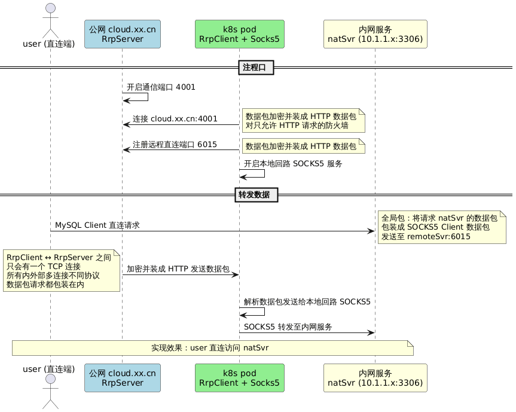
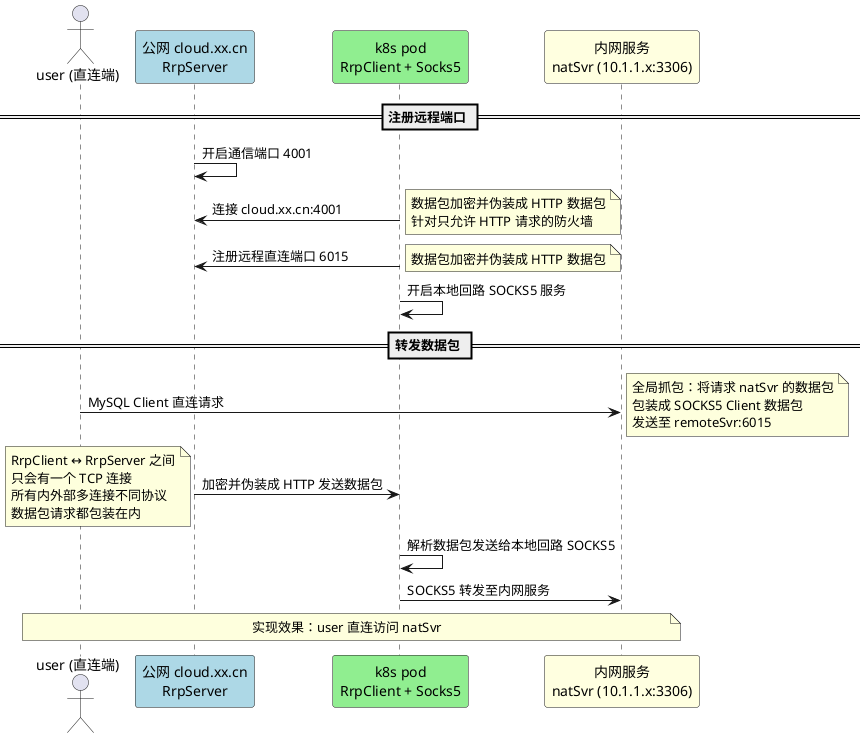

# RSocks 网络代理组件

高性能 Netty 实现的 SOCKS5/Shadowsocks/RRP 代理协议栈，支持 TCP/UDP 全协议转发、智能路由、域名匹配和加密传输。

## 目录结构

```
org.rx.net/
├── dns/           # DNS 服务器与解析
├── socks/         # SOCKS5/Shadowsocks/RRP 代理实现
└── support/       # 路由支持（域名匹配、GeoIP）
```

---

## DNS 模块

### DnsServer

基于 Netty 的高性能 DNS 服务器，同时支持 TCP 和 UDP 协议（标准端口 53）。

**核心特点：**

| 特性 | 说明 |
|------|------|
| **双协议支持** | 同时监听 TCP/UDP，使用 Netty 内置编解码器 `TcpDnsQueryDecoder` / `DatagramDnsQueryDecoder` |
| **hosts 权重负载** | 支持 `enableHostsWeight` 模式，相同域名多 IP 时按权重分配，返回 1-2 个 IP |
| **解析拦截器** | `ResolveInterceptor` 接口支持自定义解析逻辑，可对接外部服务（如服务发现） |
| **防缓存击穿** | `resolvingKeys` + `resolvingPromises` 防止并发场景下的缓存穿透（thundering-herd） |
| **H2 持久缓存** | 使用 `H2StoreCache` 作为 DNS 缓存后端，支持 TTL 和跨进程共享 |

**典型用途：**
- 本地开发 DNS 劫持/劫持测试
- 内网服务发现 DNS 前端
- 配合 SOCKS5 实现智能 DNS 路由

---

## SOCKS5 代理模块

### SocksProxyServer

标准 SOCKS5 协议服务器实现，支持 TCP CONNECT 和 UDP ASSOCIATE。

**核心特点：**

| 特性 | 说明 |
|------|------|
| **内存通道模式** | 支持 `LocalServerChannel` 内存通信，用于同一 JVM 内组件间零拷贝代理 |
| **灵活路由委托** | `onTcpRoute` / `onUdpRoute` 委托允许运行时动态决定上游（直接连接/转发到另一个代理） |
| **加密路由切换** | `cipherRouter` 谓词可针对特定目标（如 DNS 端口 53、HTTP 80）启用加密 |
| **UDP Relay 管理** | 内置 `udpRelayRegistry` 管理 UDP 中继通道，支持 `resetUdpRelay` / `claimUdpRelay` 状态清理 |
| **流量整形** | 可选 `ProxyManageHandler` 进行连接级流量统计和限速 |

**协议流水线：**
```
[Socks5InitialRequestDecoder] → [Socks5InitialRequestHandler]
    → [Socks5PasswordAuthRequestDecoder] (可选认证)
    → [Socks5CommandRequestDecoder] → [Socks5CommandRequestHandler]
```

### Socks5Client

SOCKS5 客户端实现，支持 CONNECT 和 UDP_ASSOCIATE。

**核心特点：**

| 特性 | 说明 |
|------|------|
| **双模式 UDP** | `udpAssociateAsync()` 自动创建 UDP 通道；支持外部传入已绑定通道复用 |
| **会话生命周期管理** | `Socks5UdpSession` 自动关联 TCP 控制通道与 UDP 中继通道，任一关闭则整体关闭 |
| **SOCKS5 UDP 编解码** | `UdpManager.socks5Encode/socks5Decode` 自动处理 SOCKS5 UDP 头部封装 |
| **Wildcard 地址解析** | 代理返回 `0.0.0.0` 时自动替换为代理服务器实际 IP |

### SocksContext

代理会话上下文，贯穿连接生命周期。

**核心特点：**

| 特性 | 说明 |
|------|------|
| **FastThreadLocal 优化** | `USE_FAST_THREAD_LOCAL` 控制是否复用上下文对象（默认关闭保证线程安全） |
| **双向 Channel 标记** | `markCtx()` 同时标记入站/出站 Channel，支持双向查找 |
| **Omega 快速部署** | `omega()` / `omegax()` 静态方法支持通过配置字符串快速启动 RRP Client / SSH Server |

---

## Shadowsocks 模块

### ShadowsocksServer

Shadowsocks 协议服务器（TCP/UDP）。

**核心特点：**

| 特性 | 说明 |
|------|------|
| **独立加密线程池** | `useDedicatedCryptoGroup` 模式下使用独立 `EventExecutorGroup` 进行加解密，避免阻塞 I/O 线程 |
| **多算法支持** | 通过 `ICrypto` 接口支持 AES-GCM、ChaCha20-Poly1305 等算法 |
| **UDP 优化** | UDP 通道独立初始化 `ICrypto`，设置 `forUdp=true` 优化包处理 |

**流水线：**
```
[CipherCodec] → [SSProtocolCodec] → [SSTcpProxyHandler / SSUdpProxyHandler]
```

---

## RRP (Reverse Relay Protocol) 模块

### RrpServer / RrpClient

反向中继协议，用于内网穿透：客户端主动连接服务器，服务器将远程端口流量转发到客户端。

**核心特点：**

| 特性 | 说明 |
|------|------|
| **反向连接模型** | 客户端主动出站连接，突破 NAT/防火墙限制，服务器端绑定公网端口 |
| **多代理注册** | 单连接支持注册多个 `Proxy` 配置（多个远程端口映射） |
| **内存通道优化** | 客户端使用 `LocalChannel` 内存通信对接本地 SOCKS5 服务器，零内核拷贝 |
| **背压控制** | `RemoteRelayBuffer` 限制每个远程通道 1MB 待发送缓冲，超限自动关闭 |
| **流控同步** | `syncRemoteReadState()` 根据客户端可写状态动态启用/禁用远程读 |

**协议动作：**
- `ACTION_REGISTER (1)` - 客户端注册代理配置
- `ACTION_FORWARD (2)` - 双向数据转发
- `ACTION_SYNC_CLOSE (3)` - 同步关闭通知

### RRP 工作流程



**角色说明：**
- `localSvr` = k8s pod 内网微服务 (RrpClient)
- `remoteSvr` = 公网 cloud.xx.cn Java 服务 (RrpServer)
- `user` = 直连端
- `natSvr` = 内网服务 (10.1.1.x:3306)

以下为 RRP 流程说明原文（与上图 PlantUML 同源）；图中注释与步骤一一对应。
```text
角色 localSvr = k8s pod 内网微服务(RrpClient)， remoteSvr = 公网cloud.xx.cn java服务(RrpServer)， user = 直连端， natSvr = 内网服务（10.1.1.x:3306）

--注册远程端口--
remoteSvr 开启通信端口4001
localSvr 主进程内开启RrpClient连接 remoteSvr cloud.xx.cn:4001
	注释内容： 数据包加密并伪装成http数据包，针对只允许http请求的防火墙
localSvr 向 remoteSvr 注册远程直连端口如6015  
	注释内容： 数据包加密并伪装成http数据包
localSvr 开启本地回路socks5服务

--转发数据包--
user 端上的mysql client 直连 natSvr，
	注释内容： 全局抓包user 端请求 natSvr 的数据包，包装成socks5 client的数据包去请求 remoteSvr 的注册地址如 cloud.xx.cn:6015
remoteSvr 把 user 的数据包 加密并伪装成http数据包通过发送给 localSvr
	注释内容： RrpClient <-> RrpServer 之间只会有一个tcp连接，所有内外部多连接不同协议数据包请求都包装在内
localSvr 再把数据包解析发送本地回路socks5服务
本地回路socks5服务根据协议发送数据包至natSvr

注释内容： 从而实现 user 直连 natSvr 的效果
```

---

## 路由支持模块 (support)

### UltraDomainTrieMatcher

高性能双数组 Trie 域名后缀匹配器。

**核心特点：**

| 特性 | 说明 |
|------|------|
| **Suffix Compression (Tail)** | 共享后缀存储，大幅降低内存占用 |
| **Zero-Allocation 查询** | 使用 `Window` 滑动窗口 + `CompactLabelMap` 扁平哈希，无临时对象分配 |
| **FastThreadLocal 零拷贝** | 查询过程不生成中间字符串，直接基于原始字符数组比较 |
| **CompactLabelMap** | 自定义开放寻址哈希表，替代 fastutil 运行时依赖，序列化友好 |

**复杂度：**
- 构建：O(N × L)，N 为规则数，L 为平均域名长度
- 查询：O(L)，与规则数无关

### GeoSiteMatcher

V2Ray GeoSite 格式规则匹配器，支持完整规则类型。

**核心特点：**

| 特性 | 说明 |
|------|------|
| **四层匹配策略** | 按优先级：①后缀 (Trie) ②完整 (HashSet) ③关键词 (Aho-Corasick) ④正则 (Regex) |
| **Aho-Corasick 多模式** | 使用 `hankcs/AhoCorasickDoubleArrayTrie` 实现 O(N) 多关键词匹配 |
| **零分配 Case-Insensitive** | `LowerAsciiCharSequence` 包装器避免 toLowerCase 字符串分配 |
| **线程安全 Regex** | `ReusablePattern` 使用 `FastThreadLocal<Matcher>` 避免重复编译 |

**规则格式支持：**
- `domain:example.com` - 后缀匹配（默认）
- `full:example.com` - 完整匹配
- `keyword:example` - 关键词包含
- `regexp:.*example.*` - 正则匹配

### DomainTrieMatcher (Deprecated)

早期域名 Trie 实现，使用压缩数组节点。

**特点：**
- 仅支持 38 字符集（a-z, 0-9, ., -）
- 反向插入实现后缀匹配
- 已被 `UltraDomainTrieMatcher` 取代

---

## 配置类说明

### SocksConfig

SOCKS5 服务器配置，继承 `SocketConfig`。

**关键配置项：**

```java
// 超时控制
readTimeoutSeconds = 240          // TCP 读超时
udpReadTimeoutSeconds = 1200        // UDP 读超时

// 预热连接池
tcpWarmPoolEnabled = true           // TCP 连接预热
tcpWarmPoolMinSize = 2
tcpWarmPoolMaxIdleMillis = 60000

// UDP 租赁池
udpLeasePoolEnabled = true          // UDP ASSOCIATE 连接池
udpLeasePoolMinSize = 2
udpLeasePoolMaxSize = 32

// UDP 多倍发包（游戏场景）
udpRedundant.multiplier = 2         // 2倍发包
udpRedundant.adaptive = true        // 自适应调节
udpRedundant.intervalMicros = 1000  // 发包间隔
```

### RrpConfig

RRP 协议配置。

**关键配置项：**

```java
// 服务端
token = "secret"                    // 认证令牌
bindPort = 7000                     // 控制通道端口

// 客户端
serverEndpoint = "host:7000"        // 服务端地址
enableReconnect = true              // 自动重连
waitConnectMillis = 4000            // 连接超时

// 代理映射
proxies = [
  { name: "web", remotePort: 8080, auth: "user:pass" }
]
```

---

## 性能优化要点

1. **零拷贝**：`LocalChannel` 内存通道避免内核态切换
2. **对象池**：`PooledByteBufAllocator` 复用 ByteBuf
3. **线程隔离**：加密操作 offload 到独立线程池
4. **无锁查询**：域名匹配全程无锁、零分配
5. **背压控制**：写缓冲上限 + 流控反馈防止 OOM

---

## 集成测试类

- `SocksProxyServerIntegrationTest` - SOCKS5 全流程测试
- `ShadowsocksServerIntegrationTest` - Shadowsocks 加解密测试
- `Socks5ClientIntegrationTest` - 客户端 CONNECT/UDP_ASSOCIATE 测试
- `RrpIntegrationTest` - 反向中继穿透测试
- `DnsServerIntegrationTest` - DNS 解析与缓存测试
