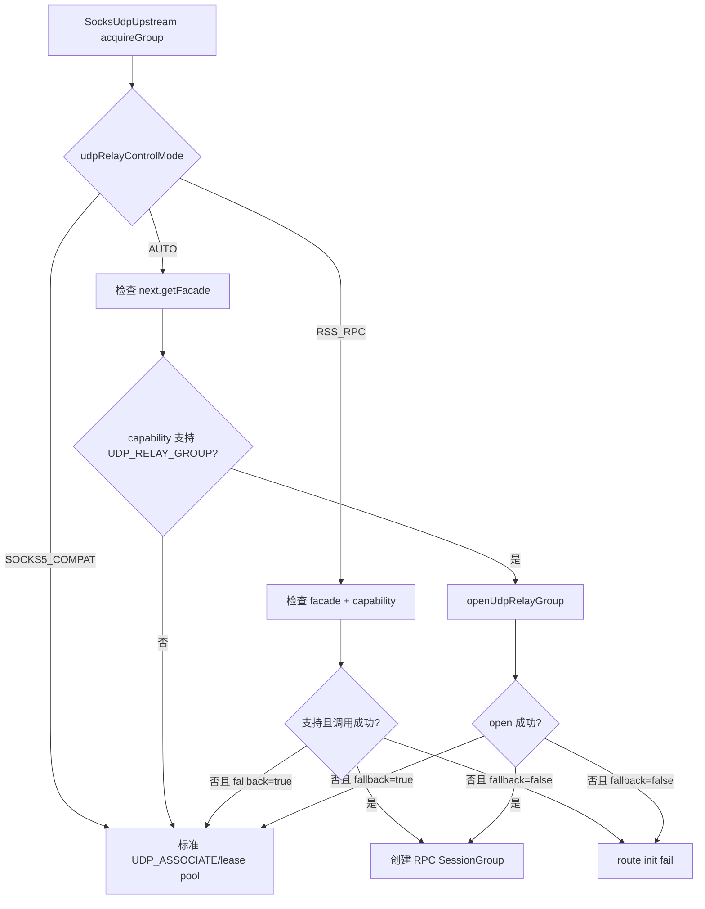
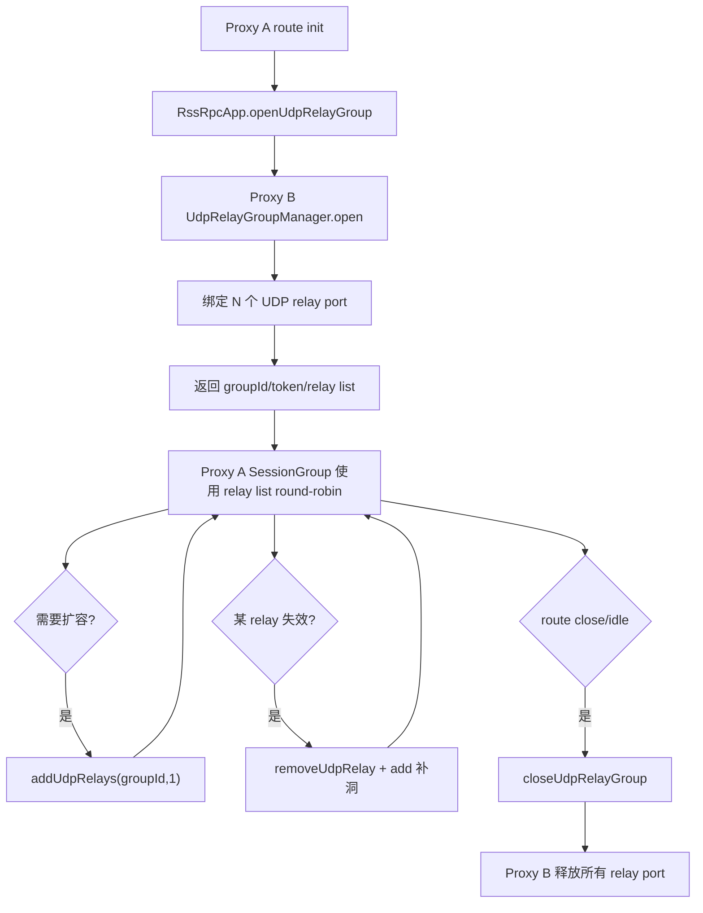

# RX SOCKS5 UDP Relay Control 长期方案

本文档是 `UdpSocks5UpstreamPortHopping-plan.md` 的长期扩展方案。

当前端口跳跃已经实现标准 SOCKS5 兼容模式：一个逻辑 `SocksUdpUpstream` 可以持有多个远端 SOCKS5 `UDP_ASSOCIATE` relay 端口，并通过自适应扩容、lease pool、单 hop 摘除补洞来控制资源开销。

但标准 SOCKS5 的天然限制是：

```text
1 个 UDP_ASSOCIATE relay ≈ 1 条 TCP control channel + 1 个 UDP relay port
N 个 hop ≈ N 条 TCP control channel + N 个 UDP relay port
```

如果 Proxy A 和 Proxy B 两端都是 rxlib，则可以扩展私有控制协议，让一个 TCP/RPC control session 管理整个 UDP relay group，从而把控制面开销从 `N 条 TCP` 降低到 `1 条 TCP/RPC`。

## 1. 结论

可以实现，而且建议长期优先走 `RssRpcApp / SocksRpcContract` 扩展，而不是修改标准 SOCKS5 `UDP_ASSOCIATE` 状态机。

推荐最终形态：

```text
两端都是 rxlib：
  1 条 RssRpcApp / SocksRpcContract 控制会话
  + N 个远端 UDP relay port
  + 1 个逻辑 relay group

任意一端不是 rxlib：
  回退标准 SOCKS5 兼容模式
  1 个 UDP relay = 1 条 TCP control channel
```

原因：

- 标准 SOCKS5 的 `UDP_ASSOCIATE` 语义通常绑定一条 TCP control connection 的生命周期；强行在一个标准 TCP control 上复用多个 UDP relay 不利于兼容第三方实现。
- rxlib 两端可控时，控制面可以走 `SocksRpcContract` / `RssRpcApp` 私有 RPC，不影响标准 SOCKS5 wire protocol。
- UDP 数据面仍可保持当前 SOCKS5 UDP request/response header 格式，降低 `SocksUdpRelayHandler`、`SSUdpProxyHandler`、`Udp2rawHandler` 的改造成本。

## 2. 目标

- 在 A/B 两端都是 rxlib 时，支持一个控制会话管理多个 UDP relay port。
- 保持现有标准 SOCKS5 兼容模式，不破坏第三方 SOCKS5 server/client。
- 控制面支持批量申请、追加、释放、重置、心跳、能力协商。
- 数据面继续使用 UDP relay port 进行端口分散，仍能降低单端口/五元组限速风险。
- 与已有 `UdpPortHoppingConfig`、自适应扩容、lease pool、单 hop 摘除补洞兼容。
- 为后续跨 relay RDNT 去重窗口和 `spreadRedundantCopies` 打基础。

## 3. 非目标

- 不修改第三方标准 SOCKS5 服务器的兼容路径。
- 不要求一个 UDP socket 虚拟出多个端口；如果要规避按端口/五元组限速，远端仍必须真实绑定多个 UDP relay port。
- 第一阶段不启用跨 relay 冗余副本分散；`spreadRedundantCopies` 仍保持 false。
- 第一阶段不把 UDP payload 改成全新私有格式，优先复用现有 SOCKS5 UDP header。

## 4. 总体架构

### 4.1 兼容模式：当前实现

```text
Proxy A SocksUdpUpstream
  -> TCP control #1 -> SOCKS5 UDP_ASSOCIATE -> UDP relay port 1
  -> TCP control #2 -> SOCKS5 UDP_ASSOCIATE -> UDP relay port 2
  -> TCP control #3 -> SOCKS5 UDP_ASSOCIATE -> UDP relay port 3
```

优点：

- 完全兼容标准 SOCKS5；
- 任意第三方 SOCKS5 upstream 可用。

缺点：

- 多 hop 会线性增加 TCP control channel；
- 控制面握手和 channel 数量较重。

### 4.2 rxlib 私有 RPC 控制模式：推荐长期方向

```text
Proxy A SocksUdpUpstream
  -> 1 条 RssRpcApp / SocksRpcContract control session
      -> openUdpRelayGroup(count=3)
      <- groupId + relayPort1 + relayPort2 + relayPort3 + token

UDP data:
  A UDP outbound -> B relayPort1 / relayPort2 / relayPort3
```

资源模型：

```text
3 hop 标准模式：3 条 TCP control + 3 个 UDP relay port
3 hop RX RPC 模式：1 条 RPC/control + 3 个 UDP relay port
```

### 4.3 私有 SOCKS5 batch command：备选方向

```text
TCP control #1
  -> RX_UDP_ASSOCIATE_BATCH(count=3)
  <- relayPort1, relayPort2, relayPort3
```

不推荐优先实现。原因是需要扩展 SOCKS5 编解码状态机，并且与第三方 SOCKS5 实现没有兼容价值。RPC/facade 已经存在，直接扩展 `SocksRpcContract` 更自然。

## 5. 模式选择和自动回退

新增控制模式枚举：

```java
public enum UdpRelayControlMode {
    AUTO,
    SOCKS5_COMPAT,
    RSS_RPC,
    RX_SOCKS5_BATCH
}
```

推荐默认：

```java
private UdpRelayControlMode udpRelayControlMode = UdpRelayControlMode.AUTO;
```

选择规则：

```text
AUTO:
  1. 如果 next.getFacade() != null 且 capability 支持 UDP_RELAY_GROUP，则使用 RSS_RPC
  2. 否则如果未来实现 RX_SOCKS5_BATCH 且 peer 支持，则使用 RX_SOCKS5_BATCH
  3. 否则回退 SOCKS5_COMPAT

SOCKS5_COMPAT:
  强制使用当前标准 SOCKS5 UDP_ASSOCIATE 模式

RSS_RPC:
  要求 rxlib peer 支持 RssRpcApp 扩展，否则 route 初始化失败或按配置回退

RX_SOCKS5_BATCH:
  预留给未来私有 SOCKS5 command
```

建议再增加：

```java
private boolean udpRelayControlFallbackToSocks5 = true;
```

语义：

- `true`：RPC 不可用、能力不支持、调用失败时回退标准 SOCKS5；
- `false`：要求必须走 rxlib 私有控制模式，失败则 route init 失败。

## 6. SocksRpcContract 扩展设计

当前 `SocksRpcContract` 已有：

```java
boolean claimUdpRelay(int relayPort, InetSocketAddress clientAddr);
boolean resetUdpRelay(int relayPort);
```

长期建议增加默认方法，保持二进制兼容和旧实现不破坏：

```java
public interface SocksRpcContract extends AutoCloseable, DnsServer.ResolveInterceptor {
    default SocksRpcCapabilities capabilities() {
        return SocksRpcCapabilities.EMPTY;
    }

    default UdpRelayGroupOpenResult openUdpRelayGroup(UdpRelayGroupOpenRequest request) {
        return UdpRelayGroupOpenResult.unsupported();
    }

    default UdpRelayGroupUpdateResult addUdpRelays(String groupId, int count) {
        return UdpRelayGroupUpdateResult.unsupported();
    }

    default boolean removeUdpRelay(String groupId, int relayPort) {
        return false;
    }

    default boolean heartbeatUdpRelayGroup(String groupId) {
        return false;
    }

    default boolean closeUdpRelayGroup(String groupId) {
        return false;
    }
}
```

### 6.1 Capability

```java
public final class SocksRpcCapabilities implements Serializable {
    public static final int UDP_RELAY_GROUP = 1;
    public static final int UDP_RELAY_GROUP_ADD = 1 << 1;
    public static final int UDP_RELAY_GROUP_HEARTBEAT = 1 << 2;
    public static final int UDP_RELAY_GROUP_SHARED_DEDUP = 1 << 3;
    public static final int UDP_RELAY_GROUP_BATCH_RESET = 1 << 4;

    private int flags;
    private int version;
    private int maxRelaysPerGroup;
    private int maxGroups;
}
```

### 6.2 Open request

```java
public final class UdpRelayGroupOpenRequest implements Serializable {
    private String clientId;
    private InetSocketAddress clientAddr;
    private UnresolvedEndpoint firstDestination;
    private int initialRelayCount;
    private int minActiveRelays;
    private int maxRelayCount;
    private long idleTimeoutMillis;
    private boolean sharedDedupRequired;
    private Map<String, String> attributes;
}
```

### 6.3 Open result

```java
public final class UdpRelayGroupOpenResult implements Serializable {
    private boolean success;
    private boolean supported;
    private String errorCode;
    private String errorMessage;
    private String groupId;
    private String token;
    private long expireAtMillis;
    private List<UdpRelayEndpoint> relays;
}
```

### 6.4 Relay endpoint

```java
public final class UdpRelayEndpoint implements Serializable {
    private String relayId;
    private InetSocketAddress relayAddress;
    private int weight;
    private long expireAtMillis;
}
```

## 7. RssRpcApp 实现方向

`RssRpcApp` 当前实现了 `SocksRpcContract`，并通过 `SocksProxyServer` 完成 relay claim/reset。

长期扩展建议：

```java
public final class RssRpcApp implements SocksRpcContract {
    @Override
    public SocksRpcCapabilities capabilities() {
        return svrSide.get().socksRpcCapabilities();
    }

    @Override
    public UdpRelayGroupOpenResult openUdpRelayGroup(UdpRelayGroupOpenRequest request) {
        return svrSide.get().openUdpRelayGroup(request);
    }

    @Override
    public UdpRelayGroupUpdateResult addUdpRelays(String groupId, int count) {
        return svrSide.get().addUdpRelays(groupId, count);
    }

    @Override
    public boolean removeUdpRelay(String groupId, int relayPort) {
        return svrSide.get().removeUdpRelay(groupId, relayPort);
    }

    @Override
    public boolean heartbeatUdpRelayGroup(String groupId) {
        return svrSide.get().heartbeatUdpRelayGroup(groupId);
    }

    @Override
    public boolean closeUdpRelayGroup(String groupId) {
        return svrSide.get().closeUdpRelayGroup(groupId);
    }
}
```

`RssRpcApp` 只做 RPC facade，不直接管理 UDP channel 细节。真正的 relay group 生命周期放到 `SocksProxyServer` 或独立 manager。

## 8. Proxy B 侧 RelayGroupManager

新增服务端管理器，建议命名：

```java
final class UdpRelayGroupManager extends Disposable {
    UdpRelayGroup open(UdpRelayGroupOpenRequest request);
    List<UdpRelayEndpoint> addRelays(String groupId, int count);
    boolean removeRelay(String groupId, int relayPort);
    boolean heartbeat(String groupId);
    boolean close(String groupId);
}
```

### 8.1 UdpRelayGroup

```java
final class UdpRelayGroup {
    final String groupId;
    final String token;
    final InetSocketAddress clientAddr;
    final UnresolvedEndpoint firstDestination;
    final Map<Integer, UdpRelayEntry> relays;
    final long createdAtMillis;
    volatile long lastActiveAtMillis;
    volatile boolean closed;
}
```

### 8.2 UdpRelayEntry

```java
final class UdpRelayEntry {
    final String relayId;
    final int relayPort;
    final Channel udpChannel;
    volatile long lastActiveAtMillis;
    volatile int weight;
}
```

### 8.3 生命周期

```text
openUdpRelayGroup
  -> 创建 groupId/token
  -> 绑定 N 个 UDP relay channel/port
  -> 绑定 clientAddr 或安全 token
  -> 注册到 relayGroupMap 和 relayPortMap
  -> 返回 relay endpoint 列表

UDP 包到达 relayPort
  -> relayPortMap 找到 UdpRelayEntry
  -> 校验 clientAddr 或 token
  -> 解析 SOCKS5 UDP header
  -> 转发到真实 dest

closeUdpRelayGroup / idle timeout
  -> 关闭所有 relay channel
  -> 移除 relayPortMap
  -> 移除 groupMap
```

## 9. Proxy A 侧 SocksUdpUpstream 改造

`SocksUdpUpstream` 当前的 holder 基本以 `SessionHolder` 为单位。长期可以抽象出统一 holder：

```java
interface UdpRelayHolder extends AutoCloseable {
    InetSocketAddress relayAddress();
    boolean isValid();
    boolean pooled();
    String groupId();
}
```

现有模式：

```text
Socks5UdpSessionHolder implements UdpRelayHolder
Socks5UdpLeaseHolder implements UdpRelayHolder
```

新增 RPC group 模式：

```text
RpcUdpRelayGroupHolder
  -> 内部持有 groupId/token/control facade
  -> 包含多个 RpcUdpRelayHolder
```

建议第一阶段不要大改继承层次，只在 `SocksUdpUpstream.acquireGroup()` 中加入新分支：

```java
private SessionGroup acquireGroup(Channel channel) {
    if (shouldUseRpcRelayGroup()) {
        SessionGroup group = acquireRpcRelayGroup(channel);
        if (group != null && group.isValid()) {
            return group;
        }
        if (!config.isUdpRelayControlFallbackToSocks5()) {
            throw new IllegalStateException("RX UDP relay group unavailable");
        }
    }
    return acquireSocks5CompatGroup(channel);
}
```

`acquireRpcRelayGroup()` 流程：

```text
1. facade.capabilities()
2. 检查 UDP_RELAY_GROUP 支持
3. openUdpRelayGroup(initialCount/minActive/max)
4. 为返回的每个 relay endpoint 创建轻量 holder
5. holder 不再拥有独立 TCP control channel
6. group close 时调用 closeUdpRelayGroup(groupId)
```

自适应扩容：

```text
标准模式：acquireHolder() -> UDP_ASSOCIATE 或 lease pool
RPC group：addUdpRelays(groupId, 1) -> 追加 relay endpoint
```

单 hop 摘除：

```text
标准模式：remove holder + close/reset 对应 lease/session
RPC group：removeUdpRelay(groupId, relayPort)
```

整组关闭：

```text
标准模式：close 每个 holder
RPC group：closeUdpRelayGroup(groupId)
```

## 10. 数据面格式

第一阶段建议继续复用 SOCKS5 UDP datagram 格式：

```text
+----+------+------+----------+----------+----------+
|RSV | FRAG | ATYP | DST.ADDR | DST.PORT |   DATA   |
+----+------+------+----------+----------+----------+
```

好处：

- `SocksUdpRelayHandler` 现有解析逻辑可复用；
- Shadowsocks 场景 4 不需要大改；
- 第三方兼容路径和 rxlib 私有路径的数据面差异较小。

如需增强安全校验，可以在服务端 group 中继续绑定 `clientAddr`。如果存在 NAT 端口变化或多出口漂移，再考虑私有 header：

```text
RXUDP magic + version + groupIdHash + tokenMac + socks5UdpPayload
```

第一阶段不建议引入私有 UDP header，以减少改造风险。

## 11. 安全与授权

### 11.1 基础模式：clientAddr 绑定

open group 时记录 `clientAddr`：

```text
clientAddr = Proxy A 对 Proxy B 发 UDP 的源 IP:port
```

Proxy B relay 收包时校验 sender：

```text
sender 必须等于 group.clientAddr
```

优点：简单、无额外 UDP payload 开销。

缺点：如果 NAT 映射变化，可能导致 relay 拒收。

### 11.2 增强模式：token

open group 返回 `token`。如果未来引入 RXUDP header，则每个 UDP datagram 带 `tokenMac`：

```text
tokenMac = HMAC(token, timestamp + relayId + seq + payloadHash)
```

第一阶段只生成 token 并保留字段，不要求数据面携带。

## 12. 心跳与超时

RPC group 不再依赖 N 条 TCP control channel 的 closeFuture 来表达 relay 生命周期，因此必须显式管理超时。

建议：

```java
private long udpRelayGroupIdleMillis = 300_000L;
private long udpRelayGroupHeartbeatMillis = 30_000L;
```

Proxy A：

```text
route 活跃时不需要额外 heartbeat，以 UDP traffic 刷新活跃时间
route 长时间无 UDP traffic 但仍希望保留 group 时，调用 heartbeatUdpRelayGroup
route close 时调用 closeUdpRelayGroup
```

Proxy B：

```text
定期扫描 group.lastActiveAtMillis
超过 idle timeout -> close group
```

## 13. 与端口跳跃现有能力的关系

### 13.1 固定 hop

```text
RPC openUdpRelayGroup(count=hopCount)
```

### 13.2 自适应 hop

```text
初始：openUdpRelayGroup(count=minHopCount)
扩容：addUdpRelays(groupId, 1)
补洞：addUdpRelays(groupId, 1)
收缩/摘除：removeUdpRelay(groupId, relayPort)
```

### 13.3 lease pool

RPC group 模式下，Proxy A 侧不需要为每个 hop borrow SOCKS5 UDP lease。Proxy B 侧可以内部维护 UDP relay channel pool，但这是服务端本地优化，和当前 A 侧 `Socks5UpstreamPoolManager.UdpLeasePool` 分开。

建议：

```text
SOCKS5_COMPAT：继续使用当前 UDP lease pool
RSS_RPC：跳过 A 侧 UDP lease pool，直接 RPC 管理 relay group
```

### 13.4 单 hop 摘除补洞

当前逻辑可复用，只是 holder 的 close/replenish 操作不同：

```text
SOCKS5_COMPAT holder close -> close/reset session/lease
RSS_RPC holder close -> removeUdpRelay(groupId, relayPort)
RSS_RPC replenish -> addUdpRelays(groupId, 1)
```

## 14. 失败回退策略

### 14.1 初始化阶段

```text
capabilities 不支持 UDP_RELAY_GROUP
  -> fallbackToSocks5=true：走标准 SOCKS5
  -> fallbackToSocks5=false：route init fail

openUdpRelayGroup 失败
  -> fallbackToSocks5=true：走标准 SOCKS5
  -> fallbackToSocks5=false：route init fail
```

### 14.2 运行阶段

```text
addUdpRelays 失败
  -> 保持当前 active relays，不影响转发
  -> 记录 metric，按 cooldown 重试

removeUdpRelay 失败
  -> 本地先摘除，服务端依靠 idle timeout 回收

heartbeat 失败
  -> 标记 group 可疑；连续失败则 close local group 并回退重建

closeUdpRelayGroup 失败
  -> 本地清理，服务端依靠 idle timeout 回收
```

### 14.3 自动降级

如果 RPC group 连续失败超过阈值，打开短期 breaker：

```text
udpRelayControlBreakerOpenMillis = 60_000
```

breaker 打开期间 `AUTO` 直接走 `SOCKS5_COMPAT`，避免每条 route 都先打失败 RPC。

## 15. 指标与日志

新增 metrics：

```text
socks.udp.relay.control.mode.count{mode=rss_rpc|socks5_compat|fallback}
socks.udp.relay.group.open.count{result=success|fail|unsupported}
socks.udp.relay.group.active.count
socks.udp.relay.group.relay.count
socks.udp.relay.group.add.count{result=success|fail}
socks.udp.relay.group.remove.count{result=success|fail}
socks.udp.relay.group.close.count{result=success|fail|timeout}
socks.udp.relay.group.heartbeat.count{result=success|fail}
socks.udp.relay.control.breaker.count{action=open|close}
```

日志建议：

- capability 不支持时 debug；
- `RSS_RPC` 模式失败并 fallback 时 warn；
- `fallbackToSocks5=false` 且失败时 error；
- group idle timeout 回收时 debug；
- relay group 超过推荐上限时 warn。

## 16. 配置建议

新增配置字段建议放在 `SocksConfig` 或 `UdpPortHoppingConfig` 下。

```java
private UdpRelayControlMode udpRelayControlMode = UdpRelayControlMode.AUTO;
private boolean udpRelayControlFallbackToSocks5 = true;
private int udpRelayControlMaxRelaysPerGroup = 4;
private long udpRelayGroupIdleMillis = 300_000L;
private long udpRelayGroupHeartbeatMillis = 30_000L;
private int udpRelayControlFailureThreshold = 5;
private long udpRelayControlBreakerOpenMillis = 60_000L;
```

推荐线上默认：

```java
bConf.setUdpRelayControlMode(UdpRelayControlMode.AUTO);
bConf.setUdpRelayControlFallbackToSocks5(true);
bConf.setUdpRelayControlMaxRelaysPerGroup(3);
bConf.setUdpRelayGroupIdleMillis(300_000L);
bConf.setUdpRelayGroupHeartbeatMillis(30_000L);
```

## 17. 实施阶段

### 阶段 A：RPC 能力协商

- [ ] 新增 `SocksRpcCapabilities`。
- [ ] `SocksRpcContract` 增加默认 `capabilities()`。
- [ ] `RssRpcApp` 实现 capabilities。
- [ ] `SocksUdpUpstream` 在 `AUTO` 模式下探测 capability。
- [ ] capability 不支持时自动回退当前 SOCKS5 兼容模式。

### 阶段 B：服务端 RelayGroupManager

- [ ] 新增 `UdpRelayGroupManager`。
- [ ] 支持 `open/add/remove/heartbeat/close`。
- [ ] Proxy B 侧维护 `groupId -> group` 和 `relayPort -> entry`。
- [ ] 支持 idle timeout 自动回收。
- [ ] 数据面继续使用 SOCKS5 UDP header。

### 阶段 C：RssRpcApp 扩展

- [ ] `SocksRpcContract` 增加 group 默认方法。
- [ ] `RssRpcApp` 调用 `SocksProxyServer` 的 group 管理方法。
- [ ] 保持旧实现默认 unsupported，不破坏第三方/旧版本。

### 阶段 D：SocksUdpUpstream 接入 RSS_RPC 模式

- [ ] 新增 `UdpRelayControlMode` 配置。
- [ ] `acquireGroup()` 优先尝试 `acquireRpcRelayGroup()`。
- [ ] RPC group holder 支持 `select/snapshot/contains/remove/add`。
- [ ] 自适应扩容改为 `addUdpRelays(groupId, 1)`。
- [ ] group close 调用 `closeUdpRelayGroup(groupId)`。
- [ ] 失败按 `fallbackToSocks5` 决定是否回退。

### 阶段 E：breaker 与观测

- [ ] RPC 连续失败打开 breaker。
- [ ] breaker 打开期间 `AUTO` 直接走 SOCKS5 兼容模式。
- [ ] 增加 group open/add/remove/close/heartbeat 指标。
- [ ] 压测对比 TCP control channel 数量。

### 阶段 F：跨 relay RDNT 共享去重窗口

- [ ] 在 `UdpRelayGroup` 中加入共享 dedup window。
- [ ] 去重 key 使用 `groupId + destAddr + seqId`。
- [ ] capability 增加 `UDP_RELAY_GROUP_SHARED_DEDUP`。
- [ ] 支持 `spreadRedundantCopies=true`。
- [ ] 验证真实目标不会收到重复 payload。

## 18. 测试计划

### 18.1 单元测试

```text
SocksRpcCapabilitiesTest
UdpRelayGroupManagerTest
SocksUdpUpstreamRelayControlModeTest
RssRpcUdpRelayGroupTest
```

覆盖：

- capability 支持/不支持；
- `AUTO` 模式选择 RSS_RPC 或 SOCKS5_COMPAT；
- `fallbackToSocks5=true/false` 行为；
- group open 返回多个 relay；
- add/remove/heartbeat/close 生命周期；
- idle timeout 自动清理；
- RPC add 失败不影响已有 UDP 转发。

### 18.2 集成测试

rxlib 两端：

```text
ShadowsocksClient -> ShadowsocksServer -> Proxy A(rxlib)
  -> RSS_RPC openUdpRelayGroup -> Proxy B(rxlib)
  -> UDP dest
```

验证：

- `hopCount=3` 时 Proxy A 到 Proxy B 只有 1 条 RPC/control 会话；
- UDP 数据分散到 3 个真实 relay port；
- 断开一个 relay 后可 remove + add 补洞；
- close route 后 Proxy B group 清理完整。

非 rxlib 或 capability 不支持：

```text
Proxy A(rxlib) -> third-party SOCKS5
```

验证：

- 自动回退标准 SOCKS5 `UDP_ASSOCIATE`；
- 行为与当前兼容模式一致；
- 不调用 group RPC 方法。

### 18.3 压测

对比：

```text
1000 route, maxHopCount=3
SOCKS5_COMPAT：理论最多 3000 条 TCP control
RSS_RPC：理论 1 条长 RPC control 或每 upstream 少量 RPC control + 3000 个 UDP relay
```

关注：

- TCP control channel 数；
- UDP relay port 数；
- route init 延迟；
- 扩容延迟；
- Proxy B 堆外内存；
- ctxMap/groupMap 残留；
- 失败回退次数。

## 19. Mermaid 流程图

### 19.1 AUTO 模式选择



### 19.2 RPC relay group 生命周期



## 20. 风险点

- RPC control session 本身需要稳定；如果它频繁断开，group 生命周期需要依靠 heartbeat/idle timeout 补偿。
- 如果只用 clientAddr 绑定，NAT 端口变化会导致 UDP relay 拒收；必要时引入 tokenMac 私有 UDP header。
- RSS_RPC 模式减少的是 TCP control channel，不减少 UDP relay port；端口跳跃要真实生效仍然需要多个 UDP port。
- batch group 模式下，服务端 groupMap/relayPortMap 清理必须严格，否则更容易出现 relay port 泄漏。
- 跨 relay RDNT 去重没有实现前，仍不能把同一冗余组副本拆到不同 relay。

## 21. 最终推荐

短期继续保持当前标准兼容实现作为 baseline。

长期按以下路线推进：

```text
1. SocksRpcContract 增加 capabilities 和 UDP relay group 默认方法
2. RssRpcApp 实现 UDP relay group 控制
3. Proxy B 增加 UdpRelayGroupManager
4. SocksUdpUpstream AUTO 模式优先走 RSS_RPC
5. RPC 不可用时自动回退 SOCKS5_COMPAT
6. 压测确认 TCP control channel 从 N 降为 1 或少量长连接
7. 再做跨 relay RDNT 共享去重窗口和 spreadRedundantCopies
```

推荐优先实现 `RSS_RPC`，暂缓 `RX_SOCKS5_BATCH`。这样可以最大程度复用现有 `RssRpcApp`、`SocksRpcContract`、`SocksProxyServer` 能力，并保持标准 SOCKS5 兼容路径稳定。