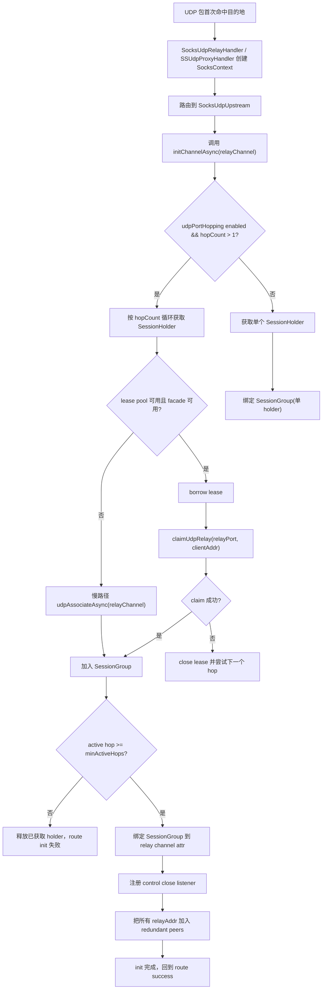
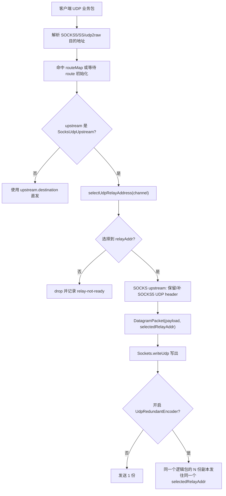
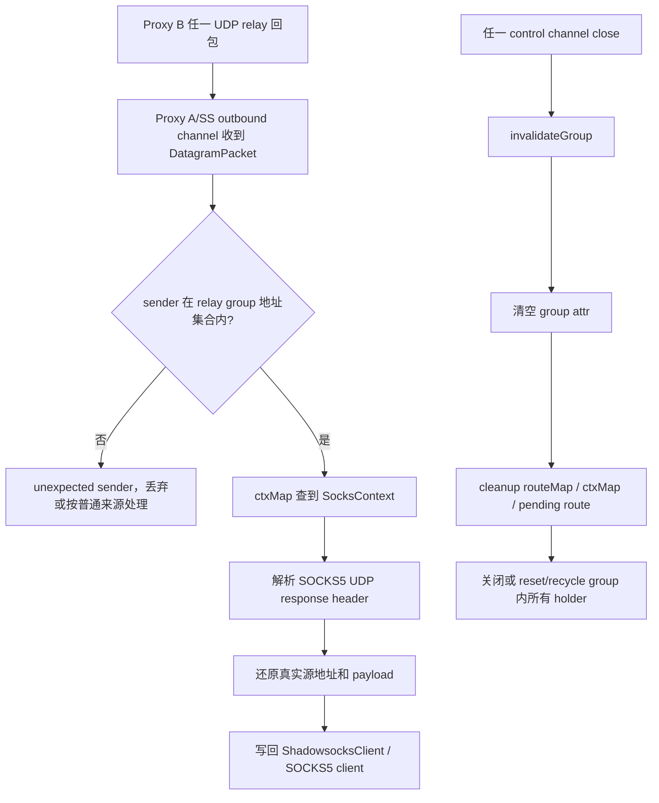

# UDP SOCKS5 Upstream 端口跳跃计划

## 当前实现状态

已完成第一期实现：

- 新增 `UdpPortHoppingConfig`、`UdpPortHoppingMode`，并接入 `SocksConfig`。
- `SocksUdpUpstream` 支持一个逻辑 upstream 持有多个远端 SOCKS5 UDP relay 端口。
- `SocksUdpRelayHandler`、`SSUdpProxyHandler`、`Udp2rawHandler` 已改为发送时选择 relay、回包时识别 group 内任意 relay。
- 默认关闭；`enabled=false` 或 `hopCount=1` 时保持旧行为。
- 第一版采用“任一 hop control channel 关闭则整组失效并由下一次 route 重新初始化”的保守策略，不做单 hop 异步补洞。

未实现内容：

- `spreadRedundantCopies` 仍为二期预留，不会把同一个 RDNT 冗余组拆到多个远端 relay 端口。
- 单 hop 权重降级、按丢包率补洞、跨 relay 共享去重窗口暂未实现。

## 背景

目标场景来自 `docs/test/SocksScene.md` 的场景4：

```text
ShadowsocksClient -> ShadowsocksServer -> SocksServerProxy A
  -> UDP_ASSOCIATE -> SocksServerProxy B -> UDP dest
```

当前 `SocksUdpUpstream` 在 Proxy A 到 Proxy B 的 UDP upstream 上只绑定一个远端 `UDP_ASSOCIATE` relay 地址。这个地址由 Proxy B 每次动态分配，端口是随机的；`SocksUdpRelayHandler`、`SSUdpProxyHandler` 和 `Udp2rawHandler` 都按一个 `relayAddr` 做出站发送和回包识别。

启用 UDP 多倍发包后，同一条 A->B UDP relay 端口会承载 `multiplier` 倍数据量，容易触发按端口或五元组计量的限速。需要在同一个逻辑 upstream 下维护多个远端 UDP relay 端口，并把逻辑报文分摊到不同 relay 上，形成类似“端口跳跃”的效果。

## 目标

- 场景4 下支持一个逻辑 `SocksUdpUpstream` 同时持有多个 Proxy B UDP relay 端口。
- 默认策略为按逻辑 UDP 报文轮换远端 relay 端口，降低单端口持续流量。
- 保持 Java 8、Netty EventLoop 线程亲和、无阻塞 I/O 进入 I/O 线程。
- 热点发送路径不做 DNS、不建连接、不分配复杂对象；端口选择只做数组访问和递增索引。
- 复用现有 SOCKS5 `UDP_ASSOCIATE`、lease pool、`claimUdpRelay/resetUdpRelay` 控制面能力。
- 与现有多倍发包、压缩、lease pool、场景4回归用例兼容。

## 非目标

- 第一期不把同一个 RDNT 冗余组的多个副本拆到不同远端 relay 端口。
- 第一期不修改 SOCKS5 wire protocol。
- 第一期不要求远端 Proxy B 共享多个 UDP relay channel 的去重窗口。
- 第一期不引入 Spring 风格封装或阻塞式 DNS。

## 关键设计判断

### 为什么第一期按“逻辑报文轮换”，而不是“冗余副本分散”

当前 `UdpRedundantDecoder` 的去重状态在每个 UDP channel 内部。若同一个 RDNT `seqId` 的多个副本被发到 Proxy B 的不同 UDP relay channel，每个 channel 都会把它当作首次收到的包，远端可能向真实目标转发多份重复 payload。

因此第一期采用：

```text
逻辑包 #1 的 N 个冗余副本 -> relayPortA
逻辑包 #2 的 N 个冗余副本 -> relayPortB
逻辑包 #3 的 N 个冗余副本 -> relayPortC
```

这样仍能把端口平均流量摊开，同时保留现有“同 channel 去重”语义。跨端口分散同一冗余组可作为二期能力，但必须先实现远端跨 relay 的共享去重窗口。

### 为什么放在 `SocksUdpUpstream` 层

端口跳跃只对 SOCKS5 UDP upstream 有意义，且多个端口来自多次 `UDP_ASSOCIATE` 或 UDP lease。把状态放在 `SocksUdpUpstream` 可以复用：

- `Socks5Client.udpAssociateAsync(channel)` 慢路径；
- `Socks5UpstreamPoolManager.UdpLeasePool` 快路径；
- `SocksRpcContract.claimUdpRelay/resetUdpRelay` 远端 relay 锁定语义；
- 现有 `SocksUdpRelayHandler`、`SSUdpProxyHandler`、`Udp2rawHandler` 的 upstream 抽象。

## 配置实现

新增独立配置类：

```java
public class UdpPortHoppingConfig implements Serializable {
    private boolean enabled;
    private int hopCount = 1;
    private int minActiveHops = 1;
    private UdpPortHoppingMode mode = UdpPortHoppingMode.ROUND_ROBIN;
    private int replenishDelayMillis = 1000;
    private boolean spreadRedundantCopies = false;
}
```

新增枚举：

```java
public enum UdpPortHoppingMode {
    ROUND_ROBIN,
    RANDOM
}
```

`SocksConfig` 增加字段与便捷方法：

- `UdpPortHoppingConfig udpPortHopping`
- `boolean isUdpPortHoppingEnabled()`
- `int getUdpPortHoppingHopCount()`
- `int getUdpPortHoppingMinActiveHops()`

默认 `enabled=false`、`hopCount=1`，保证现有行为不变。建议第一期限制 `hopCount` 到 `[1, 8]`，避免对 Proxy B 产生过多 TCP control channel 和 UDP relay channel。

`spreadRedundantCopies` 第一期开关保留但不启用，避免误开导致目标收到重复包。当前代码没有接入该开关，行为恒等于 `false`。

## 详细使用方式

### 最小开启方式

端口跳跃是 `SocksUdpUpstream` 的能力，只需要在“指向下一级 SOCKS5 upstream 的 `SocksConfig`”上开启。以场景4为例，应该开启在 Proxy A -> Proxy B 这一段，而不是开启在 ShadowsocksClient -> ShadowsocksServer 本地入口。

```java
int proxyBPort = 1081;
SocksConfig upstreamConfig = new SocksConfig(proxyBPort);
upstreamConfig.setUdpPortHoppingEnabled(true);
upstreamConfig.setUdpPortHoppingHopCount(3);
upstreamConfig.setUdpPortHoppingMinActiveHops(2);
upstreamConfig.setUdpPortHoppingMode(UdpPortHoppingMode.ROUND_ROBIN);

UpstreamSupport supportB = new UpstreamSupport(
        new AuthenticEndpoint(new InetSocketAddress("proxy-b.example.com", proxyBPort), null, null),
        null);

proxyA.onUdpRoute.replace((s, e) -> {
    e.setUpstream(new SocksUdpUpstream(e.getFirstDestination(), upstreamConfig, supportB));
});
```

推荐值：

- `hopCount=2~4`：常规防单端口限速优先从 3 开始。
- `minActiveHops=1`：更偏可用性，部分端口建立失败时仍可降级转发。
- `minActiveHops=hopCount`：更偏严格端口分散，拿不满端口就让 route init 失败。
- `mode=ROUND_ROBIN`：默认推荐，热点路径只递增索引，行为稳定。
- `mode=RANDOM`：用于避免固定轮换特征，但每包多一次随机数调用。

### 场景4完整接线示例

```java
int proxyAPort = 1080;
int proxyBPort = 1081;
int ssPort = 8388;

SocksProxyServer proxyB = new SocksProxyServer(new SocksConfig(proxyBPort));
SocksProxyServer proxyA = new SocksProxyServer(new SocksConfig(proxyAPort));
ShadowsocksServer ssServer = new ShadowsocksServer(new ShadowsocksConfig(
        Sockets.newAnyEndpoint(ssPort),
        org.rx.net.socks.encryption.CipherKind.AES_256_GCM.getCipherName(),
        "password"));

UpstreamSupport supportA = new UpstreamSupport(
        new AuthenticEndpoint(new InetSocketAddress("127.0.0.1", proxyAPort), null, null),
        null);
UpstreamSupport supportB = new UpstreamSupport(
        new AuthenticEndpoint(new InetSocketAddress("proxy-b.example.com", proxyBPort), null, null),
        null);

ssServer.onUdpRoute.replace((s, e) -> {
    SocksConfig aConf = new SocksConfig(proxyAPort);
    e.setUpstream(new SocksUdpUpstream(e.getFirstDestination(), aConf, supportA));
});

proxyA.onUdpRoute.replace((s, e) -> {
    SocksConfig bConf = new SocksConfig(proxyBPort);
    bConf.setUdpPortHoppingEnabled(true);
    bConf.setUdpPortHoppingHopCount(3);
    bConf.setUdpPortHoppingMinActiveHops(2);
    e.setUpstream(new SocksUdpUpstream(e.getFirstDestination(), bConf, supportB));
});
```

注意：

- `bConf` 是 A->B 这段 upstream 的配置；Proxy A 自己监听用的 `configA` 不需要开启端口跳跃。
- Proxy B 不需要特殊配置即可支持慢路径，因为端口来自标准 SOCKS5 `UDP_ASSOCIATE`。
- 若要让 Proxy B 复用远端 relay，需额外启用 UDP lease pool 并提供 `SocksRpcContract` facade。

### 与 UDP lease pool 联用

端口跳跃会一次获取多个 holder。若启用 lease pool，则每个 hop 优先从池里 borrow 一个 lease，并对远端执行 `claimUdpRelay(relayPort, clientAddr)`。

```java
SocksConfig bConf = new SocksConfig(proxyBPort);
bConf.setUdpPortHoppingEnabled(true);
bConf.setUdpPortHoppingHopCount(3);
bConf.setUdpPortHoppingMinActiveHops(2);

bConf.setUdpLeasePoolEnabled(true);
bConf.setUdpLeasePoolMinSize(3);
bConf.setUdpLeasePoolMaxSize(16);
bConf.setUdpLeasePoolMaxIdleMillis(300_000);

UpstreamSupport supportB = new UpstreamSupport(
        new AuthenticEndpoint(new InetSocketAddress("proxy-b.example.com", proxyBPort), null, null),
        rpcFacade);
```

建议：

- `udpLeasePoolMinSize >= hopCount`，避免首次端口跳跃仍大量走慢路径建连。
- `udpLeasePoolMaxSize` 至少为 `并发客户端数 * hopCount` 的保守上限，避免 borrow 饥饿。
- 没有 facade、breaker 打开、claim 失败时会自动回退慢路径 `UDP_ASSOCIATE`。

### 与 UDP 多倍发包联用

可以同时开启多倍发包和端口跳跃：

```java
SocksConfig bConf = new SocksConfig(proxyBPort);
bConf.setUdpPortHoppingEnabled(true);
bConf.setUdpPortHoppingHopCount(3);
bConf.setUdpRedundantMultiplier(2);
bConf.setUdpRedundantIntervalMicros(500);
```

当前一期语义是：

```text
逻辑包 #1 的 2 份 RDNT 副本 -> relayPortA
逻辑包 #2 的 2 份 RDNT 副本 -> relayPortB
逻辑包 #3 的 2 份 RDNT 副本 -> relayPortC
```

不会变成：

```text
逻辑包 #1 的副本1 -> relayPortA
逻辑包 #1 的副本2 -> relayPortB
```

原因是 Proxy B 当前按 UDP relay channel 维护 RDNT 去重窗口，跨端口拆同一组副本会让真实目标收到重复包。

### 运行验证

推荐先跑端口跳跃专项：

```bash
mvn -pl rxlib test "-Dtest=SocksUdpRelayHandlerTest,SocksUdpUpstreamPortHoppingTest,SocksProxyServerIntegrationTest#shadowsocksUdpRelay_socks5_chained_withPortHopping_e2e" "-Dmaven.test.skip=false"
```

手工观察点：

- Proxy B 的 `udpRelayRegistry.size()` 应不小于 `hopCount` 或 `minActiveHops`。
- 抓包观察 A->B UDP recipient port，应在多个 Proxy B relay 端口之间轮换。
- 客户端只应收到一份业务响应；真实 UDP 目标不应收到同一逻辑包的跨端口重复副本。
- 监控关注 `socks.udp.porthop.group.active.count`、`socks.udp.porthop.acquire.count`、UDP drop、堆外内存、连接数、吞吐和延迟。

### 故障与降级行为

- 未开启端口跳跃：单 holder，行为与旧版本一致。
- `hopCount=1`：即使 `enabled=true`，也等价旧行为。
- 初始化拿到的 active hop 数低于 `minActiveHops`：route init 失败，pending UDP 包释放。
- 初始化拿到的 active hop 数大于等于 `minActiveHops` 但小于 `hopCount`：以已有 hop 降级运行。
- 任一 hop control channel 关闭：当前整组失效，清理 route cache；后续新包重新初始化 group。
- pooled holder：relay channel 关闭时异步 `resetUdpRelay`，成功后 recycle，失败则 close。
- 非 pooled holder：关闭 `Socks5UdpSession` 和 `Socks5Client`。

## 端口跳跃实现流程图

### 初始化流程



### 发送流程



### 回包与清理流程



## 数据结构实现

在 `SocksUdpUpstream` 中把当前单个 `SessionHolder` 扩展为 hop group：

```java
final class SessionGroup {
    final SessionHolder[] holders;
    final UdpPortHoppingMode mode;
    int nextIndex;

    InetSocketAddress selectRelayAddress();
    boolean containsRelayAddress(InetSocketAddress sender);
    InetSocketAddress primaryRelayAddress();
}
```

原则：

- `SessionGroup` 绑定到 UDP outbound/relay channel 的 attr 上。
- `selectRelayAddress()` 只在 channel 的 EventLoop 上调用，使用普通 `int nextIndex`，不需要 `AtomicInteger`。
- `holders` 初始化后按数组保存，发送路径不复制集合。
- 第一版任一 holder control channel 关闭时整组失效，清理 route cache；后续新包重新初始化 group。
- channel close 时关闭或回收全部 holder。

兼容方法保留：

- `getUdpRelayAddress(Channel)` 返回 primary relay，兼容旧调用。

新增方法：

- `selectUdpRelayAddress(Channel channel)`：发送路径选择本次报文使用的 relay。
- `ownsUdpRelayAddress(Channel channel, InetSocketAddress sender)`：回包路径判断 sender 是否属于该 upstream group。
- `snapshotUdpRelayAddresses(Channel channel)`：路由初始化时把所有 relay 地址注册进 ctxMap。

## 实现步骤

### 1. 配置与基础类型

- 新增 `UdpPortHoppingConfig` 和 `UdpPortHoppingMode`。
- `SocksConfig` 增加配置字段、getter/setter 和默认值。
- 保持 Java 8 语法，不使用 `var`、`List.of`、`Map.of`。

### 2. `SocksUdpUpstream` 支持多 holder

- 当前 `ATTR_UDP_SESSION` 的值类型已替换为 `SessionGroup`。
- `initChannelAsync(channel)` 在端口跳跃关闭时保持单 holder 快路径。
- 端口跳跃开启时一次性获取 `hopCount` 个 holder：
  - 优先从 UDP lease pool borrow 并 `claimUdpRelay(relayPort, clientAddr)`；
  - claim 失败的 lease 立即 close；
  - pool 不可用或数量不足时回退慢路径 `udpAssociateAsync(channel)`；
  - 可用数量低于 `minActiveHops` 则 init 失败并释放已获取 holder。
- `bindHolder` 演进为 `bindGroup`：
  - 对每个 control channel 注册 close listener；
  - 任一 holder 失效时整组失效，清理 route cache 并释放 upstream retain；
  - relay channel 关闭时关闭或 reset/recycle group 内全部 holder。

### 3. `SocksUdpRelayHandler` 改造

- `onRouteInitSuccess` 对 `SocksUdpUpstream` 注册 group 内所有 relay 地址到 `ctxMap`。
- `writeClientPacket` 对 `SocksUdpUpstream` 使用 `selectUdpRelayAddress(relay)`，非 SOCKS upstream 保持当前逻辑。
- `handleDestResponse` 不再只依赖 primary relay；只要 `ctxMap.get(sender)` 命中就按 upstream response 处理。
- `cleanupInvalidatedRoute` 清理该 upstream 对应的全部 relay 地址，而不是只清理单个 `relayAddress`。

### 4. `SSUdpProxyHandler` 场景4改造

- `buildOutboundPacket` 中对 `SocksUdpUpstream` 使用 `selectUdpRelayAddress(outbound)`。
- `UdpBackendRelayHandler` 中把：

```java
udpRelayAddr.equals(out.sender())
```

替换为：

```java
((SocksUdpUpstream) upstream).ownsUdpRelayAddress(outbound, out.sender())
```

- `ensureRelayResponseDecoder` 保持只补回程 decoder，不安装 encoder，避免本地 SS->SOCKS A 跳被额外放大。
- `OutboundPoolKey` 仍按 upstream pool key 聚合，端口跳跃 group 绑定在 outbound channel 上。

### 5. `Udp2rawHandler` 兼容

- `writeClientModePacket` / `writeServerModePacket` 选择 relay 地址时改为 `selectUdpRelayAddress`。
- 回包识别和 route cleanup 改为支持多个 relay 地址。
- 与 `resetUdpRelay/claimUdpRelay` 的 client lock 语义保持一致。

### 6. 二期：冗余副本跨端口分散

若后续必须把同一个 RDNT 组的 N 份副本发往不同 relay 端口，需要新增远端跨 channel 去重：

- 去重 key 至少包含 `clientAddr + upstreamGroupId + seqId`。
- Proxy B 多个 relay channel 需共享一个 bounded cache 或窗口。
- 需要 TTL 清理和最大容量限制，避免被伪造 seq 打爆内存。
- 只有确认远端支持共享去重后，`UdpRedundantEncoder` 才能接入 recipient selector，把 copy index 映射到不同 relay。

二期不应在第一期一起做，避免改变现有多倍发包对目标的“只转发一份”语义。

## 生命周期与并发

- holder/group 初始化继续走 `Tasks.runAsync`，完成后回到 channel EventLoop 绑定。
- 发送路径只读 EventLoop 内的 group 数组，不等待 future，不做 RPC。
- `claim/reset` 仍通过远端 relay 的 EventLoop 执行，保持与 `channelRead0` 串行。
- channel close 时：
  - 非 pooled holder 关闭 `Socks5UdpSession` 和 `Socks5Client`；
  - pooled holder 先异步 `resetUdpRelay`，成功后 recycle，否则 close；
  - group attr 清空，route cache 清理。
- 单个 hop control channel close 时当前直接让整组失效；补洞留给后续演进。

## 背压与流量控制

- 端口跳跃不增加单个逻辑包的写次数，第一期只改变 recipient。
- 多倍发包仍由 `UdpRedundantEncoder` 控制倍率和间隔。
- 继续使用 `Sockets.writeUdp` 的写水位与 drop 结果，新增指标只记录 hop 选择和 hop 可用性。
- hop 初始化失败时不在 I/O 线程重试；低于 `minActiveHops` 才让 route init 失败，否则降级使用已有 hop。

## 内存与 ByteBuf 风险

- 第一期不额外复制 payload；`DatagramPacket` 构造和 `ByteBuf.retain/release` 语义沿用当前发送路径。
- `SessionGroup` 使用固定数组，避免发送路径创建 `List` 或 iterator。
- `snapshotUdpRelayAddresses` 只在 route 初始化和 cleanup 使用，不进入每包热点路径。
- 新增 cache 必须有上限；不允许 unbounded `ConcurrentHashMap` 存 hop 或去重状态。

## 协议兼容性

- 端口跳跃第一期只通过多次标准 SOCKS5 `UDP_ASSOCIATE` 获取远端 relay 端口。
- Proxy B 不需要新增 wire protocol。
- 远端支持 `claimUdpRelay` 时可以配合 lease pool 复用端口；无 facade 时自动慢路径。
- DNS 策略不变：代理分支保持域名未解析并交给上游/远端处理。

## 监控指标

新增或补充以下指标：

- `socks.udp.porthop.group.active.count`：每个 group 当前 active hop 数。
- `socks.udp.porthop.acquire.count`：按 `result=success|partial|fail` 标记。
- `socks.udp.lease.borrow.count`、`socks.udp.lease.rpc.fail.count` 继续复用现有 lease pool 指标。
- 必须保留核心网络指标：堆外内存占用、活跃连接数、UDP 吞吐、UDP drop、端到端延迟。

## 测试计划

已新增并通过：

- `SocksUdpUpstreamPortHoppingTest`
  - `sessionGroupRoundRobinSelectsActiveRelayAddresses`
  - `sessionGroupSkipsClosedRelayAddress`
- `SocksUdpRelayHandlerTest#socksUdpUpstreamRegistersAndRotatesPortHoppingRelays`
- `SocksProxyServerIntegrationTest#shadowsocksUdpRelay_socks5_chained_withPortHopping_e2e`

### 单元测试

- `SocksUdpUpstream` group 选择：
  - `ROUND_ROBIN` 在 N 个 active hop 间轮换；
  - inactive holder 被跳过；
  - 低于 `minActiveHops` 初始化失败并释放已获取 holder。
- `ownsUdpRelayAddress`：
  - 命中 group 内任意 relay；
  - 不命中未知 sender；
  - unresolved/normalized 地址语义正确。
- `SocksUdpRelayHandler`：
  - route ready 后 `ctxMap` 注册多个 relay 地址；
  - 任意 relay 地址回包都进入 upstream response 分支；
  - upstream group invalidated 后多个 relay 地址都被清理。
- `SSUdpProxyHandler.UdpBackendRelayHandler`：
  - 多 relay sender 可通过校验；
  - 未知 sender 被 drop 并记录指标。

### 集成测试

优先新增或扩展：

- `SocksProxyServerIntegrationTest#shadowsocksUdpRelay_socks5_chained_withPortHopping_e2e`（已实现）
- `SocksProxyServerIntegrationTest#shadowsocksUdpRelay_socks5_chained_withUdpRedundantAndPortHopping_e2e`
- `SocksProxyServerIntegrationTest#shadowsocksUdpRelay_socks5_chained_withLeasePoolAndPortHopping_e2e`

验证点：

- Proxy B `udpRelayRegistry` 中出现不少于 `hopCount` 个 relay。
- 多轮 UDP 请求的 A->B recipient 端口覆盖多个 relay 端口。
- 客户端只收到一份正确响应，不因端口跳跃产生重复回包。
- 开启多倍发包后现有去重仍生效，真实 UDP echo 端不收到跨 relay 重复包。
- 关闭某个 hop control channel 后，当前预期为整组失效并下一次 route 重新建组。

回归用例：

- `ShadowsocksServerIntegrationTest#shadowsocksUdpRelay_e2e`
- `SocksProxyServerIntegrationTest#shadowsocksUdpRelay_socks5_chained_e2e`
- `SocksProxyServerIntegrationTest#shadowsocksUdpRelay_socks5_chained_withUdpRedundantOnProxyA_e2e`
- `SocksProxyServerIntegrationTest#shadowsocksUdpRelay_socks5_chained_withUdpCompressAndRedundantOnProxyAB_e2e`
- `SocksProxyServerIntegrationTest#shadowsocksUdpRelay_socks5_chained_withLeasePool_e2e`
- `SocksProxyServerIntegrationTest#shadowsocksUdpRelay_sameDestinationDifferentClientPorts_e2e`

## 验收标准

- 默认配置下所有现有 SOCKS5/ShadowSocks UDP 测试行为不变。
- 开启 `udpPortHopping.enabled=true` 且 `hopCount=3` 时，场景4 能稳定通过。
- 多倍发包与端口跳跃同时开启时，单个远端 relay 端口流量下降，整体成功率不低于不开端口跳跃（待专项集成测试补充）。
- 无 ByteBuf 泄漏；Netty leak detector 在相关测试中无报错。
- I/O 线程无阻塞 RPC、无同步建连、无阻塞 DNS。
- 监控能看到 active hop、acquire fail、UDP drop、堆外内存。

## 风险与应对

- 远端 relay 数过多导致 Proxy B 资源压力增加：限制 `hopCount`，默认关闭，指标观测 active relay 数。
- NAT 映射不稳定：所有 hop 共享同一个本地 UDP channel source port，远端 `claim` 锁定同一个 clientAddr，减少 NAT 变量。
- 某个 relay 端口被单独丢弃或限速：轮换选择会自然绕过部分流量，后续可按 drop/timeout 做权重降级。
- 跨端口冗余副本会让目标收到重复包：第一期明确不做，二期必须先实现共享去重。
- lease pool 与异步 reset 交错泄漏 control channel：沿用现有 reset 成功才 recycle 的规则，失败直接 close。

## 推荐落地顺序

1. 配置类和 `SocksUdpUpstream.SessionGroup`。
2. `SocksUdpRelayHandler` 多 relay 地址注册、选择与 cleanup。
3. `SSUdpProxyHandler` 场景4发送和回包校验改造。
4. lease pool 多 lease claim/reset 支持。
5. 单元测试与场景4集成测试。
6. 观察指标后再评估二期 `spreadRedundantCopies`、单 hop 补洞和跨 relay 共享去重。
