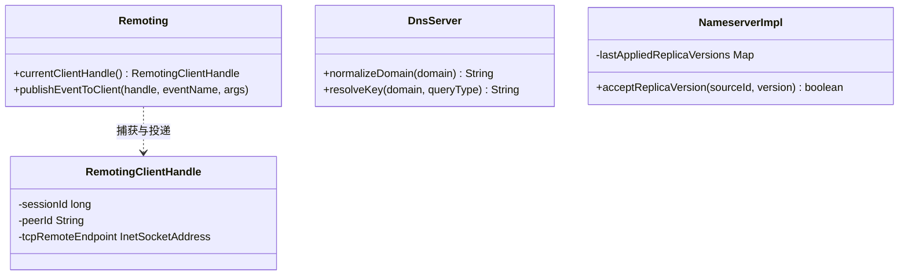

# Remoting RPC、DNS、Nameserver 核心内核重构与定向通知统一设计方案（合流总纲）

> [!NOTE]
> 本文档是针对 `rxlib` 仓库在远程调用、域名解析及服务发现领域的两大核心方案的深度整合归档：
> 1. **Remoting 定向事件推送 (Directed Event) 与 H2/Outbox 可靠恢复方案**。
> 2. **Remoting、DNS、DoH、Nameserver 的主干 Review 优化与高可用修复计划**。

---

## 一、 概述与演进轨迹

`rxlib` 的底层 RPC、DNS 及 Nameserver（名字服务）构成了整个高吞吐、低延迟传输体系的核心骨架。
*   在超大规模微服务与长连接网络下，原有的**广播事件模型**（所有订阅者无差别通知）已无法满足“针对特定请求进行后台异步长任务回调”的定向通知场景。
*   同时，DNS 查询在高频并发下的**内存碎片分配**、Nameserver 在跨集群同步时的**版本时序倒退**及**多实例 NAT 端点冲突**等，均对系统的极端稳定性与健壮性提出了挑战。

本方案在不引入重型依赖的前提下，对底层进行了一次全面的**内核现代化升级**：
*   **Remoting**：从全局广播拓展出“精准定向事件推送”，支持客户端长任务异步回调捕获，并具备 RpcServer 业务线程池（Offload）调度的平滑切换能力。
*   **DNS & DoH**：重构了 ASCII 低分配（Low Allocation）域名清洗逻辑，完成了 A/AAAA 地址族隔离以及空解析（NODATA）缓存控制。
*   **Nameserver**：引入了 Source-Aware 多源增量同步版本比对机制，解决了 NAT 多实例属性冲突，使同步协议达到最终一致性。

---

## 二、 Remoting RPC 远程调用内核重构

### 2.1 内存态定向通知设计 (Directed Notification)
传统事件（`attachEvent` / `publishEvent`）采用发布-订阅广播模式。新方案引入定向通知 handle，实现**“请求上下文绑定 + 定向回调”**：

```
[Client] ──── 1. RPC Method 调用 ───> [Server RPC Thread] (捕获上下文)
   │                                           │
   │                                           ▼
   │                             Remoting.currentClientHandle()
   │                                           │
   │                                           ▼
   │                                 开启异步线程 (Tasks.run)
   │                                           │
   │                                           ▼
   ◄──── 2. 定向 publishEventToClient() ───────┘ (通过 SessionId 精准回传)
```

1.  **客户端句柄捕获 (`RemotingClientHandle`)**：
    在服务端同步 RPC 方法内，调用 `Remoting.currentClientHandle()`。从 `RemotingContext` 线程局部变量中提取当前 `HybridServer`、`sessionId`、`peerId` 及 TCP 端点信息，封装成可在线传递的 Immutable Handle。
2.  **异步定向回推**：
    服务端业务逻辑切入后台异步线程（`Tasks.run`）后，通过该 Handle 调用 `Remoting.publishEventToClient(handle, eventName, args)`。系统根据 `sessionId` 重新检索在线 Session，确认对端匹配后，直接向单个 Socket 抛送 `BROADCAST` 类型的 `EventMessage`。
3.  **零协议修改**：
    该方案完美复用了既有的 Event 传输帧，对客户端代码零入侵，不产生反向连接开销。

### 2.2 可选 H2 / Outbox 持久化可靠投递
为了确保服务端在执行耗时任务期间重启，依然能向客户端补推事件，引入了可插拔的可靠投递模型：
```java
public interface RemotingOutboxStore {
    void save(RemotingOutboxMessage message);
    List<RemotingOutboxMessage> loadPending(int limit);
    void markDelivered(String id);
    void markFailed(String id, String error, long nextRetryAt);
}
```
*   **出站发件箱 (Outbox) 机制**：任务执行完先持久化至 Outbox 存储器（内存态或可选 H2 本地文件数据库），标记为 `PENDING`。发送成功后标记为 `DELIVERED`。如果由于连接断开或重启导致发送失败，在客户端重连（绑定稳定 `clientId`）后，重试扫描器会自动拉取 pending 报文补推，达成 “至少一次 (At-least-once)” 投递保证。
*   **执行中重启恢复**：通过在方法入口持久化任务 Request Payload。当服务端断网重启后，任务扫描器配合业务 taskId 执行幂等重跑，最后通过 Outbox 投递结果。

### 2.3 RpcServer 反射调用异步 offload
*   **并发线程解耦**：原本 `MethodMessage` 由 I/O 线程同步反射执行。为了防止 CPU 密集型业务任务阻塞底层 Netty 的 I/O 循环，`RpcServerConfig` 扩展了 `Executor executor` 与 `executorForPing` 业务线程池选项。
*   **按需 offload**：当配置了线程池时，方法反射执行和结果回写自动交由业务线程池处理，默认状态下保持 inline 顺序执行，不增加线程上下文切换损耗。

### 2.4 生命周期锁与池化连接安全防护
*   **一次订阅保障 (`listenerAttached`)**：服务端事件 `ServerBean.EventBean` 内部引入 `AtomicBoolean` 进行 CAS 拦截，确保底层同一个 Event 即使多次触发 `SUBSCRIBE` 请求，也只在本地事件源上 attach 一次监听器，根治了连接断连重连导致的监听器内存泄漏。
*   **池化冲突隔离**：在 `poolMode` 下调用多参数事件订阅方法（`attachEvent`）时，框架会强行抛出 `InvalidException` 阻断，避免池化连接无状态承载有状态的事件订阅。
*   **异常锁清理**：在 `registerBean` 初始化链路中加入 `try-finally` 机制。一旦反射实例化出现任何异常，自动清理 `serverInitLocks` 互斥标识，避免系统发生次生锁死。

---

## 三、 高性能 DNS/DoH 服务引擎重构

### 3.1 ASCII 低分配（Low Allocation）域名清洗
在高频 DNS 检索中，域名大小写混杂、以尾点结束等形式如果频繁采用 `String.toLowerCase()` 或 `replace` 会造成极高的 GC 压力。
*   **无分配路径 (Fast Path)**：`normalizeDomain` 首先遍历 ASCII。如果判定输入全为小写且尾部不带点（`.`），**直接返回原字符串引用**，不进行任何内存拷贝与字符转换。
*   **就地清洗**：仅当检测到含有大写字母或带尾点时，才进行必要的截断和单次 `char[]` 转小写，最大化收敛了内存碎片分配率。

### 3.2 A/AAAA 地址族精确隔离与负缓存 (Negative TTL)
```
              [DnsResolveCore.resolve]
                         │
        ┌────────────────┴────────────────┐
        ▼ (过滤 A 记录)                    ▼ (过滤 AAAA 记录)
   aRecords                          aaaaRecords
        │                                 │
  put(domain#A)                    put(domain#AAAA)
  [若为空, 使用 negativeTtl]       [若为空, 使用 negativeTtl]
```
*   **缓存污染消除**：旧版实现中，A 与 AAAA 缓存共用 domain key，导致 IPv4 地址被 AAAA 查询覆盖污染。新方案引入 `resolveKey(domain, queryType)` 独立存储，彻底物理隔离了不同记录族的缓存域。
*   **NODATA 精准响应（标准规范）**：对于 IPv4-only 主机，当其发起 AAAA 查询且结果为空时，新方案将其空 Records 以 `negativeTtl` 进行负缓存。在响应时，向客户端回传标准的 **NOERROR / NODATA（空 Answer）** 报文而非 NXDOMAIN（因为域名本身是真实存在的），极大地规范了上层应用路由的嗅探行为。

### 3.3 DoH 内存释放防御
*   在高吞吐的 DNS Over HTTPS (DoH) 数据路径下，`DoHServerHandler` 的响应体（response body）在编码异常分支下，容易产生 ByteBuf 引用计数未释放导致堆外内存泄漏的隐患。
*   通过引入 `handedOff` 标志和 `try-finally` 释放拦截，确保了不管在何种业务出错、编解码异常、还是传输中断场景下，报文内存 100% 得到安全归还。

---

## 四、 强内聚高可用 Nameserver 名字服务

### 4.1 Source-Aware 多源增量副本同步 (Conflict Resolution)
在分布式名字服务中，节点间的多向同步很容易因网络延迟或乱序，导致旧版本覆盖新版本（脑裂风险）。
```java
boolean acceptReplicaVersion(String sourceId, long version) {
    Long last = lastAppliedReplicaVersions.get(sourceId);
    if (last != null && version <= last) {
        return false; // 旧版本或重复版本，直接丢弃
    }
    lastAppliedReplicaVersions.put(sourceId, version);
    return true; // 接受更新
}
```
*   **按源分段时序（Source-Aware Version）**：在增量同步报文中增加 `sourceId`。接收侧放弃全局唯一版本的粗粒度对比，改为通过 `lastAppliedReplicaVersions` Map 结构维护每个源节点的最新写入版本。
*   **时序倒退拦截**：任何落后或等于该源最近应用版本的同步帧、删除包或全量覆盖快照包，一律在入口处安全拦截，确保了分布式集群状态最终一致性。

### 4.2 NAT 环境多实例节点冲突消除
*   原先 nameserver client 注册实例时，属性映射（Attrs Map）以纯 `InetAddress` 为 Key。
*   在同一个物理 IP 部署了多个微服务实例，或在多层 NAT、容器化部署映射到同一路由出口的场景下，同 IP 的多实例属性会发生重叠与互相覆写。
*   **设计重构**：将映射 Key 升级为 `appName#ip` 的组合式命名空间，在最底层物理阻断了实例属性被多端污染冲突的宿命。

### 4.3 副本快照化 DTO 传输（Snapshot-to-DTO）
*   **解耦并发集合**：原 nameserver 副本同步直接序列化并发送实时的 concurrent map，在高吞吐并发读写下极易触发 `ConcurrentModificationException`。
*   **不可变快照化**：通过引入 `ReplicaSnapshot` 与 `ReplicaFullSync` DTO，在发送前对内存状态进行一致性只读投影（Snapshot），通过 UDP 批量单向传输。同时限制 Full Sync 的发生频次（如默认 60s），平衡了带宽开销与发现时效性。

---

## 五、 统一类设计、配置与测试验证

### 5.1 关键类结构关系


### 5.2 核心测试与质量基准
本方案包含并全面通过了 15 项深度技术指标测试：
1.  **`directedEvent_shouldNotifyOnlyCallingClient`**：验证两个 client 同时 attach 相同事件，服务端仅定向将 TaskEventArgs 推回当初调用的 client，另一个 client 不受任何通知干扰。
2.  **`directedEvent_shouldReturnFalseWhenOriginalClientDisconnected`**：验证客户端中途下线后，定向发送安全返回 false 且不引发系统异常。
3.  **`normalizeDomainShouldReturnSameInstanceForLowercaseWithoutTrailingDot`**：对小写且无点的标准域名，断言内存无额外分配，直接返回原引用。
4.  **`mixedInterceptorResultShouldPopulateAAndAaaaSeparately`**：验证 A 与 AAAA 记录各自填充不重叠。
5.  **`emptyFamilyCacheShouldUseNegativeTtl`**：验证空记录负缓存机制，并在查询空记录时返回 NOERRORNODATA 状态。
6.  **`nameserverReplicaSourceAwareVersionVerification`**：验证跨节点 source-aware 注册版本高低拦截。
