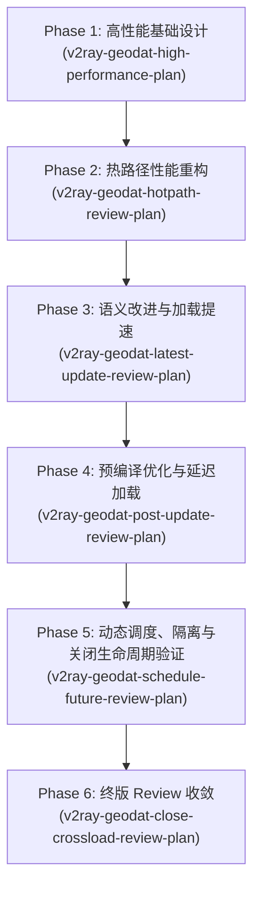

# V2Ray GeoDat 高性能读取与匹配架构演进及设计方案（合流总纲）

> [!NOTE]
> 本文档是针对 `rxlib` 仓库在 `agent/v2ray-geodat-plan` 分支演进中对 V2Ray `geoip.dat` 与 `geosite.dat` 的高性能读取、流式解析、精细匹配、动态调度及生命周期管理方案的合流归档。

---

## 一、 概述与演进历史

### 1.1 项目背景与目标
为了在基于 JDK 1.8 的底层高性能网络协议库 `rxlib` 中集成快速识别 IP 地理位置与域名匹配（通常应用于高频路由过滤与代理模块）的能力，本项目引入了对 V2Ray `geoip.dat` 与 `geosite.dat` 二进制格式的支持。

作为网络热点路径组件，该模块的设计追求以下核心指标：
*   **极致性能**：在请求期间零分配（Zero Allocation）、零锁竞争（Lock-Free）、不调用阻塞式 DNS 解析。
*   **超低开销**：不引入 `protobuf-java` 等重型依赖，设计手写、非递归、流式二进制 Protobuf Reader。
*   **并发安全**：通过 Immutable Snapshot（不可变快照）结合 `volatile` 读写，实现无缝热替换，避免因读取锁退化带来的吞吐性能下降。
*   **稳健生命周期**：健全的资源关闭 (`close()`) 处理，实现无内存泄漏、任务全生命周期可观测。

### 1.2 文档合流演进轨迹
在多轮架构 Review 与迭代改进中，本项目经历了以下主要演进：


---

## 二、 二进制数据轻量流式解析（Protobuf Reader）

### 2.1 零外部依赖解析策略
为了规避 `protobuf-java` 编译后类膨胀、内存装箱对 GC 带来的二次压力，设计了轻量级、无状态的 `V2RayGeoDataReader`：
*   **编码识别**：仅覆盖本需求所需的 Wire Type（`varint`、`length-delimited` 等），通过 offset 偏移顺序迭代解析。
*   **零拷贝映射**：默认使用 `Files.readAllBytes` 载入内存，通过指针（offset）偏移读取；对于体积超大型文件，可选支持基于 `FileChannel.map` 的内存文件映射（MappedByteBuffer）。
*   **未知字段平滑跳过**：能够自适应解析并跳过新版 Dat 中扩展的未知二进制字段，防止因协议演进破坏向后兼容性。

### 2.2 Protobuf 实体映射规范
按 Protobuf 的 Wire-Format 映射关系，设计以下无依赖轻量读取机制：
*   **varint** 循环位移构建整数（支持 `uint32`、`bool` 等）。
*   **length-delimited** 根据偏移提取指定区间内的 `String` 或二进制 `byte[]`，避免提前构建大量的临时节点。

---

## 三、 GeoIP 高性能检索与 CIDR 二分查找

### 3.1 预绑定与无锁查找架构
GeoIP 检索属于典型的热点路径（每秒数十万次并发匹配）。传统通过 Map 循环遍历 CIDR 或调用 `InetAddress` 均不能满足吞吐要求。
```
[高频匹配请求] ──> [V2RayGeoIpMatcher.CodeMatcher] 
                      ├── IPv4 检索: int 数组无符号二分查找
                      └── IPv6 检索: unsigned high/low long 二分查找
```

### 3.2 匹配数据紧凑段设计
*   **IPv4 索引**：将 CIDR 段转为 32 位无符号整数区间 `[startInt, endInt]`，通过 `int[]` 平坦数组顺序存储。
*   **IPv6 索引**：将 128 位地址拆解为 `long high, long low`，利用两个 `long[]` 数组作为二分检索的 Key，防止使用 `BigInteger` 带来的性能开销与 GC 压力。
*   **重叠区间合并 (Ranges Union)**：在加载构建期对同一 `code` 的所有 CIDR 段进行排序，并对连续、重合的子网段做预合并，极致收敛查询深度至 $O(\log N)$。

### 3.3 边界情况与逆向匹配（Inverse Match）
*   **Inverse 补集重组**：部分 Dat 文件会声明 `inverse_match = true`。其语义是“排除该区域外的地址”。构建索引时，需要计算该 entry 下 CIDR 集合相对于全网段（IPv4 / IPv6）的**补集区间**，并在 lookup 中作为匹配路由。
*   **多 Entry 检索排序**：在同一个 code 下同时存在 Normal 属性与 Inverse 属性的重合规则时，通过带有规则索引 Order ID 的有序集合（如 `TreeSet` 带有优先级权重排序）保证精准查找，符合 V2Ray 官方默认检索优先级。

---

## 四、 GeoSite 紧凑前缀/后缀匹配（Trie 树复用）

### 4.1 规则类型高速映射
V2Ray Geosite 内包含 `RootDomain`、`Full`、`Plain`、`Regex` 四类域名匹配模式，在构建阶段将其优雅重组成 `rxlib` 原生的高性能匹配内核：
*   `RootDomain`（根域名后缀） $\rightarrow$ 映射至 `UltraDomainTrieMatcher`（双数组 Trie 树，进行域名后缀的高速精确匹配）。
*   `Full`（完整域名） $\rightarrow$ 映射至 `GeoSiteMatcher` 内置哈希全匹配。
*   `Plain`（关键词包含） $\rightarrow$ 映射至 Aho-Corasick（AC 自动机）的多模式字符串匹配树。
*   `Regex`（正则匹配） $\rightarrow$ 利用预编译的 `ReusablePattern` 进行线程安全复用。

### 4.2 Attributes（属性过滤）解析优化
Geosite 规则往往带有 `@ads`、`@!cn` 等属性标识：
*   **解析收敛**：`V2RayGeoDataReader` 读取 domain 规则下的 attributes，并提取 Boolean 型属性。当 `bool_value = false` 时应自动将其忽略，防止误匹配。对于 `int_value` 类型属性，当前阶段做**存在性过滤**，不参与具体的值范围运算。
*   **配置期缓存**：使用 Caffeine Cache 构建对 `code + attrFilter` 的静态编译结果，限制最大容量为 256。高频调用通过预编译的 `GeoSiteMatcher` 做原地匹配，避免运行时解析字符串 selector 带来的多余内存损耗。

---

## 五、 并发隔离、生命周期与高可用热替换

### 5.1 隔离加载（Cross-Side Failure Isolation）
旧版加载中，一旦一侧（如 GeoSite 文件损坏）加载失败，整个加载任务会被置于异常状态，从而误伤另一侧。新方案将 IP 侧与 Site 侧的加载 Future 分离：
*   调用 `compileGeoIpMatcher` 时，若未加载仅触发 `ensureIpLoaded()` 启动独立的 IP 加载任务；
*   调用 `compileGeoSiteMatcher` 时，若未加载仅触发 `ensureSiteLoaded()` 启动独立的 Site 加载任务；
*   当一侧发生异步加载异常，另一侧已有的可用 Snapshot（快照）依然能对外提供高性能无锁服务，实现容灾隔离。

### 5.2 优雅关闭与竞态互斥（Close Lifecycle）
当调用者关闭 `V2RayGeoManager` 实例时，需要防止正在执行的后台加载（in-flight task）产生脏数据覆写快照：
```
                       close() 被触发
                              │
                    ┌─────────┴─────────┐
                    ▼                   ▼
              closed = true       cancel(dTask)
                    │                   │
         ┌──────────┴──────────┐        ▼
         ▼                     ▼  cancel(dailyTasks)
    清空 ipMatcher       清空 siteIndex
```
*   **同锁保障**：`close()` 改为 `synchronized` 方法，与 `load()` 方法使用同一把实例锁，确保“检查 closed 状态”与“新快照发布”之间的原子互斥性。
*   **双重置空防护**：`load()` 方法内部在将解析好的快照写回 `volatile` 引用之前，必须进行二次 `closed` 状态检查。若发现实例已被关闭，则立即释放新创建的快照资源并丢弃，防止 close 之后发生配置重填充。

### 5.3 每日定时下载的动态重排（Daily Schedule Reschedule）
*   **运行时热更新**：调用 `setDailyDownloadTime(time)` 时，需预防由于时间格式非法抛出异常从而导致内存配置半更新的问题。
*   **事务重排**：采用“先验证新时间段、再进行新任务 Daily 调度、生成 newTasks 成功后、最后 cancel 旧任务并覆盖句柄”的原子逻辑。如果重排失败，旧的 schedule 和历史时间配置依然完整生效不受波及。

---

## 六、 统一 API 语义与调用规范

为了保障调用者能在正确的时机使用正确的 API，防止在 Netty 的 EventLoop 线程或 I/O 线程中发生阻塞行为，系统将 API 的语义进行了清晰分类和规约：

| API 类别 | 具体接口方法 | 线程行为 | 调用场景建议 |
| :--- | :--- | :--- | :--- |
| **异步配置接口** | `setGeoIpFile(file)`<br>`setGeoSiteFile(file)` | 异步非阻塞 (提交任务后即返回) | 启动初始化、运行时配置后台更新 |
| **同步阻塞配置接口** | `compileGeoIpMatcher(code)`<br>`compileGeoSiteMatcher(code, attr)` | 在无缓存时会阻塞等待文件下载与解析完成 (默认 5min 超时) | 系统启动、服务预热阶段，**严禁在请求处理/Netty EventLoop 线程中调用** |
| **非阻塞快速编译接口**| `tryCompileGeoIpMatcher`<br>`tryCompileGeoSiteMatcher` | 立即返回。若尚未加载完成，则返回 `null` | 运行时动态热插拔规则探测 |
| **请求期高频检索** | `CodeMatcher.matches(byte[])`<br>`GeoSiteMatcher.matches(domain)` | 极速无锁（无字符串拼接与正则编译） | **高频网关/长连接路由热点路径的唯一推荐用法** |
| **低频便捷查询** | `matchGeoIp(code, ip)`<br>`matchGeoSite(code, attr, domain)`| 非阻塞。若未加载触发异步，直接返回 false。内部含有字符串转换开销 | 低频监控、管理后台、测试单测 |

---

## 七、 自动化单元测试与 CI 校验基线

本升级已在 JDK 1.8 编译环境下，通过精细化设计的 16 组单元测试进行了严密的逻辑验证：

### 7.1 测试矩阵设计一览
1.  **`V2RayGeoDataReaderTest`**：验证精简 Protobuf 读取器对未知字段跳过、流变长整形、超长溢出防护的安全健壮性。
2.  **`V2RayGeoIpMatcherTest` / `V2RayGeoSiteMatcherTest`**：验证不同规则（Cidr 段、Trie 域名后缀、AC keyword、Regex 匹配）的基础匹配正确性。
3.  **`V2RayGeoIpMatcherHotPathTest` / `V2RayGeoSiteHotPathTest`**：回归测试高频路径下的“零字符串分配解析”和“预加载 matcher 缓存命中率”。
4.  **`V2RayGeoIpLookupInverseTest`**：针对 IP 地理位置查询中 normal 与 inverse 重合区间、IPv6 unsigned 128-bit 边界进行严格比对校验。
5.  **`V2RayGeoSiteAttributeTest`**：覆盖 Boolean 属性为 false 的域名的反向过滤、整型属性存在性过滤等边界。
6.  **`V2RayGeoManagerLoadTest`**：模拟单侧加载、一侧加载失败恢复、另一侧 snapshot 容灾的真实业务场景。
7.  **`V2RayGeoManagerScheduleTest`**：验证每日定时更新在动态重配新时间、重配发生异常时旧调度任务依然保持现状的健壮设计。
8.  **`V2RayGeoManagerCrossLoadIsolationTest`**：模拟 IP 加载失败不误伤已加载的 Site 数据，Future 结果成功被 compile 方法捕捉的异常传播。
9.  **`V2RayGeoManagerCloseTest`**：测试多线程并发下，一边在 load 发布快照，一边进行 close 销毁，验证销毁后绝不出现快照漏出发布的发布竞态。

### 7.2 GitHub Actions 执行基准
每次合流代码均通过执行 JDK8 GitHub Actions 运行测试，以 conclusion=success 为准。
测试调用指令示例：
```bash
mvn -B -U -Dgpg.skip=true -Dmaven.test.skip=false -DskipTests=false clean test
```
