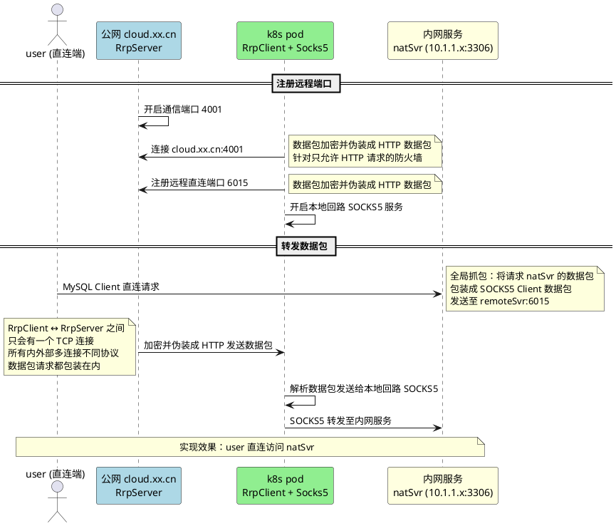

# 代理与穿透模块 (org.rx.net.socks)

此模块提供全面的 SOCKS5、Shadowsocks 以及基于 Rx 自定义的 RRP 代理与中继服务协议支持。包含代理的服务端和客户端，并实现了高级别特性的 UDP 转发与穿透能力。

## 核心类介绍

- **`SocksProxyServer`**:
  完整的 SOCKS5 代理服务器。它不仅支持标准的 TCP 代理，还完美兼容 Full Clone NAT 下的 UDP 代理机制。通过对接各类处理器（如 `Socks5WarmupHandler`，`SocksUdpRelayHandler`），支持动态上游切换。

- **`Socks5Client`**:
  代理客户端实现。专门优化了 SOCKS5 UDP 的连接建立流程（实现了 `Socks5UdpSession` 池化机制），消除了反复握手建立 UDP 会话的性能开销。

- **`ShadowsocksServer` / `SSUdpProxyHandler` / `SSTcpProxyHandler`**:
  实现了 Shadowsocks 兼容协议的服务端，支持多种加密密码学配置。

- **`RrpServer` / `RrpClient`**:
  “Rx Remoting Proxy” 的实现，专为长连接或混合连接的远程反向代理、内网穿透设计的服务端与客户端套件。

- **`Udp2rawHandler`**:
  提供了将 UDP 流量伪装为 TCP 流量的功能，以穿过某些阻断 UDP 的严苛防火墙策略。

- **`UdpCompressCodec` / `UdpRedundantCodec`**:
  为 UDP 代理数据在弱网环境下提供的额外增强：压缩（减少带宽占用）与冗余（多倍发送减少丢包率影响）。

---

## SOCKS5 代理模块详细说明

### SocksProxyServer
标准 SOCKS5 协议服务器实现，支持 TCP CONNECT 和 UDP ASSOCIATE。

| 特性 | 说明 |
|------|------|
| **内存通道模式** | 支持 `LocalServerChannel` 内存通信，用于同一 JVM 内组件间零拷贝代理 |
| **灵活路由委托** | `onTcpRoute` / `onUdpRoute` 委托允许运行时动态决定上游（直接连接/转发到另一个代理） |
| **加密路由切换** | `cipherRouter` 谓词可针对特定目标（如 DNS 端口 53、HTTP 80）启用加密 |
| **UDP Relay 管理** | 内置 `udpRelayRegistry` 管理 UDP 中继通道，支持 `resetUdpRelay` / `claimUdpRelay` 状态清理 |
| **流量整形** | 可选 `ProxyManageHandler` 进行连接级流量统计和限速 |

**协议流水线：**
```
[Socks5InitialRequestDecoder] → [Socks5InitialRequestHandler]
    → [Socks5PasswordAuthRequestDecoder] (可选认证)
    → [Socks5CommandRequestDecoder] → [Socks5CommandRequestHandler]
```

### Socks5Client
SOCKS5 客户端实现，支持 CONNECT 和 UDP_ASSOCIATE。

| 特性 | 说明 |
|------|------|
| **双模式 UDP** | `udpAssociateAsync()` 自动创建 UDP 通道；支持外部传入已绑定通道复用 |
| **会话生命周期管理** | `Socks5UdpSession` 自动关联 TCP 控制通道与 UDP 中继通道，任一关闭则整体关闭 |
| **SOCKS5 UDP 编解码** | `UdpManager.socks5Encode/socks5Decode` 自动处理 SOCKS5 UDP 头部封装 |
| **Wildcard 地址解析** | 代理返回 `0.0.0.0` 时自动替换为代理服务器实际 IP |

### SocksContext
代理会话上下文，贯穿连接生命周期。

| 特性 | 说明 |
|------|------|
| **FastThreadLocal 优化** | `USE_FAST_THREAD_LOCAL` 控制是否复用上下文对象（默认关闭保证线程安全） |
| **双向 Channel 标记** | `markCtx()` 同时标记入站/出站 Channel，支持双向查找 |
| **Omega 快速部署** | `omega()` / `omegax()` 静态方法支持通过配置字符串快速启动 RRP Client / SSH Server |

---

## Shadowsocks 模块

### ShadowsocksServer
Shadowsocks 协议服务器（TCP/UDP）。

| 特性 | 说明 |
|------|------|
| **独立加密线程池** | `useDedicatedCryptoGroup` 模式下使用独立 `EventExecutorGroup` 进行加解密，避免阻塞 I/O 线程 |
| **多算法支持** | 通过 `ICrypto` 接口支持 AES-GCM、ChaCha20-Poly1305 等算法 |
| **UDP 优化** | UDP 通道独立初始化 `ICrypto`，设置 `forUdp=true` 优化包处理 |

**流水线：**
```
[CipherCodec] → [SSProtocolCodec] → [SSTcpProxyHandler / SSUdpProxyHandler]
```

---

## RRP (Reverse Relay Protocol) 模块

### RrpServer / RrpClient
反向中继协议，用于内网穿透：客户端主动连接服务器，服务器将远程端口流量转发到客户端。

| 特性 | 说明 |
|------|------|
| **反向连接模型** | 客户端主动出站连接，突破 NAT/防火墙限制，服务器端绑定公网端口 |
| **多代理注册** | 单连接支持注册多个 `Proxy` 配置（多个远程端口映射） |
| **内存通道优化** | 客户端使用 `LocalChannel` 内存通信对接本地 SOCKS5 服务器，零内核拷贝 |
| **背压控制** | `RemoteRelayBuffer` 限制每个远程通道 1MB 待发送缓冲，超限自动关闭 |
| **流控同步** | `syncRemoteReadState()` 根据客户端可写状态动态启用/禁用远程读 |

**协议动作：**
- `ACTION_REGISTER (1)` - 客户端注册代理配置
- `ACTION_FORWARD (2)` - 双向数据转发
- `ACTION_SYNC_CLOSE (3)` - 同步关闭通知

### RRP 工作流程


**角色说明：**
- `localSvr` = k8s pod 内网微服务 (RrpClient)
- `remoteSvr` = 公网 cloud.xx.cn Java 服务 (RrpServer)
- `user` = 直连端
- `natSvr` = 内网服务 (10.1.1.x:3306)

---

## 配置类说明

### SocksConfig
SOCKS5 服务器配置，继承 `SocketConfig`。

```java
// 超时控制
readTimeoutSeconds = 240          // TCP 读超时
udpReadTimeoutSeconds = 1200        // UDP 读超时

// 预热连接池
tcpWarmPoolEnabled = true           // TCP 连接预热
tcpWarmPoolMinSize = 2
tcpWarmPoolMaxIdleMillis = 60000

// UDP 租赁池
udpLeasePoolEnabled = true          // UDP ASSOCIATE 连接池
udpLeasePoolMinSize = 2
udpLeasePoolMaxSize = 32

// UDP 多倍发包（游戏场景，继承自 SocketConfig）
udpRedundant.multiplier = 2         // 2倍发包
udpRedundant.adaptive = true        // 自适应调节
udpRedundant.intervalMicros = 1000  // 发包间隔
```

### RrpConfig
RRP 协议配置。

```java
// 服务端
token = "secret"                    // 认证令牌
bindPort = 7000                     // 控制通道端口

// 客户端
serverEndpoint = "host:7000"        // 服务端地址
enableReconnect = true              // 自动重连
waitConnectMillis = 4000            // 连接超时

// 代理映射
proxies = [
  { name: "web", remotePort: 8080, auth: "user:pass" }
]
```

## 性能优化要点

1. **零拷贝**：`LocalChannel` 内存通道避免内核态切换
2. **对象池**：`PooledByteBufAllocator` 复用 ByteBuf
3. **线程隔离**：加密操作 offload 到独立线程池
4. **无锁查询**：域名匹配全程无锁、零分配
5. **背压控制**：写缓冲上限 + 流控反馈防止 OOM

## 集成测试类

- `SocksProxyServerIntegrationTest` - SOCKS5 全流程测试
- `ShadowsocksServerIntegrationTest` - Shadowsocks 加解密测试
- `Socks5ClientIntegrationTest` - 客户端 CONNECT/UDP_ASSOCIATE 测试
- `RrpIntegrationTest` - 反向中继穿透测试
- `DnsServerIntegrationTest` - DNS 解析与缓存测试
